# Review: gh_rclone_rclone_7072

**new feature: VFS auto normalization**

- source: https://github.com/rclone/rclone/issues/7072
- kind: LLM draft (needs review)
- reviewed: `True`
- graph: `data/github_v0/graphs/gh_rclone_rclone_7072.json` · raw thread: `data/github_v0/raw/gh_rclone_rclone_7072.json`

```mermaid
flowchart LR
    N0["<b>N0 mixed-normalization mount failure reported</b><br/><small>info: 7</small>"]
    N1["<b>N1 required mount behavior clarified</b><br/><small>info: 11</small>"]
    N2["<b>N2 candidate patch passes quick test</b><br/><small>info: 12</small>"]
    N3["<b>N3 candidate validated over extended use</b><br/><small>info: 14</small>"]
    N_terminal["<b>terminal mixed-normalization mounts working</b><br/><small>info: 16</small>"]
    N0 -.->|"❓ primary_goal_names_usable_after_macos_normalizes_requests"| N1
    linkStyle 0 stroke:#3b82f6,stroke-width:2px
    N1 -.->|"❓ candidate_patch_quick_test_works_finder_terminal_fuse_t"| N2
    linkStyle 1 stroke:#3b82f6,stroke-width:2px
    N2 -.->|"❓ candidate_patch_used_for_days_and_normalization_works_perfectly"| N3
    linkStyle 2 stroke:#3b82f6,stroke-width:2px
    N3 ==>|"⚡ Make VFS path lookup tolerant of Unicode normalization changes: retain the fast exact directory-cache lookup, then compare transformed names when the exact lookup fails so an NFD request can resolve the equivalent NFC entry or vice versa. Use the existing Unicode-normalization setting, avoid the obsolete macOS iconv workaround, and provide explicit optional handling for normalization-equivalent duplicates."| N_terminal
    linkStyle 3 stroke:#f97316,stroke-width:2px
    class N0 start
    class N1 normal
    class N2 normal
    class N3 normal
    class N_terminal terminal
    classDef start fill:#fee2e2,stroke:#b91c1c,color:#000
    classDef terminal fill:#dcfce7,stroke:#15803d,color:#000
    classDef normal fill:#fef3c7,stroke:#a16207,color:#000
```

## Opening (body)

> I need macOS `rclone mount` to work predictably with remotes containing a mixture of NFC- and NFD-encoded file and directory names. This currently breaks with both macFUSE and FUSE-T: depending on the mount options, only NFC or only NFD content is visible or accessible. The same mixed content works on Linux and Windows, but macOS uses NFD in its APIs. I propose optional VFS normalization, disabled by default, with NFC and NFD modes. If two names in one directory differ only by normalization, rclone should expose only one and log an error.

## Satisfaction conditions

1. Must identify the accepted root cause: macOS changes filenames to its preferred Unicode normalization form, while VFS exact directory-cache lookup can treat the equivalent NFC and NFD spellings as different names and fail to resolve the requested object.
2. Must propose the accepted technical direction: keep exact lookup first, then perform a normalization-aware transformed comparison to resolve an equivalent cached name.
3. Must ground the diagnosis in the mixed NFC/NFD test bed, the failure across macFUSE and FUSE-T, and the reporter's successful candidate-build testing in Finder and the terminal.
4. Must not present FUSE iconv options or FUSE-T's NFC option alone as the complete fix; the reporter established that they leave content inaccessible or create Finder failures.
5. Must address normalization-equivalent duplicates explicitly, with optional blocking, hiding, or error reporting rather than silently claiming both entries are independently safe to edit.
6. Must not declare the issue resolved until the affected reporter has verified a build containing the VFS lookup change; the thread contains both a quick verification and several days of successful use.

## Edges

| edge | type | gates / info | payload |
|---|---|---|---|
| `e1_N0__N1` | clarification_only | asks: primary_goal_names_usable_after_macos_normalizes_requests | The most important goal is that names served by the mount remain usable after macOS handles them as NFD. Remot |
| `e2_N1__N2` | clarification_only | asks: candidate_patch_quick_test_works_finder_terminal_fuse_t | I built it and quickly tried my mixed NFC/NFD test data. It works — both Finder and the terminal can use the f |
| `e3_N2__N3` | clarification_only | asks: candidate_patch_used_for_days_and_normalization_works_perfectly | I have used it for the last few days with my mixed test data. The difference is day and night, and normalizati |
| `e4_N3__N_terminal` | solution_only | req_info: macos_mount_fails_with_mixed_nfc_nfd_names, remote_can_store_both_nfc_and_nfd_names, iconv_mount_options_incomplete_and_break_finder_open, macos_apis_use_nfd, fuse_t_nfc_option_still_breaks_existing_nfd_content, primary_goal_names_usable_after_macos_normalizes_requests, candidate_patch_quick_test_works_finder_terminal_fuse_t, candidate_patch_used_for_days_and_normalization_works_perfectly elements: identifies_macos_normalization_change_followed_by_exact_vfs_lookup_failure, uses_exact_lookup_then_normalization_aware_fallback, preserves_access_to_both_existing_nfc_and_nfd_remote_names, does_not_rely_on_iconv_as_the_fix, addresses_normalization_equivalent_duplicates_explicitly, requires_or_acknowledges_successful_reporter_verification_on_the_candidate_build | Make VFS path lookup tolerant of Unicode normalization changes: retain the fast exact directory-cache lookup, then compare transformed names when the exact lookup fails so an NFD request can resolve the equivalent NFC entry or vice versa. Use the existing Unicode-normalization setting, avoid the obsolete macOS iconv workaround, and provide explicit optional handling for normalization-equivalent duplicates. |

## Nodes

| node | terminal | volunteered | images | symptoms |
|---|---|---|---|---|
| `N0` |  | 0 | 0 | On macOS, a mounted remote containing both NFC and NFD names does not work consistently: depending on the mount options, only one normalizat |
| `N1` |  | 3 | 0 | FUSE-T's NFC option makes NFC content usable, but existing NFD content can disappear or directories become unbrowsable. The iconv mount opti |
| `N2` |  | 0 | 0 | With the candidate build, my mixed NFC/NFD test data is accessible in both Finder and the terminal through a FUSE-T mount. |
| `N3` |  | 1 | 0 | After using the candidate for several days, mixed NFC and NFD names continue to work with macFUSE and FUSE-T; the mount behavior is dramatic |
| `N_terminal` | ✓ | 0 | 0 | On the patched VFS build, files and directories from my mixed NFC/NFD remote can be browsed and opened normally from both Finder and the ter |

## Machine review (audit pass, adversarially verified)

Auditor verdict: **n/a** · 0 of 0 findings survived independent refutation.

__

## Review checklist

> The graph is the case's ANSWER KEY, not a transcript: edge order need
> not mirror thread chronology. Do not file chronology mismatch as a
> defect; what must be faithful is who knew what, when.

Structural (machine-checked by `scripts/validate.py`, re-verify after edits):

- [ ] validates: schema + info-containment + terminal reachability

Semantic (the defect catalog — check each against the source thread):

- [ ] **Faithful blind paths** — every `is_known_blind_path` edge corresponds
  to an attempt actually falsified in the thread (or a brush-off the
  reporter rejected). No invented failures; no ACCEPTED fix mislabeled as
  a blind path (the most common LLM defect class).
- [ ] **Gettable required info** — every id in any `solution.required_info`
  is obtainable: a clarification on some edge, or in the start node's
  info_state, or volunteered (with matching `volunteered_info` text).
  Engineer-only inference belongs in `info_inferred_by_engineer` /
  `inference_hint`, not in hard required_info.
- [ ] **Measurement-class rule** — handler-initiated measurements the user
  executed (bisections, test builds, config probes, version checks) are
  clarification edges, not solutions; their answers state what the
  measurement showed.
- [ ] **No logistics gates** — `required_elements_for_full_match` encode the
  technical diagnostic→fix chain, not release/packaging/scheduling
  remarks the engineer merely mentioned.
- [ ] **Coherent reveals** — each `user_answer_in_this_oncall` is consistent
  with the thread, delivers what it promises, and stays in the user's
  voice (no future knowledge, no diagnosis the user never made).
- [ ] **Symptoms are observations** — `symptoms_visible` contains only what
  the user can see; no causes or advice.
- [ ] **Terminal semantics** — satisfaction_conditions demand root cause +
  evidence grounding + prohibition of falsified moves + user verification;
  the terminal node is the verified-resolved state.
- [ ] **Image assignment** — referenced attachments exist and sit on the
  right hook (opening / node symptom / clarification evidence).
- [ ] **Persona** — matches the reporter's actual expertise and style.

## How to sign off

1. Edit the graph JSON if needed (authored fields only; keep
   `concrete_example` as the factual record).
2. `uv run scripts/validate.py '<graph path>'`
3. Set `metadata.hitl_reviewed: true` in the graph JSON.
4. Re-run `uv run scripts/make_review_docs.py` to refresh this page.
