# Review: gh_rclone_rclone_7103

**[rclone v1.63.0] remote Nextcloud not working after upgrade from 1.62.2 to 1.63.0**

- source: https://github.com/rclone/rclone/issues/7103
- kind: LLM draft (needs review)
- reviewed: `True`
- graph: `data/github_v0/graphs/gh_rclone_rclone_7103.json` · raw thread: `data/github_v0/raw/gh_rclone_rclone_7103.json`

```mermaid
flowchart LR
    N0["<b>N0 Nextcloud remote rejected after upgrade</b><br/><small>info: 7</small>"]
    N1["<b>N1 root-endpoint workaround confirmed</b><br/><small>info: 8</small>"]
    N2["<b>N2 initial beta accepts subdirectory URL</b><br/><small>info: 9</small>"]
    N3["<b>N3 initial beta fails internal chunking</b><br/><small>info: 12</small>"]
    N4["<b>N4 corrected candidate passes upload tests</b><br/><small>info: 13</small>"]
    N_terminal["<b>terminal reporter verifies merged fix</b><br/><small>info: 16</small>"]
    N0 -.->|"❓ root_endpoint_with_directory_in_command_works"| N1
    linkStyle 0 stroke:#3b82f6,stroke-width:2px
    N1 -.->|"❓ initial_beta_accepts_nextcloud_url_with_subdirectory"| N2
    linkStyle 1 stroke:#3b82f6,stroke-width:2px
    N2 -.->|"❓ initial_beta_internal_chunking_with_subdirectory_returns_409, initial_beta_internal_chunking_without_subdirectory_succeeds"| N3
    linkStyle 2 stroke:#3b82f6,stroke-width:2px
    N3 -.->|"❓ corrected_candidate_build_handles_chunked_and_normal_uploads"| N4
    linkStyle 3 stroke:#3b82f6,stroke-width:2px
    N4 ==>|"🔀 ❓merged_beta_matrix_with_and_without_subdirectory_all_works + ⚡Restore backward compatibility for Nextcloud WebDAV remotes whose `/dav/files/USERNAME` URL includes a subdirectory, while ensuring Nextcloud's internal chunk-upload endpoint is constructed from the user-level root rather than that configured subdirectory."| N_terminal
    linkStyle 4 stroke:#a855f7,stroke-width:2px
    class N0 start
    class N1 normal
    class N2 normal
    class N3 normal
    class N4 normal
    class N_terminal terminal
    classDef start fill:#fee2e2,stroke:#b91c1c,color:#000
    classDef terminal fill:#dcfce7,stroke:#15803d,color:#000
    classDef normal fill:#fef3c7,stroke:#a16207,color:#000
```

## Opening (body)

> After upgrading rclone from 1.62.2 to 1.63.0 on Debian 11.7, all commands against my Nextcloud v27 WebDAV remote fail while creating the filesystem with: "chunked upload with nextcloud must use /dav/files/USER endpoint not /webdav". My URL already uses `/remote.php/dav/files/USERNAME/Directory`, with a directory after the username. Deleting and recreating the remote did not help. The same configuration worked with rclone 1.62.2.

## Satisfaction conditions

1. Must identify the accepted root cause: rclone's Nextcloud URL handling rejected valid `/dav/files/USERNAME/subdirectory` configurations, and the first relaxation was incomplete because it carried the configured subdirectory into the temporary chunk-upload URL.
2. The fix must allow a subdirectory after `/dav/files/USERNAME` while constructing the temporary chunks location from `/dav/uploads/USERNAME/` without that subdirectory.
3. Diagnosis must be grounded in the comparison evidence: the username-only URL worked, the first beta accepted the subdirectory but internally chunked uploads returned 409, and the corrected candidate handled both normal and chunked uploads.
4. Must not treat merely relaxing the URL validation as the complete fix, because that candidate still failed direct internal chunking with a 409 conflict.
5. The username-only URL plus a path after the remote name may be offered as a temporary workaround, but it must not be presented as restoring backward compatibility for the reporter's existing directory-based configurations.
6. Must ask the reporter to verify a build containing the complete fix and only declare resolution after large chunked and small non-chunked uploads succeed with the original URL layout.

## Edges

| edge | type | gates / info | payload |
|---|---|---|---|
| `e1_N0__N1` | clarification_only | asks: root_endpoint_with_directory_in_command_works | Yes. If I remove the directory from the service URL and use `my-remote:Directory`, it works. That is usable as |
| `e2_N1__N2` | clarification_only | asks: initial_beta_accepts_nextcloud_url_with_subdirectory | I tested the provided 1.64 beta with the directory in the WebDAV URL. It works as it did in 1.62.2, so it fixe |
| `e3_N2__N3` | clarification_only | asks: initial_beta_internal_chunking_with_subdirectory_returns_409, initial_beta_internal_chunking_without_subdirectory_succeeds | With `nextcloud_chunk_size` set to 10M, the first beta does not work when the URL includes the directory. The  / Yes. With no directory in the configured URL, the upload completes successfully in the same beta. |
| `e4_N3__N4` | clarification_only | asks: corrected_candidate_build_handles_chunked_and_normal_uploads | Perfect, it works. I tested with the directory in the URL using a file larger than 10M and one smaller than 10 |
| `e5_N4__N_terminal` | mixed | req_info: nextcloud_remote_fails_after_upgrade_to_rclone_1_63_0, same_remote_worked_with_rclone_1_62_2, webdav_url_uses_dav_files_username_plus_subdirectory, root_endpoint_with_directory_in_command_works, initial_beta_internal_chunking_with_subdirectory_returns_409, initial_beta_internal_chunking_without_subdirectory_succeeds, corrected_candidate_build_handles_chunked_and_normal_uploads elements: identifies_overly_restrictive_nextcloud_url_validation_as_the_initial_regression, preserves_subdirectories_after_dav_files_username, constructs_temporary_chunk_upload_url_without_the_configured_subdirectory, asks_user_to_verify_on_a_build_containing_the_fix | Restore backward compatibility for Nextcloud WebDAV remotes whose `/dav/files/USERNAME` URL includes a subdirectory, while ensuring Nextcloud's internal chunk-upload endpoint is constructed from the user-level root rather than that configured subdirectory. |

## Nodes

| node | terminal | volunteered | images | symptoms |
|---|---|---|---|---|
| `N0` |  | 2 | 0 | With rclone 1.63.0, every command against my Nextcloud remote stops while creating the filesystem and says chunked uploads require `/dav/fil |
| `N1` |  | 0 | 0 | Using a URL that ends at `/dav/files/USERNAME` and putting `Directory` after the remote name makes commands work. My existing configurations |
| `N2` |  | 0 | 0 | The first provided beta accepts my original Nextcloud URL with a directory after the username, and ordinary remote use works again. |
| `N3` |  | 1 | 0 | With the first beta and a directory in the WebDAV URL, an internally chunked upload retries three times and ends with `chunked upload couldn |
| `N4` |  | 0 | 0 | The corrected development build successfully uploads both a file larger than the 10M chunk threshold and a file smaller than it while the Ne |
| `N_terminal` | ✓ | 0 | 0 | In the updated beta, both large internally chunked uploads and small normal uploads complete successfully with a Nextcloud URL that includes |

## Machine review (audit pass, adversarially verified)

Auditor verdict: **n/a** · 0 of 0 findings survived independent refutation.

__

## Review checklist

> The graph is the case's ANSWER KEY, not a transcript: edge order need
> not mirror thread chronology. Do not file chronology mismatch as a
> defect; what must be faithful is who knew what, when.

Structural (machine-checked by `scripts/validate.py`, re-verify after edits):

- [ ] validates: schema + info-containment + terminal reachability

Semantic (the defect catalog — check each against the source thread):

- [ ] **Faithful blind paths** — every `is_known_blind_path` edge corresponds
  to an attempt actually falsified in the thread (or a brush-off the
  reporter rejected). No invented failures; no ACCEPTED fix mislabeled as
  a blind path (the most common LLM defect class).
- [ ] **Gettable required info** — every id in any `solution.required_info`
  is obtainable: a clarification on some edge, or in the start node's
  info_state, or volunteered (with matching `volunteered_info` text).
  Engineer-only inference belongs in `info_inferred_by_engineer` /
  `inference_hint`, not in hard required_info.
- [ ] **Measurement-class rule** — handler-initiated measurements the user
  executed (bisections, test builds, config probes, version checks) are
  clarification edges, not solutions; their answers state what the
  measurement showed.
- [ ] **No logistics gates** — `required_elements_for_full_match` encode the
  technical diagnostic→fix chain, not release/packaging/scheduling
  remarks the engineer merely mentioned.
- [ ] **Coherent reveals** — each `user_answer_in_this_oncall` is consistent
  with the thread, delivers what it promises, and stays in the user's
  voice (no future knowledge, no diagnosis the user never made).
- [ ] **Symptoms are observations** — `symptoms_visible` contains only what
  the user can see; no causes or advice.
- [ ] **Terminal semantics** — satisfaction_conditions demand root cause +
  evidence grounding + prohibition of falsified moves + user verification;
  the terminal node is the verified-resolved state.
- [ ] **Image assignment** — referenced attachments exist and sit on the
  right hook (opening / node symptom / clarification evidence).
- [ ] **Persona** — matches the reporter's actual expertise and style.

## How to sign off

1. Edit the graph JSON if needed (authored fields only; keep
   `concrete_example` as the factual record).
2. `uv run scripts/validate.py '<graph path>'`
3. Set `metadata.hitl_reviewed: true` in the graph JSON.
4. Re-run `uv run scripts/make_review_docs.py` to refresh this page.
