# Review: gh_rclone_rclone_7334

**Dropbox insufficient_space error does not stop ongoing rclone move**

- source: https://github.com/rclone/rclone/issues/7334
- kind: LLM draft (needs review)
- reviewed: `True`
- graph: `data/github_v0/graphs/gh_rclone_rclone_7334.json` · raw thread: `data/github_v0/raw/gh_rclone_rclone_7334.json`

```mermaid
flowchart LR
    N0["<b>N0 Dropbox full but uploads continue</b><br/><small>info: 6</small>"]
    N1["<b>N1 destination capacity confirmed</b><br/><small>info: 8</small>"]
    N2["<b>N2 normal beta reproduces</b><br/><small>info: 9</small>"]
    N3["<b>N3 first candidate build disproved</b><br/><small>info: 10</small>"]
    N4["<b>N4 nested batch error still does not stop work</b><br/><small>info: 12</small>"]
    N5["<b>N5 final pre-merge test still shows new work</b><br/><small>info: 13</small>"]
    N_terminal["<b>terminal fix merged without reporter retest</b><br/><small>info: 17</small>"]
    N0 -.->|"❓ dropbox_about_reports_3_720_gib_free_of_28_tib"| N1
    linkStyle 0 stroke:#3b82f6,stroke-width:2px
    N1 -.->|"❓ normal_beta_still_continues_after_insufficient_space"| N2
    linkStyle 1 stroke:#3b82f6,stroke-width:2px
    N2 -.->|"❓ first_fix_branch_initially_appeared_ok_then_continued_uploading"| N3
    linkStyle 2 stroke:#3b82f6,stroke-width:2px
    N3 -.->|"❓ intermediate_unraid_test_used_non_branch_beta, third_candidate_windows_test_still_started_more_chunks"| N4
    linkStyle 3 stroke:#3b82f6,stroke-width:2px
    N4 -.->|"❓ fourth_candidate_failed_file_then_started_new_file"| N5
    linkStyle 4 stroke:#3b82f6,stroke-width:2px
    N5 ==>|"⚡ Handle Dropbox batch-upload insufficient-space responses as fatal errors for the whole operation by correctly recognizing the nested error returned through the Dropbox SDK, so rclone stops scheduling new files while allowing already in-flight work to finish; merge that handling and ask the reporter to verify it on a full account."| N_terminal
    linkStyle 5 stroke:#f97316,stroke-width:2px
    class N0 start
    class N1 normal
    class N2 normal
    class N3 normal
    class N4 normal
    class N5 normal
    class N_terminal terminal
    classDef start fill:#fee2e2,stroke:#b91c1c,color:#000
    classDef terminal fill:#dcfce7,stroke:#15803d,color:#000
    classDef normal fill:#fef3c7,stroke:#a16207,color:#000
```

## Opening (body)

> I am running rclone v1.64.0 on 64-bit Slackware/Unraid and moving files to Dropbox. When a Dropbox batch commit returns path/insufficient_space, rclone reports that the file failed and does not delete its source, but it keeps uploading chunks and continues for hours. I expect this clear out-of-space response to stop the entire operation immediately. The same situation hard-fails for me with Google Drive.

## Satisfaction conditions

1. Must identify the accepted root cause: Dropbox returns a clear insufficient-space condition inside the batch-upload error structure, but rclone was not reliably recognizing that nested SDK error and promoting it to a fatal operation-wide error.
2. Must ground the diagnosis in the collected evidence: the remote had only 3.720 GiB free, the file exceeded that space, and multiple exact-build logs showed a batch failure followed by another file beginning at chunk 1.
3. The fix must stop scheduling new files after the Dropbox insufficient-space response; it may allow transfers that were already in flight to finish before the process exits.
4. Must not claim that the earlier candidate builds resolved the issue: the reporter withdrew the initial success report and later logs showed that those builds still started additional upload work.
5. Must ask the reporter to verify a build containing the merged handling on a full Dropbox account before declaring the issue resolved; the thread contains a maintainer merge report but no post-merge reporter confirmation.

## Edges

| edge | type | gates / info | payload |
|---|---|---|---|
| `e1_N0__N1` | clarification_only | asks: dropbox_about_reports_3_720_gib_free_of_28_tib | I ran `rclone about XXX:`. It reports Total: 28 TiB, Used: 27.996 TiB, Free: 3.720 GiB. |
| `e2_N1__N2` | clarification_only | asks: normal_beta_still_continues_after_insufficient_space | I tried the latest beta. It still logs `path/insufficient_space`, says the copy failed and does not delete the |
| `e3_N2__N3` | clarification_only | asks: first_fix_branch_initially_appeared_ok_then_continued_uploading | At first it seemed to work, but that was wrong. On my second test it kept uploading: the log continued with ch |
| `e4_N3__N4` | clarification_only | asks: intermediate_unraid_test_used_non_branch_beta, third_candidate_windows_test_still_started_more_chunks | On Unraid, `rclone version` printed `rclone v1.65.0-beta.7451.9d4d29479`. The upload still continued, but I la / I got the exact branch build running on Windows 11. After `upload failed: path/insufficient_space`, the log im |
| `e5_N4__N5` | clarification_only | asks: fourth_candidate_failed_file_then_started_new_file | The newer build logs that `test1/12 (1).iso` failed with `path/insufficient_space`. On the very next line a di |
| `e6_N5__terminal` | solution_only | req_info: dropbox_insufficient_space_error_during_batch_commit, rclone_continues_uploading_after_space_error, move_uses_two_transfers_and_dropbox_batch_upload, source_file_not_deleted_after_failed_copy, dropbox_about_reports_3_720_gib_free_of_28_tib, normal_beta_still_continues_after_insufficient_space, first_fix_branch_initially_appeared_ok_then_continued_uploading, third_candidate_windows_test_still_started_more_chunks, fourth_candidate_failed_file_then_started_new_file elements: recognizes_the_nested_dropbox_batch_insufficient_space_error, promotes_insufficient_space_to_a_fatal_operation_error, stops_scheduling_new_files_after_the_error, distinguishes_inflight_transfer_completion_from_starting_new_work, asks_user_to_verify_on_a_build_containing_the_fix | Handle Dropbox batch-upload insufficient-space responses as fatal errors for the whole operation by correctly recognizing the nested error returned through the Dropbox SDK, so rclone stops scheduling new files while allowing already in-flight work to finish; merge that handling and ask the reporter to verify it on a full account. |

## Nodes

| node | terminal | volunteered | images | symptoms |
|---|---|---|---|---|
| `N0` |  | 0 | 0 | Dropbox reports path/insufficient_space during a batch commit, but rclone keeps uploading chunks for hours instead of stopping the move. The |
| `N1` |  | 1 | 0 | My Dropbox has only 3.720 GiB free, and the file is larger than the available space; rclone still continues uploading after Dropbox rejects  |
| `N2` |  | 0 | 0 | After updating to the latest normal beta, Dropbox still returns path/insufficient_space and rclone continues doing upload work. |
| `N3` |  | 0 | 0 | The first provided branch build initially seemed fine, but a second test showed that uploads continued after the insufficient-space error, i |
| `N4` |  | 0 | 0 | On Windows with the explicitly provided branch binary, a batch commit failed with upload failed: path/insufficient_space, then another file  |
| `N5` |  | 0 | 0 | In the later branch build, one file reported path/insufficient_space and failed, but the next log line showed a different file starting at c |
| `N_terminal` | ✓ | 0 | 0 | A maintainer reports that the Dropbox-full handling has been merged into the latest beta, but I have not retested the merged build on my ful |

## Machine review (audit pass, adversarially verified)

Auditor verdict: **n/a** · 0 of 0 findings survived independent refutation.

__

## Review checklist

> The graph is the case's ANSWER KEY, not a transcript: edge order need
> not mirror thread chronology. Do not file chronology mismatch as a
> defect; what must be faithful is who knew what, when.

Structural (machine-checked by `scripts/validate.py`, re-verify after edits):

- [ ] validates: schema + info-containment + terminal reachability

Semantic (the defect catalog — check each against the source thread):

- [ ] **Faithful blind paths** — every `is_known_blind_path` edge corresponds
  to an attempt actually falsified in the thread (or a brush-off the
  reporter rejected). No invented failures; no ACCEPTED fix mislabeled as
  a blind path (the most common LLM defect class).
- [ ] **Gettable required info** — every id in any `solution.required_info`
  is obtainable: a clarification on some edge, or in the start node's
  info_state, or volunteered (with matching `volunteered_info` text).
  Engineer-only inference belongs in `info_inferred_by_engineer` /
  `inference_hint`, not in hard required_info.
- [ ] **Measurement-class rule** — handler-initiated measurements the user
  executed (bisections, test builds, config probes, version checks) are
  clarification edges, not solutions; their answers state what the
  measurement showed.
- [ ] **No logistics gates** — `required_elements_for_full_match` encode the
  technical diagnostic→fix chain, not release/packaging/scheduling
  remarks the engineer merely mentioned.
- [ ] **Coherent reveals** — each `user_answer_in_this_oncall` is consistent
  with the thread, delivers what it promises, and stays in the user's
  voice (no future knowledge, no diagnosis the user never made).
- [ ] **Symptoms are observations** — `symptoms_visible` contains only what
  the user can see; no causes or advice.
- [ ] **Terminal semantics** — satisfaction_conditions demand root cause +
  evidence grounding + prohibition of falsified moves + user verification;
  the terminal node is the verified-resolved state.
- [ ] **Image assignment** — referenced attachments exist and sit on the
  right hook (opening / node symptom / clarification evidence).
- [ ] **Persona** — matches the reporter's actual expertise and style.

## How to sign off

1. Edit the graph JSON if needed (authored fields only; keep
   `concrete_example` as the factual record).
2. `uv run scripts/validate.py '<graph path>'`
3. Set `metadata.hitl_reviewed: true` in the graph JSON.
4. Re-run `uv run scripts/make_review_docs.py` to refresh this page.
