# Review: gh_rclone_rclone_7453

**serve s3 uses too much memory on multipart uploads**

- source: https://github.com/rclone/rclone/issues/7453
- kind: LLM draft (needs review)
- reviewed: `True`
- graph: `data/github_v0/graphs/gh_rclone_rclone_7453.json` · raw thread: `data/github_v0/raw/gh_rclone_rclone_7453.json`

```mermaid
flowchart LR
    N0["<b>N0 multipart memory issue reported</b><br/><small>info: 2</small>"]
    N1["<b>N1 implementation constraints identified</b><br/><small>info: 3</small>"]
    N2["<b>N2 initial candidate still consumes upload-sized memory</b><br/><small>info: 4</small>"]
    N2_x["<b>N2_x memory-control probe results</b><br/><small>info: 6</small>"]
    N3["<b>N3 crypt-wrapped backend configuration established</b><br/><small>info: 8</small>"]
    N4["<b>N4 crypt-specific candidate error</b><br/><small>info: 9</small>"]
    N5["<b>N5 simplified candidate verified</b><br/><small>info: 12</small>"]
    N_terminal["<b>terminal multipart memory fix verified</b><br/><small>info: 15</small>"]
    N0 -.->|"❓ implementation_options_and_backend_constraints"| N1
    linkStyle 0 stroke:#3b82f6,stroke-width:2px
    N1 -.->|"❓ initial_candidate_uses_640m_and_ooms_at_400m"| N2
    linkStyle 1 stroke:#3b82f6,stroke-width:2px
    N2 -.->|"❓ memory_tuning_probe_still_reaches_640m"| N2_x
    linkStyle 2 stroke:#3b82f6,stroke-width:2px
    N2_x -.->|"❓ exact_serve_s3_command_and_candidate_version, served_remote_is_crypt_wrapped_ceph_s3"| N3
    linkStyle 3 stroke:#3b82f6,stroke-width:2px
    N3 -.->|"❓ crypt_candidate_reports_seek_and_overlapping_part_errors"| N4
    linkStyle 4 stroke:#3b82f6,stroke-width:2px
    N4 -.->|"❓ simplified_candidate_has_small_memory_imprint, two_gib_upload_succeeds_with_normal_client_concurrency, source_and_destination_md5_match"| N5
    linkStyle 5 stroke:#3b82f6,stroke-width:2px
    N5 ==>|"⚡ Replace whole-upload multipart retention with the simplified bounded multipart implementation that works through wrapped backends such as crypt, then merge it only after an affected operator verifies memory usage, large-file completion, and data integrity."| N_terminal
    linkStyle 6 stroke:#f97316,stroke-width:2px
    class N0 start
    class N1 normal
    class N2 normal
    class N2_x normal
    class N3 normal
    class N4 normal
    class N5 normal
    class N_terminal terminal
    classDef start fill:#fee2e2,stroke:#b91c1c,color:#000
    classDef terminal fill:#dcfce7,stroke:#15803d,color:#000
    classDef normal fill:#fef3c7,stroke:#a16207,color:#000
```

## Opening (body)

> When uploading multipart files, `serve s3` holds all the parts in memory. This is a documented limitation of the library rclone uses for serving S3.

## Satisfaction conditions

1. Must identify the accepted root cause: the S3-serving library retained every multipart part body in memory, so memory grew with the complete multipart upload.
2. The diagnosis and fix must be grounded in the collected evidence: the first candidate still reached about 640 MiB, the served destination was crypt over Ceph S3, the crypt-specific candidate produced seek and unequal-part-size errors, and the simplified candidate substantially reduced memory.
3. Must recommend bounded multipart handling compatible with the reported crypt-wrapped backend rather than relying only on direct multipart interfaces exposed by plain backends.
4. Must not present `GOGC`, `--use-mmap`, or `--max-buffer-memory` as the actual fix for this defect; the measured workload still reached about 640 MiB and failed under a 400 MiB limit during those probes.
5. Must not retain the failed crypt-specific candidate as the solution because it produced `partEncrypter unsupported seek` and overlapping-part-size errors.
6. Must require affected-user verification before declaring resolution, including a realistic large upload and matching source/destination checksums.

## Edges

| edge | type | gates / info | payload |
|---|---|---|---|
| `e1_N0__N1` | clarification_only | asks: implementation_options_and_backend_constraints | I see three options. `--vfs-cache-mode writes` could assemble the file on local disk and upload it when finish |
| `e2_N1__N2` | clarification_only | asks: initial_candidate_uses_640m_and_ooms_at_400m | I tried the linked candidate in our dev environment. Our roughly 300 MB backup makes the container use about 6 |
| `e3_N2__N2_x` | clarification_only | asks: memory_tuning_probe_still_reaches_640m | I tried `GOGC=20`, `--use-mmap`, and `--max-buffer-memory=200`. The process still reaches about 640 MiB. With  |
| `e4_N2_x__N3` | clarification_only | asks: exact_serve_s3_command_and_candidate_version, served_remote_is_crypt_wrapped_ceph_s3 | I run `rclone serve s3 --addr $(SERVES3_ENDPOINT) --vfs-fast-fingerprint --auth-key $(RCLONE_S3PROXY_ACCESS_KE / Rclone is our encryption proxy. `SERVES3_BACKEND` is `crypted`; that remote has type `crypt` and points to `s3 |
| `e5_N3__N4` | clarification_only | asks: crypt_candidate_reports_seek_and_overlapping_part_errors | The multipart upload fails immediately. The log says `failed to upload chunk 1 with 21501088 bytes: operation  |
| `e6_N4__N5` | clarification_only | asks: simplified_candidate_has_small_memory_imprint, two_gib_upload_succeeds_with_normal_client_concurrency, source_and_destination_md5_match | That worked well. The same backup now creates a much smaller memory imprint. / I sent a 2 GiB file through the encryption proxy. Client upload concurrency one works, concurrency two like ou / The MD5 checks look good. Both the source and the file read back through `serve s3` report `7e1e0c88057047b9d4 |
| `e7_N5__N_terminal` | solution_only | req_info: serve_s3_holds_all_multipart_parts_in_memory, memory_behavior_is_documented_library_limitation, initial_candidate_uses_640m_and_ooms_at_400m, served_remote_is_crypt_wrapped_ceph_s3, crypt_candidate_reports_seek_and_overlapping_part_errors, simplified_candidate_has_small_memory_imprint, two_gib_upload_succeeds_with_normal_client_concurrency, source_and_destination_md5_match elements: identifies_whole_multipart_body_retention_as_root_memory_cause, uses_bounded_multipart_handling_instead_of_retaining_the_complete_upload, supports_the_reported_crypt_wrapped_backend_path, requires_successful_affected_user_verification_before_declaring_resolution, requires_integrity_verification_after_large_upload | Replace whole-upload multipart retention with the simplified bounded multipart implementation that works through wrapped backends such as crypt, then merge it only after an affected operator verifies memory usage, large-file completion, and data integrity. |

## Nodes

| node | terminal | volunteered | images | symptoms |
|---|---|---|---|---|
| `N0` |  | 0 | 0 | When I upload multipart files through `rclone serve s3`, all of the parts remain in memory. |
| `N1` |  | 0 | 0 | Multipart uploads through `serve s3` retain all uploaded parts in memory. |
| `N2` |  | 0 | 0 | With the first candidate container, our roughly 300 MB backup raises container memory usage to about 640 MiB and the container still crashes |
| `N2_x` |  | 1 | 0 | With `GOGC=20`, `--use-mmap`, and `--max-buffer-memory=200`, memory still reaches about 640 MiB. With those settings and a 400 MiB container |
| `N3` |  | 0 | 0 | The candidate build still reaches about 640 MiB while `serve s3` writes through my `crypted` remote to Ceph RGW. |
| `N4` |  | 0 | 0 | The next candidate fails on the first multipart upload with `crypt: partEncrypter unsupported seek` and then reports that overlapping multip |
| `N5` |  | 0 | 0 | With the simplified candidate, the same backup has a much smaller memory imprint. A 2 GiB upload through the encryption proxy completes with |
| `N_terminal` | ✓ | 0 | 0 | Multipart uploads through the S3 encryption proxy complete with a much smaller memory imprint, and the uploaded data has the same MD5 checks |

## Machine review (audit pass, adversarially verified)

Auditor verdict: **n/a** · 0 of 0 findings survived independent refutation.

__

## Review checklist

> The graph is the case's ANSWER KEY, not a transcript: edge order need
> not mirror thread chronology. Do not file chronology mismatch as a
> defect; what must be faithful is who knew what, when.

Structural (machine-checked by `scripts/validate.py`, re-verify after edits):

- [ ] validates: schema + info-containment + terminal reachability

Semantic (the defect catalog — check each against the source thread):

- [ ] **Faithful blind paths** — every `is_known_blind_path` edge corresponds
  to an attempt actually falsified in the thread (or a brush-off the
  reporter rejected). No invented failures; no ACCEPTED fix mislabeled as
  a blind path (the most common LLM defect class).
- [ ] **Gettable required info** — every id in any `solution.required_info`
  is obtainable: a clarification on some edge, or in the start node's
  info_state, or volunteered (with matching `volunteered_info` text).
  Engineer-only inference belongs in `info_inferred_by_engineer` /
  `inference_hint`, not in hard required_info.
- [ ] **Measurement-class rule** — handler-initiated measurements the user
  executed (bisections, test builds, config probes, version checks) are
  clarification edges, not solutions; their answers state what the
  measurement showed.
- [ ] **No logistics gates** — `required_elements_for_full_match` encode the
  technical diagnostic→fix chain, not release/packaging/scheduling
  remarks the engineer merely mentioned.
- [ ] **Coherent reveals** — each `user_answer_in_this_oncall` is consistent
  with the thread, delivers what it promises, and stays in the user's
  voice (no future knowledge, no diagnosis the user never made).
- [ ] **Symptoms are observations** — `symptoms_visible` contains only what
  the user can see; no causes or advice.
- [ ] **Terminal semantics** — satisfaction_conditions demand root cause +
  evidence grounding + prohibition of falsified moves + user verification;
  the terminal node is the verified-resolved state.
- [ ] **Image assignment** — referenced attachments exist and sit on the
  right hook (opening / node symptom / clarification evidence).
- [ ] **Persona** — matches the reporter's actual expertise and style.

## How to sign off

1. Edit the graph JSON if needed (authored fields only; keep
   `concrete_example` as the factual record).
2. `uv run scripts/validate.py '<graph path>'`
3. Set `metadata.hitl_reviewed: true` in the graph JSON.
4. Re-run `uv run scripts/make_review_docs.py` to refresh this page.
