# Review: gh_rclone_rclone_7974

**Excess memory use when syncing millions of files in one directory**

- source: https://github.com/rclone/rclone/issues/7974
- kind: LLM draft (needs review)
- reviewed: `True`
- graph: `data/github_v0/graphs/gh_rclone_rclone_7974.json` · raw thread: `data/github_v0/raw/gh_rclone_rclone_7974.json`

```mermaid
flowchart LR
    N0["<b>N0 large flat directory OOM reported</b><br/><small>info: 5</small>"]
    N0_x["<b>N0_x tuning-only aftermath</b><br/><small>info: 6</small>"]
    N1["<b>N1 chunked-list workaround available</b><br/><small>info: 7</small>"]
    N2["<b>N2 candidate build has mixed initial observations</b><br/><small>info: 8</small>"]
    N3["<b>N3 reporter test configuration and file sizes collected</b><br/><small>info: 10</small>"]
    N4["<b>N4 candidate large-directory behavior confirmed by affected users</b><br/><small>info: 11</small>"]
    N_terminal["<b>terminal fix merged, original reporter verification pending</b><br/><small>info: 13</small>"]
    N0 ==>|"💥 blind: Reduce ordinary transfer memory settings, including buffers, checkers, and transfers, and retry the same enormous single-directory sync."| N0_x
    linkStyle 0 stroke:#ef4444,stroke-width:2px
    N0 ==>|"⚡ Use the documented interim big-sync workaround: generate and sort the object list, split it into manageable chunks, then process each chunk with --files-from and --no-traverse."| N1
    linkStyle 1 stroke:#f97316,stroke-width:2px
    N0_x ==>|"⚡ Move past ineffective memory-setting tweaks and use the documented sorted-list and chunked --files-from workaround until the large-directory implementation is fixed."| N1
    linkStyle 2 stroke:#f97316,stroke-width:2px
    N1 -.->|"❓ candidate_build_has_mixed_raw_large_directory_results"| N2
    linkStyle 3 stroke:#3b82f6,stroke-width:2px
    N2 -.->|"❓ reporter_candidate_command_reaches_four_gb, reporter_files_range_from_megabytes_to_300gb"| N3
    linkStyle 4 stroke:#3b82f6,stroke-width:2px
    N3 -.->|"❓ affected_users_confirm_candidate_improves_large_directory_memory"| N4
    linkStyle 5 stroke:#3b82f6,stroke-width:2px
    N4 ==>|"⚡ Use and merge rclone's bounded-memory out-of-memory sync implementation for directories with very large numbers of entries, while treating transfer-buffer memory from high concurrency and huge files as a separate limit."| N_terminal
    linkStyle 6 stroke:#f97316,stroke-width:2px
    class N0 start
    class N0_x normal
    class N1 normal
    class N2 normal
    class N3 normal
    class N4 normal
    class N_terminal terminal
    classDef start fill:#fee2e2,stroke:#b91c1c,color:#000
    classDef terminal fill:#dcfce7,stroke:#15803d,color:#000
    classDef normal fill:#fef3c7,stroke:#a16207,color:#000
```

## Opening (body)

> I'm backing up an Amazon S3 datalake with about 100 million mostly sub-1 MB files at the root. rclone stays at 0 files and 0 bytes transferred while consuming all available memory, then is killed for OOM. Reorganizing the objects into service/year-month folders helped, but folders with more than 5 million files eventually had the same problem. Splitting them further by day keeps rclone consistently below 2 GB. I suspect the complete contents of a very large directory are held in RAM before transfers begin, and would like the large-directory scan to use bounded memory instead.

## Satisfaction conditions

1. Must identify the original root cause as memory growth from collecting or processing millions of entries in a single directory before transfers begin, not merely ordinary per-transfer buffering.
2. The diagnosis must be grounded in the flat-directory behavior, improvement after partitioning, candidate-build tests on directories with millions of entries, and the reporter's exact high-concurrency test configuration.
3. Must recommend the bounded-memory large-directory sync implementation as the product fix; sorted chunk lists with --files-from and --no-traverse may be offered only as an interim workaround.
4. Must not present reducing buffers, checkers, or transfers as the fix for the original pre-transfer large-directory memory growth, because those adjustments were already ineffective for that failure mode.
5. Must distinguish the reporter's later 4 GB candidate-build run from the original listing problem: 256 transfers and files up to hundreds of gigabytes can consume substantial transfer-buffer memory independently.
6. Must ask the original reporter to verify a build containing the merged fix on the original workload before declaring the reporter's case fully resolved.

## Edges

| edge | type | gates / info | payload |
|---|---|---|---|
| `e1_N0__N0_x` | solution_only **BLIND** | req_info: flat_directory_oom_before_any_transfer elements: recommends_only_reducing_buffers_checkers_or_transfers | Reduce ordinary transfer memory settings, including buffers, checkers, and transfers, and retry the same enormous single-directory sync. |
| `e2_N0__N1` | solution_only | req_info: s3_datalake_has_100m_mostly_small_root_objects, flat_directory_oom_before_any_transfer, five_million_entry_subdirectories_also_oom elements: uses_chunked_sorted_file_lists, uses_files_from_with_no_traverse, presents_it_as_an_interim_workaround | Use the documented interim big-sync workaround: generate and sort the object list, split it into manageable chunks, then process each chunk with --files-from and --no-traverse. |
| `e3_N0_x__N1` | solution_only | req_info: flat_directory_oom_before_any_transfer, lower_buffers_checkers_and_transfers_still_oom elements: switches_from_tuning_to_chunked_file_lists, uses_files_from_with_no_traverse | Move past ineffective memory-setting tweaks and use the documented sorted-list and chunked --files-from workaround until the large-directory implementation is fixed. |
| `e4_N1__N2` | clarification_only | asks: candidate_build_has_mixed_raw_large_directory_results | On one system it ran for almost two hours and replicated about 850,000 of 5 million objects without an issue,  |
| `e5_N2__N3` | clarification_only | asks: reporter_candidate_command_reaches_four_gb, reporter_files_range_from_megabytes_to_300gb | I'm running rclone v1.69.0-beta.8480.59a5530ce.fix-7974-out-of-memory-sync. Some 4 GB workers fill 100% of mem / The distribution here is wild. Some files are a few megabytes and some are more than 300 GB. |
| `e6_N3__N4` | clarification_only | asks: affected_users_confirm_candidate_improves_large_directory_memory | For our large-directory tests, the branch made a huge difference and fixed the issue for us. One test with abo |
| `e7_N4__N_terminal` | solution_only | req_info: s3_datalake_has_100m_mostly_small_root_objects, flat_directory_oom_before_any_transfer, five_million_entry_subdirectories_also_oom, day_partitioned_layout_stays_under_two_gb, reporter_suspects_directory_entries_are_held_in_ram, candidate_build_has_mixed_raw_large_directory_results, reporter_candidate_command_reaches_four_gb, reporter_files_range_from_megabytes_to_300gb, affected_users_confirm_candidate_improves_large_directory_memory elements: identifies_large_directory_entry_collection_as_the_original_unbounded_memory_source, uses_the_bounded_memory_large_directory_sync_implementation, distinguishes_transfer_buffer_memory_from_directory_listing_memory, does_not_treat_generic_checker_or_buffer_tuning_as_the_fix_for_the_original_listing_problem, asks_original_reporter_to_verify_on_a_build_containing_the_merged_fix | Use and merge rclone's bounded-memory out-of-memory sync implementation for directories with very large numbers of entries, while treating transfer-buffer memory from high concurrency and huge files as a separate limit. |

## Nodes

| node | terminal | volunteered | images | symptoms |
|---|---|---|---|---|
| `N0` |  | 2 | 0 | With about 100 million mostly small files at the root, rclone remains at 0 files and 0 bytes transferred while memory grows until the proces |
| `N0_x` |  | 1 | 0 | With lower buffering and fewer checkers and transfers, memory still grows until rclone is killed before it starts transferring files. |
| `N1` |  | 2 | 0 | After waiting about two and a half hours for the object list to be sorted, I can split it into 10,000-line chunks and copy each chunk with - |
| `N2` |  | 0 | 0 | On one affected system the provided build copied 850,000 of 5 million objects over almost two hours, but a later run against a bigger bucket |
| `N3` |  | 0 | 0 | My 4 GB workers reach 100% memory while running the provided beta with 1,000 checkers, 256 transfers, --fast-list, and a 32 MiB multi-thread |
| `N4` |  | 0 | 0 | In our affected-system tests, the candidate branch made a huge difference for large directories; one roughly 6-million-file run stayed near  |
| `N_terminal` | ✓ | 0 | 0 | The candidate branch kept memory bounded in several affected large-directory tests, but I have not retested the merged build on the original |

## Machine review (audit pass, adversarially verified)

Auditor verdict: **n/a** · 0 of 0 findings survived independent refutation.

__

## Review checklist

> The graph is the case's ANSWER KEY, not a transcript: edge order need
> not mirror thread chronology. Do not file chronology mismatch as a
> defect; what must be faithful is who knew what, when.

Structural (machine-checked by `scripts/validate.py`, re-verify after edits):

- [ ] validates: schema + info-containment + terminal reachability

Semantic (the defect catalog — check each against the source thread):

- [ ] **Faithful blind paths** — every `is_known_blind_path` edge corresponds
  to an attempt actually falsified in the thread (or a brush-off the
  reporter rejected). No invented failures; no ACCEPTED fix mislabeled as
  a blind path (the most common LLM defect class).
- [ ] **Gettable required info** — every id in any `solution.required_info`
  is obtainable: a clarification on some edge, or in the start node's
  info_state, or volunteered (with matching `volunteered_info` text).
  Engineer-only inference belongs in `info_inferred_by_engineer` /
  `inference_hint`, not in hard required_info.
- [ ] **Measurement-class rule** — handler-initiated measurements the user
  executed (bisections, test builds, config probes, version checks) are
  clarification edges, not solutions; their answers state what the
  measurement showed.
- [ ] **No logistics gates** — `required_elements_for_full_match` encode the
  technical diagnostic→fix chain, not release/packaging/scheduling
  remarks the engineer merely mentioned.
- [ ] **Coherent reveals** — each `user_answer_in_this_oncall` is consistent
  with the thread, delivers what it promises, and stays in the user's
  voice (no future knowledge, no diagnosis the user never made).
- [ ] **Symptoms are observations** — `symptoms_visible` contains only what
  the user can see; no causes or advice.
- [ ] **Terminal semantics** — satisfaction_conditions demand root cause +
  evidence grounding + prohibition of falsified moves + user verification;
  the terminal node is the verified-resolved state.
- [ ] **Image assignment** — referenced attachments exist and sit on the
  right hook (opening / node symptom / clarification evidence).
- [ ] **Persona** — matches the reporter's actual expertise and style.

## How to sign off

1. Edit the graph JSON if needed (authored fields only; keep
   `concrete_example` as the factual record).
2. `uv run scripts/validate.py '<graph path>'`
3. Set `metadata.hitl_reviewed: true` in the graph JSON.
4. Re-run `uv run scripts/make_review_docs.py` to refresh this page.
