# Review: gh_rclone_rclone_9392

**Drime multipart uploads ignore configured folder ID and land in the root directory**

- source: https://github.com/rclone/rclone/issues/9392
- kind: LLM draft (needs review)
- reviewed: `False`
- graph: `data/github_v0/graphs/gh_rclone_rclone_9392.json` · raw thread: `data/github_v0/raw/gh_rclone_rclone_9392.json`

```mermaid
flowchart LR
    N0["<b>N0 large Drime uploads placed in root</b><br/><small>info: 4</small>"]
    N1_x["<b>N1_x v1.74.0 update aftermath</b><br/><small>info: 7</small>"]
    N2["<b>N2 folder placement fixed in first test build</b><br/><small>info: 9</small>"]
    N3["<b>N3 cumulative branch verified by reporter</b><br/><small>info: 10</small>"]
    N_terminal["<b>terminal folder placement resolved</b><br/><small>info: 12</small>"]
    N0 ==>|"💥 blind: Update to the newly released rclone v1.74.0 and retry the same large Drime upload."| N1_x
    linkStyle 0 stroke:#ef4444,stroke-width:2px
    N1_x -.->|"❓ first_fix_branch_places_large_file_under_configured_folder_id"| N2
    linkStyle 1 stroke:#3b82f6,stroke-width:2px
    N2 -.->|"❓ latest_cumulative_fix_branch_tested_flawlessly"| N3
    linkStyle 2 stroke:#3b82f6,stroke-width:2px
    N3 ==>|"⚡ Fix Drime multipart destination construction by resolving the configured folder ID to its path from the Drime root and sending the multipart API a root-relative destination path, then ship the change after reporter verification."| N_terminal
    linkStyle 3 stroke:#f97316,stroke-width:2px
    N0 ==>|"🚀 Fix Drime multipart destination construction by resolving the configured folder ID to its path from the Drime root and sending the multipart API a root-relative destination path, then request verification on a build containing the change. (skip 6)"| N_terminal
    linkStyle 4 stroke:#0ea5e9,stroke-width:2px
    class N0 start
    class N1_x normal
    class N2 normal
    class N3 normal
    class N_terminal terminal
    classDef start fill:#fee2e2,stroke:#b91c1c,color:#000
    classDef terminal fill:#dcfce7,stroke:#15803d,color:#000
    classDef normal fill:#fef3c7,stroke:#a16207,color:#000
```

## Opening (body)

> I connected Drime to rclone using a specific folder ID. Small files around 5–10 MB upload into that folder, but a large file around 1 GB fails verification and appears in the Drime root directory instead. It should be uploaded into the configured “Rclone” folder. I downloaded rclone again after the linked update and reconfigured the remote several times, but the same thing keeps happening.

## Satisfaction conditions

1. Must identify the root cause of the opening issue: Drime's multipart upload API interprets the destination as a path relative to the account root, while rclone was supplying a path relative to the configured folder ID.
2. Must fix destination construction by resolving the configured folder ID to its path from the Drime root and using the resulting root-relative path for multipart uploads.
3. Diagnosis must be grounded in the size-dependent behavior, the completed upload appearing in root with an object-not-found verification error, and the successful placement test on a provided build.
4. Must not treat installing v1.74.0 or merely reconfiguring the same folder ID as sufficient; both were tried without resolving the issue.
5. Must not misidentify the transient Cloudflare 520 response or another participant's folder-named-0 edge case as the cause of this reporter's original root-placement problem.
6. Must ask the reporter to verify a build containing the path fix and only treat the original placement issue as resolved after that verification succeeds.

## Edges

| edge | type | gates / info | payload |
|---|---|---|---|
| `e1_N0__N1_x` | solution_only **BLIND** | req_info: large_files_fail_verification_and_appear_in_root elements: recommends_testing_rclone_v1_74_0 | Update to the newly released rclone v1.74.0 and retry the same large Drime upload. |
| `e2_N1_x__N2` | clarification_only | asks: first_fix_branch_places_large_file_under_configured_folder_id | It worked for the folder ID I configured. I also created a folder inside it and tried that destination: the fi |
| `e3_N2__N3` | clarification_only | asks: latest_cumulative_fix_branch_tested_flawlessly | Worked flawlessly! I tried it with these files and the uploads completed successfully. |
| `e4_N3__N_terminal` | solution_only | req_info: drime_remote_configured_with_specific_folder_id, small_files_upload_to_configured_folder, large_files_fail_verification_and_appear_in_root, large_upload_log_failed_to_find_object_after_copy, first_fix_branch_places_large_file_under_configured_folder_id, latest_cumulative_fix_branch_tested_flawlessly elements: identifies_multipart_path_semantics_as_the_root_cause, resolves_configured_folder_id_to_its_path_from_root, passes_a_root_relative_destination_to_the_multipart_api, asks_user_to_verify_on_a_build_containing_the_fix | Fix Drime multipart destination construction by resolving the configured folder ID to its path from the Drime root and sending the multipart API a root-relative destination path, then ship the change after reporter verification. |
| `e5_N0__N_terminal` | solution_only | req_info: drime_remote_configured_with_specific_folder_id, small_files_upload_to_configured_folder, large_files_fail_verification_and_appear_in_root elements: identifies_multipart_path_semantics_as_the_root_cause, resolves_configured_folder_id_to_its_path_from_root, passes_a_root_relative_destination_to_the_multipart_api, asks_user_to_verify_on_a_build_containing_the_fix | Fix Drime multipart destination construction by resolving the configured folder ID to its path from the Drime root and sending the multipart API a root-relative destination path, then request verification on a build containing the change. |

## Nodes

| node | terminal | volunteered | images | symptoms |
|---|---|---|---|---|
| `N0` |  | 1 | 0 | Files around 5–10 MB upload into my configured Drime folder, but a large file around 1 GB fails verification and appears in the Drime root d |
| `N1_x` |  | 3 | 0 | With rclone v1.74.0, ocean.mp4 reaches 100%, appears in the Drime root directory, and ends with “multi-thread copy: failed to find object af |
| `N2` |  | 1 | 0 | The provided test build uploaded the large file under the folder ID I configured instead of placing it in the Drime root. My first upload in |
| `N3` |  | 0 | 0 | The latest provided branch worked flawlessly with my test files. |
| `N_terminal` | ✓ | 0 | 0 | Large multipart uploads using the verified fix are placed under my configured Drime folder instead of appearing in the root directory. |

## Machine review (audit pass, adversarially verified)

Auditor verdict: **n/a** · 0 of 0 findings survived independent refutation.

__

## Review checklist

> The graph is the case's ANSWER KEY, not a transcript: edge order need
> not mirror thread chronology. Do not file chronology mismatch as a
> defect; what must be faithful is who knew what, when.

Structural (machine-checked by `scripts/validate.py`, re-verify after edits):

- [ ] validates: schema + info-containment + terminal reachability

Semantic (the defect catalog — check each against the source thread):

- [ ] **Faithful blind paths** — every `is_known_blind_path` edge corresponds
  to an attempt actually falsified in the thread (or a brush-off the
  reporter rejected). No invented failures; no ACCEPTED fix mislabeled as
  a blind path (the most common LLM defect class).
- [ ] **Gettable required info** — every id in any `solution.required_info`
  is obtainable: a clarification on some edge, or in the start node's
  info_state, or volunteered (with matching `volunteered_info` text).
  Engineer-only inference belongs in `info_inferred_by_engineer` /
  `inference_hint`, not in hard required_info.
- [ ] **Measurement-class rule** — handler-initiated measurements the user
  executed (bisections, test builds, config probes, version checks) are
  clarification edges, not solutions; their answers state what the
  measurement showed.
- [ ] **No logistics gates** — `required_elements_for_full_match` encode the
  technical diagnostic→fix chain, not release/packaging/scheduling
  remarks the engineer merely mentioned.
- [ ] **Coherent reveals** — each `user_answer_in_this_oncall` is consistent
  with the thread, delivers what it promises, and stays in the user's
  voice (no future knowledge, no diagnosis the user never made).
- [ ] **Symptoms are observations** — `symptoms_visible` contains only what
  the user can see; no causes or advice.
- [ ] **Terminal semantics** — satisfaction_conditions demand root cause +
  evidence grounding + prohibition of falsified moves + user verification;
  the terminal node is the verified-resolved state.
- [ ] **Image assignment** — referenced attachments exist and sit on the
  right hook (opening / node symptom / clarification evidence).
- [ ] **Persona** — matches the reporter's actual expertise and style.

## How to sign off

1. Edit the graph JSON if needed (authored fields only; keep
   `concrete_example` as the factual record).
2. `uv run scripts/validate.py '<graph path>'`
3. Set `metadata.hitl_reviewed: true` in the graph JSON.
4. Re-run `uv run scripts/make_review_docs.py` to refresh this page.
