# Review: gh_rclone_rclone_9392

**Large Drime uploads ignore configured folder ID and appear in the remote root**

- source: https://github.com/rclone/rclone/issues/9392
- kind: LLM draft (needs review)
- reviewed: `False`
- graph: `data/github_v0/graphs/gh_rclone_rclone_9392.json` · raw thread: `data/github_v0/raw/gh_rclone_rclone_9392.json`

```mermaid
flowchart LR
    N0["<b>N0 large uploads misplaced</b><br/><small>info: 5</small>"]
    N1_x["<b>N1_x v1.74.0 aftermath</b><br/><small>info: 7</small>"]
    N2["<b>N2 configured-folder upload verified</b><br/><small>info: 8</small>"]
    N3["<b>N3 nested folder verified</b><br/><small>info: 10</small>"]
    N_terminal["<b>terminal large-upload placement resolved</b><br/><small>info: 11</small>"]
    N0 ==>|"💥 blind: Update to the newly released rclone v1.74.0 and retry the same large Drime upload."| N1_x
    linkStyle 0 stroke:#ef4444,stroke-width:2px
    N1_x -.->|"❓ first_candidate_build_places_large_file_in_configured_folder"| N2
    linkStyle 1 stroke:#3b82f6,stroke-width:2px
    N2 -.->|"❓ candidate_build_nested_folder_upload_succeeds_after_retry"| N3
    linkStyle 2 stroke:#3b82f6,stroke-width:2px
    N3 ==>|"⚡ Fix Drime multipart uploads by deriving the configured folder's path from the remote root and supplying the multipart API with the complete destination path, then ship the verified change."| N_terminal
    linkStyle 3 stroke:#f97316,stroke-width:2px
    N0 ==>|"🚀 Fix Drime multipart uploads by resolving the configured folder ID to its path from the Drime root and sending the complete root-relative destination path to the multipart API. (skip 4)"| N_terminal
    linkStyle 4 stroke:#0ea5e9,stroke-width:2px
    class N0 start
    class N1_x normal
    class N2 normal
    class N3 normal
    class N_terminal terminal
    classDef start fill:#fee2e2,stroke:#b91c1c,color:#000
    classDef terminal fill:#dcfce7,stroke:#15803d,color:#000
    classDef normal fill:#fef3c7,stroke:#a16207,color:#000
```

## Opening (body)

> I connected rclone to Drime with the folder ID of my Rclone folder. Small files around 5–10 MB upload there correctly, but a large file around 1 GB fails verification and appears in the Drime root instead of the configured folder. I downloaded rclone again and reconfigured after the earlier update, but the behavior is unchanged every time.

## Satisfaction conditions

1. Must identify the accepted root cause: Drime's multipart upload API interprets its destination path relative to the remote root, while rclone was supplying a path relative to the folder selected by the configured folder ID.
2. Must fix the path construction by resolving the configured folder's path from the Drime root and passing the complete root-relative destination, including any nested subfolder path, to multipart upload.
3. Diagnosis must be grounded in the size-dependent behavior, the root placement with an object-not-found verification error, and the successful candidate-build tests.
4. Must not treat reinstalling, reconfiguring, or merely updating to v1.74.0 as the fix; those actions were already tried and the large upload was still misplaced.
5. Must distinguish the retryable Cloudflare 520 response from the original wrong-folder defect rather than replacing the accepted root cause with that transient error.
6. Must ask the affected user to verify a build containing the path fix with a large upload before declaring the folder-placement issue resolved.

## Edges

| edge | type | gates / info | payload |
|---|---|---|---|
| `e1_N0__N1_x` | solution_only **BLIND** | req_info: large_file_fails_verification_and_appears_in_root elements: asks_to_update_to_current_release_and_retry | Update to the newly released rclone v1.74.0 and retry the same large Drime upload. |
| `e2_N1_x__N2` | clarification_only | asks: first_candidate_build_places_large_file_in_configured_folder | It worked for the folder ID I configured. The large file was uploaded into that folder instead of the Drime ro |
| `e3_N2__N3` | clarification_only | asks: candidate_build_nested_folder_upload_succeeds_after_retry | I created another folder inside the folder whose ID is configured and uploaded there. The first run stopped pa |
| `e4_N3__N_terminal` | solution_only | req_info: drime_remote_configured_with_specific_folder_id, small_files_upload_to_configured_folder, large_file_fails_verification_and_appears_in_root, v174_large_upload_still_placed_in_root, v174_log_reports_object_not_found_after_multithread_copy, first_candidate_build_places_large_file_in_configured_folder, candidate_build_nested_folder_upload_succeeds_after_retry elements: identifies_multipart_destination_path_as_the_source_of_misplacement, derives_the_path_from_drime_root_to_the_configured_folder_id, passes_the_complete_root_relative_destination_to_the_multipart_api, asks_user_to_verify_on_a_build_containing_the_fix | Fix Drime multipart uploads by deriving the configured folder's path from the remote root and supplying the multipart API with the complete destination path, then ship the verified change. |
| `e5_N0__N_terminal` | solution_only | req_info: drime_remote_configured_with_specific_folder_id, small_files_upload_to_configured_folder, large_file_fails_verification_and_appears_in_root elements: identifies_multipart_destination_path_as_the_source_of_misplacement, derives_the_path_from_drime_root_to_the_configured_folder_id, passes_the_complete_root_relative_destination_to_the_multipart_api, asks_user_to_verify_on_a_build_containing_the_fix | Fix Drime multipart uploads by resolving the configured folder ID to its path from the Drime root and sending the complete root-relative destination path to the multipart API. |

## Nodes

| node | terminal | volunteered | images | symptoms |
|---|---|---|---|---|
| `N0` |  | 1 | 0 | Files around 5–10 MB upload into my configured Drime folder, but a file around 1 GB fails verification and appears in the Drime root instead |
| `N1_x` |  | 2 | 0 | With rclone v1.74.0, ocean.mp4 reaches 100% and is visible in the Drime root, while rclone reports 'multi-thread copy: failed to find object |
| `N2` |  | 0 | 0 | With the provided test build, the large file is uploaded into the folder represented by my configured folder ID. |
| `N3` |  | 1 | 0 | The test build also uploads into a folder inside my configured folder; the first attempt stopped with a retryable Cloudflare 520 response, a |
| `N_terminal` | ✓ | 0 | 0 | Large multipart uploads now appear in the configured Drime folder, including folders below it, rather than appearing in the remote root. |

## Machine review (audit pass, adversarially verified)

Auditor verdict: **n/a** · 0 of 0 findings survived independent refutation.

__

## Review checklist

> The graph is the case's ANSWER KEY, not a transcript: edge order need
> not mirror thread chronology. Do not file chronology mismatch as a
> defect; what must be faithful is who knew what, when.

Structural (machine-checked by `scripts/validate.py`, re-verify after edits):

- [ ] validates: schema + info-containment + terminal reachability

Semantic (the defect catalog — check each against the source thread):

- [ ] **Faithful blind paths** — every `is_known_blind_path` edge corresponds
  to an attempt actually falsified in the thread (or a brush-off the
  reporter rejected). No invented failures; no ACCEPTED fix mislabeled as
  a blind path (the most common LLM defect class).
- [ ] **Gettable required info** — every id in any `solution.required_info`
  is obtainable: a clarification on some edge, or in the start node's
  info_state, or volunteered (with matching `volunteered_info` text).
  Engineer-only inference belongs in `info_inferred_by_engineer` /
  `inference_hint`, not in hard required_info.
- [ ] **Measurement-class rule** — handler-initiated measurements the user
  executed (bisections, test builds, config probes, version checks) are
  clarification edges, not solutions; their answers state what the
  measurement showed.
- [ ] **No logistics gates** — `required_elements_for_full_match` encode the
  technical diagnostic→fix chain, not release/packaging/scheduling
  remarks the engineer merely mentioned.
- [ ] **Coherent reveals** — each `user_answer_in_this_oncall` is consistent
  with the thread, delivers what it promises, and stays in the user's
  voice (no future knowledge, no diagnosis the user never made).
- [ ] **Symptoms are observations** — `symptoms_visible` contains only what
  the user can see; no causes or advice.
- [ ] **Terminal semantics** — satisfaction_conditions demand root cause +
  evidence grounding + prohibition of falsified moves + user verification;
  the terminal node is the verified-resolved state.
- [ ] **Image assignment** — referenced attachments exist and sit on the
  right hook (opening / node symptom / clarification evidence).
- [ ] **Persona** — matches the reporter's actual expertise and style.

## How to sign off

1. Edit the graph JSON if needed (authored fields only; keep
   `concrete_example` as the factual record).
2. `uv run scripts/validate.py '<graph path>'`
3. Set `metadata.hitl_reviewed: true` in the graph JSON.
4. Re-run `uv run scripts/make_review_docs.py` to refresh this page.
