# Review: gh_redis_redis_13517

**Redis Cluster replica repeatedly starts full synchronization and reports master_link_status:down**

- source: https://github.com/redis/redis/issues/13517
- kind: LLM draft (needs review)
- reviewed: `True`
- graph: `data/github_v0/graphs/gh_redis_redis_13517.json` · raw thread: `data/github_v0/raw/gh_redis_redis_13517.json`

```mermaid
flowchart LR
    N0["<b>N0 repeated replica synchronization reported</b><br/><small>info: 3</small>"]
    N1_x["<b>N1_x larger replication backlog aftermath</b><br/><small>info: 4</small>"]
    N2["<b>N2 INFO ALL and runtime collected</b><br/><small>info: 6</small>"]
    N3["<b>N3 failover history and resource evidence collected</b><br/><small>info: 8</small>"]
    N_terminal["<b>terminal replication restored with diskless synchronization</b><br/><small>info: 9</small>"]
    N_terminal_shortcut["<b>terminal direct diskless-sync resolution</b><br/><small>info: 4</small>"]
    N0 ==>|"💥 blind: Increase the master's replication backlog so replicas have a larger window for partial resynchronization."| N1_x
    linkStyle 0 stroke:#ef4444,stroke-width:2px
    N1_x -.->|"❓ cluster_runtime_and_redis_version, info_all_shows_extreme_sync_failure_counts_and_active_bgsave"| N2
    linkStyle 1 stroke:#3b82f6,stroke-width:2px
    N2 -.->|"❓ failover_preceded_replica_sync_problem, resource_screenshot_interpretation_uncertain"| N3
    linkStyle 2 stroke:#3b82f6,stroke-width:2px
    N3 ==>|"⚡ Use diskless full synchronization for these replicas, verify that the replica links and data replication recover, and treat durable crash recovery as a separate RDB/AOF persistence decision."| N_terminal
    linkStyle 3 stroke:#f97316,stroke-width:2px
    N0 ==>|"🚀 Directly test diskless full synchronization on the masters, verify that replica links recover, and retain separate durable persistence if required. (skip 5)"| N_terminal_shortcut
    linkStyle 4 stroke:#0ea5e9,stroke-width:2px
    class N0 start
    class N1_x normal
    class N2 normal
    class N3 normal
    class N_terminal terminal
    class N_terminal_shortcut terminal
    classDef start fill:#fee2e2,stroke:#b91c1c,color:#000
    classDef terminal fill:#dcfce7,stroke:#15803d,color:#000
    classDef normal fill:#fef3c7,stroke:#a16207,color:#000
```

## Opening (body)

> I am deploying a Redis Cluster, and individual replica nodes in site2 show master_link_status:down in INFO replication. Their logs repeatedly try partial resynchronization, fall back to receiving a streamed RDB for a full resynchronization, disconnect, and start over. How should I optimize the configuration and troubleshoot this? Do the Redis nodes need more CPU or memory?

## Satisfaction conditions

1. Must identify the accepted technical chain: after a failover the affected replicas repeatedly required full synchronization, the disk-based full-sync path with repl-diskless-sync no did not complete, and changing repl-diskless-sync to yes restored replica connections and data replication.
2. The diagnosis must be grounded in the repeated partial-to-full synchronization logs, the INFO synchronization counters, and the failover history rather than assuming that a large dataset alone requires more CPU or memory.
3. Must not present increasing repl-backlog-size to 10 MB as the resolution; it was applied on the master and the synchronization loop remained.
4. Must not claim that the screenshot proves the disk is full: used_memory_peak_perc is a RAM metric, not HDD utilization.
5. Must distinguish diskless replication synchronization from durable persistence and avoid claiming that it replaces RDB or AOF for recovery after all copies crash.
6. Must ask the user to verify that synchronization completes and master_link_status becomes up before treating the issue as resolved.

## Edges

| edge | type | gates / info | payload |
|---|---|---|---|
| `e1_N0__N1_x` | solution_only **BLIND** | req_info: replicas_repeat_partial_and_full_sync_cycle elements: increases_master_replication_backlog | Increase the master's replication backlog so replicas have a larger window for partial resynchronization. |
| `e2_N1_x__N2` | clarification_only | asks: cluster_runtime_and_redis_version, info_all_shows_extreme_sync_failure_counts_and_active_bgsave | The cluster had been running for about 21 hours. The master INFO output says Redis 7.0.13 with uptime_in_secon / On the Redis 7.0.13 master, INFO ALL shows sync_full:11807, sync_partial_ok:7, sync_partial_err:11805, rdb_bgs |
| `e3_N2__N3` | clarification_only | asks: failover_preceded_replica_sync_problem, resource_screenshot_interpretation_uncertain | Yes. A failover was performed before this situation occurred, and afterward the problem appeared on some stand / I thought the disk space might not be enough to support generating RDB files, but I'm not sure. Can I draw tha |
| `e4_N3__N_terminal` | solution_only | req_info: site2_replicas_report_master_link_down, replicas_repeat_partial_and_full_sync_cycle, full_sync_streamed_rdb_disconnects_before_completion, cluster_runtime_and_redis_version, info_all_shows_extreme_sync_failure_counts_and_active_bgsave, failover_preceded_replica_sync_problem, resource_screenshot_interpretation_uncertain elements: enables_repl_diskless_sync_on_the_master, explains_that_the_screenshot_metric_is_ram_not_disk_space, distinguishes_replication_transfer_from_durable_persistence, asks_user_to_verify_master_link_status_and_replication_recovery | Use diskless full synchronization for these replicas, verify that the replica links and data replication recover, and treat durable crash recovery as a separate RDB/AOF persistence decision. |
| `e5_N0__N_terminal_shortcut` | solution_only | req_info: site2_replicas_report_master_link_down, replicas_repeat_partial_and_full_sync_cycle, full_sync_streamed_rdb_disconnects_before_completion elements: enables_repl_diskless_sync_on_the_master, distinguishes_replication_transfer_from_durable_persistence, asks_user_to_verify_master_link_status_and_replication_recovery | Directly test diskless full synchronization on the masters, verify that replica links recover, and retain separate durable persistence if required. |

## Nodes

| node | terminal | volunteered | images | symptoms |
|---|---|---|---|---|
| `N0` |  | 0 | 0 | Some replica nodes in site2 show master_link_status:down. The replica log repeatedly tries partial resynchronization, starts receiving a str |
| `N1_x` |  | 1 | 0 | After I set repl-backlog-size to 10 MB on the master and confirmed that it reads back as 10485760, the replica still shows the same repeated |
| `N2` |  | 0 | 0 | The replica continues to cycle through synchronization attempts while master_link_status remains down. |
| `N3` |  | 0 | 0 | The repeated synchronization problem appeared on some standby nodes after a failover. The affected replicas are still unable to maintain the |
| `N_terminal` | ✓ | 1 | 0 | After our team changed repl-diskless-sync from no to yes, the replica nodes restored their connections and data replication. |
| `N_terminal_shortcut` | ✓ | 1 | 0 | After our team changed repl-diskless-sync from no to yes, the replica nodes restored their connections and data replication. |

## Machine review (audit pass, adversarially verified)

Auditor verdict: **n/a** · 0 of 0 findings survived independent refutation.

__

## Review checklist

> The graph is the case's ANSWER KEY, not a transcript: edge order need
> not mirror thread chronology. Do not file chronology mismatch as a
> defect; what must be faithful is who knew what, when.

Structural (machine-checked by `scripts/validate.py`, re-verify after edits):

- [ ] validates: schema + info-containment + terminal reachability

Semantic (the defect catalog — check each against the source thread):

- [ ] **Faithful blind paths** — every `is_known_blind_path` edge corresponds
  to an attempt actually falsified in the thread (or a brush-off the
  reporter rejected). No invented failures; no ACCEPTED fix mislabeled as
  a blind path (the most common LLM defect class).
- [ ] **Gettable required info** — every id in any `solution.required_info`
  is obtainable: a clarification on some edge, or in the start node's
  info_state, or volunteered (with matching `volunteered_info` text).
  Engineer-only inference belongs in `info_inferred_by_engineer` /
  `inference_hint`, not in hard required_info.
- [ ] **Measurement-class rule** — handler-initiated measurements the user
  executed (bisections, test builds, config probes, version checks) are
  clarification edges, not solutions; their answers state what the
  measurement showed.
- [ ] **No logistics gates** — `required_elements_for_full_match` encode the
  technical diagnostic→fix chain, not release/packaging/scheduling
  remarks the engineer merely mentioned.
- [ ] **Coherent reveals** — each `user_answer_in_this_oncall` is consistent
  with the thread, delivers what it promises, and stays in the user's
  voice (no future knowledge, no diagnosis the user never made).
- [ ] **Symptoms are observations** — `symptoms_visible` contains only what
  the user can see; no causes or advice.
- [ ] **Terminal semantics** — satisfaction_conditions demand root cause +
  evidence grounding + prohibition of falsified moves + user verification;
  the terminal node is the verified-resolved state.
- [ ] **Image assignment** — referenced attachments exist and sit on the
  right hook (opening / node symptom / clarification evidence).
- [ ] **Persona** — matches the reporter's actual expertise and style.

## How to sign off

1. Edit the graph JSON if needed (authored fields only; keep
   `concrete_example` as the factual record).
2. `uv run scripts/validate.py '<graph path>'`
3. Set `metadata.hitl_reviewed: true` in the graph JSON.
4. Re-run `uv run scripts/make_review_docs.py` to refresh this page.
