# Review: gh_redis_redis_13612

**[BUG] High RSS Memory Usage Even with Active Defrag**

- source: https://github.com/redis/redis/issues/13612
- kind: LLM draft (needs review)
- reviewed: `True`
- graph: `data/github_v0/graphs/gh_redis_redis_13612.json` · raw thread: `data/github_v0/raw/gh_redis_redis_13612.json`

```mermaid
flowchart LR
    N0["<b>N0 high RSS regression reported</b><br/><small>info: 5</small>"]
    N1_x["<b>N1_x memory purge aftermath</b><br/><small>info: 6</small>"]
    N2["<b>N2 upgrade regression established</b><br/><small>info: 6</small>"]
    N3["<b>N3 defrag configuration collected</b><br/><small>info: 7</small>"]
    N4["<b>N4 debug evidence collected</b><br/><small>info: 8</small>"]
    N_terminal["<b>N_terminal memory issue resolved after upgrade</b><br/><small>info: 10</small>"]
    N_terminal_x["<b>N_terminal_x resolved after purge branch</b><br/><small>info: 8</small>"]
    N0 ==>|"💥 blind: Ask jemalloc to release unused pages with MEMORY PURGE as the resolution for the excess RSS."| N1_x
    linkStyle 0 stroke:#ef4444,stroke-width:2px
    N0 -.->|"❓ preupgrade_rss_stayed_near_dataset_at_maxmemory"| N2
    linkStyle 1 stroke:#3b82f6,stroke-width:2px
    N2 -.->|"❓ defrag_config_defaults_except_cycle_max_10"| N3
    linkStyle 2 stroke:#3b82f6,stroke-width:2px
    N3 -.->|"❓ debug_log_sample_from_high_fragmentation_host"| N4
    linkStyle 3 stroke:#3b82f6,stroke-width:2px
    N4 ==>|"⚡ Treat the high RSS as the Redis active-defragmentation regression affecting the expires dictionary, upgrade to a release containing the corrected defrag traversal, and ask the reporter to verify memory behavior under the same workload."| N_terminal
    linkStyle 4 stroke:#f97316,stroke-width:2px
    N1_x ==>|"🚀 Move past the ineffective purge and upgrade to a release containing the correction for active defragmentation leaving the expires scan too early, then verify the result under the normal workload. (skip 3)"| N_terminal_x
    linkStyle 5 stroke:#0ea5e9,stroke-width:2px
    class N0 start
    class N1_x normal
    class N2 normal
    class N3 normal
    class N4 normal
    class N_terminal terminal
    class N_terminal_x terminal
    classDef start fill:#fee2e2,stroke:#b91c1c,color:#000
    classDef terminal fill:#dcfce7,stroke:#15803d,color:#000
    classDef normal fill:#fef3c7,stroke:#a16207,color:#000
```

## Opening (body)

> Since upgrading our standalone Redis servers from 6.2.5 to 7.2.5, an affected server will occasionally keep growing in RSS until the system is nearly out of memory. Active defragmentation starts running but the RSS remains high. During one occurrence, MEMORY STATS reported about 9.09 GB allocated, 12.53 GB active, 12.67 GB resident, and roughly 3.44 GB of allocator-fragmentation bytes. I captured MEMORY STATS and jemalloc statistics and can collect more data when it happens again.

## Satisfaction conditions

1. Must identify the final accepted root cause: the affected Redis active-defragmentation logic could exit a cycle after processing keys without allowing the current database's expires scan to finish, so a large expires dictionary could make extremely slow progress and leave substantial allocator fragmentation and RSS.
2. The diagnosis must be grounded in the observed post-upgrade regression, the large allocated-versus-active gap, active defragmentation already running, and the reporter's defrag configuration; it must not be inferred from participant2's unrelated Redis 6.2 deployment.
3. Must recommend upgrading to a build containing the corrected active-defragmentation traversal rather than treating MEMORY PURGE as the resolution.
4. Must not claim that MEMORY PURGE fixes the issue; the original reporter ran it during an occurrence and the high RSS remained.
5. Must ask the reporter to monitor and verify the result on a build containing the fix under the workload that previously triggered the RSS growth before declaring resolution.
6. Resolution is confirmed only by the original reporter's post-upgrade observation that the recurring memory issue no longer appears.

## Edges

| edge | type | gates / info | payload |
|---|---|---|---|
| `e1_N0__N1_x` | solution_only **BLIND** | req_info: rss_growth_after_upgrade_6_2_5_to_7_2_5, active_defrag_runs_while_rss_remains_high, memory_stats_allocator_active_far_above_allocated elements: recommends_memory_purge_as_the_fix | Ask jemalloc to release unused pages with MEMORY PURGE as the resolution for the excess RSS. |
| `e2_N0__N2` | clarification_only | asks: preupgrade_rss_stayed_near_dataset_at_maxmemory | Before the upgrade, memory would reach maxmemory and stay there. RSS never climbed like this and definitely di |
| `e3_N2__N3` | clarification_only | asks: defrag_config_defaults_except_cycle_max_10 | Our defrag settings are mostly default: activedefrag yes, active-defrag-ignore-bytes 100mb, threshold-lower 10 |
| `e4_N3__N4` | clarification_only | asks: debug_log_sample_from_high_fragmentation_host | I enabled debug logging and captured a sample from a host currently showing a high fragmentation ratio, althou |
| `e5_N4__N_terminal` | solution_only | req_info: rss_growth_after_upgrade_6_2_5_to_7_2_5, active_defrag_runs_while_rss_remains_high, preupgrade_rss_stayed_near_dataset_at_maxmemory, memory_stats_allocator_active_far_above_allocated, defrag_config_defaults_except_cycle_max_10 elements: identifies_active_defrag_early_exit_as_the_root_cause, explains_that_the_expires_dictionary_could_take_an_excessively_long_time_to_finish, recommends_upgrading_to_a_build_containing_the_defrag_traversal_fix, asks_user_to_verify_on_a_build_containing_the_fix | Treat the high RSS as the Redis active-defragmentation regression affecting the expires dictionary, upgrade to a release containing the corrected defrag traversal, and ask the reporter to verify memory behavior under the same workload. |
| `e6_N1_x__N_terminal_x` | solution_only | req_info: rss_growth_after_upgrade_6_2_5_to_7_2_5, active_defrag_runs_while_rss_remains_high, memory_purge_left_rss_high, memory_stats_allocator_active_far_above_allocated elements: does_not_repeat_memory_purge_as_the_resolution, identifies_active_defrag_early_exit_as_the_root_cause, recommends_upgrading_to_a_build_containing_the_defrag_traversal_fix, asks_user_to_verify_on_a_build_containing_the_fix | Move past the ineffective purge and upgrade to a release containing the correction for active defragmentation leaving the expires scan too early, then verify the result under the normal workload. |

## Nodes

| node | terminal | volunteered | images | symptoms |
|---|---|---|---|---|
| `N0` |  | 1 | 0 | Since upgrading our standalone Redis servers from 6.2.5 to 7.2.5, an affected server occasionally grows in RSS until the system is nearly ou |
| `N1_x` |  | 1 | 0 | I ran MEMORY PURGE during another occurrence, and the server still had about 11.47 GB RSS for 8.46 GB of used memory while active defragment |
| `N2` |  | 0 | 0 | On 7.2.5, RSS can climb much higher than dataset memory; before the upgrade, memory reached maxmemory and stayed there without this RSS grow |
| `N3` |  | 0 | 0 | The intermittent RSS growth continues with active defragmentation enabled and its thresholds at their defaults. |
| `N4` |  | 0 | 0 | On a host showing a high fragmentation ratio, the debug log repeatedly reports approximately 2.18 MB allocated, 2.80 MB active, and 5.61 MB  |
| `N_terminal` | ✓ | 1 | 0 | After upgrading to 7.4.5, the recurring RSS memory growth no longer appears on our servers. |
| `N_terminal_x` | ✓ | 1 | 0 | After upgrading to 7.4.5, the recurring RSS memory growth no longer appears on our servers. |

## Machine review (audit pass, adversarially verified)

Auditor verdict: **n/a** · 0 of 0 findings survived independent refutation.

__

## Review checklist

> The graph is the case's ANSWER KEY, not a transcript: edge order need
> not mirror thread chronology. Do not file chronology mismatch as a
> defect; what must be faithful is who knew what, when.

Structural (machine-checked by `scripts/validate.py`, re-verify after edits):

- [ ] validates: schema + info-containment + terminal reachability

Semantic (the defect catalog — check each against the source thread):

- [ ] **Faithful blind paths** — every `is_known_blind_path` edge corresponds
  to an attempt actually falsified in the thread (or a brush-off the
  reporter rejected). No invented failures; no ACCEPTED fix mislabeled as
  a blind path (the most common LLM defect class).
- [ ] **Gettable required info** — every id in any `solution.required_info`
  is obtainable: a clarification on some edge, or in the start node's
  info_state, or volunteered (with matching `volunteered_info` text).
  Engineer-only inference belongs in `info_inferred_by_engineer` /
  `inference_hint`, not in hard required_info.
- [ ] **Measurement-class rule** — handler-initiated measurements the user
  executed (bisections, test builds, config probes, version checks) are
  clarification edges, not solutions; their answers state what the
  measurement showed.
- [ ] **No logistics gates** — `required_elements_for_full_match` encode the
  technical diagnostic→fix chain, not release/packaging/scheduling
  remarks the engineer merely mentioned.
- [ ] **Coherent reveals** — each `user_answer_in_this_oncall` is consistent
  with the thread, delivers what it promises, and stays in the user's
  voice (no future knowledge, no diagnosis the user never made).
- [ ] **Symptoms are observations** — `symptoms_visible` contains only what
  the user can see; no causes or advice.
- [ ] **Terminal semantics** — satisfaction_conditions demand root cause +
  evidence grounding + prohibition of falsified moves + user verification;
  the terminal node is the verified-resolved state.
- [ ] **Image assignment** — referenced attachments exist and sit on the
  right hook (opening / node symptom / clarification evidence).
- [ ] **Persona** — matches the reporter's actual expertise and style.

## How to sign off

1. Edit the graph JSON if needed (authored fields only; keep
   `concrete_example` as the factual record).
2. `uv run scripts/validate.py '<graph path>'`
3. Set `metadata.hitl_reviewed: true` in the graph JSON.
4. Re-run `uv run scripts/make_review_docs.py` to refresh this page.
