# Review: gh_redis_redis_14196

**[BUG] Frequent test TIMEOUTs in 7.2, 7.4 and 8.0**

- source: https://github.com/redis/redis/issues/14196
- kind: LLM draft (needs review)
- reviewed: `True`
- graph: `data/github_v0/graphs/gh_redis_redis_14196.json` · raw thread: `data/github_v0/raw/gh_redis_redis_14196.json`

```mermaid
flowchart LR
    N0["<b>N0 cross-version Gentoo test timeouts reported</b><br/><small>info: 3</small>"]
    N1["<b>N1 Gentoo reproduction detailed</b><br/><small>info: 6</small>"]
    N2["<b>N2 kernel-dependent range measured</b><br/><small>info: 11</small>"]
    N3["<b>N3 TCP receive-buffer probe succeeds</b><br/><small>info: 12</small>"]
    N4_x["<b>N4_x candidate patch leaves a residual timeout</b><br/><small>info: 14</small>"]
    N_terminal["<b>terminal reporter verifies merged fix</b><br/><small>info: 16</small>"]
    N0 -.->|"❓ gentoo_container_reproduction_steps, host_kernel_changed_from_6_11_4_to_6_15_2"| N1
    linkStyle 0 stroke:#3b82f6,stroke-width:2px
    N1 -.->|"❓ kernel_6_11_4_passes_while_6_15_2_times_out, kernel_6_12_and_6_13_pass, kernel_bisection_first_bad_8c670bdfa58e, kernel_6_16_rc_passes, kernel_bisection_first_good_572be9bf9d0d"| N2
    linkStyle 1 stroke:#3b82f6,stroke-width:2px
    N2 -.->|"❓ tcp_rmem_18mb_or_more_prevents_timeout"| N3
    linkStyle 2 stroke:#3b82f6,stroke-width:2px
    N3 ==>|"💥 blind: Backport and test the linked candidate Redis patch intended to address the active-defrag test timeout."| N4_x
    linkStyle 3 stroke:#ef4444,stroke-width:2px
    N4_x ==>|"⚡ Complete and merge the Redis test fix for both active-defrag timeout cases, accounting for the TCP receive-buffer pressure exposed by newer kernels, then require the reporter to verify the current code in the original Gentoo environment."| N_terminal
    linkStyle 4 stroke:#f97316,stroke-width:2px
    class N0 start
    class N1 normal
    class N2 normal
    class N3 normal
    class N4_x normal
    class N_terminal terminal
    classDef start fill:#fee2e2,stroke:#b91c1c,color:#000
    classDef terminal fill:#dcfce7,stroke:#15803d,color:#000
    classDef normal fill:#fef3c7,stroke:#a16207,color:#000
```

## Opening (body)

> I am experiencing frequent test TIMEOUTs in Redis 7.2, 7.4 and 8.0 in the Gentoo test environment. I noticed them after the 7.2.10, 7.4.5 and 8.0.3 security releases, although older 7.2.9, 7.4.4 and 8.0.2 builds are now affected too. The logs time out during active-defrag tests such as “Active defrag big keys” and then kill still-running Redis servers.

## Satisfaction conditions

1. Must identify the accepted root cause as TCP receive-buffer pressure during active-defrag tests that send many commands without consuming the replies, allowing the test to stall on affected newer Linux kernels.
2. The diagnosis must be grounded in the kernel-dependent pass/timeout results, the kernel bisection outputs, and the observation that raising net.ipv4.tcp_rmem to at least 18 MB prevents the timeout.
3. Must not attribute the failure to the tested OpenSSL versions, since all of them reproduced the timeout.
4. Must not treat the first candidate patch as the complete fix: it cleared the earlier Active defrag big keys case but a timeout remained after Active defrag big list.
5. The complete Redis test fix must cover both the Active defrag big keys and Active defrag big list timeout cases.
6. Must ask the reporter to verify a build containing the complete fix in the original Gentoo environment and must not declare resolution before that verification.

## Edges

| edge | type | gates / info | payload |
|---|---|---|---|
| `e1_N0__N1` | clarification_only | asks: gentoo_container_reproduction_steps, host_kernel_changed_from_6_11_4_to_6_15_2 | Yes. I have a Docker container with updated ~amd64 Gentoo. I install the dependencies with `emerge -qav1ok --w / The only difference I can see is the host kernel. It was originally 6.11.4 and is now 6.15.2. |
| `e2_N1__N2` | clarification_only | asks: kernel_6_11_4_passes_while_6_15_2_times_out, kernel_6_12_and_6_13_pass, kernel_bisection_first_bad_8c670bdfa58e, kernel_6_16_rc_passes, kernel_bisection_first_good_572be9bf9d0d | I created a virtual machine and ran the same test. It passes with kernel 6.11.4 and times out with 6.15.2. / So far, kernels 6.12 and 6.13 pass. / My kernel bisection reports `8c670bdfa58e48abad1d5b6ca1ee843ca91f7303` as the first bad commit. It is included / I tested the 6.16 release candidates and the test passed without timeouts. / The reverse bisection reports `572be9bf9d0d96242dd7977ce456009b6c690dce` as the commit where it starts working |
| `e3_N2__N3` | clarification_only | asks: tcp_rmem_18mb_or_more_prevents_timeout | The tests stop timing out if I increase `net.ipv4.tcp_rmem` to 18 MB or more. |
| `e4_N3__N4_x` | solution_only **BLIND** | req_info: initial_logs_timeout_during_active_defrag_big_keys, tcp_rmem_18mb_or_more_prevents_timeout elements: asks_to_test_the_linked_candidate_patch, keeps_the_same_reproducing_environment | Backport and test the linked candidate Redis patch intended to address the active-defrag test timeout. |
| `e5_N4_x__N_terminal` | solution_only | req_info: frequent_gentoo_test_timeouts_across_redis_7_2_7_4_8_0, initial_logs_timeout_during_active_defrag_big_keys, kernel_6_11_4_passes_while_6_15_2_times_out, kernel_bisection_first_bad_8c670bdfa58e, kernel_bisection_first_good_572be9bf9d0d, tcp_rmem_18mb_or_more_prevents_timeout, candidate_patch_removes_big_keys_hang_but_big_list_timeout_remains elements: identifies_unread_reply_socket_buffer_pressure_as_the_timeout_mechanism, covers_both_active_defrag_big_keys_and_big_list_cases, does_not_treat_the_partial_candidate_as_a_complete_fix, asks_user_to_verify_on_a_build_containing_the_complete_fix | Complete and merge the Redis test fix for both active-defrag timeout cases, accounting for the TCP receive-buffer pressure exposed by newer kernels, then require the reporter to verify the current code in the original Gentoo environment. |

## Nodes

| node | terminal | volunteered | images | symptoms |
|---|---|---|---|---|
| `N0` |  | 2 | 0 | My Gentoo test runs for Redis 7.2, 7.4 and 8.0 frequently end with TIMEOUT while an Active defrag big keys test is in progress, followed by  |
| `N1` |  | 1 | 0 | The timeout reproduces when I run the Redis ebuild test in an updated Gentoo testing container. Changing among OpenSSL 3.3.3, 3.4.1, 3.4.2,  |
| `N2` |  | 0 | 0 | The same test passes in my virtual machine with kernel 6.11.4 but times out with kernel 6.15.2; kernels 6.12 and 6.13 also pass. The test pa |
| `N3` |  | 0 | 0 | With net.ipv4.tcp_rmem increased to 18 MB or more, my Redis tests stop timing out. |
| `N4_x` |  | 2 | 0 | After I backport the candidate patch to 8.0.3, the active-defrag test list looks complete through Active defrag big list, but the run still  |
| `N_terminal` | ✓ | 1 | 0 | After running the tests with the merged changes, the active-defrag timeout no longer occurs; it seems fixed. |

## Machine review (audit pass, adversarially verified)

Auditor verdict: **n/a** · 0 of 0 findings survived independent refutation.

__

## Review checklist

> The graph is the case's ANSWER KEY, not a transcript: edge order need
> not mirror thread chronology. Do not file chronology mismatch as a
> defect; what must be faithful is who knew what, when.

Structural (machine-checked by `scripts/validate.py`, re-verify after edits):

- [ ] validates: schema + info-containment + terminal reachability

Semantic (the defect catalog — check each against the source thread):

- [ ] **Faithful blind paths** — every `is_known_blind_path` edge corresponds
  to an attempt actually falsified in the thread (or a brush-off the
  reporter rejected). No invented failures; no ACCEPTED fix mislabeled as
  a blind path (the most common LLM defect class).
- [ ] **Gettable required info** — every id in any `solution.required_info`
  is obtainable: a clarification on some edge, or in the start node's
  info_state, or volunteered (with matching `volunteered_info` text).
  Engineer-only inference belongs in `info_inferred_by_engineer` /
  `inference_hint`, not in hard required_info.
- [ ] **Measurement-class rule** — handler-initiated measurements the user
  executed (bisections, test builds, config probes, version checks) are
  clarification edges, not solutions; their answers state what the
  measurement showed.
- [ ] **No logistics gates** — `required_elements_for_full_match` encode the
  technical diagnostic→fix chain, not release/packaging/scheduling
  remarks the engineer merely mentioned.
- [ ] **Coherent reveals** — each `user_answer_in_this_oncall` is consistent
  with the thread, delivers what it promises, and stays in the user's
  voice (no future knowledge, no diagnosis the user never made).
- [ ] **Symptoms are observations** — `symptoms_visible` contains only what
  the user can see; no causes or advice.
- [ ] **Terminal semantics** — satisfaction_conditions demand root cause +
  evidence grounding + prohibition of falsified moves + user verification;
  the terminal node is the verified-resolved state.
- [ ] **Image assignment** — referenced attachments exist and sit on the
  right hook (opening / node symptom / clarification evidence).
- [ ] **Persona** — matches the reporter's actual expertise and style.

## How to sign off

1. Edit the graph JSON if needed (authored fields only; keep
   `concrete_example` as the factual record).
2. `uv run scripts/validate.py '<graph path>'`
3. Set `metadata.hitl_reviewed: true` in the graph JSON.
4. Re-run `uv run scripts/make_review_docs.py` to refresh this page.
