# Review: gh_restic_restic_5003

**"get named security info failed with: Access is denied" on an ExFAT volume, on Windows 10/11**

- source: https://github.com/restic/restic/issues/5003
- kind: LLM draft (needs review)
- reviewed: `True`
- graph: `data/github_v0/graphs/gh_restic_restic_5003.json` · raw thread: `data/github_v0/raw/gh_restic_restic_5003.json`

```mermaid
flowchart LR
    N0["<b>N0 ExFAT backup produces no snapshot</b><br/><small>info: 5</small>"]
    N1["<b>N1 newer build exposes security-info warnings</b><br/><small>info: 6</small>"]
    N2["<b>N2 native Windows scope confirmed</b><br/><small>info: 7</small>"]
    N3["<b>N3 patched build verified on reporter&#x27;s USB drive</b><br/><small>info: 8</small>"]
    N_terminal["<b>terminal removable-volume backup resolved</b><br/><small>info: 11</small>"]
    N0 -.->|"❓ master_build_saves_snapshot_but_reports_security_info_access_denied"| N1
    linkStyle 0 stroke:#3b82f6,stroke-width:2px
    N1 -.->|"❓ problem_occurs_in_native_windows_build_not_wsl"| N2
    linkStyle 1 stroke:#3b82f6,stroke-width:2px
    N2 -.->|"❓ patched_branch_usb_backup_has_no_security_info_warnings_and_saves_snapshot"| N3
    linkStyle 2 stroke:#3b82f6,stroke-width:2px
    N3 ==>|"⚡ Adopt the Windows error-handling change that treats the removable-media `Access is denied` result from security-descriptor retrieval as unavailable privileged metadata, allowing the backup to continue without the misleading repeated warnings."| N_terminal
    linkStyle 3 stroke:#f97316,stroke-width:2px
    class N0 start
    class N1 normal
    class N2 normal
    class N3 normal
    class N_terminal terminal
    classDef start fill:#fee2e2,stroke:#b91c1c,color:#000
    classDef terminal fill:#dcfce7,stroke:#15803d,color:#000
    classDef normal fill:#fef3c7,stroke:#a16207,color:#000
```

## Opening (body)

> I am trying restic for the first time on Windows, using restic 0.17.0 and a local repository on a 5 TB USB drive with a single ExFAT partition. Running `restic_0.17.0_windows_amd64.exe -v backup -r Archive2 --insecure-no-password C:\Users "D:\Components 1"` appears to collect and store objects, but no snapshot is generated. Backing up `".\Components 1"` reports `get EA failed for path Components 1, with: get file EA failed with: Incorrect function` and ends with `Fatal: unable to save snapshot: snapshot is empty`. I tried absolute and relative paths and different quoting permutations, so this does not appear to be caused by the space in the path. I expect restic to attempt the backup and warn about inaccessible files rather than leave me without a snapshot.

## Satisfaction conditions

1. Must identify the accepted root cause: on media marked removable, Windows can return `ERROR_ACCESS_DENIED` from `GetNamedSecurityInfoW` when restic requests security information for which the user lacks privileges, rather than the privilege-specific error restic expected.
2. Must ground the diagnosis in the collected evidence: the newer master build saved a snapshot but emitted repeated named-security-info warnings, while the reporter's build of the proposed branch saved a snapshot on the USB HDD without those warnings.
3. Must recommend using the Windows error-handling change that treats this removable-media access-denied result as unavailable security metadata and allows the backup to continue.
4. Must not attribute the failure to spaces, path quoting, WSL, or Cygwin: path variants were already tried and the issue occurred with the native Windows executable.
5. Must not chain the later VSS snapshot failure into this fix; that was a separate Windows snapshot problem handled by different changes.
6. Must not declare resolution without user verification on a build containing the change; the reporter's successful patched-branch backup provides that verification.

## Edges

| edge | type | gates / info | payload |
|---|---|---|---|
| `e1_N0__N1` | clarification_only | asks: master_build_saves_snapshot_but_reports_security_info_access_denied | I tested the build from the 11th on a scratch ExFAT VHD on my Windows 11 machine. It can create a snapshot, bu |
| `e2_N1__N2` | clarification_only | asks: problem_occurs_in_native_windows_build_not_wsl | This is with the native Win32 PE/COFF builds, not the Linux version under WSL or Cygwin. I first noticed it on |
| `e3_N2__N3` | clarification_only | asks: patched_branch_usb_backup_has_no_security_info_warnings_and_saves_snapshot | After building the branch and testing it on my main repository, I don't see those warnings or errors when I ar |
| `e4_N3__N_terminal` | solution_only | req_info: local_repository_on_usb_exfat_volume, backup_source_includes_exfat_volume, ea_incorrect_function_causes_empty_snapshot, problem_occurs_in_native_windows_build_not_wsl, path_quoting_and_absolute_relative_variants_same_failure, master_build_saves_snapshot_but_reports_security_info_access_denied, patched_branch_usb_backup_has_no_security_info_warnings_and_saves_snapshot elements: identifies_windows_removable_media_security_descriptor_error_behavior, handles_access_denied_as_unavailable_privileged_security_metadata, recommends_a_build_containing_the_tested_error_handling_change, uses_the_reporters_clean_patched_build_backup_as_verification | Adopt the Windows error-handling change that treats the removable-media `Access is denied` result from security-descriptor retrieval as unavailable privileged metadata, allowing the backup to continue without the misleading repeated warnings. |

## Nodes

| node | terminal | volunteered | images | symptoms |
|---|---|---|---|---|
| `N0` |  | 0 | 0 | With restic 0.17.0 on Windows, backing up a directory on my ExFAT USB volume reports `get EA failed ... Incorrect function` and ends with `F |
| `N1` |  | 0 | 0 | The newer build can create a snapshot from the ExFAT scratch volume, but it prints repeated `incomplete metadata ... get named security info |
| `N2` |  | 1 | 0 | The native Windows executable saves the ExFAT snapshot with the newer code, but still emits `get named security info failed with: Access is  |
| `N3` |  | 0 | 0 | With the patched branch built for Windows, backing up a directory on my USB HDD no longer prints the security-information warnings. The back |
| `N_terminal` | ✓ | 0 | 0 | Using a build containing the fix, I can back up a directory from my removable USB volume without the repeated `get named security info faile |

## Machine review (audit pass, adversarially verified)

Auditor verdict: **n/a** · 0 of 0 findings survived independent refutation.

__

## Review checklist

> The graph is the case's ANSWER KEY, not a transcript: edge order need
> not mirror thread chronology. Do not file chronology mismatch as a
> defect; what must be faithful is who knew what, when.

Structural (machine-checked by `scripts/validate.py`, re-verify after edits):

- [ ] validates: schema + info-containment + terminal reachability

Semantic (the defect catalog — check each against the source thread):

- [ ] **Faithful blind paths** — every `is_known_blind_path` edge corresponds
  to an attempt actually falsified in the thread (or a brush-off the
  reporter rejected). No invented failures; no ACCEPTED fix mislabeled as
  a blind path (the most common LLM defect class).
- [ ] **Gettable required info** — every id in any `solution.required_info`
  is obtainable: a clarification on some edge, or in the start node's
  info_state, or volunteered (with matching `volunteered_info` text).
  Engineer-only inference belongs in `info_inferred_by_engineer` /
  `inference_hint`, not in hard required_info.
- [ ] **Measurement-class rule** — handler-initiated measurements the user
  executed (bisections, test builds, config probes, version checks) are
  clarification edges, not solutions; their answers state what the
  measurement showed.
- [ ] **No logistics gates** — `required_elements_for_full_match` encode the
  technical diagnostic→fix chain, not release/packaging/scheduling
  remarks the engineer merely mentioned.
- [ ] **Coherent reveals** — each `user_answer_in_this_oncall` is consistent
  with the thread, delivers what it promises, and stays in the user's
  voice (no future knowledge, no diagnosis the user never made).
- [ ] **Symptoms are observations** — `symptoms_visible` contains only what
  the user can see; no causes or advice.
- [ ] **Terminal semantics** — satisfaction_conditions demand root cause +
  evidence grounding + prohibition of falsified moves + user verification;
  the terminal node is the verified-resolved state.
- [ ] **Image assignment** — referenced attachments exist and sit on the
  right hook (opening / node symptom / clarification evidence).
- [ ] **Persona** — matches the reporter's actual expertise and style.

## How to sign off

1. Edit the graph JSON if needed (authored fields only; keep
   `concrete_example` as the factual record).
2. `uv run scripts/validate.py '<graph path>'`
3. Set `metadata.hitl_reviewed: true` in the graph JSON.
4. Re-run `uv run scripts/make_review_docs.py` to refresh this page.
