# Review: gh_restic_restic_5467

**Possibly erroneus "Fatal: repository contains errors" from check**

- source: https://github.com/restic/restic/issues/5467
- kind: LLM draft (needs review)
- reviewed: `True`
- graph: `data/github_v0/graphs/gh_restic_restic_5467.json` · raw thread: `data/github_v0/raw/gh_restic_restic_5467.json`

```mermaid
flowchart LR
    N0["<b>N0 successful retries followed by fatal check result</b><br/><small>info: 6</small>"]
    N1["<b>N1 minimal reproduction and source trace</b><br/><small>info: 8</small>"]
    N2["<b>N2 local-copy control check succeeds</b><br/><small>info: 9</small>"]
    N3["<b>N3 proposed patch verified against remote repository</b><br/><small>info: 10</small>"]
    N_terminal["<b>terminal retry-handling fix verified</b><br/><small>info: 12</small>"]
    N0 -.->|"❓ nonverbose_run_reproduces_retry_success_then_check_error"| N1
    linkStyle 0 stroke:#3b82f6,stroke-width:2px
    N1 -.->|"❓ rclone_downloaded_local_copy_passes_full_check"| N2
    linkStyle 1 stroke:#3b82f6,stroke-width:2px
    N2 -.->|"❓ patched_build_remote_check_passes_after_interrupted_downloads"| N3
    linkStyle 2 stroke:#3b82f6,stroke-width:2px
    N3 ==>|"⚡ Fix restic check's retry accounting so verification errors produced while processing an incomplete or corrupted download attempt are discarded when the retried download completes and validates successfully; continue reporting damage when the retry itself fails or remains invalid."| N_terminal
    linkStyle 3 stroke:#f97316,stroke-width:2px
    class N0 start
    class N1 normal
    class N2 normal
    class N3 normal
    class N_terminal terminal
    classDef start fill:#fee2e2,stroke:#b91c1c,color:#000
    classDef terminal fill:#dcfce7,stroke:#15803d,color:#000
    classDef normal fill:#fef3c7,stroke:#a16207,color:#000
```

## Opening (body)

> I moved my repository to a new cloud provider with rclone. With restic 0.18.0 on Linux, using rclone 1.69.3 with its Jottacloud backend, `restic check --read-data` encounters interrupted downloads and retries them successfully. It then prints messages such as `check successful on second attempt, original error` with ciphertext-verification errors, but ultimately says that the repository is damaged and exits with `Fatal: repository contains errors`. I cannot tell whether the successful retries mean those errors were cleared or whether the repository is actually damaged.

## Satisfaction conditions

1. Must identify the accepted root cause: `restic check` failed to clear verification errors produced during an incomplete first download attempt, so those stale errors could set the final fatal result even after a complete and valid retry succeeded.
2. The diagnosis must be grounded in the observed sequence of interrupted downloads followed by successful retries, the clean local-copy check, and the patched remote run ending with `no errors were found`.
3. The fix must discard first-attempt errors only when the retried download and verification are successful and valid; genuine corruption or a failed retry must still be reported.
4. Must not present the superseded host-instability hypothesis or the repository-damage message as the established resolution for this case.
5. Must distinguish the backend's general download retry from restic's independent second pack-verification check.
6. Must have the affected reporter verify a build containing the retry-handling fix before treating the issue as resolved.

## Edges

| edge | type | gates / info | payload |
|---|---|---|---|
| `e1_N0__N1` | clarification_only | asks: nonverbose_run_reproduces_retry_success_then_check_error | Yes. Without `--verbose`, rclone reports an incomplete GET, restic says `Load(...) returned error`, the same l |
| `e2_N1__N2` | clarification_only | asks: rclone_downloaded_local_copy_passes_full_check | I downloaded the individual repositories again with rclone and ran `restic check --read-data` on the filesyste |
| `e3_N2__N3` | clarification_only | asks: patched_build_remote_check_passes_after_interrupted_downloads | I checked out the latest release, applied the proposed patch, compiled it, and ran the remote check. Two downl |
| `e4_N3__N_terminal` | solution_only | req_info: remote_check_downloads_interrupted_then_retried_successfully, check_reports_second_attempt_success_with_original_ciphertext_errors, check_ultimately_reports_repository_damaged, reporter_traced_successful_recheck_returned_as_error, nonverbose_run_reproduces_retry_success_then_check_error, rclone_downloaded_local_copy_passes_full_check, patched_build_remote_check_passes_after_interrupted_downloads elements: identifies_stale_errors_from_the_incomplete_first_attempt_as_the_false_fatal_cause, discards_first_attempt_verification_errors_only_after_a_successful_valid_retry, continues_to_report_errors_when_the_retry_fails_or_is_invalid, distinguishes_backend_download_retries_from_the_independent_second_pack_check, asks_user_to_verify_on_a_build_containing_the_fix | Fix restic check's retry accounting so verification errors produced while processing an incomplete or corrupted download attempt are discarded when the retried download completes and validates successfully; continue reporting damage when the retry itself fails or remains invalid. |

## Nodes

| node | terminal | volunteered | images | symptoms |
|---|---|---|---|---|
| `N0` |  | 0 | 0 | During `restic check --read-data`, rclone reports interrupted GET requests, and restic says the loads succeed after retrying. The same run p |
| `N1` |  | 1 | 0 | A shorter run still shows an interrupted download, a successful retry, `check successful on second attempt` with ciphertext-verification err |
| `N2` |  | 0 | 0 | The remote check reports errors, but after downloading the same repositories with rclone, `restic check --read-data` on the local filesystem |
| `N3` |  | 0 | 0 | With the proposed patch applied, the remote check still encounters two incomplete downloads, both loads succeed after one retry, all 14222 p |
| `N_terminal` | ✓ | 0 | 0 | On a build containing the retry-handling fix, interrupted rclone downloads can retry successfully and the complete repository check ends wit |

## Machine review (audit pass, adversarially verified)

Auditor verdict: **n/a** · 0 of 0 findings survived independent refutation.

__

## Review checklist

> The graph is the case's ANSWER KEY, not a transcript: edge order need
> not mirror thread chronology. Do not file chronology mismatch as a
> defect; what must be faithful is who knew what, when.

Structural (machine-checked by `scripts/validate.py`, re-verify after edits):

- [ ] validates: schema + info-containment + terminal reachability

Semantic (the defect catalog — check each against the source thread):

- [ ] **Faithful blind paths** — every `is_known_blind_path` edge corresponds
  to an attempt actually falsified in the thread (or a brush-off the
  reporter rejected). No invented failures; no ACCEPTED fix mislabeled as
  a blind path (the most common LLM defect class).
- [ ] **Gettable required info** — every id in any `solution.required_info`
  is obtainable: a clarification on some edge, or in the start node's
  info_state, or volunteered (with matching `volunteered_info` text).
  Engineer-only inference belongs in `info_inferred_by_engineer` /
  `inference_hint`, not in hard required_info.
- [ ] **Measurement-class rule** — handler-initiated measurements the user
  executed (bisections, test builds, config probes, version checks) are
  clarification edges, not solutions; their answers state what the
  measurement showed.
- [ ] **No logistics gates** — `required_elements_for_full_match` encode the
  technical diagnostic→fix chain, not release/packaging/scheduling
  remarks the engineer merely mentioned.
- [ ] **Coherent reveals** — each `user_answer_in_this_oncall` is consistent
  with the thread, delivers what it promises, and stays in the user's
  voice (no future knowledge, no diagnosis the user never made).
- [ ] **Symptoms are observations** — `symptoms_visible` contains only what
  the user can see; no causes or advice.
- [ ] **Terminal semantics** — satisfaction_conditions demand root cause +
  evidence grounding + prohibition of falsified moves + user verification;
  the terminal node is the verified-resolved state.
- [ ] **Image assignment** — referenced attachments exist and sit on the
  right hook (opening / node symptom / clarification evidence).
- [ ] **Persona** — matches the reporter's actual expertise and style.

## How to sign off

1. Edit the graph JSON if needed (authored fields only; keep
   `concrete_example` as the factual record).
2. `uv run scripts/validate.py '<graph path>'`
3. Set `metadata.hitl_reviewed: true` in the graph JSON.
4. Re-run `uv run scripts/make_review_docs.py` to refresh this page.
