# Review: gh_restic_restic_5715

**restic prune fails and reports missing data**

- source: https://github.com/restic/restic/issues/5715
- kind: LLM draft (needs review)
- reviewed: `True`
- graph: `data/github_v0/graphs/gh_restic_restic_5715.json` · raw thread: `data/github_v0/raw/gh_restic_restic_5715.json`

```mermaid
flowchart LR
    N0["<b>N0 prune refuses incomplete repository</b><br/><small>info: 8</small>"]
    N1["<b>N1 check identifies repository damage</b><br/><small>info: 11</small>"]
    N2["<b>N2 damaged packs removed, tree errors remain</b><br/><small>info: 16</small>"]
    N3["<b>N3 index rebuilt</b><br/><small>info: 18</small>"]
    N4["<b>N4 damaged snapshots repaired</b><br/><small>info: 21</small>"]
    N_terminal["<b>terminal repository repaired and verified</b><br/><small>info: 23</small>"]
    N0 -.->|"❓ check_reports_two_unexpected_size_packfiles, check_reports_errors_in_three_trees, debug_stats_show_repository_nearly_3tib"| N1
    linkStyle 0 stroke:#3b82f6,stroke-width:2px
    N1 ==>|"🔀 ❓repeat_check_no_longer_reports_damaged_packfiles, repeat_check_still_reports_tree_content_errors + ⚡Repair the two malformed pack files named by `restic check`, preserving any intact blobs while removing the damaged packs, and then reassess the remaining repository errors."| N2
    linkStyle 1 stroke:#a855f7,stroke-width:2px
    N2 ==>|"⚡ Rebuild the repository index from the surviving pack headers before attempting snapshot repair."| N3
    linkStyle 2 stroke:#f97316,stroke-width:2px
    N3 ==>|"⚡ Repair the snapshots against the rebuilt index and forget the broken originals, accepting removal of content that is genuinely absent from the repository."| N4
    linkStyle 3 stroke:#f97316,stroke-width:2px
    N4 ==>|"⚡ Preview pruning after the pack, index, and snapshot repairs, then perform the real prune and verify repository integrity with a clean check."| N_terminal
    linkStyle 4 stroke:#f97316,stroke-width:2px
    class N0 start
    class N1 normal
    class N2 normal
    class N3 normal
    class N4 normal
    class N_terminal terminal
    classDef start fill:#fee2e2,stroke:#b91c1c,color:#000
    classDef terminal fill:#dcfce7,stroke:#15803d,color:#000
    classDef normal fill:#fef3c7,stroke:#a16207,color:#000
```

## Opening (body)

> I am using restic 0.18.1 on Linux with a version 1 repository on Backblaze B2. Running `restic prune` for a repository with 170 snapshots stops after reporting many pack files that are not found in the index, says data seems to be missing, and exits with `Fatal: index is not complete`. Before this, I used `repair snapshots --forget` and `rewrite --forget` on snapshots originally created with restic 0.12. I had also interrupted an attempt to repair all snapshots because it went silent for a long time. A smaller repair/rewrite/prune test had completed successfully. I want to repair the repository so prune can run safely.

## Satisfaction conditions

1. Must diagnose the case as pre-existing pack/index damage in an old version 1 repository: verbose check exposed two malformed pack files and missing content referenced by three trees; maintainers considered the damage likely to predate restic 0.18.1.
2. Must not blame the interrupted `restic repair snapshots` run for corrupting the repository; the thread establishes that interruption may leave garbage but does not damage existing repository data.
3. Must not claim that source files disappearing during an ordinary backup caused this repository corruption; the unrecoverable paths were old Firefox cache entries, while the pack/index damage was considered much older.
4. Must follow the safe repair order established by the evidence: repair the two damaged packs, rerun check, rebuild the index, then repair and forget broken snapshots before pruning.
5. Must not advise forcing or repeatedly retrying prune while the index is incomplete, because prune intentionally refuses to proceed to prevent additional data loss.
6. Must ask the reporter to verify the result by running the real prune and a subsequent repository check, and must treat the issue as resolved only after both run cleanly.

## Edges

| edge | type | gates / info | payload |
|---|---|---|---|
| `e1_N0__N1` | clarification_only | asks: check_reports_two_unexpected_size_packfiles, check_reports_errors_in_three_trees, debug_stats_show_repository_nearly_3tib | I ran it and attached the full output. The check includes `unexpected file size` lines for packs `f3ade64cdd31 / Yes. The output reports missing content referenced from trees beginning `8a2d9c58`, `a37e0905`, and `f63d7a88` / I attached that output too. The repository is nearly 3 TiB, with about 16 GiB of tree metadata. |
| `e2_N1__N2` | mixed | req_info: prune_stops_with_index_not_complete, old_snapshots_created_with_restic_012, omnibus_snapshot_repair_was_interrupted, check_reports_two_unexpected_size_packfiles, check_reports_errors_in_three_trees elements: repairs_the_two_packfiles_named_by_check, explains_that_intact_blobs_are_extracted_before_damaged_packs_are_removed, reruns_check_after_pack_repair | Repair the two malformed pack files named by `restic check`, preserving any intact blobs while removing the damaged packs, and then reassess the remaining repository errors. |
| `e3_N2__N3` | solution_only | req_info: repair_packs_removed_two_damaged_packfiles, repeat_check_no_longer_reports_damaged_packfiles, repeat_check_still_reports_tree_content_errors elements: runs_repair_index_after_damaged_packs_are_removed, runs_index_repair_before_snapshot_repair, does_not_claim_that_repair_index_restores_already_missing_blob_content | Rebuild the repository index from the surviving pack headers before attempting snapshot repair. |
| `e4_N3__N4` | solution_only | req_info: repair_index_completed_normally, missing_40hex_files_absent_and_suspected_mozilla_cache, check_reports_errors_in_three_trees elements: runs_snapshot_repair_only_after_index_repair, uses_forget_to_replace_broken_snapshots, acknowledges_that_unrecoverable_missing_content_is_removed | Repair the snapshots against the rebuilt index and forget the broken originals, accepting removal of content that is genuinely absent from the repository. |
| `e5_N4__N_terminal` | solution_only | req_info: repair_index_completed_normally, repair_snapshots_removed_missing_content, missing_content_confirmed_as_firefox_cache_entries elements: previews_prune_before_destructive_execution, runs_real_prune_only_after_repository_repairs, runs_restic_check_after_pruning, asks_user_to_verify_that_prune_and_check_complete_cleanly | Preview pruning after the pack, index, and snapshot repairs, then perform the real prune and verify repository integrity with a clean check. |

## Nodes

| node | terminal | volunteered | images | symptoms |
|---|---|---|---|---|
| `N0` |  | 0 | 0 | When I run `restic prune`, it lists many data packs as not found in the index, says data seems to be missing, refuses to start pruning, and  |
| `N1` |  | 0 | 0 | My check output contains `unexpected file size` errors for two pack files and errors while reading content referenced by three trees. |
| `N2` |  | 1 | 0 | After running the pack repair, a new check no longer lists the two unexpected-size pack files, but it still prints errors for missing conten |
| `N3` |  | 2 | 0 | `restic repair index` processes 236 indexes, deletes one old index, and prints `done`. I cannot find the named 40-hex-digit files on my comp |
| `N4` |  | 3 | 0 | `restic repair snapshots --forget` reports that missing content was removed from snapshot files under my Firefox `cache2/entries` directory. |
| `N_terminal` | ✓ | 2 | 0 | `restic prune` and `restic check` now run cleanly; prune completes and reclaims about 2% of the repository. |

## Machine review (audit pass, adversarially verified)

Auditor verdict: **n/a** · 0 of 0 findings survived independent refutation.

__

## Review checklist

> The graph is the case's ANSWER KEY, not a transcript: edge order need
> not mirror thread chronology. Do not file chronology mismatch as a
> defect; what must be faithful is who knew what, when.

Structural (machine-checked by `scripts/validate.py`, re-verify after edits):

- [ ] validates: schema + info-containment + terminal reachability

Semantic (the defect catalog — check each against the source thread):

- [ ] **Faithful blind paths** — every `is_known_blind_path` edge corresponds
  to an attempt actually falsified in the thread (or a brush-off the
  reporter rejected). No invented failures; no ACCEPTED fix mislabeled as
  a blind path (the most common LLM defect class).
- [ ] **Gettable required info** — every id in any `solution.required_info`
  is obtainable: a clarification on some edge, or in the start node's
  info_state, or volunteered (with matching `volunteered_info` text).
  Engineer-only inference belongs in `info_inferred_by_engineer` /
  `inference_hint`, not in hard required_info.
- [ ] **Measurement-class rule** — handler-initiated measurements the user
  executed (bisections, test builds, config probes, version checks) are
  clarification edges, not solutions; their answers state what the
  measurement showed.
- [ ] **No logistics gates** — `required_elements_for_full_match` encode the
  technical diagnostic→fix chain, not release/packaging/scheduling
  remarks the engineer merely mentioned.
- [ ] **Coherent reveals** — each `user_answer_in_this_oncall` is consistent
  with the thread, delivers what it promises, and stays in the user's
  voice (no future knowledge, no diagnosis the user never made).
- [ ] **Symptoms are observations** — `symptoms_visible` contains only what
  the user can see; no causes or advice.
- [ ] **Terminal semantics** — satisfaction_conditions demand root cause +
  evidence grounding + prohibition of falsified moves + user verification;
  the terminal node is the verified-resolved state.
- [ ] **Image assignment** — referenced attachments exist and sit on the
  right hook (opening / node symptom / clarification evidence).
- [ ] **Persona** — matches the reporter's actual expertise and style.

## How to sign off

1. Edit the graph JSON if needed (authored fields only; keep
   `concrete_example` as the factual record).
2. `uv run scripts/validate.py '<graph path>'`
3. Set `metadata.hitl_reviewed: true` in the graph JSON.
4. Re-run `uv run scripts/make_review_docs.py` to refresh this page.
