# Review: gh_restic_restic_5715

**restic prune fails and reports missing data**

- source: https://github.com/restic/restic/issues/5715
- kind: LLM draft (needs review)
- reviewed: `False`
- graph: `data/github_v0/graphs/gh_restic_restic_5715.json` · raw thread: `data/github_v0/raw/gh_restic_restic_5715.json`

```mermaid
flowchart LR
    N0["<b>N0 prune blocked by incomplete index</b><br/><small>info: 8</small>"]
    N1["<b>N1 check confirms repository damage</b><br/><small>info: 11</small>"]
    N2["<b>N2 damaged packs repaired</b><br/><small>info: 12</small>"]
    N3["<b>N3 remaining snapshot damage isolated</b><br/><small>info: 13</small>"]
    N4["<b>N4 repository index rebuilt</b><br/><small>info: 14</small>"]
    N5["<b>N5 damaged snapshots repaired</b><br/><small>info: 15</small>"]
    N_terminal["<b>terminal prune and check succeed</b><br/><small>info: 19</small>"]
    N0 -.->|"❓ check_reports_two_packfiles_with_unexpected_sizes, check_reports_damaged_tree_and_missing_blobs, stats_reports_repository_about_three_tib"| N1
    linkStyle 0 stroke:#3b82f6,stroke-width:2px
    N1 ==>|"⚡ Repair the two packfiles specifically identified by the repository check before attempting broader index or snapshot repair."| N2
    linkStyle 1 stroke:#f97316,stroke-width:2px
    N2 -.->|"❓ repeat_check_confirms_broken_packs_removed_but_tree_errors_remain"| N3
    linkStyle 2 stroke:#3b82f6,stroke-width:2px
    N3 ==>|"⚡ Rebuild the repository index from the available pack headers before repairing snapshots, so subsequent snapshot repair operates on a correct index."| N4
    linkStyle 3 stroke:#f97316,stroke-width:2px
    N4 ==>|"⚡ Repair the damaged snapshots using the rebuilt index, forgetting the broken originals so irrecoverable missing file contents no longer block prune."| N5
    linkStyle 4 stroke:#f97316,stroke-width:2px
    N5 ==>|"⚡ With packs, index, and snapshots repaired in that order, preview prune, run the real prune, and verify repository integrity with a fresh check before declaring recovery."| N_terminal
    linkStyle 5 stroke:#f97316,stroke-width:2px
    class N0 start
    class N1 normal
    class N2 normal
    class N3 normal
    class N4 normal
    class N5 normal
    class N_terminal terminal
    classDef start fill:#fee2e2,stroke:#b91c1c,color:#000
    classDef terminal fill:#dcfce7,stroke:#15803d,color:#000
    classDef normal fill:#fef3c7,stroke:#a16207,color:#000
```

## Opening (body)

> I am using restic 0.18.1 on Linux with a version 1 repository stored on Backblaze B2. When I run `restic prune`, it loads 422 index files and 170 snapshots, then reports many data packs not found in the index and stops with `Integrity check failed: Data seems to be missing` and `Fatal: index is not complete`. Before this, I used `repair snapshots --forget` and `rewrite --forget` on groups of snapshots because rewrite could not encode some old trees without losing information. These snapshots were originally made with restic 0.12, and I upgraded to 0.18.1 yesterday to use rewrite. I also interrupted an earlier `restic repair snapshots` run after it became silent for a long time. I expected prune to complete and report the saved space.

## Satisfaction conditions

1. Must identify the accepted cause: the repository had historical incomplete-index and pack metadata damage, leaving pack entries and snapshot blobs unavailable; the remaining irrecoverable blobs were old Firefox cache content.
2. Diagnosis must be grounded in the verbose check and follow-up check: two packfiles had unexpected sizes, targeted pack repair removed those errors, and damaged-tree or missing-blob errors remained until index and snapshot repair.
3. Must preserve the safe repair order established in the thread: repair the specifically reported packs, rerun check, repair the index, then repair snapshots with `--forget` before pruning.
4. Must not blame the interrupted `restic repair snapshots` run or ordinary disappearance of cache files during a backup as the cause of repository corruption; maintainers stated that interruption does not damage the repository and that this damage likely occurred far in the past.
5. Must preview or otherwise cautiously stage prune, then have the user run both prune and a fresh repository check; resolution may only be declared after the user reports that both run cleanly.

## Edges

| edge | type | gates / info | payload |
|---|---|---|---|
| `e1_N0__N1` | clarification_only | asks: check_reports_two_packfiles_with_unexpected_sizes, check_reports_damaged_tree_and_missing_blobs, stats_reports_repository_about_three_tib | I ran the verbose check and attached the complete output. It reports unexpected file sizes for two packfiles,  / Yes. The output contains missing-blob errors for damaged trees, including tree f63d7a881a585ff2681b0a62f991328 / I ran `restic stats --mode debug` and included it with the check output. The repository is nearly 3 TiB, with  |
| `e2_N1__N2` | solution_only | req_info: prune_reports_many_packs_missing_from_index, check_reports_two_packfiles_with_unexpected_sizes elements: runs_repair_packs_for_both_check_reported_packfiles, repairs_packs_before_snapshot_repair | Repair the two packfiles specifically identified by the repository check before attempting broader index or snapshot repair. |
| `e3_N2__N3` | clarification_only | asks: repeat_check_confirms_broken_packs_removed_but_tree_errors_remain | I ran another `restic check`. The two broken packfile errors are gone, but the output still reports missing co |
| `e4_N3__N4` | solution_only | req_info: prune_reports_many_packs_missing_from_index, repair_packs_completed_for_two_reported_packfiles, repeat_check_confirms_broken_packs_removed_but_tree_errors_remain elements: runs_repair_index_before_repairing_snapshots, explains_that_snapshot_repair_depends_on_a_correct_index | Rebuild the repository index from the available pack headers before repairing snapshots, so subsequent snapshot repair operates on a correct index. |
| `e5_N4__N5` | solution_only | req_info: repair_index_rebuilt_236_indexes_and_deleted_one_old_index, check_reports_damaged_tree_and_missing_blobs, repeat_check_confirms_broken_packs_removed_but_tree_errors_remain elements: runs_repair_snapshots_with_forget_after_index_repair, allows_long_random_order_snapshot_scan_to_complete, accepts_removal_of_irrecoverable_missing_content | Repair the damaged snapshots using the rebuilt index, forgetting the broken originals so irrecoverable missing file contents no longer block prune. |
| `e6_N5__N_terminal` | solution_only | req_info: snapshots_originated_with_restic_012, repair_packs_completed_for_two_reported_packfiles, repair_index_rebuilt_236_indexes_and_deleted_one_old_index, repair_snapshots_removed_missing_mozilla_cache_content, prune_reports_many_packs_missing_from_index, check_reports_two_packfiles_with_unexpected_sizes, check_reports_damaged_tree_and_missing_blobs, repeat_check_confirms_broken_packs_removed_but_tree_errors_remain elements: identifies_old_incomplete_index_and_resulting_pack_tree_damage_as_the_cause, does_not_blame_interrupting_repair_snapshots, previews_prune_before_allowing_repository_deletions, asks_user_to_run_prune_and_verify_with_a_fresh_check, declares_resolution_only_after_prune_and_check_are_clean | With packs, index, and snapshots repaired in that order, preview prune, run the real prune, and verify repository integrity with a fresh check before declaring recovery. |

## Nodes

| node | terminal | volunteered | images | symptoms |
|---|---|---|---|---|
| `N0` |  | 3 | 0 | My prune loads the indexes and snapshots, then lists many data packs as not found in the index and exits with `Integrity check failed: Data  |
| `N1` |  | 0 | 0 | My check output reports unexpected file sizes for two packfiles, errors involving missing blobs in damaged trees, and repository errors rath |
| `N2` |  | 1 | 0 | The repair-packs command completed without an error and wrote two recovered `pack-...` files into my home directory. |
| `N3` |  | 0 | 0 | After repairing the two packs, my new check no longer reports those broken packfiles, but it still reports missing content in several trees, |
| `N4` |  | 1 | 0 | My `restic repair index` run processed 236 indexes, deleted one old index, and ended with `done`. |
| `N5` |  | 1 | 0 | The snapshot repair reports that missing content was removed from files under my Firefox cache, including `.cache/mozilla/firefox/.../cache2 |
| `N_terminal` | ✓ | 2 | 0 | Both `restic prune` and `restic check` now run cleanly; prune completed and saved about 2% of the repository space. |

## Machine review (audit pass, adversarially verified)

Auditor verdict: **n/a** · 0 of 0 findings survived independent refutation.

__

## Review checklist

> The graph is the case's ANSWER KEY, not a transcript: edge order need
> not mirror thread chronology. Do not file chronology mismatch as a
> defect; what must be faithful is who knew what, when.

Structural (machine-checked by `scripts/validate.py`, re-verify after edits):

- [ ] validates: schema + info-containment + terminal reachability

Semantic (the defect catalog — check each against the source thread):

- [ ] **Faithful blind paths** — every `is_known_blind_path` edge corresponds
  to an attempt actually falsified in the thread (or a brush-off the
  reporter rejected). No invented failures; no ACCEPTED fix mislabeled as
  a blind path (the most common LLM defect class).
- [ ] **Gettable required info** — every id in any `solution.required_info`
  is obtainable: a clarification on some edge, or in the start node's
  info_state, or volunteered (with matching `volunteered_info` text).
  Engineer-only inference belongs in `info_inferred_by_engineer` /
  `inference_hint`, not in hard required_info.
- [ ] **Measurement-class rule** — handler-initiated measurements the user
  executed (bisections, test builds, config probes, version checks) are
  clarification edges, not solutions; their answers state what the
  measurement showed.
- [ ] **No logistics gates** — `required_elements_for_full_match` encode the
  technical diagnostic→fix chain, not release/packaging/scheduling
  remarks the engineer merely mentioned.
- [ ] **Coherent reveals** — each `user_answer_in_this_oncall` is consistent
  with the thread, delivers what it promises, and stays in the user's
  voice (no future knowledge, no diagnosis the user never made).
- [ ] **Symptoms are observations** — `symptoms_visible` contains only what
  the user can see; no causes or advice.
- [ ] **Terminal semantics** — satisfaction_conditions demand root cause +
  evidence grounding + prohibition of falsified moves + user verification;
  the terminal node is the verified-resolved state.
- [ ] **Image assignment** — referenced attachments exist and sit on the
  right hook (opening / node symptom / clarification evidence).
- [ ] **Persona** — matches the reporter's actual expertise and style.

## How to sign off

1. Edit the graph JSON if needed (authored fields only; keep
   `concrete_example` as the factual record).
2. `uv run scripts/validate.py '<graph path>'`
3. Set `metadata.hitl_reviewed: true` in the graph JSON.
4. Re-run `uv run scripts/make_review_docs.py` to refresh this page.
