# Review: gh_rook_rook_11977

**1.11.2 - IPv6 Cluster creation stuck trying to get quorum status from first MON**

- source: https://github.com/rook/rook/issues/11977
- kind: LLM draft (needs review)
- reviewed: `True`
- graph: `data/github_v0/graphs/gh_rook_rook_11977.json` · raw thread: `data/github_v0/raw/gh_rook_rook_11977.json`

```mermaid
flowchart LR
    N0["<b>N0 IPv6 msgr2 bootstrap stalled</b><br/><small>info: 6</small>"]
    N1["<b>N1 configuration probe isolates msgr2 bootstrap path</b><br/><small>info: 8</small>"]
    N2["<b>N2 malformed IPv6 monitor endpoints observed</b><br/><small>info: 11</small>"]
    N3["<b>N3 endpoint construction difference located</b><br/><small>info: 13</small>"]
    N4["<b>N4 patched operator verified on reporter cluster</b><br/><small>info: 15</small>"]
    N_terminal["<b>terminal IPv6 msgr2 bootstrap resolved</b><br/><small>info: 16</small>"]
    N0 -.->|"❓ bootstrap_proceeds_when_require_msgr2_is_false"| N1
    linkStyle 0 stroke:#3b82f6,stroke-width:2px
    N1 -.->|"❓ operator_reports_ipv6_endpoint_port_parse_errors, first_mon_status_contains_mangled_v2_probe_address, generated_require_msgr2_mon_host_is_malformed"| N2
    linkStyle 1 stroke:#3b82f6,stroke-width:2px
    N2 -.->|"❓ source_comparison_points_to_direct_msgr2_host_port_concatenation, non_required_msgr2_path_generates_correctly_bracketed_endpoints"| N3
    linkStyle 2 stroke:#3b82f6,stroke-width:2px
    N3 -.->|"❓ patched_operator_generates_correct_bracketed_v2_mon_host, patched_cluster_reaches_three_mon_quorum_and_starts_mgrs"| N4
    linkStyle 3 stroke:#3b82f6,stroke-width:2px
    N4 ==>|"⚡ Correct the IPv6 monitor endpoint construction used when msgr2 is required so that the IPv6 literal is bracketed before the port is appended, then ship the validated operator change."| N_terminal
    linkStyle 4 stroke:#f97316,stroke-width:2px
    class N0 start
    class N1 normal
    class N2 normal
    class N3 normal
    class N4 normal
    class N_terminal terminal
    classDef start fill:#fee2e2,stroke:#b91c1c,color:#000
    classDef terminal fill:#dcfce7,stroke:#15803d,color:#000
    classDef normal fill:#fef3c7,stroke:#a16207,color:#000
```

## Opening (body)

> I am creating an IPv6-only Kubernetes cluster with rook/ceph:v1.11.2-4.g9928f26cc and Ceph v17.2.5. My CephCluster sets ipFamily: "IPv6", dualStack: false, requireMsgr2: true, and requests three MONs. The first MON starts, but the operator cannot get quorum status, so no further MONs are created and cluster creation does not proceed. I expect all MONs to be created and reach quorum.

## Satisfaction conditions

1. Must identify the accepted root cause: the monitor configuration path used when msgr2 is required appended port 3300 to an unbracketed IPv6 literal, producing a malformed v2 endpoint that prevented the first MON from completing bootstrap.
2. Must ground the diagnosis in the collected evidence: bootstrap proceeds with the setting disabled, the failed configuration lacks inner IPv6 brackets, MON status shows the mangled address with the port effectively duplicated, and the adjacent working path produces a bracketed host and port.
3. Must fix endpoint generation with IPv6-safe host/port joining or equivalent correct bracketing, rather than treating requireMsgr2: false as the final resolution.
4. Must not treat the CSI ConfigMap workaround as the fix for initial MON bootstrap; that was a separate endpoint-parsing issue and maintainers explicitly said it would not resolve this bootstrap problem.
5. Must rely on affected-user verification before declaring resolution: a build containing the correction must generate the bracketed v2 endpoint and bring all three MONs into quorum.

## Edges

| edge | type | gates / info | payload |
|---|---|---|---|
| `e1_N0__N1` | clarification_only | asks: bootstrap_proceeds_when_require_msgr2_is_false | Yes. With requireMsgr2 set to false, cluster creation proceeds. With it true from the initial creation, it han |
| `e2_N1__N2` | clarification_only | asks: operator_reports_ipv6_endpoint_port_parse_errors, first_mon_status_contains_mangled_v2_probe_address, generated_require_msgr2_mon_host_is_malformed | The operator repeatedly prints errors like: endpoint "[fd07:aaaa:bbbb:cccc::11]:6789" does not contain two par / The first MON is rank -1 and state probing with no quorum. Its extra probe peer is shown as "[fd07:aaaa:bbbb:c / The generated file says: mon host = [v2:fd07:aaaa:bbbb:cccc::11:3300]. |
| `e3_N2__N3` | clarification_only | asks: source_comparison_points_to_direct_msgr2_host_port_concatenation, non_required_msgr2_path_generates_correctly_bracketed_endpoints | I traced it to the require-msgr2 branch in pkg/daemon/ceph/client/config.go. That branch builds the value by d / The working path produces: mon host = [v2:[fd07:aaaa:bbbb:cccc::11]:3300,v1:[fd07:aaaa:bbbb:cccc::11]:6789]. T |
| `e4_N3__N4` | clarification_only | asks: patched_operator_generates_correct_bracketed_v2_mon_host, patched_cluster_reaches_three_mon_quorum_and_starts_mgrs | I built and pushed an operator image from my branch. With requireMsgr2 true, the generated line is now: mon ho / I have three MONs now, all in quorum, and the rest of the cluster is coming online. ceph status shows mon: 3 d |
| `e5_N4__N_terminal` | solution_only | req_info: ipv6_only_kubernetes_cluster, cluster_requires_msgr2_with_dual_stack_disabled, first_monitor_starts_but_bootstrap_stalls_before_quorum, bootstrap_proceeds_when_require_msgr2_is_false, first_mon_status_contains_mangled_v2_probe_address, generated_require_msgr2_mon_host_is_malformed, source_comparison_points_to_direct_msgr2_host_port_concatenation, non_required_msgr2_path_generates_correctly_bracketed_endpoints, patched_operator_generates_correct_bracketed_v2_mon_host, patched_cluster_reaches_three_mon_quorum_and_starts_mgrs elements: identifies_missing_ipv6_host_bracketing_in_the_msgr2_monitor_config_path, uses_ipv6_safe_host_port_joining_or_equivalent_correct_bracketing, preserves_msgr2_instead_of_disabling_it_as_the_final_fix, grounds_resolution_in_reporter_verification_on_a_build_containing_the_change | Correct the IPv6 monitor endpoint construction used when msgr2 is required so that the IPv6 literal is bracketed before the port is appended, then ship the validated operator change. |

## Nodes

| node | terminal | volunteered | images | symptoms |
|---|---|---|---|---|
| `N0` |  | 0 | 0 | With IPv6 only and requireMsgr2 set to true, the first MON comes up, but no additional MONs are created and the cluster never reaches quorum |
| `N1` |  | 1 | 0 | The IPv6 cluster proceeds through creation when I set requireMsgr2 to false; with it true from the beginning, creation remains stuck after t |
| `N2` |  | 0 | 0 | The first MON remains in probing state with an empty quorum. Its status reports the v2 peer as '[fd07:aaaa:bbbb:cccc::11:3300]:3300', and ro |
| `N3` |  | 0 | 0 | The generated requireMsgr2 configuration lacks brackets around the IPv6 host before the port. The other generation path produces 'v2:[fd07:a |
| `N4` |  | 0 | 0 | With my patched operator image, rook-ceph.config contains 'mon host = [v2:[fd07:aaaa:bbbb:cccc::11]:3300]'. The cluster creates three MONs i |
| `N_terminal` | ✓ | 0 | 0 | An IPv6-only cluster using the corrected operator starts all three MONs with msgr2 required, reaches quorum, and brings the manager daemons  |

## Machine review (audit pass, adversarially verified)

Auditor verdict: **n/a** · 0 of 0 findings survived independent refutation.

__

## Review checklist

> The graph is the case's ANSWER KEY, not a transcript: edge order need
> not mirror thread chronology. Do not file chronology mismatch as a
> defect; what must be faithful is who knew what, when.

Structural (machine-checked by `scripts/validate.py`, re-verify after edits):

- [ ] validates: schema + info-containment + terminal reachability

Semantic (the defect catalog — check each against the source thread):

- [ ] **Faithful blind paths** — every `is_known_blind_path` edge corresponds
  to an attempt actually falsified in the thread (or a brush-off the
  reporter rejected). No invented failures; no ACCEPTED fix mislabeled as
  a blind path (the most common LLM defect class).
- [ ] **Gettable required info** — every id in any `solution.required_info`
  is obtainable: a clarification on some edge, or in the start node's
  info_state, or volunteered (with matching `volunteered_info` text).
  Engineer-only inference belongs in `info_inferred_by_engineer` /
  `inference_hint`, not in hard required_info.
- [ ] **Measurement-class rule** — handler-initiated measurements the user
  executed (bisections, test builds, config probes, version checks) are
  clarification edges, not solutions; their answers state what the
  measurement showed.
- [ ] **No logistics gates** — `required_elements_for_full_match` encode the
  technical diagnostic→fix chain, not release/packaging/scheduling
  remarks the engineer merely mentioned.
- [ ] **Coherent reveals** — each `user_answer_in_this_oncall` is consistent
  with the thread, delivers what it promises, and stays in the user's
  voice (no future knowledge, no diagnosis the user never made).
- [ ] **Symptoms are observations** — `symptoms_visible` contains only what
  the user can see; no causes or advice.
- [ ] **Terminal semantics** — satisfaction_conditions demand root cause +
  evidence grounding + prohibition of falsified moves + user verification;
  the terminal node is the verified-resolved state.
- [ ] **Image assignment** — referenced attachments exist and sit on the
  right hook (opening / node symptom / clarification evidence).
- [ ] **Persona** — matches the reporter's actual expertise and style.

## How to sign off

1. Edit the graph JSON if needed (authored fields only; keep
   `concrete_example` as the factual record).
2. `uv run scripts/validate.py '<graph path>'`
3. Set `metadata.hitl_reviewed: true` in the graph JSON.
4. Re-run `uv run scripts/make_review_docs.py` to refresh this page.
