# Review: gh_rook_rook_12099

**Dashboard: Object Gateway Service is not configured after upgrade to helm v1.11.4**

- source: https://github.com/rook/rook/issues/12099
- kind: LLM draft (needs review)
- reviewed: `True`
- graph: `data/github_v0/graphs/gh_rook_rook_12099.json` · raw thread: `data/github_v0/raw/gh_rook_rook_12099.json`

```mermaid
flowchart LR
    N0["<b>N0 dashboard cannot connect to working object gateway</b><br/><small>info: 6</small>"]
    N1_x["<b>N1_x rollback aftermath with monitor crashes</b><br/><small>info: 7</small>"]
    N2["<b>N2 manager RGW connection failure captured</b><br/><small>info: 9</small>"]
    N3["<b>N3 affected Ceph version and incorrect endpoint established</b><br/><small>info: 11</small>"]
    N_terminal["<b>terminal fix available but original reporter has not verified</b><br/><small>info: 13</small>"]
    N0 ==>|"💥 blind: Roll back the Rook and Ceph deployment to the previously used versions to restore the old dashboard behavior."| N1_x
    linkStyle 0 stroke:#ef4444,stroke-width:2px
    N1_x ==>|"🔀 ❓mgr_log_uses_node_host_port_8080_and_connection_refused + ⚡Recover from the incompatible downgrade by returning to the newer operational Ceph stack, then diagnose the dashboard failure from the active manager log."| N2
    linkStyle 1 stroke:#a855f7,stroke-width:2px
    N2 -.->|"❓ logged_common_kuber_hosts_are_kubernetes_nodes, affected_cluster_uses_ceph_17_2_6"| N3
    linkStyle 2 stroke:#3b82f6,stroke-width:2px
    N3 ==>|"⚡ Treat this as a Ceph dashboard RGW endpoint-discovery regression, not a failed gateway: update through a Rook release containing the corrected Ceph dashboard behavior, then have the reporter verify the Object Gateway page before declaring resolution."| N_terminal
    linkStyle 3 stroke:#f97316,stroke-width:2px
    N0 ==>|"🚀 Recognize the known Ceph dashboard RGW endpoint-discovery regression, update through a Rook release containing the corrected Ceph behavior, and require a dashboard retest before declaring success. (skip 4)"| N_terminal
    linkStyle 4 stroke:#0ea5e9,stroke-width:2px
    class N0 start
    class N1_x normal
    class N2 normal
    class N3 normal
    class N_terminal terminal
    classDef start fill:#fee2e2,stroke:#b91c1c,color:#000
    classDef terminal fill:#dcfce7,stroke:#15803d,color:#000
    classDef normal fill:#fef3c7,stroke:#a16207,color:#000
```

## Opening (body)

> I upgraded my Helm-installed Rook cluster from v1.11.3 to v1.11.4. All pods are running, and the dashboard lists two object gateways, but the Object Gateway section says that the Object Gateway Service is not configured and reports an error connecting to it. The gateway itself appears to work because I can see successful requests in its logs. I can share logs, but I do not know which module's logs are needed.

## Satisfaction conditions

1. Must identify the final accepted root cause as a Ceph dashboard RGW endpoint-discovery regression: the manager tries an unreachable Kubernetes node hostname and RGW port instead of an endpoint reachable through the Kubernetes gateway service.
2. Must ground the diagnosis in the collected evidence that RGW still serves requests while the manager's RGW admin request to a node hostname on port 8080 is refused.
3. Must recommend updating through a Rook or Ceph build containing the corrected dashboard endpoint handling rather than treating the gateway itself as unconfigured.
4. Must not recommend downgrading to the previous Ceph stack as the resolution; that attempt caused the reporter's monitors to abort while decoding authentication state.
5. Must ask the reporter to retest the Object Gateway dashboard on a build containing the fix and must not declare the original reporter's cluster resolved until that verification is reported.

## Edges

| edge | type | gates / info | payload |
|---|---|---|---|
| `e1_N0__N1_x` | solution_only **BLIND** | req_info: rook_helm_upgrade_1_11_3_to_1_11_4, dashboard_object_gateway_not_configured_error elements: recommends_rolling_back_to_the_previous_stack | Roll back the Rook and Ceph deployment to the previously used versions to restore the old dashboard behavior. |
| `e2_N1_x__N2` | mixed | req_info: rollback_to_previous_stack_crashes_monitors elements: restores_the_cluster_from_the_crashing_downgrade, collects_manager_logs_while_reproducing_the_dashboard_error | Recover from the incompatible downgrade by returning to the newer operational Ceph stack, then diagnose the dashboard failure from the active manager log. |
| `e3_N2__N3` | clarification_only | asks: logged_common_kuber_hosts_are_kubernetes_nodes, affected_cluster_uses_ceph_17_2_6 | common-kuber-01 and common-kuber-03 are my Kubernetes node names. / The affected deployment is using Ceph v17.2.6, which became the default with the upgrade. |
| `e4_N3__N_terminal` | solution_only | req_info: dashboard_object_gateway_not_configured_error, rgw_logs_show_successful_requests, mgr_log_uses_node_host_port_8080_and_connection_refused, logged_common_kuber_hosts_are_kubernetes_nodes, affected_cluster_uses_ceph_17_2_6 elements: identifies_ceph_dashboard_rgw_endpoint_discovery_as_the_root_cause, explains_that_the_manager_is_using_an_unreachable_node_endpoint_instead_of_a_kubernetes_accessible_gateway_endpoint, recommends_a_rook_or_ceph_build_containing_the_endpoint_fix, warns_against_the_falsified_downgrade, asks_user_to_verify_on_a_build_containing_the_fix | Treat this as a Ceph dashboard RGW endpoint-discovery regression, not a failed gateway: update through a Rook release containing the corrected Ceph dashboard behavior, then have the reporter verify the Object Gateway page before declaring resolution. |
| `e5_N0__N_terminal` | solution_only | req_info: rook_helm_upgrade_1_11_3_to_1_11_4, dashboard_object_gateway_not_configured_error, rgw_logs_show_successful_requests elements: identifies_the_ceph_dashboard_endpoint_regression, recommends_a_build_containing_the_endpoint_fix, asks_user_to_verify_on_a_build_containing_the_fix | Recognize the known Ceph dashboard RGW endpoint-discovery regression, update through a Rook release containing the corrected Ceph behavior, and require a dashboard retest before declaring success. |

## Nodes

| node | terminal | volunteered | images | symptoms |
|---|---|---|---|---|
| `N0` |  | 2 | 0 | After upgrading Rook from v1.11.3 to v1.11.4, all pods are running and the dashboard lists two object gateways, but opening the Object Gatew |
| `N1_x` |  | 1 | 0 | When I try to roll back to the previous version, the monitor processes abort while decoding the authentication key state. |
| `N2` |  | 0 | 0 | With the cluster back on the newer stack, the Object Gateway page still reports a connection error while gateway requests continue to succee |
| `N3` |  | 0 | 0 | The dashboard manager is trying to contact Kubernetes node names on port 8080 rather than the working in-cluster gateway endpoint, and the c |
| `N_terminal` | ✓ | 0 | 0 | A maintainer reports that a Rook release now comes with the Ceph dashboard fix for this RGW endpoint problem, but I have not reported retest |

## Machine review (audit pass, adversarially verified)

Auditor verdict: **n/a** · 0 of 0 findings survived independent refutation.

__

## Review checklist

> The graph is the case's ANSWER KEY, not a transcript: edge order need
> not mirror thread chronology. Do not file chronology mismatch as a
> defect; what must be faithful is who knew what, when.

Structural (machine-checked by `scripts/validate.py`, re-verify after edits):

- [ ] validates: schema + info-containment + terminal reachability

Semantic (the defect catalog — check each against the source thread):

- [ ] **Faithful blind paths** — every `is_known_blind_path` edge corresponds
  to an attempt actually falsified in the thread (or a brush-off the
  reporter rejected). No invented failures; no ACCEPTED fix mislabeled as
  a blind path (the most common LLM defect class).
- [ ] **Gettable required info** — every id in any `solution.required_info`
  is obtainable: a clarification on some edge, or in the start node's
  info_state, or volunteered (with matching `volunteered_info` text).
  Engineer-only inference belongs in `info_inferred_by_engineer` /
  `inference_hint`, not in hard required_info.
- [ ] **Measurement-class rule** — handler-initiated measurements the user
  executed (bisections, test builds, config probes, version checks) are
  clarification edges, not solutions; their answers state what the
  measurement showed.
- [ ] **No logistics gates** — `required_elements_for_full_match` encode the
  technical diagnostic→fix chain, not release/packaging/scheduling
  remarks the engineer merely mentioned.
- [ ] **Coherent reveals** — each `user_answer_in_this_oncall` is consistent
  with the thread, delivers what it promises, and stays in the user's
  voice (no future knowledge, no diagnosis the user never made).
- [ ] **Symptoms are observations** — `symptoms_visible` contains only what
  the user can see; no causes or advice.
- [ ] **Terminal semantics** — satisfaction_conditions demand root cause +
  evidence grounding + prohibition of falsified moves + user verification;
  the terminal node is the verified-resolved state.
- [ ] **Image assignment** — referenced attachments exist and sit on the
  right hook (opening / node symptom / clarification evidence).
- [ ] **Persona** — matches the reporter's actual expertise and style.

## How to sign off

1. Edit the graph JSON if needed (authored fields only; keep
   `concrete_example` as the factual record).
2. `uv run scripts/validate.py '<graph path>'`
3. Set `metadata.hitl_reviewed: true` in the graph JSON.
4. Re-run `uv run scripts/make_review_docs.py` to refresh this page.
