# Review: gh_rust-lang_rust_115642

**Rust building and testing fails while bootstrapping it in poky**

- source: https://github.com/rust-lang/rust/issues/115642
- kind: LLM draft (needs review)
- reviewed: `False`
- graph: `data/github_v0/graphs/gh_rust-lang_rust_115642.json` · raw thread: `data/github_v0/raw/gh_rust-lang_rust_115642.json`

```mermaid
flowchart LR
    N0["<b>N0 Poky bootstrap test failures reported</b><br/><small>info: 5</small>"]
    N1["<b>N1 generated bootstrap configuration collected</b><br/><small>info: 8</small>"]
    N2["<b>N2 failure isolated to bootstrap testing</b><br/><small>info: 11</small>"]
    N3["<b>N3 stable-channel failure removed but custom target remains absent</b><br/><small>info: 13</small>"]
    N4["<b>N4 candidate stable-channel and custom-target changes verified</b><br/><small>info: 15</small>"]
    N_terminal["<b>terminal integrated fix reported but not fully retested</b><br/><small>info: 19</small>"]
    N0 -.->|"❓ config_has_poky_and_unknown_target_sections, config_channel_is_stable, config_pins_poky_rust_snapshot_rustc_and_cargo"| N1
    linkStyle 0 stroke:#3b82f6,stroke-width:2px
    N1 -.->|"❓ explicit_x_build_succeeds, bootstrap_test_command_triggers_failure, same_test_failure_observed_from_1_72_through_1_75"| N2
    linkStyle 1 stroke:#3b82f6,stroke-width:2px
    N2 -.->|"❓ first_candidate_patch_reaches_compiletest_missing_target_entry"| N3
    linkStyle 2 stroke:#3b82f6,stroke-width:2px
    N3 -.->|"❓ two_candidate_commits_remove_nightly_and_custom_target_errors, multiple_core_test_suites_complete_with_two_commits"| N4
    linkStyle 3 stroke:#3b82f6,stroke-width:2px
    N4 ==>|"⚡ Use the integrated bootstrap correction that covers all three related test-path failures: avoid constructing the nightly-only synthetic MIR-opt target on stable, include custom JSON targets in compiletest target data, and handle the stage-0 compiler request without rewriting the compiler host manually. Then ask the reporter to rerun the original Poky test command with no local assertion bypass."| N_terminal
    linkStyle 4 stroke:#f97316,stroke-width:2px
    class N0 start
    class N1 normal
    class N2 normal
    class N3 normal
    class N4 normal
    class N_terminal terminal
    classDef start fill:#fee2e2,stroke:#b91c1c,color:#000
    classDef terminal fill:#dcfce7,stroke:#15803d,color:#000
    classDef normal fill:#fef3c7,stroke:#a16207,color:#000
```

## Opening (body)

> I am building and testing Rust 1.72 in a Poky environment with `bitbake rust` followed by `python3 src/bootstrap/bootstrap.py test test_suites_names --target x86_64-poky-linux-gnu`. This worked through Rust 1.70, but Rust 1.72 fails during bootstrap testing. One panic compares `x86_64-unknown-linux-gnu` with `x86_64-poky-linux-gnu` and says it cannot obtain a compiler for a non-native build triple at stage 0. If execution proceeds beyond that assertion, testing later reports that the `Z` option is only accepted on nightly and panics while gathering the target specification for `i686-unknown-linux-gnu`.

## Satisfaction conditions

1. Must identify the accepted issue as a combination of bootstrap test-path defects: stable-channel testing attempted a nightly-dependent synthetic MIR-opt target, compiletest lacked the Poky custom target in its target data, and the stage-0 path requested a compiler with the non-native Poky host.
2. Diagnosis must be grounded in the collected evidence: `x build` succeeds while bootstrap testing fails, the stable-channel configuration rejects the unstable option, the first candidate patch exposes a missing custom-target entry, and the next two candidate commits remove the nightly and custom-target errors.
3. Must recommend the complete integrated bootstrap correction rather than only suppressing the `-Z` option, switching the whole build to nightly, skipping the assertion, or mutating `target_compiler.host` to make the assertion pass.
4. Must keep the later QEMU remote-test connection reset and cross-compiled linker failure separate from the opening bootstrap regression; they are independent follow-on problems.
5. Must ask the reporter to rerun the original Poky bootstrap test command with the complete integrated change and without local bypasses before declaring the issue fully resolved.

## Edges

| edge | type | gates / info | payload |
|---|---|---|---|
| `e1_N0__N1` | clarification_only | asks: config_has_poky_and_unknown_target_sections, config_channel_is_stable, config_pins_poky_rust_snapshot_rustc_and_cargo | Yes. The generated configuration has separate `[target.x86_64-poky-linux-gnu]` and `[target.x86_64-unknown-lin / The generated `[rust]` section has `channel = "stable"`. / Yes. The generated configuration sets `rustc = "build_dir/rust-snapshot/bin/rustc"` and `cargo = "build_dir/ru |
| `e2_N1__N2` | clarification_only | asks: explicit_x_build_succeeds, bootstrap_test_command_triggers_failure, same_test_failure_observed_from_1_72_through_1_75 | If I run `x build` explicitly in the terminal, it works fine. / The error occurs while the compiler is built internally by `python3 src/bootstrap/bootstrap.py test --target x / Poky has since moved to Rust 1.74.1, and I manually tested source versions from 1.72 through 1.75. The error s |
| `e3_N2__N3` | clarification_only | asks: first_candidate_patch_reaches_compiletest_missing_target_entry | I applied the patch and ran the test again. It reached `Testing stage1 compiletest suite=ui mode=ui (x86_64-un |
| `e4_N3__N4` | clarification_only | asks: two_candidate_commits_remove_nightly_and_custom_target_errors, multiple_core_test_suites_complete_with_two_commits | I tested with the two commits, and the errors about using a nightly flag and handling the custom target specif / Testing completed for UI, run-pass-valgrind, coverage, mir-opt, codegen, assembly, and incremental. After that |
| `e5_N4__N_terminal` | solution_only | req_info: worked_through_rust_1_70_broke_with_1_72, stage0_assertion_build_unknown_host_poky, stable_compiler_rejects_z_option_during_tests, bootstrap_test_command_triggers_failure, config_has_poky_and_unknown_target_sections, config_channel_is_stable, explicit_x_build_succeeds, first_candidate_patch_reaches_compiletest_missing_target_entry, custom_poky_target_json_available_via_rust_target_path, two_candidate_commits_remove_nightly_and_custom_target_errors elements: identifies_three_distinct_bootstrap_test_path_failures, avoids_nightly_only_synthetic_test_target_on_stable, preserves_custom_target_data_for_compiletest, handles_stage0_host_mismatch_without_overwriting_the_host, asks_user_to_verify_the_complete_integrated_change_without_local_bypasses | Use the integrated bootstrap correction that covers all three related test-path failures: avoid constructing the nightly-only synthetic MIR-opt target on stable, include custom JSON targets in compiletest target data, and handle the stage-0 compiler request without rewriting the compiler host manually. Then ask the reporter to rerun the original Poky test command with no local assertion bypass. |

## Nodes

| node | terminal | volunteered | images | symptoms |
|---|---|---|---|---|
| `N0` |  | 0 | 0 | Testing Rust 1.72 in Poky panics because the stage-0 build triple is `x86_64-unknown-linux-gnu` while the requested compiler host is `x86_64 |
| `N1` |  | 0 | 0 | The bootstrap test still reaches a stage-0 host mismatch and later invokes an unstable option while my configuration uses the stable channel |
| `N2` |  | 0 | 0 | An explicit `x build` completes, but `python3 src/bootstrap/bootstrap.py test --target x86_64-poky-linux-gnu` fails. I see the same bootstra |
| `N3` |  | 1 | 0 | After applying the first candidate patch, testing reaches the stage-1 UI compiletest but panics at `targets[&config.target]` with `no entry  |
| `N4` |  | 0 | 0 | With the two candidate commits, I no longer see the nightly-option or custom-target-specification errors. The UI, run-pass-valgrind, coverag |
| `N_terminal` | ✓ | 0 | 0 | The two changes I tested removed the nightly-option and custom-target errors, and the maintainer says the integrated three-change bootstrap  |

## Review checklist

> The graph is the case's ANSWER KEY, not a transcript: edge order need
> not mirror thread chronology. Do not file chronology mismatch as a
> defect; what must be faithful is who knew what, when.

Structural (machine-checked by `scripts/validate.py`, re-verify after edits):

- [ ] validates: schema + info-containment + terminal reachability

Semantic (the defect catalog — check each against the source thread):

- [ ] **Faithful blind paths** — every `is_known_blind_path` edge corresponds
  to an attempt actually falsified in the thread (or a brush-off the
  reporter rejected). No invented failures; no ACCEPTED fix mislabeled as
  a blind path (the most common LLM defect class).
- [ ] **Gettable required info** — every id in any `solution.required_info`
  is obtainable: a clarification on some edge, or in the start node's
  info_state, or volunteered (with matching `volunteered_info` text).
  Engineer-only inference belongs in `info_inferred_by_engineer` /
  `inference_hint`, not in hard required_info.
- [ ] **Measurement-class rule** — handler-initiated measurements the user
  executed (bisections, test builds, config probes, version checks) are
  clarification edges, not solutions; their answers state what the
  measurement showed.
- [ ] **No logistics gates** — `required_elements_for_full_match` encode the
  technical diagnostic→fix chain, not release/packaging/scheduling
  remarks the engineer merely mentioned.
- [ ] **Coherent reveals** — each `user_answer_in_this_oncall` is consistent
  with the thread, delivers what it promises, and stays in the user's
  voice (no future knowledge, no diagnosis the user never made).
- [ ] **Symptoms are observations** — `symptoms_visible` contains only what
  the user can see; no causes or advice.
- [ ] **Terminal semantics** — satisfaction_conditions demand root cause +
  evidence grounding + prohibition of falsified moves + user verification;
  the terminal node is the verified-resolved state.
- [ ] **Image assignment** — referenced attachments exist and sit on the
  right hook (opening / node symptom / clarification evidence).
- [ ] **Persona** — matches the reporter's actual expertise and style.

## How to sign off

1. Edit the graph JSON if needed (authored fields only; keep
   `concrete_example` as the factual record).
2. `uv run scripts/validate.py '<graph path>'`
3. Set `metadata.hitl_reviewed: true` in the graph JSON.
4. Re-run `uv run scripts/make_review_docs.py` to refresh this page.
