# Review: gh_rust-lang_rust_127979

**Incorrect behavior on Windows with dylibs and ThinLTO**

- source: https://github.com/rust-lang/rust/issues/127979
- kind: LLM draft (needs review)
- reviewed: `True`
- graph: `data/github_v0/graphs/gh_rust-lang_rust_127979.json` · raw thread: `data/github_v0/raw/gh_rust-lang_rust_127979.json`

```mermaid
flowchart LR
    N0["<b>N0 Windows release panic reported</b><br/><small>info: 4</small>"]
    N1["<b>N1 release configuration isolated</b><br/><small>info: 6</small>"]
    N2["<b>N2 LTO variants tested</b><br/><small>info: 8</small>"]
    N3["<b>N3 minimal reproducer and regression range obtained</b><br/><small>info: 11</small>"]
    N4["<b>N4 candidate compiler change tested</b><br/><small>info: 13</small>"]
    N_terminal["<b>terminal reporter confirmed fixed</b><br/><small>info: 16</small>"]
    N0 -.->|"❓ debug_build_does_not_reproduce, release_profile_uses_single_codegen_unit_thin_lto_size_opt"| N1
    linkStyle 0 stroke:#3b82f6,stroke-width:2px
    N1 -.->|"❓ thin_and_full_lto_both_trigger_once_panics, stable_and_nightly_show_different_once_panic_messages"| N2
    linkStyle 1 stroke:#3b82f6,stroke-width:2px
    N2 -.->|"❓ minimal_non_bevy_dylib_reproducer, bisect_raw_regression_nightly_2022_11_10"| N3
    linkStyle 2 stroke:#3b82f6,stroke-width:2px
    N3 -.->|"❓ candidate_assertion_passes_but_repro_still_crashes, candidate_codegen_change_revert_stops_crash"| N4
    linkStyle 3 stroke:#3b82f6,stroke-width:2px
    N4 ==>|"⚡ Fix the Windows dylib/LTO interaction rather than changing `std::sync::Once`: stop Cargo from passing linker-plugin LTO for a ThinLTO build involving dylibs, and restore correct compiler handling of dylib linkage by reverting the regressing codegen behavior; then ask the reporter to retest a toolchain containing the fixes."| N_terminal
    linkStyle 4 stroke:#f97316,stroke-width:2px
    class N0 start
    class N1 normal
    class N2 normal
    class N3 normal
    class N4 normal
    class N_terminal terminal
    classDef start fill:#fee2e2,stroke:#b91c1c,color:#000
    classDef terminal fill:#dcfce7,stroke:#15803d,color:#000
    classDef normal fill:#fef3c7,stroke:#a16207,color:#000
```

## Opening (body)

> On Windows, I cloned https://github.com/TheBevyFlock/bevy_quickstart and ran `cargo run --release`. Instead of running normally, it panicked inside the standard library with `internal error: entered unreachable code: state is never set to invalid values`. I reproduced this with rustc 1.81.0-nightly (5affbb171 2024-07-18), targeting x86_64-pc-windows-msvc with LLVM 18.1.7. I included the backtrace and a screenshot.

## Satisfaction conditions

1. Must identify the accepted root cause as a Windows dylib/LTO linkage failure: Cargo incorrectly passed linker-plugin LTO for ThinLTO when dylibs were involved, interacting with regressed compiler handling of dylib linkage and causing invalid memory to be observed inside otherwise-correct `Once` implementations.
2. The diagnosis must be grounded in the release-only behavior, both LTO-mode tests, standalone dylib reproducer, raw nightly bisection range, and the compiler-revert test.
3. Must not diagnose the unreachable branch or assertion as a defect in `std::sync::Once`; different stable and nightly implementations failed because bad dylib/linkage output led them to observe invalid state.
4. Must not present switching from ThinLTO to full LTO as the fix, because the reproducer crashed under both settings.
5. Must ask the original reporter to verify a toolchain containing the fixes and must not declare resolution before that retest; the thread reaches resolution when the reporter later confirms it looks good.

## Edges

| edge | type | gates / info | payload |
|---|---|---|---|
| `e1_N0__N1` | clarification_only | asks: debug_build_does_not_reproduce, release_profile_uses_single_codegen_unit_thin_lto_size_opt | It does not reproduce in debug mode; I see the panic in the release build. / The release profile is custom: `codegen-units = 1`, `lto = "thin"`, `opt-level = "s"`, and `strip = "debuginfo |
| `e2_N1__N2` | clarification_only | asks: thin_and_full_lto_both_trigger_once_panics, stable_and_nightly_show_different_once_panic_messages | I tested both `lto = "thin"` and `lto = true`. The optimized program crashes with either setting. / On current nightly I get `internal error: entered unreachable code: state is never set to invalid values`. On  |
| `e3_N2__N3` | clarification_only | asks: minimal_non_bevy_dylib_reproducer, bisect_raw_regression_nightly_2022_11_10 | I reduced it to https://github.com/bash/rust-dylib-crash. It does not involve Bevy, and the dylib setup is mod / The unattended run searched nightly-2020-01-01 through nightly-2024-07-19 and printed `Regression in nightly-2 |
| `e4_N3__N4` | clarification_only | asks: candidate_assertion_passes_but_repro_still_crashes, candidate_codegen_change_revert_stops_crash | I finished a stage1 build with the proposed assertion. The assertion is reached and passes, but the reproducer / Yes. Reverting 296489c89268e56abb8f6050842d006b16ed4f09 causes the reproducer not to crash. |
| `e5_N4__N_terminal` | solution_only | req_info: release_profile_uses_single_codegen_unit_thin_lto_size_opt, minimal_non_bevy_dylib_reproducer, dylib_presence_sufficient_without_use, thin_and_full_lto_both_trigger_once_panics, stable_and_nightly_show_different_once_panic_messages, bisect_raw_regression_nightly_2022_11_10, candidate_assertion_passes_but_repro_still_crashes, candidate_codegen_change_revert_stops_crash elements: identifies_unsupported_linker_plugin_lto_and_dylib_interaction, identifies_compiler_dylib_linkage_regression, fixes_build_tool_and_codegen_handling_instead_of_std_once, asks_user_to_verify_on_a_toolchain_containing_the_fixes | Fix the Windows dylib/LTO interaction rather than changing `std::sync::Once`: stop Cargo from passing linker-plugin LTO for a ThinLTO build involving dylibs, and restore correct compiler handling of dylib linkage by reverting the regressing codegen behavior; then ask the reporter to retest a toolchain containing the fixes. |

## Nodes

| node | terminal | volunteered | images | symptoms |
|---|---|---|---|---|
| `N0` |  | 1 | 0 | Running `cargo run --release` for bevy_quickstart on Windows panics in `std::sync::once` with `internal error: entered unreachable code: sta |
| `N1` |  | 0 | 0 | The panic occurs in the release build but not in debug mode. My release profile uses one codegen unit, ThinLTO, size optimization, and strip |
| `N2` |  | 0 | 0 | The optimized program still crashes when I replace ThinLTO with full LTO. Current nightly reaches the `state is never set to invalid values` |
| `N3` |  | 1 | 0 | A small reproducer without Bevy still crashes when the dylib is merely linked, even though the executable does not need to call anything fro |
| `N4` |  | 0 | 0 | With the proposed assertion enabled, the assertion passes but the reproducer still crashes. With commit 296489c89268e56abb8f6050842d006b16ed |
| `N_terminal` | ✓ | 1 | 0 | I retested after the fixes and the original reproducer looks good; the standard-library `Once` panic no longer occurs. |

## Machine review (audit pass, adversarially verified)

Auditor verdict: **n/a** · 0 of 0 findings survived independent refutation.

__

## Review checklist

> The graph is the case's ANSWER KEY, not a transcript: edge order need
> not mirror thread chronology. Do not file chronology mismatch as a
> defect; what must be faithful is who knew what, when.

Structural (machine-checked by `scripts/validate.py`, re-verify after edits):

- [ ] validates: schema + info-containment + terminal reachability

Semantic (the defect catalog — check each against the source thread):

- [ ] **Faithful blind paths** — every `is_known_blind_path` edge corresponds
  to an attempt actually falsified in the thread (or a brush-off the
  reporter rejected). No invented failures; no ACCEPTED fix mislabeled as
  a blind path (the most common LLM defect class).
- [ ] **Gettable required info** — every id in any `solution.required_info`
  is obtainable: a clarification on some edge, or in the start node's
  info_state, or volunteered (with matching `volunteered_info` text).
  Engineer-only inference belongs in `info_inferred_by_engineer` /
  `inference_hint`, not in hard required_info.
- [ ] **Measurement-class rule** — handler-initiated measurements the user
  executed (bisections, test builds, config probes, version checks) are
  clarification edges, not solutions; their answers state what the
  measurement showed.
- [ ] **No logistics gates** — `required_elements_for_full_match` encode the
  technical diagnostic→fix chain, not release/packaging/scheduling
  remarks the engineer merely mentioned.
- [ ] **Coherent reveals** — each `user_answer_in_this_oncall` is consistent
  with the thread, delivers what it promises, and stays in the user's
  voice (no future knowledge, no diagnosis the user never made).
- [ ] **Symptoms are observations** — `symptoms_visible` contains only what
  the user can see; no causes or advice.
- [ ] **Terminal semantics** — satisfaction_conditions demand root cause +
  evidence grounding + prohibition of falsified moves + user verification;
  the terminal node is the verified-resolved state.
- [ ] **Image assignment** — referenced attachments exist and sit on the
  right hook (opening / node symptom / clarification evidence).
- [ ] **Persona** — matches the reporter's actual expertise and style.

## How to sign off

1. Edit the graph JSON if needed (authored fields only; keep
   `concrete_example` as the factual record).
2. `uv run scripts/validate.py '<graph path>'`
3. Set `metadata.hitl_reviewed: true` in the graph JSON.
4. Re-run `uv run scripts/make_review_docs.py` to refresh this page.
