# Review: gh_scikit-learn_scikit-learn_29579

**`TerminatedWorkerError` when working with `n_jobs=-1` in `GridSearchCV`**

- source: https://github.com/scikit-learn/scikit-learn/issues/29579
- kind: LLM draft (needs review)
- reviewed: `False`
- graph: `data/github_v0/graphs/gh_scikit-learn_scikit-learn_29579.json` · raw thread: `data/github_v0/raw/gh_scikit-learn_scikit-learn_29579.json`

```mermaid
flowchart LR
    N0["<b>N0 intermittent worker crashes reported</b><br/><small>info: 8</small>"]
    N1_x["<b>N1_x lower pre-dispatch aftermath</b><br/><small>info: 9</small>"]
    N1["<b>N1 process logs collected</b><br/><small>info: 12</small>"]
    N2["<b>N2 faulthandler tracebacks captured</b><br/><small>info: 13</small>"]
    N3["<b>N3 NumPy installation and array details collected</b><br/><small>info: 15</small>"]
    N4["<b>N4 first development-build run completed</b><br/><small>info: 16</small>"]
    N_terminal["<b>terminal resolved after repeated long runs</b><br/><small>info: 21</small>"]
    N0 ==>|"💥 blind: Keep lowering GridSearchCV pre_dispatch to reduce how many jobs are dispatched at once."| N1_x
    linkStyle 0 stroke:#ef4444,stroke-width:2px
    N0 -.->|"❓ joblib_module_error_not_observed, raw_logs_report_no_memmapping_and_small_memory"| N1
    linkStyle 1 stroke:#3b82f6,stroke-width:2px
    N1_x -.->|"❓ joblib_module_error_not_observed, raw_logs_report_no_memmapping_and_small_memory"| N1
    linkStyle 2 stroke:#3b82f6,stroke-width:2px
    N1 -.->|"❓ faulthandler_sigbus_and_sigsegv_stack_at_numpy_sort"| N2
    linkStyle 3 stroke:#3b82f6,stroke-width:2px
    N2 -.->|"❓ numpy_installed_with_pip, precrash_array_is_small_aligned_contiguous_int64"| N3
    linkStyle 4 stroke:#3b82f6,stroke-width:2px
    N3 -.->|"❓ initial_numpy_dev_workload_run_completed"| N4
    linkStyle 5 stroke:#3b82f6,stroke-width:2px
    N4 ==>|"🔀 ❓repeated_13_hour_numpy_dev_runs_completed + ⚡Treat the failures as a NumPy 2 regression on macOS arm64 and use a NumPy build containing the upstream crash fix rather than tuning GridSearchCV dispatching or changing joblib backends."| N_terminal
    linkStyle 6 stroke:#a855f7,stroke-width:2px
    class N0 start
    class N1_x normal
    class N1 normal
    class N2 normal
    class N3 normal
    class N4 normal
    class N_terminal terminal
    classDef start fill:#fee2e2,stroke:#b91c1c,color:#000
    classDef terminal fill:#dcfce7,stroke:#15803d,color:#000
    classDef normal fill:#fef3c7,stroke:#a16207,color:#000
```

## Opening (body)

> I intermittently get `TerminatedWorkerError` when running `GridSearchCV` with `n_jobs=-1` or a fixed parallel count on a MacBook Pro M3. The same kind of workload ran without this problem on my older Ubuntu laptop with Python 3.8 and scikit-learn 1.0.2. The failure can happen early or much later, and rerunning the same fitting code may finish successfully. My tentative public reproducer is similar to the private workload but does not reproduce the error in a fresh notebook. Setting `pre_dispatch='1.5*n_jobs'` initially seemed to help, but the error returned on another dataset with worker exit code `SIGBUS(-10)`. I added imputation early in the pipeline and attached screenshots of the training-data dimensions, memory statistics, and spawned processes in `top`.

## Satisfaction conditions

1. Must identify the final accepted root cause as a NumPy 2 regression affecting macOS arm64, grounded in the fatal NumPy-sort tracebacks, ordinary aligned-array metadata, and related CI failures rather than inferred from TerminatedWorkerError alone.
2. Must recommend upgrading to a NumPy build containing the upstream crash fix while retaining parallel GridSearchCV as appropriate.
3. Must not present lower pre_dispatch as the fix: both 1.5*n_jobs and 1.25*n_jobs were followed by the same intermittent worker crashes.
4. Must not settle on memory mapping, OS out-of-memory killing, or joblib/loky as the root cause; the logs reported no memmapping and small memory, and similar crashes occurred without joblib.
5. Must require verification on the reporter's original long-running workload and only treat the issue as resolved after multiple full runs complete without SIGBUS, SIGSEGV, or TerminatedWorkerError.

## Edges

| edge | type | gates / info | payload |
|---|---|---|---|
| `e1_N0__N1_x` | solution_only **BLIND** | req_info: predispatch_1_5_still_sigbus, mac_m3_random_worker_termination elements: recommends_lowering_pre_dispatch | Keep lowering GridSearchCV pre_dispatch to reduce how many jobs are dispatched at once. |
| `e2_N0__N1` | clarification_only | asks: joblib_module_error_not_observed, raw_logs_report_no_memmapping_and_small_memory | No, I did not observe that ModuleNotFoundError, so my failure looks different from that old joblib issue. / I captured both crash logs. They contain the worker termination but also say 'NO MEMMAPPING'; the arrays and p |
| `e3_N1_x__N1` | clarification_only | asks: joblib_module_error_not_observed, raw_logs_report_no_memmapping_and_small_memory | No, I do not get the missing-joblib error from that issue. / I captured the failures. The output says 'NO MEMMAPPING', and the reported arrays and memory use are small. |
| `e4_N1__N2` | clarification_only | asks: faulthandler_sigbus_and_sigsegv_stack_at_numpy_sort | I captured both. One starts with 'Fatal Python error: Bus error' and the other with 'Fatal Python error: Segme |
| `e5_N2__N3` | clarification_only | asks: numpy_installed_with_pip, precrash_array_is_small_aligned_contiguous_int64 | I believe NumPy was installed through pip; here is the package information from my environment. / The final print before the bus error says int64, alignment 8, shape (40,), strides (8,). The flags say C_CONTI |
| `e6_N3__N4` | clarification_only | asks: initial_numpy_dev_workload_run_completed | I installed NumPy's development version with the provided pip command and ran the test. That run completed wit |
| `e7_N4__N_terminal` | mixed | req_info: mac_m3_random_worker_termination, predispatch_1_5_still_sigbus, raw_logs_report_no_memmapping_and_small_memory, faulthandler_sigbus_and_sigsegv_stack_at_numpy_sort, numpy_installed_with_pip, precrash_array_is_small_aligned_contiguous_int64, initial_numpy_dev_workload_run_completed elements: identifies_numpy_macos_arm64_regression_as_root_cause, recommends_a_numpy_build_containing_the_fix, does_not_treat_lower_pre_dispatch_as_the_fix, asks_user_to_verify_with_repeated_full_workload_runs | Treat the failures as a NumPy 2 regression on macOS arm64 and use a NumPy build containing the upstream crash fix rather than tuning GridSearchCV dispatching or changing joblib backends. |

## Nodes

| node | terminal | volunteered | images | symptoms |
|---|---|---|---|---|
| `N0` |  | 6 | 3 | On my MacBook Pro M3, parallel GridSearchCV fits randomly end with TerminatedWorkerError; the worker exit code can be SIGBUS(-10). The failu |
| `N1_x` |  | 1 | 0 | With pre_dispatch lowered to '1.25*n_jobs', the same fitting code still randomly loses workers and raises TerminatedWorkerError. |
| `N1` |  | 2 | 0 | The parallel fit still fails unpredictably, sometimes with SIGBUS(-10) and sometimes with SIGSEGV(-11), while an exact rerun can complete. T |
| `N2` |  | 0 | 0 | Both the bus-error and segmentation-fault runs terminate while the traceback is inside NumPy sort during scikit-learn's fold construction. |
| `N3` |  | 0 | 0 | The crash remains intermittent; the last array printed before a bus error is a small, aligned, contiguous, writeable int64 array with shape  |
| `N4` |  | 0 | 0 | My workload completed after I installed the NumPy development build, but I want to repeat the long run because the old crashes were random. |
| `N_terminal` | ✓ | 0 | 0 | I ran my 13-hour process a couple of times with the NumPy development build, and every run finished successfully without SIGBUS, SIGSEGV, or |

## Machine review (audit pass, adversarially verified)

Auditor verdict: **n/a** · 0 of 0 findings survived independent refutation.

__

## Review checklist

> The graph is the case's ANSWER KEY, not a transcript: edge order need
> not mirror thread chronology. Do not file chronology mismatch as a
> defect; what must be faithful is who knew what, when.

Structural (machine-checked by `scripts/validate.py`, re-verify after edits):

- [ ] validates: schema + info-containment + terminal reachability

Semantic (the defect catalog — check each against the source thread):

- [ ] **Faithful blind paths** — every `is_known_blind_path` edge corresponds
  to an attempt actually falsified in the thread (or a brush-off the
  reporter rejected). No invented failures; no ACCEPTED fix mislabeled as
  a blind path (the most common LLM defect class).
- [ ] **Gettable required info** — every id in any `solution.required_info`
  is obtainable: a clarification on some edge, or in the start node's
  info_state, or volunteered (with matching `volunteered_info` text).
  Engineer-only inference belongs in `info_inferred_by_engineer` /
  `inference_hint`, not in hard required_info.
- [ ] **Measurement-class rule** — handler-initiated measurements the user
  executed (bisections, test builds, config probes, version checks) are
  clarification edges, not solutions; their answers state what the
  measurement showed.
- [ ] **No logistics gates** — `required_elements_for_full_match` encode the
  technical diagnostic→fix chain, not release/packaging/scheduling
  remarks the engineer merely mentioned.
- [ ] **Coherent reveals** — each `user_answer_in_this_oncall` is consistent
  with the thread, delivers what it promises, and stays in the user's
  voice (no future knowledge, no diagnosis the user never made).
- [ ] **Symptoms are observations** — `symptoms_visible` contains only what
  the user can see; no causes or advice.
- [ ] **Terminal semantics** — satisfaction_conditions demand root cause +
  evidence grounding + prohibition of falsified moves + user verification;
  the terminal node is the verified-resolved state.
- [ ] **Image assignment** — referenced attachments exist and sit on the
  right hook (opening / node symptom / clarification evidence).
- [ ] **Persona** — matches the reporter's actual expertise and style.

## How to sign off

1. Edit the graph JSON if needed (authored fields only; keep
   `concrete_example` as the factual record).
2. `uv run scripts/validate.py '<graph path>'`
3. Set `metadata.hitl_reviewed: true` in the graph JSON.
4. Re-run `uv run scripts/make_review_docs.py` to refresh this page.
