# Review: gh_scikit-learn_scikit-learn_32491

**CI Intermittent segmentation fault in Windows arm64 wheels test (vanilla CPython)**

- source: https://github.com/scikit-learn/scikit-learn/issues/32491
- kind: LLM draft (needs review)
- reviewed: `True`
- graph: `data/github_v0/graphs/gh_scikit-learn_scikit-learn_32491.json` · raw thread: `data/github_v0/raw/gh_scikit-learn_scikit-learn_32491.json`

```mermaid
flowchart LR
    N0["<b>N0 intermittent Windows arm64 access violation reported</b><br/><small>info: 4</small>"]
    N1["<b>N1 seed and local reproduction attempts completed</b><br/><small>info: 8</small>"]
    N2["<b>N2 parallel reproducer found</b><br/><small>info: 10</small>"]
    N3["<b>N3 native crash stack captured</b><br/><small>info: 12</small>"]
    N3_x["<b>N3_x unsupported OpenBLAS attribution and test-skipping rejected</b><br/><small>info: 13</small>"]
    N_terminal["<b>terminal provisionally resolved after sustained non-recurrence</b><br/><small>info: 18</small>"]
    N0 -.->|"❓ wheel_jobs_do_not_set_global_random_seed, isolated_test_all_seeds_did_not_reproduce, local_full_suite_did_not_reproduce"| N1
    linkStyle 0 stroke:#3b82f6,stroke-width:2px
    N1 -.->|"❓ parallel_batches_reproduce_access_violation_around_run_36_to_39, debugger_instruction_at_pyinit_utils_offset"| N2
    linkStyle 1 stroke:#3b82f6,stroke-width:2px
    N2 -.->|"❓ cdb_stack_includes_utils_criterion_tree_and_python_frames, debug_symbols_and_source_line_numbers_missing"| N3
    linkStyle 2 stroke:#3b82f6,stroke-width:2px
    N3 ==>|"💥 blind: Treat the intermittent crash as an OpenBLAS or platform-stress limitation and skip the implicated test on Windows ARM."| N3_x
    linkStyle 3 stroke:#ef4444,stroke-width:2px
    N3_x ==>|"🔀 ❓current_main_about_twenty_runs_without_segfault + ⚡Keep the tests enabled and close the issue provisionally after sustained non-recurrence on the current Windows ARM wheel setup, while explicitly leaving the root cause unconfirmed and reopening with stronger instrumentation if it returns."| N_terminal
    linkStyle 4 stroke:#a855f7,stroke-width:2px
    class N0 start
    class N1 normal
    class N2 normal
    class N3 normal
    class N3_x normal
    class N_terminal terminal
    classDef start fill:#fee2e2,stroke:#b91c1c,color:#000
    classDef terminal fill:#dcfce7,stroke:#15803d,color:#000
    classDef normal fill:#fef3c7,stroke:#a16207,color:#000
```

## Opening (body)

> I've seen an intermittent segmentation fault in 2 of 13 scheduled Windows arm64 wheel runs so far: once with Python 3.12 and once with Python 3.14. Both logs look similar. The current Python frame is in `sklearn\tree\tests\test_monotonic_tree.py`, line 511, in `test_nd_tree_nodes_values`, while fitting a tree, and Windows reports a fatal access violation.

## Satisfaction conditions

1. Must state that the thread did not establish a definitive root cause; the later MAE criterion rewrite and Cython update are timing-compatible possibilities, not confirmed diagnoses.
2. Must ground the investigation in the collected evidence: the seed and isolated-test attempts did not reproduce, parallel Windows ARM batches did reproduce `c0000005`, and the native dump showed compiled tree-extension frames without source line numbers.
3. Must not attribute the crash to OpenBLAS or treat the test visible in the Python stack as proven responsible, because those conclusions were unsupported and the reporter explicitly rejected skipping the test.
4. Must preserve the Windows ARM test coverage rather than hide the intermittent fault by skipping the test.
5. Must have the affected side verify sustained non-recurrence over repeated current builds before closing, and must present the closure as provisional with monitoring and reopening if the access violation returns.

## Edges

| edge | type | gates / info | payload |
|---|---|---|---|
| `e1_N0__N1` | clarification_only | asks: wheel_jobs_do_not_set_global_random_seed, isolated_test_all_seeds_did_not_reproduce, local_full_suite_did_not_reproduce | I don't think the wheel jobs use the global random seed. My `git grep` only finds it in the unit-test and Azur / I ran the isolated test hundreds of times with seed values 0 through 99 on my Windows ARM laptop. The selected / I left it running with the full test suite since yesterday on my Windows ARM device, but the segmentation faul |
| `e2_N1__N2` | clarification_only | asks: parallel_batches_reproduce_access_violation_around_run_36_to_39, debugger_instruction_at_pyinit_utils_offset | I ran ten test batches in parallel, repeated five times. That produces a stable crash around run 36 to 39 with / CDB prints `Access violation - code c0000005` and stops at `_utils_cp314_win_arm64!PyInit__utils+0x70b0`, on ` |
| `e3_N2__N3` | clarification_only | asks: cdb_stack_includes_utils_criterion_tree_and_python_frames, debug_symbols_and_source_line_numbers_missing | I captured the dump and ran `kb`. It starts at `_utils_cp314_win_arm64!PyInit__utils+0x70b0`, then includes mo / No. The dump resolves module and function names or offsets, but it does not show source line numbers for the c |
| `e4_N3__N3_x` | solution_only **BLIND** | req_info: windows_arm64_wheel_ci_intermittent_access_violation, parallel_batches_reproduce_access_violation_around_run_36_to_39 elements: attributes_crash_to_openblas_without_direct_evidence, proposes_skipping_the_test | Treat the intermittent crash as an OpenBLAS or platform-stress limitation and skip the implicated test on Windows ARM. |
| `e5_N3_x__terminal` | mixed | req_info: windows_arm64_wheel_ci_intermittent_access_violation, observed_two_failures_in_thirteen_scheduled_runs, wheel_jobs_do_not_set_global_random_seed, parallel_batches_reproduce_access_violation_around_run_36_to_39, cdb_stack_includes_utils_criterion_tree_and_python_frames, debug_symbols_and_source_line_numbers_missing elements: acknowledges_that_no_definitive_root_cause_was_established, keeps_the_windows_arm_tests_enabled, asks_user_to_verify_repeatedly_on_the_current_build_environment, closes_only_provisionally_after_sustained_nonrecurrence, recommends_reopening_with_memory_debugging_if_the_fault_returns | Keep the tests enabled and close the issue provisionally after sustained non-recurrence on the current Windows ARM wheel setup, while explicitly leaving the root cause unconfirmed and reopening with stronger instrumentation if it returns. |

## Nodes

| node | terminal | volunteered | images | symptoms |
|---|---|---|---|---|
| `N0` |  | 0 | 0 | Two of 13 scheduled Windows arm64 wheel runs ended with a Windows fatal access violation. The failures occurred on vanilla Python 3.12 and P |
| `N1` |  | 1 | 0 | The isolated test passed for seeds 0 through 99, and repeated local full-suite runs on a Windows ARM laptop did not crash. The scheduled whe |
| `N2` |  | 0 | 0 | Running the tree test in ten parallel batches repeatedly produces `Access violation - code c0000005`, usually around run 36 to 39. CDB stops |
| `N3` |  | 0 | 0 | The captured crash dump contains the same `c0000005` access violation and a native stack through the compiled `_utils`, `_criterion`, and `_ |
| `N3_x` |  | 1 | 0 | The intermittent access violation remains unexplained, and the Python test shown at the time of the crash may not be the code that corrupted |
| `N_terminal` | ✓ | 4 | 0 | I could not trigger the segmentation fault once in roughly 20 runs against the later code and build environment. The last scheduled segmenta |

## Machine review (audit pass, adversarially verified)

Auditor verdict: **n/a** · 0 of 0 findings survived independent refutation.

__

## Review checklist

> The graph is the case's ANSWER KEY, not a transcript: edge order need
> not mirror thread chronology. Do not file chronology mismatch as a
> defect; what must be faithful is who knew what, when.

Structural (machine-checked by `scripts/validate.py`, re-verify after edits):

- [ ] validates: schema + info-containment + terminal reachability

Semantic (the defect catalog — check each against the source thread):

- [ ] **Faithful blind paths** — every `is_known_blind_path` edge corresponds
  to an attempt actually falsified in the thread (or a brush-off the
  reporter rejected). No invented failures; no ACCEPTED fix mislabeled as
  a blind path (the most common LLM defect class).
- [ ] **Gettable required info** — every id in any `solution.required_info`
  is obtainable: a clarification on some edge, or in the start node's
  info_state, or volunteered (with matching `volunteered_info` text).
  Engineer-only inference belongs in `info_inferred_by_engineer` /
  `inference_hint`, not in hard required_info.
- [ ] **Measurement-class rule** — handler-initiated measurements the user
  executed (bisections, test builds, config probes, version checks) are
  clarification edges, not solutions; their answers state what the
  measurement showed.
- [ ] **No logistics gates** — `required_elements_for_full_match` encode the
  technical diagnostic→fix chain, not release/packaging/scheduling
  remarks the engineer merely mentioned.
- [ ] **Coherent reveals** — each `user_answer_in_this_oncall` is consistent
  with the thread, delivers what it promises, and stays in the user's
  voice (no future knowledge, no diagnosis the user never made).
- [ ] **Symptoms are observations** — `symptoms_visible` contains only what
  the user can see; no causes or advice.
- [ ] **Terminal semantics** — satisfaction_conditions demand root cause +
  evidence grounding + prohibition of falsified moves + user verification;
  the terminal node is the verified-resolved state.
- [ ] **Image assignment** — referenced attachments exist and sit on the
  right hook (opening / node symptom / clarification evidence).
- [ ] **Persona** — matches the reporter's actual expertise and style.

## How to sign off

1. Edit the graph JSON if needed (authored fields only; keep
   `concrete_example` as the factual record).
2. `uv run scripts/validate.py '<graph path>'`
3. Set `metadata.hitl_reviewed: true` in the graph JSON.
4. Re-run `uv run scripts/make_review_docs.py` to refresh this page.
