# Review: gh_sgl-project_sglang_20252

**Large-scale PD disaggregation cascade when a prefill or decode server goes offline**

- source: https://github.com/sgl-project/sglang/issues/20252
- kind: LLM draft (needs review)
- reviewed: `True`
- graph: `data/github_v0/graphs/gh_sgl-project_sglang_20252.json` · raw thread: `data/github_v0/raw/gh_sgl-project_sglang_20252.json`

```mermaid
flowchart LR
    N0["<b>N0 cascading PD failure reported</b><br/><small>info: 6</small>"]
    N1["<b>N1 deployed version established</b><br/><small>info: 7</small>"]
    N1_x["<b>N1_x heartbeat threshold workaround aftermath</b><br/><small>info: 10</small>"]
    N2["<b>N2 minimal reproduction collected</b><br/><small>info: 12</small>"]
    N2_x["<b>N2_x retry-reduction patch aftermath</b><br/><small>info: 13</small>"]
    N3_x["<b>N3_x drain patch race aftermath</b><br/><small>info: 15</small>"]
    N4["<b>N4 decode blocking mitigated</b><br/><small>info: 18</small>"]
    N5["<b>N5 reciprocal health-check failure isolated</b><br/><small>info: 22</small>"]
    N6["<b>N6 candidate health-check fix verified</b><br/><small>info: 23</small>"]
    N_terminal["<b>terminal resolved</b><br/><small>info: 25</small>"]
    N0 -.->|"❓ running_sglang_0_5_9"| N1
    linkStyle 0 stroke:#3b82f6,stroke-width:2px
    N1 ==>|"💥 blind: Set the disaggregation heartbeat maximum failure count to one so requests affected by a missing prefill are aborted quickly."| N1_x
    linkStyle 1 stroke:#ef4444,stroke-width:2px
    N1_x -.->|"❓ minimal_3p1d_reproduction_with_eight_clients, killed_prefill_produces_connection_refused_retry_2_of_20"| N2
    linkStyle 2 stroke:#3b82f6,stroke-width:2px
    N2 ==>|"💥 blind: Apply the first proposed retry-reduction patch to reduce how long the decoder retries an unavailable prefill."| N2_x
    linkStyle 3 stroke:#ef4444,stroke-width:2px
    N2_x ==>|"💥 blind: Replace the synchronous retry path with background drain and resolving logic so unavailable peers do not block request handling."| N3_x
    linkStyle 4 stroke:#ef4444,stroke-width:2px
    N3_x ==>|"⚡ Revise the implementation so peer-resolution retries no longer block the request path while retaining a later opportunity to resolve peers that start late."| N4
    linkStyle 5 stroke:#f97316,stroke-width:2px
    N4 -.->|"❓ reciprocal_2p2d_nginx_failure_reproduction, peer_server_stalls_about_one_minute, only_metrics_respond_during_fifty_second_processing_gap, health_error_after_twenty_seconds_without_detokenizer_response"| N5
    linkStyle 6 stroke:#3b82f6,stroke-width:2px
    N5 -.->|"❓ candidate_health_check_patch_verified_with_fast_router_checks"| N6
    linkStyle 7 stroke:#3b82f6,stroke-width:2px
    N6 ==>|"⚡ Ship the verified health-check correction so queued work involving an unavailable PD peer does not cause an otherwise functioning worker to be marked unhealthy and turn delayed router detection into a cascade."| N_terminal
    linkStyle 8 stroke:#f97316,stroke-width:2px
    class N0 start
    class N1 normal
    class N1_x normal
    class N2 normal
    class N2_x normal
    class N3_x normal
    class N4 normal
    class N5 normal
    class N6 normal
    class N_terminal terminal
    classDef start fill:#fee2e2,stroke:#b91c1c,color:#000
    classDef terminal fill:#dcfce7,stroke:#15803d,color:#000
    classDef normal fill:#fef3c7,stroke:#a16207,color:#000
```

## Opening (body)

> I am deploying qwen3-32b-fp8 in PD disaggregation mode with 90 prefill servers and 30 decode servers on H20 GPUs. When a prefill server is restarted or migrated, affected decoder requests fail and the decode server continuously retries the unavailable prefill. Its health check then times out, sglang-router removes it, and high-QPS traffic is concentrated on the remaining decode servers until they crash. Decoder logs show disconnected health-check requests, 20-second detokenizer timeouts, and health-check failures. I am unsure whether the problem is invalid routing from the gateway or retry behavior inside the SGLang server.

## Satisfaction conditions

1. Must identify the final accepted diagnosis: delayed worker detection can send work toward a dead PD peer, but faulty server health-check behavior amplifies that event by marking otherwise functioning workers unhealthy after queued work produces no detokenizer response.
2. Must ground the diagnosis in the collected evidence: reproducible connection-refused retries, the roughly one-minute processing gap where only metrics responded, and the 20-second no-detokenizer health-check error.
3. Must recommend isolating, rerouting, or fast-failing requests affected by a dead prefill or decode while keeping unrelated healthy workers available.
4. Must not present SGLANG_DISAGGREGATION_HEARTBEAT_MAX_FAILURE=1, merely reducing the retry count, or the first drain implementation as the fix; each was tried and did not resolve the case.
5. Must ask the reporter to verify a build containing the health-check correction in both prefill-loss and decode-loss scenarios before declaring the issue resolved.

## Edges

| edge | type | gates / info | payload |
|---|---|---|---|
| `e1_N0__N1` | clarification_only | asks: running_sglang_0_5_9 | I am running 0.5.9. |
| `e2_N1__N1_x` | solution_only **BLIND** | req_info: prefill_loss_triggers_decode_retry_and_health_timeout, running_sglang_0_5_9 elements: sets_heartbeat_max_failure_to_one | Set the disaggregation heartbeat maximum failure count to one so requests affected by a missing prefill are aborted quickly. |
| `e3_N1_x__N2` | clarification_only | asks: minimal_3p1d_reproduction_with_eight_clients, killed_prefill_produces_connection_refused_retry_2_of_20 | I reproduced it with three prefill servers, one decode server, the PD router, and eight client threads continu / The decoder logs connection refused for 127.0.0.1:8998 and prints 'Prefill server info not available from 127. |
| `e4_N2__N2_x` | solution_only **BLIND** | req_info: code_has_20_retry_prefill_info_fetch, minimal_3p1d_reproduction_with_eight_clients, killed_prefill_produces_connection_refused_retry_2_of_20 elements: reduces_prefill_info_retry_count | Apply the first proposed retry-reduction patch to reduce how long the decoder retries an unavailable prefill. |
| `e5_N2_x__N3_x` | solution_only **BLIND** | req_info: reduced_retry_patch_still_retries_about_one_minute, minimal_3p1d_reproduction_with_eight_clients elements: moves_retry_work_out_of_request_handling | Replace the synchronous retry path with background drain and resolving logic so unavailable peers do not block request handling. |
| `e6_N3_x__N4` | solution_only | req_info: first_drain_patch_makes_prefill_stall_on_request, minimal_3p1d_reproduction_with_eight_clients elements: makes_peer_resolution_nonblocking, preserves_late_reconnect_opportunity | Revise the implementation so peer-resolution retries no longer block the request path while retaining a later opportunity to resolve peers that start late. |
| `e7_N4__N5` | clarification_only | asks: reciprocal_2p2d_nginx_failure_reproduction, peer_server_stalls_about_one_minute, only_metrics_respond_during_fifty_second_processing_gap, health_error_after_twenty_seconds_without_detokenizer_response | I tested with 2P2D behind nginx and 16 clients. I simulate a node failure with pkill nginx, which makes that s / Virtually, the corresponding decode or prefill instance stalls for about a minute and then recovers. / I found an empty processing window from 15:01:49 to 15:02:39. Only GET /metrics continued to return 200 during / At 15:02:10 the log says: 'Health check failed. Server couldn't get a response from detokenizer for last 20 se |
| `e8_N5__N6` | clarification_only | asks: candidate_health_check_patch_verified_with_fast_router_checks | Great, this patch seems to really work. Killing one prefill or decode instance no longer affects the other dec |
| `e9_N6__N_terminal` | solution_only | req_info: prefill_loss_triggers_decode_retry_and_health_timeout, heartbeat_max_failure_one_does_not_resolve, code_has_20_retry_prefill_info_fetch, minimal_3p1d_reproduction_with_eight_clients, reciprocal_2p2d_nginx_failure_reproduction, only_metrics_respond_during_fifty_second_processing_gap, health_error_after_twenty_seconds_without_detokenizer_response, candidate_health_check_patch_verified_with_fast_router_checks elements: identifies_health_check_logic_as_the_cascade_amplifier, recognizes_delayed_router_detection_as_the_trigger_for_requests_to_dead_peers, keeps_healthy_prefill_and_decode_workers_available, uses_fast_failure_or_rerouting_instead_of_minute_long_blocking, asks_user_to_verify_on_a_build_containing_the_health_check_fix | Ship the verified health-check correction so queued work involving an unavailable PD peer does not cause an otherwise functioning worker to be marked unhealthy and turn delayed router detection into a cascade. |

## Nodes

| node | terminal | volunteered | images | symptoms |
|---|---|---|---|---|
| `N0` |  | 1 | 0 | When a prefill server is restarted or migrated, decode requests fail and the corresponding decode servers keep retrying until their health c |
| `N1` |  | 0 | 0 | The cascading retry and health-check timeout occurs on SGLang 0.5.9. |
| `N1_x` |  | 3 | 0 | With SGLANG_DISAGGREGATION_HEARTBEAT_MAX_FAILURE=1, the decoder still keeps retrying the unavailable prefill and its requests and health che |
| `N2` |  | 0 | 0 | In a three-prefill, one-decode reproduction with eight clients, killing one prefill makes the decoder repeatedly log connection refused for  |
| `N2_x` |  | 1 | 0 | After applying the first retry-reduction patch, continuously sending requests in the 3P1D test still leaves the decoder retrying the dead pr |
| `N3_x` |  | 1 | 0 | With the first drain-logic patch applied to the 3P1D setup, the prefill server becomes stuck as soon as it receives a request and later repo |
| `N4` |  | 2 | 0 | On main with the revised patch, the decode side continues serving requests after I kill a prefill and no longer blocks, although connection- |
| `N5` |  | 0 | 0 | In my 2P2D nginx-based failure test with 16 clients, killing either the prefill or decode proxy makes a corresponding peer server stop proce |
| `N6` |  | 0 | 0 | With the candidate patch and router health checks set to a 1-second interval and 2-second timeout, killing one prefill or decode instance no |
| `N_terminal` | ✓ | 0 | 0 | After applying the verified health-check correction, taking one prefill or decode instance offline no longer stalls or removes the otherwise |

## Machine review (audit pass, adversarially verified)

Auditor verdict: **n/a** · 0 of 0 findings survived independent refutation.

__

## Review checklist

> The graph is the case's ANSWER KEY, not a transcript: edge order need
> not mirror thread chronology. Do not file chronology mismatch as a
> defect; what must be faithful is who knew what, when.

Structural (machine-checked by `scripts/validate.py`, re-verify after edits):

- [ ] validates: schema + info-containment + terminal reachability

Semantic (the defect catalog — check each against the source thread):

- [ ] **Faithful blind paths** — every `is_known_blind_path` edge corresponds
  to an attempt actually falsified in the thread (or a brush-off the
  reporter rejected). No invented failures; no ACCEPTED fix mislabeled as
  a blind path (the most common LLM defect class).
- [ ] **Gettable required info** — every id in any `solution.required_info`
  is obtainable: a clarification on some edge, or in the start node's
  info_state, or volunteered (with matching `volunteered_info` text).
  Engineer-only inference belongs in `info_inferred_by_engineer` /
  `inference_hint`, not in hard required_info.
- [ ] **Measurement-class rule** — handler-initiated measurements the user
  executed (bisections, test builds, config probes, version checks) are
  clarification edges, not solutions; their answers state what the
  measurement showed.
- [ ] **No logistics gates** — `required_elements_for_full_match` encode the
  technical diagnostic→fix chain, not release/packaging/scheduling
  remarks the engineer merely mentioned.
- [ ] **Coherent reveals** — each `user_answer_in_this_oncall` is consistent
  with the thread, delivers what it promises, and stays in the user's
  voice (no future knowledge, no diagnosis the user never made).
- [ ] **Symptoms are observations** — `symptoms_visible` contains only what
  the user can see; no causes or advice.
- [ ] **Terminal semantics** — satisfaction_conditions demand root cause +
  evidence grounding + prohibition of falsified moves + user verification;
  the terminal node is the verified-resolved state.
- [ ] **Image assignment** — referenced attachments exist and sit on the
  right hook (opening / node symptom / clarification evidence).
- [ ] **Persona** — matches the reporter's actual expertise and style.

## How to sign off

1. Edit the graph JSON if needed (authored fields only; keep
   `concrete_example` as the factual record).
2. `uv run scripts/validate.py '<graph path>'`
3. Set `metadata.hitl_reviewed: true` in the graph JSON.
4. Re-run `uv run scripts/make_review_docs.py` to refresh this page.
