# Review: gh_sgl-project_sglang_9365

**VLM and LLM GPU memory usage grows across repeated requests until OOM**

- source: https://github.com/sgl-project/sglang/issues/9365
- kind: LLM draft (needs review)
- reviewed: `True`
- graph: `data/github_v0/graphs/gh_sgl-project_sglang_9365.json` · raw thread: `data/github_v0/raw/gh_sgl-project_sglang_9365.json`

```mermaid
flowchart LR
    N0["<b>N0 repeated-request VRAM growth reported</b><br/><small>info: 8</small>"]
    N1["<b>N1 cache and static-memory controls tested</b><br/><small>info: 10</small>"]
    N2["<b>N2 image-processing contribution compared</b><br/><small>info: 11</small>"]
    N2_x["<b>N2_x version downgrade aftermath</b><br/><small>info: 12</small>"]
    N3["<b>N3 candidate memory fix verified</b><br/><small>info: 14</small>"]
    N3_x["<b>N3_x candidate fix verified after downgrade failed</b><br/><small>info: 14</small>"]
    N_terminal["<b>terminal original VRAM-growth issue resolved</b><br/><small>info: 15</small>"]
    N0 -.->|"❓ qwen_text_model_grows_with_radix_cache_enabled, lower_static_fraction_shifts_memory_curve_down"| N1
    linkStyle 0 stroke:#3b82f6,stroke-width:2px
    N1 -.->|"❓ qwen_vl_with_and_without_image_processing_memory_comparison"| N2
    linkStyle 1 stroke:#3b82f6,stroke-width:2px
    N2 ==>|"💥 blind: Avoid the current leak by switching the deployment to SGLang 0.4.10.post2, which was reported as trustworthy."| N2_x
    linkStyle 2 stroke:#ef4444,stroke-width:2px
    N2 -.->|"❓ version_0_4_10_post2_also_leaks_on_qwen_vl, candidate_patch_stops_vlm_vram_growth"| N3
    linkStyle 3 stroke:#3b82f6,stroke-width:2px
    N2_x -.->|"❓ candidate_patch_stops_vlm_vram_growth"| N3_x
    linkStyle 4 stroke:#3b82f6,stroke-width:2px
    N3 ==>|"⚡ Use a current SGLang build containing the accepted peak-memory reduction fix, then verify under the original repeated VLM workload that VRAM remains bounded instead of growing toward OOM."| N_terminal
    linkStyle 5 stroke:#f97316,stroke-width:2px
    N3_x ==>|"⚡ Replace the ineffective older-version workaround with a current SGLang build containing the accepted peak-memory reduction fix, and verify the original VLM workload no longer exhibits continuing VRAM growth."| N_terminal
    linkStyle 6 stroke:#f97316,stroke-width:2px
    class N0 start
    class N1 normal
    class N2 normal
    class N2_x normal
    class N3 normal
    class N3_x normal
    class N_terminal terminal
    classDef start fill:#fee2e2,stroke:#b91c1c,color:#000
    classDef terminal fill:#dcfce7,stroke:#15803d,color:#000
    classDef normal fill:#fef3c7,stroke:#a16207,color:#000
```

## Opening (body)

> When I send repeated image requests to an SGLang server hosting a VLM, GPU memory usage continuously increases until an OOM occurs. I have also observed growth with several text and multimodal configurations, although text-only gpt-oss did not show it. VLMs reach OOM more often because they have a larger footprint, including the ViT, activations, and sometimes a fast image processor. Version 0.4.9.post6 has a severe VLM memory leak when the fast image processor is used and should be avoided. I published the reproduction setup and memory plots for gpt-oss, Llama 3.2, Qwen2.5, Qwen2.5-VL, and InternVL3.

## Satisfaction conditions

1. Must identify the established failure mode without inventing an unsupported code-level cause: repeated VLM and some LLM requests grow non-static GPU memory until OOM, with multimodal image processing adding memory pressure.
2. Diagnosis must be grounded in the collected controls: growth also occurs with radix cache enabled, lowering static allocation shifts the baseline without removing the rising trend, and matched VLM runs compare operation with and without image processing.
3. Must recommend using a current build containing the accepted peak-memory reduction fix and verifying that VRAM remains bounded under the original repeated-request workload.
4. Must not present 0.4.10.post2 as a reliable fix; affected users reproduced GPU-memory growth and OOM on that version.
5. Must not conflate the separate post-workload lingering Python process with failure of the original continuous-VRAM-growth fix.
6. Must treat the original OOM issue as resolved only after an affected user verifies the fixed build; the reporter's final confirmation supplies that terminal evidence.

## Edges

| edge | type | gates / info | payload |
|---|---|---|---|
| `e1_N0__N1` | clarification_only | asks: qwen_text_model_grows_with_radix_cache_enabled, lower_static_fraction_shifts_memory_curve_down | I repeated it with Qwen/Qwen2.5-3B and radix cache enabled. The plot title is wrong, but the memory curve stil / Reducing --mem-fraction-static shifts the curve to a lower memory level, while its overall rising shape remain |
| `e2_N1__N2` | clarification_only | asks: qwen_vl_with_and_without_image_processing_memory_comparison | I compared Qwen2.5-VL with image processing on the right and without it on the left. Both runs used sequential |
| `e3_N2__N2_x` | solution_only **BLIND** | req_info: repeated_vlm_requests_grow_gpu_memory_until_oom, qwen_vl_with_and_without_image_processing_memory_comparison elements: recommends_switching_to_the_suggested_older_build | Avoid the current leak by switching the deployment to SGLang 0.4.10.post2, which was reported as trustworthy. |
| `e4_N2__N3` | clarification_only | asks: version_0_4_10_post2_also_leaks_on_qwen_vl, candidate_patch_stops_vlm_vram_growth | I tested 0.4.10.post2 with Qwen2.5-VL, and it also has GPU memory growth. In another run the workload failed a / I tested the proposed patch, and it effectively resolved the VRAM consumption growth issue with my VLM workloa |
| `e5_N2_x__N3_x` | clarification_only | asks: candidate_patch_stops_vlm_vram_growth | I tested the proposed patch, and it effectively stopped the VRAM consumption growth in my VLM workload. The sp |
| `e6_N3__N_terminal` | solution_only | req_info: repeated_vlm_requests_grow_gpu_memory_until_oom, qwen_text_model_grows_with_radix_cache_enabled, lower_static_fraction_shifts_memory_curve_down, growth_seen_across_multiple_llm_and_vlm_setups, qwen_vl_with_and_without_image_processing_memory_comparison, version_0_4_10_post2_also_leaks_on_qwen_vl, candidate_patch_stops_vlm_vram_growth elements: recommends_a_current_build_containing_the_peak_memory_fix, explains_that_the_target_is_nonstatic_gpu_memory_growth_under_repeated_requests, asks_user_to_verify_on_a_build_containing_the_fix | Use a current SGLang build containing the accepted peak-memory reduction fix, then verify under the original repeated VLM workload that VRAM remains bounded instead of growing toward OOM. |
| `e7_N3_x__N_terminal` | solution_only | req_info: repeated_vlm_requests_grow_gpu_memory_until_oom, lower_static_fraction_shifts_memory_curve_down, growth_seen_across_multiple_llm_and_vlm_setups, qwen_vl_with_and_without_image_processing_memory_comparison, version_0_4_10_post2_also_leaks_on_qwen_vl, candidate_patch_stops_vlm_vram_growth elements: does_not_treat_the_older_build_as_the_fix, recommends_a_current_build_containing_the_peak_memory_fix, asks_user_to_verify_on_a_build_containing_the_fix | Replace the ineffective older-version workaround with a current SGLang build containing the accepted peak-memory reduction fix, and verify the original VLM workload no longer exhibits continuing VRAM growth. |

## Nodes

| node | terminal | volunteered | images | symptoms |
|---|---|---|---|---|
| `N0` |  | 2 | 0 | When I repeatedly send image requests to an SGLang VLM server, GPU memory usage keeps increasing until the server runs out of memory. I also |
| `N1` |  | 0 | 0 | Qwen2.5-3B memory still rises over time when radix cache is enabled. Using a lower static-memory fraction shifts the entire memory curve dow |
| `N2` |  | 0 | 0 | Under sequential Qwen2.5-VL requests with cache flushing every 50 requests and CUDA graph and radix cache disabled, the memory plots differ  |
| `N2_x` |  | 1 | 0 | After switching to 0.4.10.post2, GPU memory still grows on Qwen2.5-VL and the workload can still end in OOM or a server restart. |
| `N3` |  | 1 | 0 | With the proposed patch, VRAM no longer keeps growing during my VLM workload. After the multimodal workload finishes, the spawned Python pro |
| `N3_x` |  | 1 | 0 | The proposed patch stops the continuing VRAM growth that was still present on 0.4.10.post2. The spawned Python process can remain present af |
| `N_terminal` | ✓ | 1 | 0 | On a current build containing the memory-usage fix, repeated VLM requests no longer cause VRAM consumption to grow continuously toward OOM. |

## Machine review (audit pass, adversarially verified)

Auditor verdict: **n/a** · 0 of 0 findings survived independent refutation.

__

## Review checklist

> The graph is the case's ANSWER KEY, not a transcript: edge order need
> not mirror thread chronology. Do not file chronology mismatch as a
> defect; what must be faithful is who knew what, when.

Structural (machine-checked by `scripts/validate.py`, re-verify after edits):

- [ ] validates: schema + info-containment + terminal reachability

Semantic (the defect catalog — check each against the source thread):

- [ ] **Faithful blind paths** — every `is_known_blind_path` edge corresponds
  to an attempt actually falsified in the thread (or a brush-off the
  reporter rejected). No invented failures; no ACCEPTED fix mislabeled as
  a blind path (the most common LLM defect class).
- [ ] **Gettable required info** — every id in any `solution.required_info`
  is obtainable: a clarification on some edge, or in the start node's
  info_state, or volunteered (with matching `volunteered_info` text).
  Engineer-only inference belongs in `info_inferred_by_engineer` /
  `inference_hint`, not in hard required_info.
- [ ] **Measurement-class rule** — handler-initiated measurements the user
  executed (bisections, test builds, config probes, version checks) are
  clarification edges, not solutions; their answers state what the
  measurement showed.
- [ ] **No logistics gates** — `required_elements_for_full_match` encode the
  technical diagnostic→fix chain, not release/packaging/scheduling
  remarks the engineer merely mentioned.
- [ ] **Coherent reveals** — each `user_answer_in_this_oncall` is consistent
  with the thread, delivers what it promises, and stays in the user's
  voice (no future knowledge, no diagnosis the user never made).
- [ ] **Symptoms are observations** — `symptoms_visible` contains only what
  the user can see; no causes or advice.
- [ ] **Terminal semantics** — satisfaction_conditions demand root cause +
  evidence grounding + prohibition of falsified moves + user verification;
  the terminal node is the verified-resolved state.
- [ ] **Image assignment** — referenced attachments exist and sit on the
  right hook (opening / node symptom / clarification evidence).
- [ ] **Persona** — matches the reporter's actual expertise and style.

## How to sign off

1. Edit the graph JSON if needed (authored fields only; keep
   `concrete_example` as the factual record).
2. `uv run scripts/validate.py '<graph path>'`
3. Set `metadata.hitl_reviewed: true` in the graph JSON.
4. Re-run `uv run scripts/make_review_docs.py` to refresh this page.
