# Review: gh_supabase_supabase_15184

**CLI: supabase link returns password authentication failed for user "postgres"**

- source: https://github.com/supabase/supabase/issues/15184
- kind: LLM draft (needs review)
- reviewed: `False`
- graph: `data/github_v0/graphs/gh_supabase_supabase_15184.json` · raw thread: `data/github_v0/raw/gh_supabase_supabase_15184.json`

```mermaid
flowchart LR
    N0["<b>N0 link authentication failure reported</b><br/><small>info: 6</small>"]
    N1["<b>N1 failure reproduced on new project</b><br/><small>info: 7</small>"]
    N2_x["<b>N2_x password-reset aftermath</b><br/><small>info: 8</small>"]
    N3_x["<b>N3_x access-token attempt aftermath</b><br/><small>info: 9</small>"]
    N4_x["<b>N4_x account and device replacement aftermath</b><br/><small>info: 12</small>"]
    N_terminal["<b>terminal linked using database-password environment variable</b><br/><small>info: 14</small>"]
    N0 -.->|"❓ new_project_has_same_link_auth_failure"| N1
    linkStyle 0 stroke:#3b82f6,stroke-width:2px
    N1 ==>|"💥 blind: Reset the project's database password in dashboard settings and retry linking."| N2_x
    linkStyle 1 stroke:#ef4444,stroke-width:2px
    N2_x ==>|"💥 blind: Generate a new Supabase access token, authenticate the CLI with it, and retry linking."| N3_x
    linkStyle 2 stroke:#ef4444,stroke-width:2px
    N3_x ==>|"💥 blind: Create a new Supabase account and project to avoid a possible account-specific problem, then try linking there."| N4_x
    linkStyle 3 stroke:#ef4444,stroke-width:2px
    N4_x ==>|"⚡ Supply the database password through the `SUPABASE_DB_PASSWORD` environment variable for the link invocation, then compare it with a plain invocation to verify that this password-delivery path resolves linking."| N_terminal
    linkStyle 4 stroke:#f97316,stroke-width:2px
    class N0 start
    class N1 normal
    class N2_x normal
    class N3_x normal
    class N4_x normal
    class N_terminal terminal
    classDef start fill:#fee2e2,stroke:#b91c1c,color:#000
    classDef terminal fill:#dcfce7,stroke:#15803d,color:#000
    classDef normal fill:#fef3c7,stroke:#a16207,color:#000
```

## Opening (body)

> When I run `supabase link --project-ref **********`, or include the database password with `--password`, linking fails with `password authentication failed for user "postgres" (SQLSTATE 28P01)`. I copied the project reference from the dashboard's Reference ID. I expect to link my local project to the remote project. I am using macOS Monterey 12.1 and supabase-cli 1.68.6. The project had been paused for a few months and was restored two or three days ago.

## Satisfaction conditions

1. Must identify the established fault boundary: the project reference, account, project, computer, password reset, and CLI access token did not resolve the failure, while supplying the database password through `SUPABASE_DB_PASSWORD` allowed the same link operation to finish.
2. Must recommend using the database password through `SUPABASE_DB_PASSWORD` for the `supabase link --project-ref <ref>` invocation; a CLI access token is not a substitute for this database credential.
3. Must not present resetting the database password, regenerating the access token, or replacing the account/project as the resolved fix for this reporter, because each was tried without resolving the authentication failure.
4. Must not state that special-character handling was conclusively proven as the root mechanism; the thread presents it only as a possible explanation.
5. Must ask the reporter to verify that the environment-variable invocation finishes linking successfully before declaring the issue resolved.

## Edges

| edge | type | gates / info | payload |
|---|---|---|---|
| `e1_N0__N1` | clarification_only | asks: new_project_has_same_link_auth_failure | I only had this project, so I created a new one to test. It fails there too: `failed SASL auth (FATAL: passwor |
| `e2_N1__N2_x` | solution_only **BLIND** | req_info: supabase_link_postgres_auth_failure, new_project_has_same_link_auth_failure elements: recommends_resetting_database_password | Reset the project's database password in dashboard settings and retry linking. |
| `e3_N2_x__N3_x` | solution_only **BLIND** | req_info: supabase_link_postgres_auth_failure, database_password_reset_did_not_change_error elements: recommends_regenerating_cli_access_token | Generate a new Supabase access token, authenticate the CLI with it, and retry linking. |
| `e4_N3_x__N4_x` | solution_only **BLIND** | req_info: database_password_reset_did_not_change_error, new_cli_access_token_did_not_change_error, new_project_has_same_link_auth_failure elements: recommends_replacing_account_and_project | Create a new Supabase account and project to avoid a possible account-specific problem, then try linking there. |
| `e5_N4_x__terminal` | solution_only | req_info: supabase_link_postgres_auth_failure, explicit_password_flag_still_auth_fails, database_password_reset_did_not_change_error, new_cli_access_token_did_not_change_error, new_account_and_project_still_fail_auth, different_computer_has_same_error, project_ref_copied_from_dashboard_reference_id, new_project_has_same_link_auth_failure elements: sets_SUPABASE_DB_PASSWORD_for_the_link_invocation, uses_the_database_password_not_the_cli_access_token, asks_user_to_verify_that_link_finishes_successfully, does_not_claim_the_exact_shell_or_password_mechanism_is_proven | Supply the database password through the `SUPABASE_DB_PASSWORD` environment variable for the link invocation, then compare it with a plain invocation to verify that this password-delivery path resolves linking. |

## Nodes

| node | terminal | volunteered | images | symptoms |
|---|---|---|---|---|
| `N0` |  | 0 | 0 | Running `supabase link` with my project reference fails with `password authentication failed for user "postgres" (SQLSTATE 28P01)`. Passing  |
| `N1` |  | 0 | 0 | I created a new project for comparison, and `supabase link` fails there too with a failed SASL authentication and `password authentication f |
| `N2_x` |  | 1 | 0 | After resetting the database password, `supabase link` still shows the same password authentication error. |
| `N3_x` |  | 1 | 0 | After generating a new access token and logging in with the CLI, I still get the same database authentication error. |
| `N4_x` |  | 3 | 0 | A project under a new Supabase account still fails to link, although one attempt reports `SASL authentication failed (SQLSTATE 08P01)`. The  |
| `N_terminal` | ✓ | 2 | 0 | Running `SUPABASE_DB_PASSWORD=********** supabase link --project-ref **********` finishes successfully. Running the same link command withou |

## Review checklist

> The graph is the case's ANSWER KEY, not a transcript: edge order need
> not mirror thread chronology. Do not file chronology mismatch as a
> defect; what must be faithful is who knew what, when.

Structural (machine-checked by `scripts/validate.py`, re-verify after edits):

- [ ] validates: schema + info-containment + terminal reachability

Semantic (the defect catalog — check each against the source thread):

- [ ] **Faithful blind paths** — every `is_known_blind_path` edge corresponds
  to an attempt actually falsified in the thread (or a brush-off the
  reporter rejected). No invented failures; no ACCEPTED fix mislabeled as
  a blind path (the most common LLM defect class).
- [ ] **Gettable required info** — every id in any `solution.required_info`
  is obtainable: a clarification on some edge, or in the start node's
  info_state, or volunteered (with matching `volunteered_info` text).
  Engineer-only inference belongs in `info_inferred_by_engineer` /
  `inference_hint`, not in hard required_info.
- [ ] **Measurement-class rule** — handler-initiated measurements the user
  executed (bisections, test builds, config probes, version checks) are
  clarification edges, not solutions; their answers state what the
  measurement showed.
- [ ] **No logistics gates** — `required_elements_for_full_match` encode the
  technical diagnostic→fix chain, not release/packaging/scheduling
  remarks the engineer merely mentioned.
- [ ] **Coherent reveals** — each `user_answer_in_this_oncall` is consistent
  with the thread, delivers what it promises, and stays in the user's
  voice (no future knowledge, no diagnosis the user never made).
- [ ] **Symptoms are observations** — `symptoms_visible` contains only what
  the user can see; no causes or advice.
- [ ] **Terminal semantics** — satisfaction_conditions demand root cause +
  evidence grounding + prohibition of falsified moves + user verification;
  the terminal node is the verified-resolved state.
- [ ] **Image assignment** — referenced attachments exist and sit on the
  right hook (opening / node symptom / clarification evidence).
- [ ] **Persona** — matches the reporter's actual expertise and style.

## How to sign off

1. Edit the graph JSON if needed (authored fields only; keep
   `concrete_example` as the factual record).
2. `uv run scripts/validate.py '<graph path>'`
3. Set `metadata.hitl_reviewed: true` in the graph JSON.
4. Re-run `uv run scripts/make_review_docs.py` to refresh this page.
