# Review: gh_supabase_supabase_32901

**Can't Delete User on Locally Deployed Supabase: 'Method Not Allowed' Error**

- source: https://github.com/supabase/supabase/issues/32901
- kind: LLM draft (needs review)
- reviewed: `False`
- graph: `data/github_v0/graphs/gh_supabase_supabase_32901.json` · raw thread: `data/github_v0/raw/gh_supabase_supabase_32901.json`

```mermaid
flowchart LR
    N0["<b>N0 local user deletion failure reported</b><br/><small>info: 4</small>"]
    N1["<b>N1 affected CLI packaging established</b><br/><small>info: 6</small>"]
    N1_x["<b>N1_x CLI 2.9.6 update aftermath</b><br/><small>info: 6</small>"]
    N2["<b>N2 older CLI workaround working</b><br/><small>info: 7</small>"]
    N3["<b>N3 corrected pre-release verified</b><br/><small>info: 8</small>"]
    N_terminal["<b>terminal reporter-confirmed resolution</b><br/><small>info: 9</small>"]
    N0 -.->|"❓ deployment_uses_supabase_cli"| N1
    linkStyle 0 stroke:#3b82f6,stroke-width:2px
    N0 ==>|"💥 blind: Update the local project to Supabase CLI 2.9.6 on the assumption that its recently pushed Studio image already resolves user deletion."| N1_x
    linkStyle 1 stroke:#ef4444,stroke-width:2px
    N1 ==>|"⚡ Use CLI 2.6.7 as a temporary rollback because it predates the affected CLI and Studio combination."| N2
    linkStyle 2 stroke:#f97316,stroke-width:2px
    N1_x ==>|"⚡ Recover from the still-broken 2.9.6 update by rolling the CLI back to the known-working 2.6.7 version."| N2
    linkStyle 3 stroke:#f97316,stroke-width:2px
    N2 -.->|"❓ cli_2_12_1_fails_but_2_15_3_prerelease_works"| N3
    linkStyle 4 stroke:#3b82f6,stroke-width:2px
    N3 ==>|"⚡ Replace the temporary rollback with the latest public Supabase CLI release that includes the corrected Studio build, restart the local stack, and have the reporter verify user deletion before closing the issue."| N_terminal
    linkStyle 5 stroke:#f97316,stroke-width:2px
    class N0 start
    class N1 normal
    class N1_x normal
    class N2 normal
    class N3 normal
    class N_terminal terminal
    classDef start fill:#fee2e2,stroke:#b91c1c,color:#000
    classDef terminal fill:#dcfce7,stroke:#15803d,color:#000
    classDef normal fill:#fef3c7,stroke:#a16207,color:#000
```

## Opening (body)

> I recently deployed Supabase locally. In Supabase Studio at http://127.0.0.1:54323, deleting a test user from Authentication fails with “Failed to delete selected users: API error happened while trying to communicate with the server.” The request reports Method Not Allowed. I looked at the Studio source handling the delete request, and it appears as though it should work. Is there a configuration I missed, or is this a bug?

## Satisfaction conditions

1. Must identify the accepted root cause at the level established by the thread: affected Supabase CLI releases packaged a Studio build in which local Dashboard user deletion returned Method Not Allowed; this was not a missing user configuration.
2. Diagnosis must be grounded in the version evidence: the issue remained on CLI 2.9.6 and 2.12.1, worked when rolled back to 2.6.7, and worked again in the corrected pre-release.
3. Must recommend moving from the temporary rollback to a public CLI build containing the corrected Studio image and restarting the local CLI stack.
4. Must not present CLI 2.9.6 or 2.12.1 as the fix; both were shown in the thread to retain the deletion failure.
5. Must ask the affected reporter to retry deleting a user on the updated stack and must not declare resolution until that verification succeeds.
6. Must not conflate this issue with self-hosted email-provider configuration, table editing, or deletion failures caused by dependent database rows.

## Edges

| edge | type | gates / info | payload |
|---|---|---|---|
| `e1_N0__N1` | clarification_only | asks: deployment_uses_supabase_cli | I'm using the Supabase CLI to run the local project. |
| `e2_N0__N1_x` | solution_only **BLIND** | req_info: local_studio_user_delete_fails, studio_running_at_local_cli_address elements: recommends_updating_to_cli_2_9_6 | Update the local project to Supabase CLI 2.9.6 on the assumption that its recently pushed Studio image already resolves user deletion. |
| `e3_N1__N2` | solution_only | req_info: cli_2_9_6_still_uses_affected_studio_and_delete_fails, deployment_uses_supabase_cli elements: offers_older_cli_as_temporary_workaround, keeps_rollback_scoped_to_cli_deployments | Use CLI 2.6.7 as a temporary rollback because it predates the affected CLI and Studio combination. |
| `e4_N1_x__N2` | solution_only | req_info: cli_2_9_6_still_uses_affected_studio_and_delete_fails, deployment_uses_supabase_cli elements: rolls_back_from_broken_cli_release, uses_known_working_older_cli_temporarily | Recover from the still-broken 2.9.6 update by rolling the CLI back to the known-working 2.6.7 version. |
| `e5_N2__N3` | clarification_only | asks: cli_2_12_1_fails_but_2_15_3_prerelease_works | I encountered the same deletion issue on 2.12.1, but 2.15.3 works: I can delete a user without the error. |
| `e6_N3__N_terminal` | solution_only | req_info: local_studio_user_delete_fails, cli_2_9_6_still_uses_affected_studio_and_delete_fails, delete_request_returns_method_not_allowed, deployment_uses_supabase_cli, cli_2_12_1_fails_but_2_15_3_prerelease_works elements: identifies_affected_studio_packaging_in_cli_as_root_cause, updates_to_public_cli_containing_corrected_studio, restarts_local_cli_stack, asks_user_to_verify_on_a_build_containing_the_fix | Replace the temporary rollback with the latest public Supabase CLI release that includes the corrected Studio build, restart the local stack, and have the reporter verify user deletion before closing the issue. |

## Nodes

| node | terminal | volunteered | images | symptoms |
|---|---|---|---|---|
| `N0` |  | 1 | 0 | When I try to delete a test user from the Authentication section of my local Supabase Studio, Studio says “Failed to delete selected users:  |
| `N1` |  | 1 | 0 | User deletion still returns the same API communication error in the local Studio started through the Supabase CLI. |
| `N1_x` |  | 2 | 0 | After starting the project with CLI 2.9.6, deleting a user still produces the same API communication error, and that CLI still includes the  |
| `N2` |  | 1 | 0 | With the project started using CLI 2.6.7, I can delete the user successfully from Studio. |
| `N3` |  | 0 | 0 | The delete operation still fails on CLI 2.12.1, while a test using the 2.15.3 pre-release allows the user to be deleted without an error. |
| `N_terminal` | ✓ | 1 | 0 | After updating to the fixed public CLI release and restarting the local stack, I can delete users from Studio without the Method Not Allowed |

## Review checklist

> The graph is the case's ANSWER KEY, not a transcript: edge order need
> not mirror thread chronology. Do not file chronology mismatch as a
> defect; what must be faithful is who knew what, when.

Structural (machine-checked by `scripts/validate.py`, re-verify after edits):

- [ ] validates: schema + info-containment + terminal reachability

Semantic (the defect catalog — check each against the source thread):

- [ ] **Faithful blind paths** — every `is_known_blind_path` edge corresponds
  to an attempt actually falsified in the thread (or a brush-off the
  reporter rejected). No invented failures; no ACCEPTED fix mislabeled as
  a blind path (the most common LLM defect class).
- [ ] **Gettable required info** — every id in any `solution.required_info`
  is obtainable: a clarification on some edge, or in the start node's
  info_state, or volunteered (with matching `volunteered_info` text).
  Engineer-only inference belongs in `info_inferred_by_engineer` /
  `inference_hint`, not in hard required_info.
- [ ] **Measurement-class rule** — handler-initiated measurements the user
  executed (bisections, test builds, config probes, version checks) are
  clarification edges, not solutions; their answers state what the
  measurement showed.
- [ ] **No logistics gates** — `required_elements_for_full_match` encode the
  technical diagnostic→fix chain, not release/packaging/scheduling
  remarks the engineer merely mentioned.
- [ ] **Coherent reveals** — each `user_answer_in_this_oncall` is consistent
  with the thread, delivers what it promises, and stays in the user's
  voice (no future knowledge, no diagnosis the user never made).
- [ ] **Symptoms are observations** — `symptoms_visible` contains only what
  the user can see; no causes or advice.
- [ ] **Terminal semantics** — satisfaction_conditions demand root cause +
  evidence grounding + prohibition of falsified moves + user verification;
  the terminal node is the verified-resolved state.
- [ ] **Image assignment** — referenced attachments exist and sit on the
  right hook (opening / node symptom / clarification evidence).
- [ ] **Persona** — matches the reporter's actual expertise and style.

## How to sign off

1. Edit the graph JSON if needed (authored fields only; keep
   `concrete_example` as the factual record).
2. `uv run scripts/validate.py '<graph path>'`
3. Set `metadata.hitl_reviewed: true` in the graph JSON.
4. Re-run `uv run scripts/make_review_docs.py` to refresh this page.
