# Review: gh_supabase_supabase_39664

**AI Assistant not working despite a valid OpenAI key in self-hosted Supabase**

- source: https://github.com/supabase/supabase/issues/39664
- kind: LLM draft (needs review)
- reviewed: `False`
- graph: `data/github_v0/graphs/gh_supabase_supabase_39664.json` · raw thread: `data/github_v0/raw/gh_supabase_supabase_39664.json`

```mermaid
flowchart LR
    N0["<b>N0 AI Assistant error reported</b><br/><small>info: 2</small>"]
    N1_x["<b>N1_x API-key troubleshooting aftermath</b><br/><small>info: 3</small>"]
    N1["<b>N1 browser exception captured</b><br/><small>info: 5</small>"]
    N2["<b>N2 failure corroborated</b><br/><small>info: 7</small>"]
    N_terminal["<b>terminal reporter confirms fixed</b><br/><small>info: 9</small>"]
    N0 ==>|"💥 blind: Treat the failure as an OpenAI configuration problem: add the key to the Studio service, restart the containers, verify the environment variable, and test the key directly."| N1_x
    linkStyle 0 stroke:#ef4444,stroke-width:2px
    N0 -.->|"❓ configuration_checks_confirm_key_but_ui_error_remains, browser_console_profileimage_undefined_startswith_error, studio_starts_cleanly_and_key_is_loaded"| N1
    linkStyle 1 stroke:#3b82f6,stroke-width:2px
    N1_x -.->|"❓ browser_console_profileimage_undefined_startswith_error, studio_starts_cleanly_and_key_is_loaded"| N1
    linkStyle 2 stroke:#3b82f6,stroke-width:2px
    N1 -.->|"❓ container_can_reach_openai_without_live_studio_errors, other_self_hosted_users_reproduce_profileimage_error"| N2
    linkStyle 3 stroke:#3b82f6,stroke-width:2px
    N2 ==>|"⚡ Update self-hosted Supabase Studio to a build containing the ProfileImage type-error correction, then have the affected user verify that the Assistant opens and works before declaring the issue resolved."| N_terminal
    linkStyle 4 stroke:#f97316,stroke-width:2px
    class N0 start
    class N1_x normal
    class N1 normal
    class N2 normal
    class N_terminal terminal
    classDef start fill:#fee2e2,stroke:#b91c1c,color:#000
    classDef terminal fill:#dcfce7,stroke:#15803d,color:#000
    classDef normal fill:#fef3c7,stroke:#a16207,color:#000
```

## Opening (body)

> On my self-hosted Supabase instance, trying to use the AI Assistant produces an error. My OpenAI key is present in the .env file and is valid. I am not sure whether this is a problem with my setup or a known issue.

## Satisfaction conditions

1. Must identify the accepted root cause of the opening failure: a Supabase Studio frontend type error in the ProfileImage path attempted to read `startsWith` from an undefined value.
2. The diagnosis must be grounded in the collected evidence: the exact browser stack, a valid and loaded OpenAI key, clean Studio startup, successful container connectivity to OpenAI, and matching self-hosted reproductions.
3. Must not treat rotating the OpenAI key, adding credits, or merely re-adding the existing environment variable as the fix; those configuration checks passed while the browser exception remained.
4. Must recommend updating Studio to a build containing the type-error correction and ask the affected user to verify that the Assistant works before declaring resolution.
5. Must keep the later browser Basic Auth request issue and the unrelated MCP deployment problem separate from the initial ProfileImage type-error chain.

## Edges

| edge | type | gates / info | payload |
|---|---|---|---|
| `e1_N0__N1_x` | solution_only **BLIND** | req_info: self_hosted_ai_assistant_errors, openai_key_present_and_reported_valid elements: checks_studio_openai_key_configuration, restarts_and_verifies_container_environment | Treat the failure as an OpenAI configuration problem: add the key to the Studio service, restart the containers, verify the environment variable, and test the key directly. |
| `e2_N0__N1` | clarification_only | asks: configuration_checks_confirm_key_but_ui_error_remains, browser_console_profileimage_undefined_startswith_error, studio_starts_cleanly_and_key_is_loaded | The key is correctly set in the environment. Initially I had not added it and Studio asked me to configure it; / The console throws `TypeError: Cannot read properties of undefined (reading 'startsWith')`. The stack includes / Studio starts successfully as Next.js on port 3000, and I do not see a startup error. Here are the Studio logs |
| `e3_N1_x__N1` | clarification_only | asks: browser_console_profileimage_undefined_startswith_error, studio_starts_cleanly_and_key_is_loaded | It says `TypeError: Cannot read properties of undefined (reading 'startsWith')`, and the stack points to `Prof / The Studio logs show it starting normally, and the OpenAI key is loaded. I also shared the running image infor |
| `e4_N1__N2` | clarification_only | asks: container_can_reach_openai_without_live_studio_errors, other_self_hosted_users_reproduce_profileimage_error | The container can reach the OpenAI API after I installed curl in it. I can make OpenAI requests from other app / Yes. On another affected self-hosted setup the OpenAI key is correct, but the console shows the same undefined |
| `e5_N2__N_terminal` | solution_only | req_info: self_hosted_ai_assistant_errors, openai_key_present_and_reported_valid, configuration_checks_confirm_key_but_ui_error_remains, other_self_hosted_users_reproduce_profileimage_error, browser_console_profileimage_undefined_startswith_error, studio_starts_cleanly_and_key_is_loaded, container_can_reach_openai_without_live_studio_errors elements: identifies_original_failure_as_profileimage_frontend_type_error, recommends_a_studio_build_containing_the_type_error_fix, distinguishes_the_crash_from_openai_key_configuration, asks_user_to_verify_on_a_build_containing_the_fix | Update self-hosted Supabase Studio to a build containing the ProfileImage type-error correction, then have the affected user verify that the Assistant opens and works before declaring the issue resolved. |

## Nodes

| node | terminal | volunteered | images | symptoms |
|---|---|---|---|---|
| `N0` |  | 0 | 0 | When I try to use the AI Assistant in my self-hosted Supabase Studio, I get an error instead of a usable assistant. |
| `N1_x` |  | 1 | 0 | The Studio container has the OpenAI key and the key works, but clicking the AI Assistant still produces the same interface error. |
| `N1` |  | 0 | 0 | Clicking the Assistant button triggers a browser-console TypeError saying it cannot read 'startsWith' from undefined, with ProfileImage in t |
| `N2` |  | 0 | 0 | The AI Assistant remains unusable even though the container can reach OpenAI and no new Studio log error appears when I click the Assistant. |
| `N_terminal` | ✓ | 1 | 0 | The originally reported AI Assistant failure is fixed on my self-hosted installation. |

## Review checklist

> The graph is the case's ANSWER KEY, not a transcript: edge order need
> not mirror thread chronology. Do not file chronology mismatch as a
> defect; what must be faithful is who knew what, when.

Structural (machine-checked by `scripts/validate.py`, re-verify after edits):

- [ ] validates: schema + info-containment + terminal reachability

Semantic (the defect catalog — check each against the source thread):

- [ ] **Faithful blind paths** — every `is_known_blind_path` edge corresponds
  to an attempt actually falsified in the thread (or a brush-off the
  reporter rejected). No invented failures; no ACCEPTED fix mislabeled as
  a blind path (the most common LLM defect class).
- [ ] **Gettable required info** — every id in any `solution.required_info`
  is obtainable: a clarification on some edge, or in the start node's
  info_state, or volunteered (with matching `volunteered_info` text).
  Engineer-only inference belongs in `info_inferred_by_engineer` /
  `inference_hint`, not in hard required_info.
- [ ] **Measurement-class rule** — handler-initiated measurements the user
  executed (bisections, test builds, config probes, version checks) are
  clarification edges, not solutions; their answers state what the
  measurement showed.
- [ ] **No logistics gates** — `required_elements_for_full_match` encode the
  technical diagnostic→fix chain, not release/packaging/scheduling
  remarks the engineer merely mentioned.
- [ ] **Coherent reveals** — each `user_answer_in_this_oncall` is consistent
  with the thread, delivers what it promises, and stays in the user's
  voice (no future knowledge, no diagnosis the user never made).
- [ ] **Symptoms are observations** — `symptoms_visible` contains only what
  the user can see; no causes or advice.
- [ ] **Terminal semantics** — satisfaction_conditions demand root cause +
  evidence grounding + prohibition of falsified moves + user verification;
  the terminal node is the verified-resolved state.
- [ ] **Image assignment** — referenced attachments exist and sit on the
  right hook (opening / node symptom / clarification evidence).
- [ ] **Persona** — matches the reporter's actual expertise and style.

## How to sign off

1. Edit the graph JSON if needed (authored fields only; keep
   `concrete_example` as the factual record).
2. `uv run scripts/validate.py '<graph path>'`
3. Set `metadata.hitl_reviewed: true` in the graph JSON.
4. Re-run `uv run scripts/make_review_docs.py` to refresh this page.
