# Review: gh_supabase_supabase_40686

**Self-Host: Large file resumable upload always uses port 8000**

- source: https://github.com/supabase/supabase/issues/40686
- kind: LLM draft (needs review)
- reviewed: `False`
- graph: `data/github_v0/graphs/gh_supabase_supabase_40686.json` · raw thread: `data/github_v0/raw/gh_supabase_supabase_40686.json`

```mermaid
flowchart LR
    N0["<b>N0 incorrect resumable upload URL reported</b><br/><small>info: 7</small>"]
    N1["<b>N1 proxy topology clarified</b><br/><small>info: 9</small>"]
    N2_x["<b>N2_x forwarded-header workaround aftermath</b><br/><small>info: 11</small>"]
    N3["<b>N3 Kong internal-port behavior confirmed</b><br/><small>info: 12</small>"]
    N_terminal["<b>terminal fix available but reporter not retested</b><br/><small>info: 14</small>"]
    N0 -.->|"❓ reverse_proxy_44307_forwards_to_kong_8089, browser_accesses_both_upload_modes_through_external_https"| N1
    linkStyle 0 stroke:#3b82f6,stroke-width:2px
    N1 ==>|"💥 blind: Keep the reverse proxy and Kong in the request path, make the proxy send the external forwarded protocol and port, and configure Kong to trust that proxy so it preserves those values for Storage."| N2_x
    linkStyle 1 stroke:#ef4444,stroke-width:2px
    N2_x -.->|"❓ direct_http_8089_probe_still_returns_port_8000"| N3
    linkStyle 2 stroke:#3b82f6,stroke-width:2px
    N3 ==>|"⚡ Use a Storage build and Docker Compose configuration that supports an explicit STORAGE_PUBLIC_URL for TUS resumable URLs, set it to the externally reachable Supabase URL, and have the reporter verify the returned Location header and chunk requests before declaring resolution."| N_terminal
    linkStyle 3 stroke:#f97316,stroke-width:2px
    class N0 start
    class N1 normal
    class N2_x normal
    class N3 normal
    class N_terminal terminal
    classDef start fill:#fee2e2,stroke:#b91c1c,color:#000
    classDef terminal fill:#dcfce7,stroke:#15803d,color:#000
    classDef normal fill:#fef3c7,stroke:#a16207,color:#000
```

## Opening (body)

> I am self-hosting Supabase with KONG_HTTP_PORT=8089 and the public URLs set to https://myhost:44307. Small Storage uploads correctly use the external HTTPS URL and port. Large files that require resumable uploads instead generate URLs such as http://myhost:8000/storage/v1//upload/resumable/..., ignoring the external port. I expect large-file resumable uploads to use https://myhost:44307/storage/v1/upload/resumable/... like small uploads do. My host OS is Windows, with supabase/studio:2025.11.10-sha-5291fe3, kong:2.8.1, and supabase/storage-api:v1.29.0.

## Satisfaction conditions

1. Must identify the accepted root cause: resumable uploads use a Location URL constructed by Storage from proxy information, and Kong can pass its internal HTTP port 8000 values instead of the externally reachable HTTPS host and port.
2. Diagnosis must be grounded in the observed split between small and resumable uploads, the reverse-proxy-to-Kong topology, and the direct http://IP:8089 probe that still produced a port-8000 resumable URL.
3. The durable final recommendation must use Storage's explicit public URL configuration for TUS, setting STORAGE_PUBLIC_URL to the externally reachable Supabase URL, rather than assuming SITE_URL or API_EXTERNAL_URL alone controls resumable Location headers.
4. Must not claim that the forwarded-header and KONG_TRUSTED_IPS attempt resolved this reporter's deployment; the reporter said that attempted configuration did not work.
5. Must ask the reporter to verify a file larger than 6 MB by checking the Location header and subsequent chunk requests on a build containing the public-URL support.
6. Must not declare the original reporter's system resolved, because the thread contains no reporter confirmation after the final Storage configuration support became available.

## Edges

| edge | type | gates / info | payload |
|---|---|---|---|
| `e1_N0__N1` | clarification_only | asks: reverse_proxy_44307_forwards_to_kong_8089, browser_accesses_both_upload_modes_through_external_https | Port 44307 is my reverse-proxy port. It exposes my domain over HTTPS and forwards to Kong on port 8089. / I start both small and large uploads from https://myhost:44307. Small uploads keep using that address, while t |
| `e2_N1__N2_x` | solution_only **BLIND** | req_info: large_resumable_upload_uses_http_port_8000, reverse_proxy_44307_forwards_to_kong_8089, browser_accesses_both_upload_modes_through_external_https elements: configures_external_forwarded_protocol_and_port, configures_kong_to_trust_the_reverse_proxy | Keep the reverse proxy and Kong in the request path, make the proxy send the external forwarded protocol and port, and configure Kong to trust that proxy so it preserves those values for Storage. |
| `e3_N2_x__N3` | clarification_only | asks: direct_http_8089_probe_still_returns_port_8000 | Even when I access http://IP:8089 directly without HTTPS, the large upload still sends its subsequent request  |
| `e4_N3__N_terminal` | solution_only | req_info: small_storage_upload_uses_external_https_url, large_resumable_upload_uses_http_port_8000, trusted_proxy_header_workaround_did_not_change_url, reverse_proxy_44307_forwards_to_kong_8089, browser_accesses_both_upload_modes_through_external_https, direct_http_8089_probe_still_returns_port_8000 elements: identifies_kong_internal_forwarded_values_as_the_source_of_http_port_8000, uses_storage_public_url_to_define_the_external_tus_base_url, checks_both_the_location_header_and_subsequent_chunk_requests, asks_user_to_verify_on_a_storage_build_containing_the_public_url_support, does_not_claim_the_reporter_has_already_verified_the_fix | Use a Storage build and Docker Compose configuration that supports an explicit STORAGE_PUBLIC_URL for TUS resumable URLs, set it to the externally reachable Supabase URL, and have the reporter verify the returned Location header and chunk requests before declaring resolution. |

## Nodes

| node | terminal | volunteered | images | symptoms |
|---|---|---|---|---|
| `N0` |  | 1 | 0 | Small Storage uploads use https://myhost:44307, but large resumable uploads generate an http://myhost:8000/storage/v1//upload/resumable/...  |
| `N1` |  | 0 | 0 | I access both small and large uploads through https://myhost:44307, but only the large upload is redirected to http://myhost:8000. |
| `N2_x` |  | 1 | 1 | After applying the suggested reverse-proxy and Kong trusted-IP configuration, the large-file upload still uses the wrong URL. |
| `N3` |  | 0 | 0 | Even when I bypass HTTPS and access http://IP:8089 directly, a large upload still sends the subsequent resumable request to port 8000. |
| `N_terminal` | ✓ | 0 | 0 | A maintainer reports that Storage now supports an explicit public URL for resumable uploads, but I have not retested that change on my own s |

## Review checklist

> The graph is the case's ANSWER KEY, not a transcript: edge order need
> not mirror thread chronology. Do not file chronology mismatch as a
> defect; what must be faithful is who knew what, when.

Structural (machine-checked by `scripts/validate.py`, re-verify after edits):

- [ ] validates: schema + info-containment + terminal reachability

Semantic (the defect catalog — check each against the source thread):

- [ ] **Faithful blind paths** — every `is_known_blind_path` edge corresponds
  to an attempt actually falsified in the thread (or a brush-off the
  reporter rejected). No invented failures; no ACCEPTED fix mislabeled as
  a blind path (the most common LLM defect class).
- [ ] **Gettable required info** — every id in any `solution.required_info`
  is obtainable: a clarification on some edge, or in the start node's
  info_state, or volunteered (with matching `volunteered_info` text).
  Engineer-only inference belongs in `info_inferred_by_engineer` /
  `inference_hint`, not in hard required_info.
- [ ] **Measurement-class rule** — handler-initiated measurements the user
  executed (bisections, test builds, config probes, version checks) are
  clarification edges, not solutions; their answers state what the
  measurement showed.
- [ ] **No logistics gates** — `required_elements_for_full_match` encode the
  technical diagnostic→fix chain, not release/packaging/scheduling
  remarks the engineer merely mentioned.
- [ ] **Coherent reveals** — each `user_answer_in_this_oncall` is consistent
  with the thread, delivers what it promises, and stays in the user's
  voice (no future knowledge, no diagnosis the user never made).
- [ ] **Symptoms are observations** — `symptoms_visible` contains only what
  the user can see; no causes or advice.
- [ ] **Terminal semantics** — satisfaction_conditions demand root cause +
  evidence grounding + prohibition of falsified moves + user verification;
  the terminal node is the verified-resolved state.
- [ ] **Image assignment** — referenced attachments exist and sit on the
  right hook (opening / node symptom / clarification evidence).
- [ ] **Persona** — matches the reporter's actual expertise and style.

## How to sign off

1. Edit the graph JSON if needed (authored fields only; keep
   `concrete_example` as the factual record).
2. `uv run scripts/validate.py '<graph path>'`
3. Set `metadata.hitl_reviewed: true` in the graph JSON.
4. Re-run `uv run scripts/make_review_docs.py` to refresh this page.
