# Review: gh_syncthing_syncthing_10233

**"database is locked" migrating to 2.0**

- source: https://github.com/syncthing/syncthing/issues/10233
- kind: LLM draft (needs review)
- reviewed: `True`
- graph: `data/github_v0/graphs/gh_syncthing_syncthing_10233.json` · raw thread: `data/github_v0/raw/gh_syncthing_syncthing_10233.json`

```mermaid
flowchart LR
    N0["<b>N0 migration fails with locked database</b><br/><small>info: 3</small>"]
    N1["<b>N1 deployment described and migration bypassed</b><br/><small>info: 8</small>"]
    N2["<b>N2 open-process probe collected</b><br/><small>info: 9</small>"]
    N3["<b>N3 migration succeeds after storage move</b><br/><small>info: 11</small>"]
    N4["<b>N4 successful storage procedure clarified</b><br/><small>info: 15</small>"]
    N_terminal["<b>terminal migration completed with local database storage</b><br/><small>info: 16</small>"]
    N0 -.->|"❓ proxmox_debian_trixie_official_image, upgrade_source_around_v1_30, container_updated_regularly_since_2023, traefik_in_front"| N1
    linkStyle 0 stroke:#3b82f6,stroke-width:2px
    N1 -.->|"❓ lsof_and_top_raw_output"| N2
    linkStyle 1 stroke:#3b82f6,stroke-width:2px
    N2 ==>|"⚡ Preserve the existing Syncthing configuration while testing whether moving the configuration and database from their current storage into Docker-managed local volumes allows the v2 migration to complete."| N3
    linkStyle 2 stroke:#f97316,stroke-width:2px
    N3 -.->|"❓ original_config_storage_was_bind_mount, docker_volume_layout_for_config_and_syncthing_data, existing_v1_30_files_copied_before_v2_start"| N4
    linkStyle 3 stroke:#3b82f6,stroke-width:2px
    N4 ==>|"⚡ Keep Syncthing's configuration database on storage local to the machine running Syncthing, while allowing separately mounted locations to hold folders that Syncthing synchronizes."| N_terminal
    linkStyle 4 stroke:#f97316,stroke-width:2px
    class N0 start
    class N1 normal
    class N2 normal
    class N3 normal
    class N4 normal
    class N_terminal terminal
    classDef start fill:#fee2e2,stroke:#b91c1c,color:#000
    classDef terminal fill:#dcfce7,stroke:#15803d,color:#000
    classDef normal fill:#fef3c7,stroke:#a16207,color:#000
```

## Opening (body)

> I get a database lock error when trying to migrate Syncthing to v2.0.0-rc.24 on Linux AMD64 with Docker Compose. Syncthing reports `Failed to migrate old-style database (error="openbase: runscripts: database is locked")`, exits with status 1, and starts again.

## Satisfaction conditions

1. Must identify storage placement as the decisive issue established for this case: the migration failed with the configuration database on the reporter's bind-mounted storage and succeeded after the existing configuration was copied to Docker-managed storage.
2. Must recommend keeping the Syncthing configuration database local to the machine running Syncthing; remote or NAS-backed locations may be mounted separately for folders being synchronized.
3. Must not overclaim that the original reporter proved an SMB, CIFS, NFS, POSIX-locking, permissions, UID, or second-process root cause; the thread does not establish the exact underlying mechanism for that reporter.
4. Must not require deleting the existing configuration or starting from scratch, because copying the existing files preserved the reporter's settings and allowed migration.
5. Must ground the recommendation in the successful bind-mount-to-volume comparison rather than treating the raw lsof/top output as proof of another process holding the database.
6. Must have the user verify that v2 starts, completes the migration without the lock error, and retains the existing settings before declaring resolution.

## Edges

| edge | type | gates / info | payload |
|---|---|---|---|
| `e1_N0__N1` | clarification_only | asks: proxmox_debian_trixie_official_image, upgrade_source_around_v1_30, container_updated_regularly_since_2023, traefik_in_front | It runs under Proxmox 8.4 in a Debian Trixie VM, using the official Syncthing Docker image from the Trixie Doc / I believe I tried to move from v1.30 to v2.0.0-rc.24, although I have some doubt whether the original version  / I have updated the container at almost every release since early 2023 using the latest tag. / I use Traefik in front of it, but otherwise it is an alone service and there is nothing special. |
| `e2_N1__N2` | clarification_only | asks: lsof_and_top_raw_output | I ran `lsof /config/config/index-v0.14.0.db/current`. It printed four entries for PID 28463 `/bin/busybox`, at |
| `e3_N2__N3` | solution_only | req_info: v2_rc24_old_database_migration_locked, linux_amd64_docker_compose elements: moves_the_configuration_and_database_to_docker_managed_storage, copies_existing_configuration_instead_of_starting_over, retries_the_v2_migration | Preserve the existing Syncthing configuration while testing whether moving the configuration and database from their current storage into Docker-managed local volumes allows the v2 migration to complete. |
| `e4_N3__N4` | clarification_only | asks: original_config_storage_was_bind_mount, docker_volume_layout_for_config_and_syncthing_data, existing_v1_30_files_copied_before_v2_start | The term I could not remember was bind mounts. My existing Syncthing configuration files had been stored in a  / I use one volume for `/config` and another one for `/var/syncthing`. / I created Docker volumes, copied the existing v1.30 configuration files from my bind mount into the new volume |
| `e5_N4__N_terminal` | solution_only | req_info: moving_config_files_to_docker_volume_allows_v2_migration, storage_backend_implicated_by_successful_move, original_config_storage_was_bind_mount, docker_volume_layout_for_config_and_syncthing_data, existing_v1_30_files_copied_before_v2_start elements: keeps_the_syncthing_database_local_to_the_runtime_host, distinguishes_the_database_path_from_remote_synced_folders, preserves_and_copies_the_existing_configuration, asks_user_to_verify_that_v2_starts_migrates_and_retains_settings | Keep Syncthing's configuration database on storage local to the machine running Syncthing, while allowing separately mounted locations to hold folders that Syncthing synchronizes. |

## Nodes

| node | terminal | volunteered | images | symptoms |
|---|---|---|---|---|
| `N0` |  | 0 | 0 | When I start Syncthing v2.0.0-rc.24 in Docker Compose, it reports `Failed to migrate old-style database` with `openbase: runscripts: databas |
| `N1` |  | 1 | 0 | The v2 migration still produces the database lock error in my Proxmox Debian VM. After temporarily changing config.xml to version 37, my exi |
| `N2` |  | 0 | 0 | The v2 database migration has not completed; I am still using the temporary config.xml version change. Inside the container, my lsof command |
| `N3` |  | 1 | 0 | After moving my configuration files to a Docker volume and deploying the v2 container, the migration completes as expected. |
| `N4` |  | 1 | 0 | Syncthing v2 starts successfully after I copy the existing v1.30 configuration from the bind mount into Docker-managed storage. The database |
| `N_terminal` | ✓ | 0 | 0 | Syncthing v2 starts normally with its configuration and database in local Docker storage; the migration finishes without the database lock e |

## Machine review (audit pass, adversarially verified)

Auditor verdict: **n/a** · 0 of 0 findings survived independent refutation.

__

## Review checklist

> The graph is the case's ANSWER KEY, not a transcript: edge order need
> not mirror thread chronology. Do not file chronology mismatch as a
> defect; what must be faithful is who knew what, when.

Structural (machine-checked by `scripts/validate.py`, re-verify after edits):

- [ ] validates: schema + info-containment + terminal reachability

Semantic (the defect catalog — check each against the source thread):

- [ ] **Faithful blind paths** — every `is_known_blind_path` edge corresponds
  to an attempt actually falsified in the thread (or a brush-off the
  reporter rejected). No invented failures; no ACCEPTED fix mislabeled as
  a blind path (the most common LLM defect class).
- [ ] **Gettable required info** — every id in any `solution.required_info`
  is obtainable: a clarification on some edge, or in the start node's
  info_state, or volunteered (with matching `volunteered_info` text).
  Engineer-only inference belongs in `info_inferred_by_engineer` /
  `inference_hint`, not in hard required_info.
- [ ] **Measurement-class rule** — handler-initiated measurements the user
  executed (bisections, test builds, config probes, version checks) are
  clarification edges, not solutions; their answers state what the
  measurement showed.
- [ ] **No logistics gates** — `required_elements_for_full_match` encode the
  technical diagnostic→fix chain, not release/packaging/scheduling
  remarks the engineer merely mentioned.
- [ ] **Coherent reveals** — each `user_answer_in_this_oncall` is consistent
  with the thread, delivers what it promises, and stays in the user's
  voice (no future knowledge, no diagnosis the user never made).
- [ ] **Symptoms are observations** — `symptoms_visible` contains only what
  the user can see; no causes or advice.
- [ ] **Terminal semantics** — satisfaction_conditions demand root cause +
  evidence grounding + prohibition of falsified moves + user verification;
  the terminal node is the verified-resolved state.
- [ ] **Image assignment** — referenced attachments exist and sit on the
  right hook (opening / node symptom / clarification evidence).
- [ ] **Persona** — matches the reporter's actual expertise and style.

## How to sign off

1. Edit the graph JSON if needed (authored fields only; keep
   `concrete_example` as the factual record).
2. `uv run scripts/validate.py '<graph path>'`
3. Set `metadata.hitl_reviewed: true` in the graph JSON.
4. Re-run `uv run scripts/make_review_docs.py` to refresh this page.
