# Review: gh_systemd_systemd_25911

**systemd-boot fails to prepare large initrd with Bad Buffer Size on Dell R420 firmware**

- source: https://github.com/systemd/systemd/issues/25911
- kind: LLM draft (needs review)
- reviewed: `True`
- graph: `data/github_v0/graphs/gh_systemd_systemd_25911.json` · raw thread: `data/github_v0/raw/gh_systemd_systemd_25911.json`

```mermaid
flowchart LR
    N0["<b>N0 initrd preparation failure reported</b><br/><small>info: 6</small>"]
    N1["<b>N1 kernel-side initrd loading works</b><br/><small>info: 8</small>"]
    N2["<b>N2 firmware read failure captured</b><br/><small>info: 10</small>"]
    N3["<b>N3 large single-read probe reproduced failure</b><br/><small>info: 11</small>"]
    N4["<b>N4 chunk-size behavior measured</b><br/><small>info: 12</small>"]
    N4_x["<b>N4_x reopen-and-retry attempt aftermath</b><br/><small>info: 13</small>"]
    N5["<b>N5 reopened-file corruption evidence collected</b><br/><small>info: 14</small>"]
    N6["<b>N6 corrected candidate verified</b><br/><small>info: 15</small>"]
    N_terminal["<b>terminal resolved with chunked initrd reads</b><br/><small>info: 17</small>"]
    N0 -.->|"❓ efi_shell_initrd_files_have_nonzero_sizes, kernel_cmdline_initrd_loading_boots_successfully"| N1
    linkStyle 0 stroke:#3b82f6,stroke-width:2px
    N1 -.->|"❓ debug_boot_branch_raw_read_failure_output"| N2
    linkStyle 1 stroke:#3b82f6,stroke-width:2px
    N2 -.->|"❓ kernel_nochunk_probe_bad_buffer_size_on_large_initrd"| N3
    linkStyle 2 stroke:#3b82f6,stroke-width:2px
    N3 -.->|"❓ chunk_size_bisection_raw_screenshots"| N4
    linkStyle 3 stroke:#3b82f6,stroke-width:2px
    N4 ==>|"💥 blind: Attempt a large read first, then recover from Bad Buffer Size by reopening the initrd and retrying with smaller chunked reads."| N4_x
    linkStyle 4 stroke:#ef4444,stroke-width:2px
    N4_x -.->|"❓ reopened_file_size_and_sha_debug_output"| N5
    linkStyle 5 stroke:#3b82f6,stroke-width:2px
    N5 -.->|"❓ always_chunked_read_candidate_boots_successfully"| N6
    linkStyle 6 stroke:#3b82f6,stroke-width:2px
    N6 ==>|"⚡ Make systemd-boot load initrds using bounded chunked reads from the outset, matching the kernel's firmware-compatibility strategy instead of attempting one oversized read or reopening a poisoned handle."| N_terminal
    linkStyle 7 stroke:#f97316,stroke-width:2px
    class N0 start
    class N1 normal
    class N2 normal
    class N3 normal
    class N4 normal
    class N4_x normal
    class N5 normal
    class N6 normal
    class N_terminal terminal
    classDef start fill:#fee2e2,stroke:#b91c1c,color:#000
    classDef terminal fill:#dcfce7,stroke:#15803d,color:#000
    classDef normal fill:#fef3c7,stroke:#a16207,color:#000
```

## Opening (body)

> I am running systemd 252 on Arch Linux with kernel 6.1.1-arch1-1 on an x86_64 Dell R420. After selecting my systemd-boot entry, boot fails with “Error preparing initrd: Bad Buffer Size.” The ESP is FAT32 mounted at /boot, with the kernel and initramfs stored there. This setup worked for about two years but has become flaky over the last few weeks or months. Reinstalling and rebuilding boot components briefly made it work, but the failure returned. I had also been experimenting with unified kernel images and EFI boot entries and briefly ran out of NVRAM space.

## Satisfaction conditions

1. Must identify the accepted root cause: the Dell R420's buggy EFI FAT/file implementation rejects oversized initrd reads with EFI_BAD_BUFFER_SIZE, and a handle reopened after such a failure can return a silently truncated file.
2. The diagnosis must be grounded in the collected evidence: nonempty ESP files, successful kernel-command-line workaround, failure of the efi=nochunk probe with the large initrd, the chunk-size test output, and the size/hash diagnostics.
3. The fix must load initrds in bounded chunks from the outset, following the kernel's compatibility behavior rather than relying on one whole-file read.
4. Must not recommend the reopen-after-failed-read strategy as the fix; it was tested and the same error remained, with later diagnostics showing the reopened file data was unreliable.
5. The kernel-command-line initrd method may be described as a temporary workaround, but it must not replace the systemd-boot chunked-read fix.
6. Must have the reporter verify a build containing the corrected behavior before declaring the issue resolved.

## Edges

| edge | type | gates / info | payload |
|---|---|---|---|
| `e1_N0__N1` | clarification_only | asks: efi_shell_initrd_files_have_nonzero_sizes, kernel_cmdline_initrd_loading_boots_successfully | They look OK in the EFI shell; neither initrd is empty. I attached photos of the file listings and sizes. / That works. With `initrd /intel-ucode.img` and `initrd /initramfs-linux.img` in the loader entry I get the err |
| `e2_N1__N2` | clarification_only | asks: debug_boot_branch_raw_read_failure_output | Here is the console output from the diagnostic build. This run used the fallback initrd and ended with Bad Buf |
| `e3_N2__N3` | clarification_only | asks: kernel_nochunk_probe_bad_buffer_size_on_large_initrd | The kernel-side test with the large initrd also reaches a Bad Buffer Size failure. I attached the boot screen. |
| `e4_N3__N4` | clarification_only | asks: chunk_size_bisection_raw_screenshots | I ran it through PiKVM. The output was split across four screenshots, but I tried to capture the whole sequenc |
| `e5_N4__N4_x` | solution_only **BLIND** | req_info: systemd_boot_bad_buffer_size_during_initrd, chunk_size_bisection_raw_screenshots elements: reopens_file_after_failed_large_read, retries_using_smaller_chunks | Attempt a large read first, then recover from Bad Buffer Size by reopening the initrd and retrying with smaller chunked reads. |
| `e6_N4_x__N5` | clarification_only | asks: reopened_file_size_and_sha_debug_output | I rebuilt it in debug mode. The first screenshot contains the expected and returned size plus the SHA-256 prin |
| `e7_N5__N6` | clarification_only | asks: always_chunked_read_candidate_boots_successfully | Tested it with the original setup. It works like a charm. |
| `e8_N6__N_terminal` | solution_only | req_info: systemd_boot_bad_buffer_size_during_initrd, dell_r420_x86_64, kernel_cmdline_initrd_loading_boots_successfully, kernel_nochunk_probe_bad_buffer_size_on_large_initrd, chunk_size_bisection_raw_screenshots, reopened_file_size_and_sha_debug_output, always_chunked_read_candidate_boots_successfully elements: identifies_buggy_firmware_large_read_limit, uses_chunked_initrd_reads_from_the_start, avoids_reopen_after_failed_oversized_read, asks_user_to_verify_on_a_build_containing_the_fix | Make systemd-boot load initrds using bounded chunked reads from the outset, matching the kernel's firmware-compatibility strategy instead of attempting one oversized read or reopening a poisoned handle. |

## Nodes

| node | terminal | volunteered | images | symptoms |
|---|---|---|---|---|
| `N0` |  | 0 | 0 | After I select the Arch Linux entry in systemd-boot, boot stops with “Error preparing initrd: Bad Buffer Size.” The same setup worked for ab |
| `N1` |  | 0 | 0 | The initrd files have nonzero sizes in the EFI shell. Boot succeeds when I remove the loader entry's initrd directives and put the initrd pa |
| `N2` |  | 1 | 0 | The debug boot build still stops while preparing the initrd and prints “Bad Buffer Size.” I tested with the fallback initrd, and the regular |
| `N3` |  | 0 | 0 | During the kernel-side probe with the large initrd and efi=nochunk, the boot screen also reports a Bad Buffer Size failure. |
| `N4` |  | 0 | 0 | The automatic chunk-size test prints different results as it tries a sequence of read sizes; the complete console output is captured in my P |
| `N4_x` |  | 1 | 0 | With the build that retries by reopening the initrd after the large read, boot still stops with the same “Bad Buffer Size” message. |
| `N5` |  | 0 | 0 | The debug build prints the expected and returned initrd sizes and a SHA-256 value during boot; I also captured the corresponding sha256sum o |
| `N6` |  | 0 | 0 | The latest candidate build boots the original loader entry successfully; the initrd preparation error is gone. |
| `N_terminal` | ✓ | 0 | 0 | The system boots normally from the systemd-boot entry with its initrd directives, and “Error preparing initrd: Bad Buffer Size” no longer ap |

## Machine review (audit pass, adversarially verified)

Auditor verdict: **n/a** · 0 of 0 findings survived independent refutation.

__

## Review checklist

> The graph is the case's ANSWER KEY, not a transcript: edge order need
> not mirror thread chronology. Do not file chronology mismatch as a
> defect; what must be faithful is who knew what, when.

Structural (machine-checked by `scripts/validate.py`, re-verify after edits):

- [ ] validates: schema + info-containment + terminal reachability

Semantic (the defect catalog — check each against the source thread):

- [ ] **Faithful blind paths** — every `is_known_blind_path` edge corresponds
  to an attempt actually falsified in the thread (or a brush-off the
  reporter rejected). No invented failures; no ACCEPTED fix mislabeled as
  a blind path (the most common LLM defect class).
- [ ] **Gettable required info** — every id in any `solution.required_info`
  is obtainable: a clarification on some edge, or in the start node's
  info_state, or volunteered (with matching `volunteered_info` text).
  Engineer-only inference belongs in `info_inferred_by_engineer` /
  `inference_hint`, not in hard required_info.
- [ ] **Measurement-class rule** — handler-initiated measurements the user
  executed (bisections, test builds, config probes, version checks) are
  clarification edges, not solutions; their answers state what the
  measurement showed.
- [ ] **No logistics gates** — `required_elements_for_full_match` encode the
  technical diagnostic→fix chain, not release/packaging/scheduling
  remarks the engineer merely mentioned.
- [ ] **Coherent reveals** — each `user_answer_in_this_oncall` is consistent
  with the thread, delivers what it promises, and stays in the user's
  voice (no future knowledge, no diagnosis the user never made).
- [ ] **Symptoms are observations** — `symptoms_visible` contains only what
  the user can see; no causes or advice.
- [ ] **Terminal semantics** — satisfaction_conditions demand root cause +
  evidence grounding + prohibition of falsified moves + user verification;
  the terminal node is the verified-resolved state.
- [ ] **Image assignment** — referenced attachments exist and sit on the
  right hook (opening / node symptom / clarification evidence).
- [ ] **Persona** — matches the reporter's actual expertise and style.

## How to sign off

1. Edit the graph JSON if needed (authored fields only; keep
   `concrete_example` as the factual record).
2. `uv run scripts/validate.py '<graph path>'`
3. Set `metadata.hitl_reviewed: true` in the graph JSON.
4. Re-run `uv run scripts/make_review_docs.py` to refresh this page.
