# Review: gh_systemd_systemd_28411

**udev regression causes Librem 5 USB rules using ID_PATH to stop matching**

- source: https://github.com/systemd/systemd/issues/28411
- kind: LLM draft (needs review)
- reviewed: `False`
- graph: `data/github_v0/graphs/gh_systemd_systemd_28411.json` · raw thread: `data/github_v0/raw/gh_systemd_systemd_28411.json`

```mermaid
flowchart LR
    N0["<b>N0 possible udev regression reported</b><br/><small>info: 2</small>"]
    N1["<b>N1 early-boot USB disappearance characterized</b><br/><small>info: 5</small>"]
    N2["<b>N2 updated downstream rules avoid symptom</b><br/><small>info: 6</small>"]
    N3["<b>N3 original rules reproduce issue</b><br/><small>info: 8</small>"]
    N3_x["<b>N3_x power-persist explanation rejected</b><br/><small>info: 11</small>"]
    N4["<b>N4 old and new udev behavior compared</b><br/><small>info: 16</small>"]
    N5["<b>N5 proposed fix verified</b><br/><small>info: 17</small>"]
    N_terminal["<b>terminal fix confirmed</b><br/><small>info: 18</small>"]
    N0 -.->|"❓ modem_disappears_after_initramfs_settle, installed_and_initramfs_rules_collected"| N1
    linkStyle 0 stroke:#3b82f6,stroke-width:2px
    N1 -.->|"❓ updated_librem5_rules_no_longer_trigger_issue"| N2
    linkStyle 1 stroke:#3b82f6,stroke-width:2px
    N2 -.->|"❓ original_rules_reliably_restore_issue, power_persist_rule_change_appeared_to_avoid_symptom"| N3
    linkStyle 2 stroke:#3b82f6,stroke-width:2px
    N3 ==>|"💥 blind: Treat disabling USB power persistence as the cause of the disconnection and redirect the issue to the Librem 5 rule maintainers without changing systemd."| N3_x
    linkStyle 3 stroke:#ef4444,stroke-width:2px
    N3_x -.->|"❓ old_udev_info_contains_id_path_for_usb_interfaces, new_udev_info_omits_id_path_for_usb_interfaces, new_builtin_probe_can_compute_id_path, old_normal_test_runs_path_id_but_new_test_does_not, usb_interfaces_have_no_bdeviceclass"| N4
    linkStyle 4 stroke:#3b82f6,stroke-width:2px
    N4 -.->|"❓ proposed_build_works_with_original_rules"| N5
    linkStyle 5 stroke:#3b82f6,stroke-width:2px
    N5 ==>|"⚡ Preserve ID_PATH compatibility for USB interfaces by arranging for their path properties to be imported again, so existing rules matching ENV{ID_PATH} continue to apply."| N_terminal
    linkStyle 6 stroke:#f97316,stroke-width:2px
    class N0 start
    class N1 normal
    class N2 normal
    class N3 normal
    class N3_x normal
    class N4 normal
    class N5 normal
    class N_terminal terminal
    classDef start fill:#fee2e2,stroke:#b91c1c,color:#000
    classDef terminal fill:#dcfce7,stroke:#15803d,color:#000
    classDef normal fill:#fef3c7,stroke:#a16207,color:#000
```

## Opening (body)

> #26886 may have caused a regression, but I am not sure. This issue is a reminder about the regression reported in the linked Debian bug.

## Satisfaction conditions

1. Must identify the final accepted root cause: an earlier broad udev rule incidentally imported path properties for USB interfaces, and the cleanup removed that invocation, so existing ENV{ID_PATH}-based Librem 5 rules stopped matching.
2. The diagnosis must be grounded in the old/new udevadm evidence: the working old normal rule run supplies ID_PATH, the newer normal run omits it, and the newer direct builtin probe can still compute it.
3. Must recommend intentionally restoring path properties for USB interfaces, or an equivalent compatibility fix, so the original ID_PATH-based rules apply their required USB port attributes.
4. Must not settle on power/persist as the cause; that explanation was corrected in the thread, and the working DEVPATH rewrite demonstrates that the relevant failure is the unmatched interface rules.
5. Must not use the withdrawn 71-seat explanation as the root cause.
6. Must have an affected user verify a build containing the compatibility fix with the original reproducing rules before treating the issue as resolved.

## Edges

| edge | type | gates / info | payload |
|---|---|---|---|
| `e1_N0__N1` | clarification_only | asks: modem_disappears_after_initramfs_settle, installed_and_initramfs_rules_collected | The modem disappears during early boot. It happens when something like udevadm settle runs in the initramfs. / There is nothing in /etc/udev/rules.d. I provided the contents of /usr/lib/udev/rules.d. The initramfs normall |
| `e2_N1__N2` | clarification_only | asks: updated_librem5_rules_no_longer_trigger_issue | After updating the packages that install the Librem 5 udev rules, I can no longer reproduce the issue in the d |
| `e3_N2__N3` | clarification_only | asks: original_rules_reliably_restore_issue, power_persist_rule_change_appeared_to_avoid_symptom | Yes. If I roll back to the original rules, the modem disappearance reliably comes back. With the updated rules / At first, changing the matching USB rule from ATTR{power/persist}="0" to ATTR{power/persist}="1" appeared to f |
| `e4_N3__N3_x` | solution_only **BLIND** | req_info: power_persist_rule_change_appeared_to_avoid_symptom elements: attributes_failure_to_power_persist_zero, redirects_issue_to_downstream_rules | Treat disabling USB power persistence as the cause of the disconnection and redirect the issue to the Librem 5 rule maintainers without changing systemd. |
| `e5_N3_x__N4` | clarification_only | asks: old_udev_info_contains_id_path_for_usb_interfaces, new_udev_info_omits_id_path_for_usb_interfaces, new_builtin_probe_can_compute_id_path, old_normal_test_runs_path_id_but_new_test_does_not, usb_interfaces_have_no_bdeviceclass | On the working v247 setup, udevadm info for both USB interface paths includes ID_PATH and ID_PATH_TAG. One res / On udev 253.5, the normal udevadm info output for those USB interfaces has DEVPATH and the USB properties, but / Yes. On the newer system, the direct builtin test prints ID_PATH=platform-xhci-hcd.4.auto-usb-0:0:1.0 and the  / The v247 udevadm test output contains ID_PATH and ID_PATH_TAG. The newer normal test output does not contain t / Those files do not exist under the interface paths; cat returns 'No such file or directory'. The parent USB de |
| `e6_N4__N5` | clarification_only | asks: proposed_build_works_with_original_rules | I can confirm it works. With the proposed build, the original reproducing setup no longer makes the modem disa |
| `e7_N5__N_terminal` | solution_only | req_info: suspected_regression_after_26886, original_rules_reliably_restore_issue, legacy_id_path_rules_fail_to_apply, devpath_rewritten_rules_keep_modem_available, old_udev_info_contains_id_path_for_usb_interfaces, new_udev_info_omits_id_path_for_usb_interfaces, new_builtin_probe_can_compute_id_path, old_normal_test_runs_path_id_but_new_test_does_not, proposed_build_works_with_original_rules elements: identifies_loss_of_usb_interface_path_properties_as_the_root_cause, explains_that_an_older_broad_rule_incidentally_imported_those_properties, restores_intentional_path_property_import_for_usb_interfaces, asks_user_to_verify_on_a_build_containing_the_fix | Preserve ID_PATH compatibility for USB interfaces by arranging for their path properties to be imported again, so existing rules matching ENV{ID_PATH} continue to apply. |

## Nodes

| node | terminal | volunteered | images | symptoms |
|---|---|---|---|---|
| `N0` |  | 1 | 0 |  |
| `N1` |  | 1 | 0 | On the affected Librem 5, the modem disappears during early boot when the initramfs runs something like udevadm settle. Other users with the |
| `N2` |  | 0 | 0 | After updating the packages that install the Librem 5 udev rules, I can no longer reproduce the modem disappearance in the default installed |
| `N3` |  | 0 | 0 | If I restore the original udev rules, the modem reliably disappears again. Changing a matching USB rule from power/persist=0 to power/persis |
| `N3_x` |  | 3 | 0 | With the original rules that match the hub interfaces through ENV{ID_PATH}, the expected port attributes are not applied and the USB reset m |
| `N4` |  | 0 | 0 | The original rules still reproduce the modem disappearance on the newer udev behavior. |
| `N5` |  | 0 | 0 | The proposed build works with the original rules; the modem remains available. |
| `N_terminal` | ✓ | 0 | 0 | With a build containing the compatibility fix and the original Librem 5 rules, the modem remains available through the initramfs udev settle |

## Machine review (audit pass, adversarially verified)

Auditor verdict: **n/a** · 0 of 0 findings survived independent refutation.

__

## Review checklist

> The graph is the case's ANSWER KEY, not a transcript: edge order need
> not mirror thread chronology. Do not file chronology mismatch as a
> defect; what must be faithful is who knew what, when.

Structural (machine-checked by `scripts/validate.py`, re-verify after edits):

- [ ] validates: schema + info-containment + terminal reachability

Semantic (the defect catalog — check each against the source thread):

- [ ] **Faithful blind paths** — every `is_known_blind_path` edge corresponds
  to an attempt actually falsified in the thread (or a brush-off the
  reporter rejected). No invented failures; no ACCEPTED fix mislabeled as
  a blind path (the most common LLM defect class).
- [ ] **Gettable required info** — every id in any `solution.required_info`
  is obtainable: a clarification on some edge, or in the start node's
  info_state, or volunteered (with matching `volunteered_info` text).
  Engineer-only inference belongs in `info_inferred_by_engineer` /
  `inference_hint`, not in hard required_info.
- [ ] **Measurement-class rule** — handler-initiated measurements the user
  executed (bisections, test builds, config probes, version checks) are
  clarification edges, not solutions; their answers state what the
  measurement showed.
- [ ] **No logistics gates** — `required_elements_for_full_match` encode the
  technical diagnostic→fix chain, not release/packaging/scheduling
  remarks the engineer merely mentioned.
- [ ] **Coherent reveals** — each `user_answer_in_this_oncall` is consistent
  with the thread, delivers what it promises, and stays in the user's
  voice (no future knowledge, no diagnosis the user never made).
- [ ] **Symptoms are observations** — `symptoms_visible` contains only what
  the user can see; no causes or advice.
- [ ] **Terminal semantics** — satisfaction_conditions demand root cause +
  evidence grounding + prohibition of falsified moves + user verification;
  the terminal node is the verified-resolved state.
- [ ] **Image assignment** — referenced attachments exist and sit on the
  right hook (opening / node symptom / clarification evidence).
- [ ] **Persona** — matches the reporter's actual expertise and style.

## How to sign off

1. Edit the graph JSON if needed (authored fields only; keep
   `concrete_example` as the factual record).
2. `uv run scripts/validate.py '<graph path>'`
3. Set `metadata.hitl_reviewed: true` in the graph JSON.
4. Re-run `uv run scripts/make_review_docs.py` to refresh this page.
