# Review: gh_systemd_systemd_33920

**systemd stalls activating LVM swap after a udev-less custom initramfs**

- source: https://github.com/systemd/systemd/issues/33920
- kind: LLM draft (needs review)
- reviewed: `True`
- graph: `data/github_v0/graphs/gh_systemd_systemd_33920.json` · raw thread: `data/github_v0/raw/gh_systemd_systemd_33920.json`

```mermaid
flowchart LR
    N0["<b>N0 LVM swap activation stall reported</b><br/><small>info: 5</small>"]
    N1["<b>N1 initramfs and swap ownership clarified</b><br/><small>info: 11</small>"]
    N2["<b>N2 clean reboot and unit state captured</b><br/><small>info: 15</small>"]
    N3["<b>N3 debug journal collected</b><br/><small>info: 17</small>"]
    N3_x["<b>N3_x mapper-node workaround aftermath</b><br/><small>info: 18</small>"]
    N_terminal["<b>terminal external diagnosis without reporter verification</b><br/><small>info: 21</small>"]
    N0 -.->|"❓ custom_initramfs_runs_shell_not_systemd_or_udevd, initramfs_activates_luks_lvm_root_then_switch_root, debian_encrypted_default_disk_layout, systemd_and_udevd_run_after_switch_root, initramfs_does_not_activate_swap, manual_swapon_a_activates_swap"| N1
    linkStyle 0 stroke:#3b82f6,stroke-width:2px
    N1 -.->|"❓ swap_unit_waits_before_manual_activation, mapper_entries_exist_for_root_swap_and_crypt_device, reboot_reproduces_stall_before_swapon, swap_unit_becomes_active_after_swapon"| N2
    linkStyle 1 stroke:#3b82f6,stroke-width:2px
    N2 -.->|"❓ debug_system_journal_uploaded, journal_dm2_processed_with_systemd_ready_false"| N3
    linkStyle 2 stroke:#3b82f6,stroke-width:2px
    N3 ==>|"💥 blind: Create the missing /dev/mapper nodes by running vgscan --mknodes in the custom initramfs before switch_root."| N3_x
    linkStyle 3 stroke:#ef4444,stroke-width:2px
    N3_x ==>|"⚡ Treat this as an initramfs/LVM udev-integration problem rather than a systemd swap-unit bug: ensure device-mapper volumes are processed with usable udev metadata before handoff, or synthesize and replay equivalent udev state; use noauto plus manual swapon only as a workaround, and verify automatic activation on a reboot before declaring it fixed."| N_terminal
    linkStyle 4 stroke:#f97316,stroke-width:2px
    class N0 start
    class N1 normal
    class N2 normal
    class N3 normal
    class N3_x normal
    class N_terminal terminal
    classDef start fill:#fee2e2,stroke:#b91c1c,color:#000
    classDef terminal fill:#dcfce7,stroke:#15803d,color:#000
    classDef normal fill:#fef3c7,stroke:#a16207,color:#000
```

## Opening (body)

> I am using systemd 255 on x86_64 and have reproduced this across Fedora, Debian, Ubuntu, and Gentoo with various kernels. I boot without udev and activate LVM volumes with the LVM tools. After boot, systemd hangs while looking for the udev device path for an LVM swap volume even though the volume is mapped and listed in fstab. The swap is not activated, and I expect it to be activated so the system can finish booting normally.

## Satisfaction conditions

1. Must identify the final accepted cause: LVM device-mapper volumes were activated in the custom initramfs before udev processing, and the later udev event did not provide PID 1 with the mapper-path readiness information it needed; the journal consequently reports SYSTEMD_READY=false.
2. Diagnosis must be grounded in the collected clean-reboot unit state and debug journal, including that mapper nodes exist and manual swapon works; it must not infer a bad swap signature or missing block device from the symptom alone.
3. Must not present vgscan --mknodes or merely creating /dev/mapper entries as the fix, because those nodes were already created and automatic activation still waited.
4. The durable direction must address the custom initramfs/LVM udev handoff by using udev-aware activation or supplying equivalent udev database and event information; noauto with manual swapon may be offered only as a workaround.
5. Must ask the reporter to verify automatic swap activation on a reboot after changing the initramfs or LVM integration, and must not claim the original system was resolved because no such reporter verification appears in the thread.

## Edges

| edge | type | gates / info | payload |
|---|---|---|---|
| `e1_N0__N1` | clarification_only | asks: custom_initramfs_runs_shell_not_systemd_or_udevd, initramfs_activates_luks_lvm_root_then_switch_root, debian_encrypted_default_disk_layout, systemd_and_udevd_run_after_switch_root, initramfs_does_not_activate_swap, manual_swapon_a_activates_swap | My ugrd initramfs does not run systemd or udevd. It runs a simple shell script whose job is to prepare the roo / The initramfs autodetects and activates the LUKS/LVM root, mounts it, and performs switch_root. That part work / This is the default disk layout made by the Debian installer for its encrypted setup, which I am using as a re / Yes, systemd runs after switch_root and I think udevd is running there; this screenshot is what I see on the D / No. The initramfs ignores swap and exists only to mount the root and switch_root. I want the main init system  / Running swapon -a activates the swap successfully after boot. The swap-service screenshot was taken after I ha |
| `e2_N1__N2` | clarification_only | asks: swap_unit_waits_before_manual_activation, mapper_entries_exist_for_root_swap_and_crypt_device, reboot_reproduces_stall_before_swapon, swap_unit_becomes_active_after_swapon | I rebooted without running swapon first. The boot stalls waiting for the swap device, and the swap unit is not / The mapped entries exist for debian--vg-root, debian--vg-swap_1, and vda3_crypt. / Yes. It stalls at the device wait during boot before I manually activate the swap. / After the stalled boot, I can activate the swap with swapon and it then shows as active. |
| `e3_N2__N3` | clarification_only | asks: debug_system_journal_uploaded, journal_dm2_processed_with_systemd_ready_false | I added systemd.log_level=debug through GRUB, rebooted, and uploaded the journal. My first upload only contain / For dm-2, the journal says the add event was queued and processed, /dev/block/254:2 was linked to /dev/dm-2, a |
| `e4_N3__N3_x` | solution_only **BLIND** | req_info: lvm_volumes_activated_without_udev, mapper_entries_exist_for_root_swap_and_crypt_device elements: suggests_creating_mapper_nodes_with_vgscan_mknodes | Create the missing /dev/mapper nodes by running vgscan --mknodes in the custom initramfs before switch_root. |
| `e5_N3_x__terminal` | solution_only | req_info: custom_initramfs_runs_shell_not_systemd_or_udevd, lvm_volumes_activated_without_udev, manual_swapon_a_activates_swap, mapper_entries_exist_for_root_swap_and_crypt_device, initramfs_does_not_activate_swap, swap_unit_waits_before_manual_activation, journal_dm2_processed_with_systemd_ready_false, vgscan_mknodes_already_tried_and_mapper_nodes_present elements: identifies_missing_or_incomplete_udev_metadata_for_the_mapper_device, explains_that_pid1_keeps_the_device_unready_after_the_pre_udev_lvm_activation, places_the_durable_fix_in_custom_initramfs_or_lvm_device_rule_integration, distinguishes_device_node_existence_from_udev_readiness_metadata, offers_noauto_and_manual_swapon_only_as_a_workaround, asks_user_to_verify_automatic_swap_activation_on_a_reboot_before_declaring_resolution | Treat this as an initramfs/LVM udev-integration problem rather than a systemd swap-unit bug: ensure device-mapper volumes are processed with usable udev metadata before handoff, or synthesize and replay equivalent udev state; use noauto plus manual swapon only as a workaround, and verify automatic activation on a reboot before declaring it fixed. |

## Nodes

| node | terminal | volunteered | images | symptoms |
|---|---|---|---|---|
| `N0` |  | 0 | 0 | After the LVM volumes are mapped, systemd waits for a udev device path and the LVM swap from fstab is not activated. |
| `N1` |  | 0 | 0 | My shell-based initramfs mounts the encrypted LVM root and completes switch_root, but the main system then stalls on the LVM swap. The swap  |
| `N2` |  | 0 | 0 | A clean reboot stalls while waiting for the swap device; the mapper entry is present, but the swap unit does not become active until I run s |
| `N3` |  | 0 | 0 | The same boot still waits for the LVM swap device, while manual swapon remains able to activate it. |
| `N3_x` |  | 1 | 0 | Even with vgscan --mknodes creating valid-looking entries under /dev/mapper, automatic swap activation still waits for the device. |
| `N_terminal` | ✓ | 0 | 0 | Automatic activation of the LVM swap has not been confirmed fixed on my system; noauto with manual swapon is available as a workaround. |

## Machine review (audit pass, adversarially verified)

Auditor verdict: **n/a** · 0 of 0 findings survived independent refutation.

__

## Review checklist

> The graph is the case's ANSWER KEY, not a transcript: edge order need
> not mirror thread chronology. Do not file chronology mismatch as a
> defect; what must be faithful is who knew what, when.

Structural (machine-checked by `scripts/validate.py`, re-verify after edits):

- [ ] validates: schema + info-containment + terminal reachability

Semantic (the defect catalog — check each against the source thread):

- [ ] **Faithful blind paths** — every `is_known_blind_path` edge corresponds
  to an attempt actually falsified in the thread (or a brush-off the
  reporter rejected). No invented failures; no ACCEPTED fix mislabeled as
  a blind path (the most common LLM defect class).
- [ ] **Gettable required info** — every id in any `solution.required_info`
  is obtainable: a clarification on some edge, or in the start node's
  info_state, or volunteered (with matching `volunteered_info` text).
  Engineer-only inference belongs in `info_inferred_by_engineer` /
  `inference_hint`, not in hard required_info.
- [ ] **Measurement-class rule** — handler-initiated measurements the user
  executed (bisections, test builds, config probes, version checks) are
  clarification edges, not solutions; their answers state what the
  measurement showed.
- [ ] **No logistics gates** — `required_elements_for_full_match` encode the
  technical diagnostic→fix chain, not release/packaging/scheduling
  remarks the engineer merely mentioned.
- [ ] **Coherent reveals** — each `user_answer_in_this_oncall` is consistent
  with the thread, delivers what it promises, and stays in the user's
  voice (no future knowledge, no diagnosis the user never made).
- [ ] **Symptoms are observations** — `symptoms_visible` contains only what
  the user can see; no causes or advice.
- [ ] **Terminal semantics** — satisfaction_conditions demand root cause +
  evidence grounding + prohibition of falsified moves + user verification;
  the terminal node is the verified-resolved state.
- [ ] **Image assignment** — referenced attachments exist and sit on the
  right hook (opening / node symptom / clarification evidence).
- [ ] **Persona** — matches the reporter's actual expertise and style.

## How to sign off

1. Edit the graph JSON if needed (authored fields only; keep
   `concrete_example` as the factual record).
2. `uv run scripts/validate.py '<graph path>'`
3. Set `metadata.hitl_reviewed: true` in the graph JSON.
4. Re-run `uv run scripts/make_review_docs.py` to refresh this page.
