# Review: gh_tailscale_tailscale_10023

**Tailscale 1.52.0 fails to connect to the Tailscale service on Windows**

- source: https://github.com/tailscale/tailscale/issues/10023
- kind: LLM draft (needs review)
- reviewed: `True`
- graph: `data/github_v0/graphs/gh_tailscale_tailscale_10023.json` · raw thread: `data/github_v0/raw/gh_tailscale_tailscale_10023.json`

```mermaid
flowchart LR
    N0["<b>N0 service connection failure reported</b><br/><small>info: 5</small>"]
    N1["<b>N1 running service remains unreachable</b><br/><small>info: 8</small>"]
    N2["<b>N2 startup panic captured</b><br/><small>info: 9</small>"]
    N3["<b>N3 locale and Windows-version hypotheses tested</b><br/><small>info: 11</small>"]
    N4["<b>N4 conflicting DLL isolated and workaround confirmed by other users</b><br/><small>info: 14</small>"]
    N_terminal["<b>terminal workaround established but reporter verification absent</b><br/><small>info: 15</small>"]
    N0 -.->|"❓ task_manager_reports_tailscale_service_running"| N1
    linkStyle 0 stroke:#3b82f6,stroke-width:2px
    N1 -.->|"❓ direct_tailscaled_run_panics_in_wintun_create_adapter"| N2
    linkStyle 1 stroke:#3b82f6,stroke-width:2px
    N2 -.->|"❓ reporter_uses_simplified_chinese_locale, cross_system_locale_and_windows_version_tests_do_not_track_failure"| N3
    linkStyle 2 stroke:#3b82f6,stroke-width:2px
    N3 -.->|"❓ old_wireguard_signed_wintun_dll_found_in_system32, module_inspection_reports_system32_wintun_loaded_instead_of_bundled_copy"| N4
    linkStyle 3 stroke:#3b82f6,stroke-width:2px
    N4 ==>|"⚡ Prevent tailscaled from loading the incompatible wintun.dll found in System32: preserve a backup and move or rename that conflicting copy with administrator privileges, then restart Tailscale or reinstall 1.52.0 if necessary and verify that the service remains reachable."| N_terminal
    linkStyle 4 stroke:#f97316,stroke-width:2px
    class N0 start
    class N1 normal
    class N2 normal
    class N3 normal
    class N4 normal
    class N_terminal terminal
    classDef start fill:#fee2e2,stroke:#b91c1c,color:#000
    classDef terminal fill:#dcfce7,stroke:#15803d,color:#000
    classDef normal fill:#fef3c7,stroke:#a16207,color:#000
```

## Opening (body)

> After updating from Tailscale 1.51.0 to 1.52.0 on Windows 10, starting Tailscale normally or after a reboot shows “Failed to connect to Tailscale service.” The reported version is 1.52.0 (t3c2ff1e4a-gfccfad18e), and the bug report LogID is d7215ddcb08bb19ce0ab4ea8bcfa79f9bee1ba3764701c131f3cd9fc888038c9. I also have ZeroTier and Clash for Windows installed.

## Satisfaction conditions

1. Must identify the accepted root cause: tailscaled loaded an older, incompatible wintun.dll from System32 instead of the compatible bundled copy, and the resulting interface mismatch led to the startup panic.
2. The diagnosis must be grounded in the direct tailscaled stack trace, the discovered System32 DLL, and the module/version comparison rather than inferred from Chinese locale or Windows version alone.
3. Must recommend safely moving, renaming, or otherwise removing the conflicting System32 wintun.dll from the search path, then restarting Tailscale or reinstalling if needed so the bundled compatible dependency is used.
4. Must not claim that restarting the service, rebooting, reinstalling, downgrading, or changing locale by itself is the fix; those directions did not explain or clear the failure in the collected reports.
5. Must ask the original reporter to verify that tailscaled no longer panics and that the client can connect to the local service before declaring the reporter's system resolved.
6. Must not state that the original reporter confirmed the workaround; only other affected users reported recovery after renaming the System32 DLL.

## Edges

| edge | type | gates / info | payload |
|---|---|---|---|
| `e1_N0__N1` | clarification_only | asks: task_manager_reports_tailscale_service_running | Yes, it is running. Restarting it does not help. Another of us also tried rebooting, cleaning the install fold |
| `e2_N1__N2` | clarification_only | asks: direct_tailscaled_run_panics_in_wintun_create_adapter | It starts logging, prints “wgengine.NewUserspaceEngine(tun "Tailscale") ...”, and then panics with “invalid me |
| `e3_N2__N3` | clarification_only | asks: reporter_uses_simplified_chinese_locale, cross_system_locale_and_windows_version_tests_do_not_track_failure | I am using zh-Hans, Simplified Chinese. The test screenshot appears to be zh-Hant, Traditional Chinese, so my  / The administrative locale is Chinese (Simplified, China), code page 936. I also tested en-US on Windows 11 23H |
| `e4_N3__N4` | clarification_only | asks: old_wireguard_signed_wintun_dll_found_in_system32, module_inspection_reports_system32_wintun_loaded_instead_of_bundled_copy | I found wintun.dll under System32, dated 2021-08-02. Its digital signature is related to WireGuard. It is 7291 / When I install the packaged Tailscale build, the loaded DLL is the older copy from System32 rather than the co |
| `e5_N4__N_terminal` | solution_only | req_info: failed_to_connect_after_update_from_151_to_152, other_affected_users_restored_service_by_renaming_system32_wintun, cross_system_locale_and_windows_version_tests_do_not_track_failure, task_manager_reports_tailscale_service_running, direct_tailscaled_run_panics_in_wintun_create_adapter, old_wireguard_signed_wintun_dll_found_in_system32, module_inspection_reports_system32_wintun_loaded_instead_of_bundled_copy elements: identifies_the_incompatible_system32_wintun_copy_as_the_conflict, explains_that_tailscaled_loaded_it_instead_of_the_bundled_compatible_copy, recommends_safely_renaming_moving_or_removing_the_conflicting_copy, does_not_present_restart_reinstall_downgrade_or_locale_change_alone_as_the_fix, asks_the_original_reporter_to_verify_service_connectivity_after_the_change | Prevent tailscaled from loading the incompatible wintun.dll found in System32: preserve a backup and move or rename that conflicting copy with administrator privileges, then restart Tailscale or reinstall 1.52.0 if necessary and verify that the service remains reachable. |

## Nodes

| node | terminal | volunteered | images | symptoms |
|---|---|---|---|---|
| `N0` |  | 1 | 0 | After updating from Tailscale 1.51.0 to 1.52.0, I get “Failed to connect to Tailscale service” when starting it normally or after rebooting  |
| `N1` |  | 2 | 0 | Task Manager says the Tailscale Service is running, but the client still cannot connect to it. Restarting the service does not change the er |
| `N2` |  | 0 | 0 | Running tailscaled.exe directly reaches “wgengine.NewUserspaceEngine” and then exits with a nil-pointer panic whose stack includes windows.U |
| `N3` |  | 0 | 0 | My affected system uses Simplified Chinese rather than Traditional Chinese. The failure was also reproduced with an en-US system locale, whi |
| `N4` |  | 1 | 0 | I found a WireGuard-signed wintun.dll under System32 dated 2021-08-02; its size differs from the copy associated with Clash for Windows. Two |
| `N_terminal` | ✓ | 0 | 0 | Other affected users can connect again after moving the conflicting System32 wintun.dll out of the search path, but I have not confirmed the |

## Machine review (audit pass, adversarially verified)

Auditor verdict: **n/a** · 0 of 0 findings survived independent refutation.

__

## Review checklist

> The graph is the case's ANSWER KEY, not a transcript: edge order need
> not mirror thread chronology. Do not file chronology mismatch as a
> defect; what must be faithful is who knew what, when.

Structural (machine-checked by `scripts/validate.py`, re-verify after edits):

- [ ] validates: schema + info-containment + terminal reachability

Semantic (the defect catalog — check each against the source thread):

- [ ] **Faithful blind paths** — every `is_known_blind_path` edge corresponds
  to an attempt actually falsified in the thread (or a brush-off the
  reporter rejected). No invented failures; no ACCEPTED fix mislabeled as
  a blind path (the most common LLM defect class).
- [ ] **Gettable required info** — every id in any `solution.required_info`
  is obtainable: a clarification on some edge, or in the start node's
  info_state, or volunteered (with matching `volunteered_info` text).
  Engineer-only inference belongs in `info_inferred_by_engineer` /
  `inference_hint`, not in hard required_info.
- [ ] **Measurement-class rule** — handler-initiated measurements the user
  executed (bisections, test builds, config probes, version checks) are
  clarification edges, not solutions; their answers state what the
  measurement showed.
- [ ] **No logistics gates** — `required_elements_for_full_match` encode the
  technical diagnostic→fix chain, not release/packaging/scheduling
  remarks the engineer merely mentioned.
- [ ] **Coherent reveals** — each `user_answer_in_this_oncall` is consistent
  with the thread, delivers what it promises, and stays in the user's
  voice (no future knowledge, no diagnosis the user never made).
- [ ] **Symptoms are observations** — `symptoms_visible` contains only what
  the user can see; no causes or advice.
- [ ] **Terminal semantics** — satisfaction_conditions demand root cause +
  evidence grounding + prohibition of falsified moves + user verification;
  the terminal node is the verified-resolved state.
- [ ] **Image assignment** — referenced attachments exist and sit on the
  right hook (opening / node symptom / clarification evidence).
- [ ] **Persona** — matches the reporter's actual expertise and style.

## How to sign off

1. Edit the graph JSON if needed (authored fields only; keep
   `concrete_example` as the factual record).
2. `uv run scripts/validate.py '<graph path>'`
3. Set `metadata.hitl_reviewed: true` in the graph JSON.
4. Re-run `uv run scripts/make_review_docs.py` to refresh this page.
