# Review: gh_tailscale_tailscale_13041

**Tailscale is slow: wg fails to write packets to the TUN device with EINVAL**

- source: https://github.com/tailscale/tailscale/issues/13041
- kind: LLM draft (needs review)
- reviewed: `True`
- graph: `data/github_v0/graphs/gh_tailscale_tailscale_13041.json` · raw thread: `data/github_v0/raw/gh_tailscale_tailscale_13041.json`

```mermaid
flowchart LR
    N0["<b>N0 asymmetric slowdown and TUN EINVAL reported</b><br/><small>info: 4</small>"]
    N1["<b>N1 affected kernel and packet evidence collected</b><br/><small>info: 9</small>"]
    N2["<b>N2 older-kernel workaround and regression boundary established</b><br/><small>info: 12</small>"]
    N3_x["<b>N3_x initial client mitigation aftermath</b><br/><small>info: 15</small>"]
    N4["<b>N4 corrective kernel packages installed for testing</b><br/><small>info: 18</small>"]
    N5["<b>N5 kernel correction verified on test packages</b><br/><small>info: 20</small>"]
    N_terminal["<b>terminal resolved on corrected kernel</b><br/><small>info: 21</small>"]
    N0 -.->|"❓ issue_reproduces_on_arch_kernel_6_10_3, iperf_uses_tcp_default, tailscale0_packet_capture_supplied, stopping_other_tun_programs_does_not_change_issue, no_known_local_tun_configuration_changes"| N1
    linkStyle 0 stroke:#3b82f6,stroke-width:2px
    N1 ==>|"⚡ Temporarily boot an older unaffected Linux kernel to restore Tailscale performance and determine whether the failure follows the kernel version."| N2
    linkStyle 1 stroke:#f97316,stroke-width:2px
    N2 ==>|"💥 blind: Install and test the initial wireguard-go mitigation build on an affected kernel in an attempt to avoid the TUN EINVAL failures without changing kernels."| N3_x
    linkStyle 2 stroke:#ef4444,stroke-width:2px
    N3_x ==>|"⚡ Correct the Linux virtio-net GSO validation regression by installing a kernel containing the upstream follow-up fix, rather than suppressing the Tailscale error."| N4
    linkStyle 3 stroke:#f97316,stroke-width:2px
    N4 -.->|"❓ provided_patched_stable_and_lts_kernels_both_fix_issue"| N5
    linkStyle 4 stroke:#3b82f6,stroke-width:2px
    N5 ==>|"⚡ Move from test packages or an old-kernel workaround to an official Linux kernel release containing the virtio-net GSO correction, then verify normal throughput and the absence of TUN EINVAL logs before closing the issue."| N_terminal
    linkStyle 5 stroke:#f97316,stroke-width:2px
    class N0 start
    class N1 normal
    class N2 normal
    class N3_x normal
    class N4 normal
    class N5 normal
    class N_terminal terminal
    classDef start fill:#fee2e2,stroke:#b91c1c,color:#000
    classDef terminal fill:#dcfce7,stroke:#15803d,color:#000
    classDef normal fill:#fef3c7,stroke:#a16207,color:#000
```

## Opening (body)

> For a few days Tailscale has been extremely slow and repeatedly logs `wg: Failed to write packets to TUN device: write /dev/net/tun: invalid argument`. A reverse iperf3 test from my Tailscale exit node receives only about 419 Kbit/s, with several one-second intervals transferring nothing and 282 retransmissions, while the other direction reaches roughly 21–32 Mbit/s.

## Satisfaction conditions

1. Must identify the accepted root cause as a Linux kernel virtio-net GSO header-validation regression that rejects valid oversized/GSO writes to the TUN device with EINVAL, causing severe asymmetric TCP performance.
2. Diagnosis must be grounded in the collected evidence: adjacent kernel versions change the outcome, other TUN programs are not responsible, the packet-level/TUN evidence implicates GSO writes, and corrected kernel test packages restore operation.
3. Must recommend upgrading to an official kernel containing the follow-up virtio-net correction; using an older unaffected kernel is acceptable only as a temporary workaround.
4. Must not claim that the initially tested wireguard-go/tailscaled mitigation resolved this case, because affected users still reproduced the TUN EINVAL errors with that build.
5. Must ask the reporter to verify both normal network performance and disappearance of the TUN write errors on a kernel containing the correction before declaring resolution.

## Edges

| edge | type | gates / info | payload |
|---|---|---|---|
| `e1_N0__N1` | clarification_only | asks: issue_reproduces_on_arch_kernel_6_10_3, iperf_uses_tcp_default, tailscale0_packet_capture_supplied, stopping_other_tun_programs_does_not_change_issue, no_known_local_tun_configuration_changes | It also happens on `6.10.3-arch1-1`. I could not compile the linux-mainline AUR package to test that one. / Yes, I am using iperf3's default setting, which as far as I understand is TCP. / I captured it with the requested tcpdump command and uploaded `tailscale0.pcap.txt`; the `.txt` suffix only ex / It still does not work after I stop the other TUN programs. As far as I know, I have not made any other change / Not as far as I know; I have not made any changes relevant to the TUN adapters. |
| `e2_N1__N2` | solution_only | req_info: tailscale_extremely_slow_for_days, tun_writes_repeatedly_fail_with_einval, iperf_uses_tcp_default, issue_reproduces_on_arch_kernel_6_10_3, stopping_other_tun_programs_does_not_change_issue elements: suggests_testing_an_older_kernel, treats_downgrade_as_a_temporary_workaround, compares_the_same_tailscale_test_across_kernel_versions | Temporarily boot an older unaffected Linux kernel to restore Tailscale performance and determine whether the failure follows the kernel version. |
| `e3_N2__N3_x` | solution_only **BLIND** | req_info: tun_writes_repeatedly_fail_with_einval, downgrade_to_6_6_35_lts_restores_operation, issue_reproduces_on_arch_kernel_6_10_3 elements: installs_the_proposed_custom_tailscaled_build, tests_it_on_an_affected_kernel | Install and test the initial wireguard-go mitigation build on an affected kernel in an attempt to avoid the TUN EINVAL failures without changing kernels. |
| `e4_N3_x__N4` | solution_only | req_info: lts_6_6_44_bad_but_6_6_43_and_6_6_42_good, second_user_6_10_3_bad_and_6_10_2_good, initial_wireguard_go_mitigation_still_has_einval, reverse_iperf_about_419_kbps_with_stalls, forward_iperf_about_21_to_32_mbps, tailscale0_packet_capture_supplied, issue_reproduces_on_arch_kernel_6_10_3 elements: identifies_a_linux_kernel_virtio_net_gso_regression, uses_a_kernel_containing_the_follow_up_correction, does_not_treat_log_suppression_as_the_fix | Correct the Linux virtio-net GSO validation regression by installing a kernel containing the upstream follow-up fix, rather than suppressing the Tailscale error. |
| `e5_N4__N5` | clarification_only | asks: provided_patched_stable_and_lts_kernels_both_fix_issue | They both fix the problem for me. |
| `e6_N5__N_terminal` | solution_only | req_info: tailscale_extremely_slow_for_days, tun_writes_repeatedly_fail_with_einval, lts_6_6_44_bad_but_6_6_43_and_6_6_42_good, second_user_6_10_3_bad_and_6_10_2_good, initial_wireguard_go_mitigation_still_has_einval, reverse_iperf_about_419_kbps_with_stalls, forward_iperf_about_21_to_32_mbps, issue_reproduces_on_arch_kernel_6_10_3, tailscale0_packet_capture_supplied, provided_patched_stable_and_lts_kernels_both_fix_issue elements: recommends_an_official_kernel_containing_the_virtio_net_correction, explains_that_the_root_cause_is_a_linux_kernel_gso_validation_regression, asks_user_to_verify_on_a_build_containing_the_kernel_fix, checks_both_network_performance_and_tailscaled_logs, does_not_present_the_failed_initial_tailscaled_patch_as_the_resolution | Move from test packages or an old-kernel workaround to an official Linux kernel release containing the virtio-net GSO correction, then verify normal throughput and the absence of TUN EINVAL logs before closing the issue. |

## Nodes

| node | terminal | volunteered | images | symptoms |
|---|---|---|---|---|
| `N0` |  | 0 | 0 | Tailscale has been extremely slow for a few days, and the log repeatedly says `wg: Failed to write packets to TUN device: write /dev/net/tun |
| `N1` |  | 0 | 0 | The invalid-argument errors and severe reverse-direction slowdown still occur on my Arch 6.10.3 kernel after I stop the other programs that  |
| `N2` |  | 3 | 0 | After I downgrade to the older 6.6.35 LTS kernel, Tailscale works normally again. The problem is present on 6.6.44 LTS but not on 6.6.43 or  |
| `N3_x` |  | 3 | 0 | On the affected 6.10.3 kernel, the test tailscaled build still repeatedly logs `write /dev/net/tun: invalid argument`, and connections time  |
| `N4` |  | 0 | 0 |  |
| `N5` |  | 1 | 0 | Both provided patched kernels fix the slowdown and TUN write errors for me. My flood-ping checks through Tailscale complete with 1000 of 100 |
| `N_terminal` | ✓ | 1 | 0 | On the latest corrected Linux LTS kernel, Tailscale is no longer slow and the invalid-argument messages no longer appear in the log. |

## Machine review (audit pass, adversarially verified)

Auditor verdict: **n/a** · 0 of 0 findings survived independent refutation.

__

## Review checklist

> The graph is the case's ANSWER KEY, not a transcript: edge order need
> not mirror thread chronology. Do not file chronology mismatch as a
> defect; what must be faithful is who knew what, when.

Structural (machine-checked by `scripts/validate.py`, re-verify after edits):

- [ ] validates: schema + info-containment + terminal reachability

Semantic (the defect catalog — check each against the source thread):

- [ ] **Faithful blind paths** — every `is_known_blind_path` edge corresponds
  to an attempt actually falsified in the thread (or a brush-off the
  reporter rejected). No invented failures; no ACCEPTED fix mislabeled as
  a blind path (the most common LLM defect class).
- [ ] **Gettable required info** — every id in any `solution.required_info`
  is obtainable: a clarification on some edge, or in the start node's
  info_state, or volunteered (with matching `volunteered_info` text).
  Engineer-only inference belongs in `info_inferred_by_engineer` /
  `inference_hint`, not in hard required_info.
- [ ] **Measurement-class rule** — handler-initiated measurements the user
  executed (bisections, test builds, config probes, version checks) are
  clarification edges, not solutions; their answers state what the
  measurement showed.
- [ ] **No logistics gates** — `required_elements_for_full_match` encode the
  technical diagnostic→fix chain, not release/packaging/scheduling
  remarks the engineer merely mentioned.
- [ ] **Coherent reveals** — each `user_answer_in_this_oncall` is consistent
  with the thread, delivers what it promises, and stays in the user's
  voice (no future knowledge, no diagnosis the user never made).
- [ ] **Symptoms are observations** — `symptoms_visible` contains only what
  the user can see; no causes or advice.
- [ ] **Terminal semantics** — satisfaction_conditions demand root cause +
  evidence grounding + prohibition of falsified moves + user verification;
  the terminal node is the verified-resolved state.
- [ ] **Image assignment** — referenced attachments exist and sit on the
  right hook (opening / node symptom / clarification evidence).
- [ ] **Persona** — matches the reporter's actual expertise and style.

## How to sign off

1. Edit the graph JSON if needed (authored fields only; keep
   `concrete_example` as the factual record).
2. `uv run scripts/validate.py '<graph path>'`
3. Set `metadata.hitl_reviewed: true` in the graph JSON.
4. Re-run `uv run scripts/make_review_docs.py` to refresh this page.
