# Review: gh_tailscale_tailscale_9468

**Unable to access certain sites on Chrome using Exit Nodes**

- source: https://github.com/tailscale/tailscale/issues/9468
- kind: LLM draft (needs review)
- reviewed: `True`
- graph: `data/github_v0/graphs/gh_tailscale_tailscale_9468.json` · raw thread: `data/github_v0/raw/gh_tailscale_tailscale_9468.json`

```mermaid
flowchart LR
    N0["<b>N0 Chrome failures through exit node reported</b><br/><small>info: 8</small>"]
    N1["<b>N1 affected sites identified</b><br/><small>info: 9</small>"]
    N2["<b>N2 failure captured after IPv6 disruption</b><br/><small>info: 12</small>"]
    N3["<b>N3 local proxy and Avast excluded</b><br/><small>info: 15</small>"]
    N4["<b>N4 QUIC probe only briefly changes behavior</b><br/><small>info: 16</small>"]
    N_terminal["<b>terminal maintainer-reported resolution without public reporter retest</b><br/><small>info: 21</small>"]
    N0 -.->|"❓ google_sites_fail_continuously_aws_intermitttent"| N1
    linkStyle 0 stroke:#3b82f6,stroke-width:2px
    N1 -.->|"❓ wireshark_capture_collected_during_failure, pcap_captured_on_affected_mac"| N2
    linkStyle 1 stroke:#3b82f6,stroke-width:2px
    N2 -.->|"❓ chrome_has_no_configured_proxy, second_pcap_captured_during_error_and_sent, avast_already_disabled_long_term"| N3
    linkStyle 2 stroke:#3b82f6,stroke-width:2px
    N3 -.->|"❓ quic_disabled_worked_briefly_then_error_returned"| N4
    linkStyle 3 stroke:#3b82f6,stroke-width:2px
    N4 ==>|"⚡ Restore genuine external IPv6 connectivity through the exit node so Chrome's preferred IPv6 connections reach their destinations, then have the affected user retest before declaring the case resolved."| N_terminal
    linkStyle 4 stroke:#f97316,stroke-width:2px
    class N0 start
    class N1 normal
    class N2 normal
    class N3 normal
    class N4 normal
    class N_terminal terminal
    classDef start fill:#fee2e2,stroke:#b91c1c,color:#000
    classDef terminal fill:#dcfce7,stroke:#15803d,color:#000
    classDef normal fill:#fef3c7,stroke:#a16207,color:#000
```

## Opening (body)

> I am using a Tailscale exit node from my macOS Ventura 13.5.2 device with Tailscale 1.48.2 (macsys). Certain websites fail in Chrome with ERR_CONNECTION_RESET while the exit node is active, but the same websites work in Safari. Other people at my company do not seem to have the problem, so I suspect it affects only certain devices. This is my first time using exit nodes, and I am not certain how to reproduce it beyond using Chrome through the exit node. Avast AV is installed. Bug report: BUG-6d2218208b897581dbf3fbb18f1df079c6904f36c5046d770be2e42a4199d3a4-20230919210540Z-903996c7ac93c724.

## Satisfaction conditions

1. Must identify the final accepted root cause: the exit node lacked working external IPv6 connectivity, while an intermediary proxy handshake made Chrome regard IPv6 as functional, so failed IPv6 streams did not trigger the expected IPv4 fallback.
2. The diagnosis must be grounded in the packet captures and behavioral probes: the failure was captured on the affected Mac, engineers observed IPv6 destination-unreachable behavior with valid IPv4 and IPv6 DNS answers, and disabling QUIC only helped briefly.
3. Must recommend establishing genuine external IPv6 connectivity through the exit node rather than treating Avast, a configured Chrome proxy, deliberate IPv6 breakage, or permanent QUIC disabling as the fix.
4. Must ask the affected user to retest Chrome through the corrected exit node before declaring user-verified resolution.
5. Must not claim that the reporter publicly confirmed the final fix; the thread only contains the maintainer's statement that establishing IPv6 connectivity resolved the issue.

## Edges

| edge | type | gates / info | payload |
|---|---|---|---|
| `e1_N0__N1` | clarification_only | asks: google_sites_fail_continuously_aws_intermitttent | It is mostly Google sites such as Gmail, YouTube, and Google Drive. Google sites fail continuously. AWS partly |
| `e2_N1__N2` | clarification_only | asks: wireshark_capture_collected_during_failure, pcap_captured_on_affected_mac | I activated the exit node, captured packets with Wireshark while visiting a Google site, and sent the packet c / The pcap was gathered from the Mac where I am using Google Chrome. |
| `e3_N2__N3` | clarification_only | asks: chrome_has_no_configured_proxy, second_pcap_captured_during_error_and_sent, avast_already_disabled_long_term | I can confirm that there are no proxy settings enabled. / Yes, the packets were captured while I encountered ERR_CONNECTION_RESET using the exit node. I captured a seco / Avast has already been disabled on my machine for a long time. |
| `e4_N3__N4` | clarification_only | asks: quic_disabled_worked_briefly_then_error_returned | I disabled the flag and everything worked for about ten minutes. After I relaunched Chrome, the issue came bac |
| `e5_N4__terminal` | solution_only | req_info: chrome_err_connection_reset_with_exit_node, same_sites_work_in_safari, google_sites_fail_continuously_aws_intermitttent, wireshark_capture_collected_during_failure, pcap_captured_on_affected_mac, second_pcap_captured_during_error_and_sent, chrome_has_no_configured_proxy, avast_already_disabled_long_term, quic_disabled_worked_briefly_then_error_returned elements: identifies_missing_external_ipv6_connectivity_through_exit_node, explains_chrome_kept_preferring_apparently_healthy_ipv6, mentions_intermediary_handshake_before_true_destination_connection, restores_working_exit_node_ipv6_instead_of_using_quic_toggle_as_fix, asks_user_to_verify_on_the_affected_mac_after_ipv6_connectivity_is_restored | Restore genuine external IPv6 connectivity through the exit node so Chrome's preferred IPv6 connections reach their destinations, then have the affected user retest before declaring the case resolved. |

## Nodes

| node | terminal | volunteered | images | symptoms |
|---|---|---|---|---|
| `N0` |  | 1 | 0 | Certain websites show ERR_CONNECTION_RESET in Chrome while I use the Tailscale exit node, but the same websites open in Safari. Other people |
| `N1` |  | 0 | 0 | Gmail, YouTube, Google Drive, and other Google sites fail continuously in Chrome through the exit node. AWS sometimes works and sometimes fa |
| `N2` |  | 1 | 0 | The Chrome error still occurs after I broke IPv6 on the exit node. I reproduced the error while capturing traffic on the Mac's Tailscale int |
| `N3` |  | 0 | 0 | ERR_CONNECTION_RESET still occurs in Chrome through the exit node even though Chrome has no configured proxy and Avast has already been disa |
| `N4` |  | 0 | 0 | After I disabled Experimental QUIC in Chrome, everything worked for about ten minutes. The issue returned after I relaunched Chrome even tho |
| `N_terminal` | ✓ | 0 | 0 | External IPv6 connectivity was established through the exit node and the Chrome issue was reported resolved, but I did not post my own publi |

## Machine review (audit pass, adversarially verified)

Auditor verdict: **n/a** · 0 of 0 findings survived independent refutation.

__

## Review checklist

> The graph is the case's ANSWER KEY, not a transcript: edge order need
> not mirror thread chronology. Do not file chronology mismatch as a
> defect; what must be faithful is who knew what, when.

Structural (machine-checked by `scripts/validate.py`, re-verify after edits):

- [ ] validates: schema + info-containment + terminal reachability

Semantic (the defect catalog — check each against the source thread):

- [ ] **Faithful blind paths** — every `is_known_blind_path` edge corresponds
  to an attempt actually falsified in the thread (or a brush-off the
  reporter rejected). No invented failures; no ACCEPTED fix mislabeled as
  a blind path (the most common LLM defect class).
- [ ] **Gettable required info** — every id in any `solution.required_info`
  is obtainable: a clarification on some edge, or in the start node's
  info_state, or volunteered (with matching `volunteered_info` text).
  Engineer-only inference belongs in `info_inferred_by_engineer` /
  `inference_hint`, not in hard required_info.
- [ ] **Measurement-class rule** — handler-initiated measurements the user
  executed (bisections, test builds, config probes, version checks) are
  clarification edges, not solutions; their answers state what the
  measurement showed.
- [ ] **No logistics gates** — `required_elements_for_full_match` encode the
  technical diagnostic→fix chain, not release/packaging/scheduling
  remarks the engineer merely mentioned.
- [ ] **Coherent reveals** — each `user_answer_in_this_oncall` is consistent
  with the thread, delivers what it promises, and stays in the user's
  voice (no future knowledge, no diagnosis the user never made).
- [ ] **Symptoms are observations** — `symptoms_visible` contains only what
  the user can see; no causes or advice.
- [ ] **Terminal semantics** — satisfaction_conditions demand root cause +
  evidence grounding + prohibition of falsified moves + user verification;
  the terminal node is the verified-resolved state.
- [ ] **Image assignment** — referenced attachments exist and sit on the
  right hook (opening / node symptom / clarification evidence).
- [ ] **Persona** — matches the reporter's actual expertise and style.

## How to sign off

1. Edit the graph JSON if needed (authored fields only; keep
   `concrete_example` as the factual record).
2. `uv run scripts/validate.py '<graph path>'`
3. Set `metadata.hitl_reviewed: true` in the graph JSON.
4. Re-run `uv run scripts/make_review_docs.py` to refresh this page.
