# Review: gh_tailscale_tailscale_9468

**Unable to access certain sites on Chrome using Exit Nodes**

- source: https://github.com/tailscale/tailscale/issues/9468
- kind: LLM draft (needs review)
- reviewed: `False`
- graph: `data/github_v0/graphs/gh_tailscale_tailscale_9468.json` · raw thread: `data/github_v0/raw/gh_tailscale_tailscale_9468.json`

```mermaid
flowchart LR
    N0["<b>N0 Chrome connection resets reported</b><br/><small>info: 8</small>"]
    N1["<b>N1 affected sites identified</b><br/><small>info: 9</small>"]
    N2["<b>N2 packet capture collected</b><br/><small>info: 11</small>"]
    N3["<b>N3 local proxy and Avast ruled out</b><br/><small>info: 15</small>"]
    N4["<b>N4 QUIC probe transient</b><br/><small>info: 16</small>"]
    N_terminal["<b>terminal maintainer-documented resolution awaiting reporter verification</b><br/><small>info: 23</small>"]
    N0 -.->|"❓ google_sites_fail_continuously_aws_intermittent"| N1
    linkStyle 0 stroke:#3b82f6,stroke-width:2px
    N1 -.->|"❓ first_pcap_captured_on_tailscale_interface_and_sent"| N2
    linkStyle 1 stroke:#3b82f6,stroke-width:2px
    N2 -.->|"❓ pcap_from_mac_during_connection_reset, chrome_has_no_configured_proxy, avast_had_long_been_disabled, second_pcap_sent_to_support"| N3
    linkStyle 2 stroke:#3b82f6,stroke-width:2px
    N3 -.->|"❓ quic_disabled_only_helped_until_browser_relaunch"| N4
    linkStyle 3 stroke:#3b82f6,stroke-width:2px
    N4 ==>|"⚡ Restore real public IPv6 connectivity through the exit node and correct or remove the intermediary that accepts Chrome's IPv6 TCP connection before it has successfully connected to the true destination; then have the affected user retest."| N_terminal
    linkStyle 4 stroke:#f97316,stroke-width:2px
    class N0 start
    class N1 normal
    class N2 normal
    class N3 normal
    class N4 normal
    class N_terminal terminal
    classDef start fill:#fee2e2,stroke:#b91c1c,color:#000
    classDef terminal fill:#dcfce7,stroke:#15803d,color:#000
    classDef normal fill:#fef3c7,stroke:#a16207,color:#000
```

## Opening (body)

> I am using a Tailscale exit node from my macOS Ventura 13.5.2 device with Tailscale 1.48.2. In Chrome, certain websites fail with ERR_CONNECTION_RESET while the exit node is active, but the same websites work in Safari. Other people at my company use Tailscale without this problem, so it may affect only certain devices. This is my first time using exit nodes, and Avast AV is installed.

## Satisfaction conditions

1. Must identify the final accepted root cause: an intermediary accepted Chrome's IPv6 TCP connection before it had opened the true destination stream, making IPv6 appear functional; the stream then closed and Chrome did not fall back to IPv4.
2. Must ground the diagnosis in the collected captures and observations: valid IPv4 and IPv6 DNS answers, IPv6 destination-unreachable responses from the exit-node path, Chrome-specific failures, and only transient improvement from disabling QUIC.
3. Must recommend establishing working public IPv6 connectivity through the exit node and correcting the premature-handshake intermediary behavior.
4. Must not blame Avast, Chrome's configured proxy settings, or Tailscale's userspace routing proxy: Avast was already disabled, Chrome had no configured proxy, and the exit node was a Linux TUN kernel router.
5. Must not present disabling QUIC or merely breaking IPv6 on the exit node as the fix; both were tested without durable resolution.
6. Must ask the affected reporter to verify the same sites on the affected Mac after the network change, and must not claim reporter-confirmed resolution because no such final retest appears in the thread.

## Edges

| edge | type | gates / info | payload |
|---|---|---|---|
| `e1_N0__N1` | clarification_only | asks: google_sites_fail_continuously_aws_intermittent | It is mostly Google sites such as Gmail, YouTube, and Google Drive. They fail continuously. AWS partly works b |
| `e2_N1__N2` | clarification_only | asks: first_pcap_captured_on_tailscale_interface_and_sent | I captured the packets with Wireshark as instructed while using Chrome on my Mac and sent the capture to suppo |
| `e3_N2__N3` | clarification_only | asks: pcap_from_mac_during_connection_reset, chrome_has_no_configured_proxy, avast_had_long_been_disabled, second_pcap_sent_to_support | Yes, the pcap was gathered from the Mac where I use Google Chrome, and I captured it while I encountered ERR_C / I can confirm there are no proxy settings enabled in Chrome. / Avast has been disabled on my machine for a long time already. / I captured it again during the error and sent the second pcap to support. |
| `e4_N3__N4` | clarification_only | asks: quic_disabled_only_helped_until_browser_relaunch | I disabled it and everything worked for about ten minutes. After I relaunched Chrome, the issue came back even |
| `e5_N4__N_terminal` | solution_only | req_info: chrome_sites_reset_when_using_exit_node, same_sites_work_in_safari, google_sites_fail_continuously_aws_intermittent, first_pcap_captured_on_tailscale_interface_and_sent, pcap_from_mac_during_connection_reset, chrome_has_no_configured_proxy, avast_had_long_been_disabled, second_pcap_sent_to_support, quic_disabled_only_helped_until_browser_relaunch elements: identifies_false_ipv6_health_caused_by_an_intermediary_accepting_the_tcp_connection_too_early, explains_that_chrome_kept_preferring_ipv6_instead_of_falling_back_to_ipv4, restores_working_public_ipv6_connectivity_through_the_exit_node, does_not_treat_disabling_quic_as_the_fix, asks_reporter_to_verify_on_the_affected_mac_after_the_network_change | Restore real public IPv6 connectivity through the exit node and correct or remove the intermediary that accepts Chrome's IPv6 TCP connection before it has successfully connected to the true destination; then have the affected user retest. |

## Nodes

| node | terminal | volunteered | images | symptoms |
|---|---|---|---|---|
| `N0` |  | 2 | 0 | While I use a Tailscale exit node, Chrome shows ERR_CONNECTION_RESET for certain websites, while Safari can access the same websites. |
| `N1` |  | 0 | 0 | Gmail, YouTube, Google Drive, and other Google sites fail continuously in Chrome through the exit node; AWS sometimes works and sometimes fa |
| `N2` |  | 1 | 0 | The Chrome error remains after I broke IPv6 on the exit node. I reproduced the failure while capturing traffic on the Mac's Tailscale interf |
| `N3` |  | 0 | 0 | ERR_CONNECTION_RESET occurs during the Mac packet captures even though Chrome has no configured proxy and Avast has already been disabled fo |
| `N4` |  | 0 | 0 | After I disabled Experimental QUIC in Chrome, everything worked for about ten minutes, but ERR_CONNECTION_RESET returned after I relaunched  |
| `N_terminal` | ✓ | 0 | 0 | I have not posted my own final retest after public IPv6 connectivity was established through the exit node. |

## Machine review (audit pass, adversarially verified)

Auditor verdict: **n/a** · 0 of 0 findings survived independent refutation.

__

## Review checklist

> The graph is the case's ANSWER KEY, not a transcript: edge order need
> not mirror thread chronology. Do not file chronology mismatch as a
> defect; what must be faithful is who knew what, when.

Structural (machine-checked by `scripts/validate.py`, re-verify after edits):

- [ ] validates: schema + info-containment + terminal reachability

Semantic (the defect catalog — check each against the source thread):

- [ ] **Faithful blind paths** — every `is_known_blind_path` edge corresponds
  to an attempt actually falsified in the thread (or a brush-off the
  reporter rejected). No invented failures; no ACCEPTED fix mislabeled as
  a blind path (the most common LLM defect class).
- [ ] **Gettable required info** — every id in any `solution.required_info`
  is obtainable: a clarification on some edge, or in the start node's
  info_state, or volunteered (with matching `volunteered_info` text).
  Engineer-only inference belongs in `info_inferred_by_engineer` /
  `inference_hint`, not in hard required_info.
- [ ] **Measurement-class rule** — handler-initiated measurements the user
  executed (bisections, test builds, config probes, version checks) are
  clarification edges, not solutions; their answers state what the
  measurement showed.
- [ ] **No logistics gates** — `required_elements_for_full_match` encode the
  technical diagnostic→fix chain, not release/packaging/scheduling
  remarks the engineer merely mentioned.
- [ ] **Coherent reveals** — each `user_answer_in_this_oncall` is consistent
  with the thread, delivers what it promises, and stays in the user's
  voice (no future knowledge, no diagnosis the user never made).
- [ ] **Symptoms are observations** — `symptoms_visible` contains only what
  the user can see; no causes or advice.
- [ ] **Terminal semantics** — satisfaction_conditions demand root cause +
  evidence grounding + prohibition of falsified moves + user verification;
  the terminal node is the verified-resolved state.
- [ ] **Image assignment** — referenced attachments exist and sit on the
  right hook (opening / node symptom / clarification evidence).
- [ ] **Persona** — matches the reporter's actual expertise and style.

## How to sign off

1. Edit the graph JSON if needed (authored fields only; keep
   `concrete_example` as the factual record).
2. `uv run scripts/validate.py '<graph path>'`
3. Set `metadata.hitl_reviewed: true` in the graph JSON.
4. Re-run `uv run scripts/make_review_docs.py` to refresh this page.
