# Review: gh_tauri-apps_tauri_11994

**[bug] Tauri fails to build on Fedora 41 (Failed to get GBM device)**

- source: https://github.com/tauri-apps/tauri/issues/11994
- kind: LLM draft (needs review)
- reviewed: `True`
- graph: `data/github_v0/graphs/gh_tauri-apps_tauri_11994.json` · raw thread: `data/github_v0/raw/gh_tauri-apps_tauri_11994.json`

```mermaid
flowchart LR
    N0["<b>N0 empty window and GBM error reported</b><br/><small>info: 3</small>"]
    N1["<b>N1 test setup clarified</b><br/><small>info: 4</small>"]
    N2["<b>N2 installed rendering package version established</b><br/><small>info: 5</small>"]
    N3["<b>N3 launch command verified</b><br/><small>info: 7</small>"]
    N_terminal["<b>terminal runtime workaround adopted</b><br/><small>info: 8</small>"]
    N0 -.->|"❓ tests_used_standard_iso_virtual_machines"| N1
    linkStyle 0 stroke:#3b82f6,stroke-width:2px
    N1 -.->|"❓ fedora_has_webkit2gtk_4_1_2_46_4"| N2
    linkStyle 1 stroke:#3b82f6,stroke-width:2px
    N2 -.->|"❓ compositing_mode_environment_workaround_restores_runtime"| N3
    linkStyle 2 stroke:#3b82f6,stroke-width:2px
    N3 ==>|"⚡ Treat the empty window as an upstream WebKitGTK graphics-runtime problem and apply the already verified WebKit compositing workaround at application startup, before constructing the Tauri builder."| N_terminal
    linkStyle 3 stroke:#f97316,stroke-width:2px
    class N0 start
    class N1 normal
    class N2 normal
    class N3 normal
    class N_terminal terminal
    classDef start fill:#fee2e2,stroke:#b91c1c,color:#000
    classDef terminal fill:#dcfce7,stroke:#15803d,color:#000
    classDef normal fill:#fef3c7,stroke:#a16207,color:#000
```

## Opening (body)

> I created a default React app with `npm create tauri-app@latest` on Fedora 41. When I run `npm run tauri dev`, the window appears with an empty screen and the terminal reports `Failed to get GBM device`. I attached a screenshot and the development log.

## Satisfaction conditions

1. Must diagnose the opening empty-window and `Failed to get GBM device` behavior at the level established by the thread: an upstream WebKitGTK graphics-runtime issue, without claiming that Wayland plus Nvidia was confirmed.
2. Must ground the recommendation in the reported evidence that Fedora already had webkit2gtk 4.1 version 2.46.4 and that launching with `WEBKIT_DISABLE_COMPOSITING_MODE=1` restored the window.
3. Must recommend applying the verified runtime environment workaround before `tauri::Builder` when an automatic in-app setting is desired, rather than treating an application-startup variable as a build-time setting.
4. Must not attribute the opening runtime failure solely to an outdated WebKitGTK package, because the reporter had version 2.46.4 installed.
5. Must ask the reporter to verify that the window renders with the runtime setting and must not declare resolution without the reporter's successful launch result.

## Edges

| edge | type | gates / info | payload |
|---|---|---|---|
| `e1_N0__N1` | clarification_only | asks: tests_used_standard_iso_virtual_machines | All my tests were done on virtual machines using standard ISO installations. |
| `e2_N1__N2` | clarification_only | asks: fedora_has_webkit2gtk_4_1_2_46_4 | Fedora reports that `webkit2gtk4.1-2.46.4-1.fc41.x86_64` is already installed. |
| `e3_N2__N3` | clarification_only | asks: compositing_mode_environment_workaround_restores_runtime | Running `WEBKIT_DISABLE_COMPOSITING_MODE=1 npm run tauri dev` actually fixed the issue for running the app. Ca |
| `e4_N3__N_terminal` | solution_only | req_info: empty_window_with_failed_to_get_gbm_device, wants_runtime_workaround_configured_automatically, fedora_has_webkit2gtk_4_1_2_46_4, compositing_mode_environment_workaround_restores_runtime elements: identifies_the_failure_as_an_upstream_webkitgtk_graphics_runtime_issue, uses_the_verified_compositing_mode_environment_workaround, sets_the_runtime_variable_before_constructing_the_tauri_builder, asks_the_user_to_verify_that_the_window_renders_after_applying_the_runtime_setting | Treat the empty window as an upstream WebKitGTK graphics-runtime problem and apply the already verified WebKit compositing workaround at application startup, before constructing the Tauri builder. |

## Nodes

| node | terminal | volunteered | images | symptoms |
|---|---|---|---|---|
| `N0` |  | 1 | 0 | My default React Tauri app opens an empty window on Fedora 41, and `npm run tauri dev` prints `Failed to get GBM device`. |
| `N1` |  | 0 | 0 | The default Tauri app still opens with an empty screen in my standard-install virtual machines. |
| `N2` |  | 0 | 0 | The app still shows an empty window even though Fedora already has webkit2gtk 4.1 version 2.46.4 installed. |
| `N3` |  | 1 | 0 | When I launch the app with `WEBKIT_DISABLE_COMPOSITING_MODE=1`, it runs and the window is no longer empty. |
| `N_terminal` | ✓ | 0 | 0 | The Tauri window renders when the WebKit compositing-mode environment variable is set for the running application. |

## Machine review (audit pass, adversarially verified)

Auditor verdict: **n/a** · 0 of 0 findings survived independent refutation.

__

## Review checklist

> The graph is the case's ANSWER KEY, not a transcript: edge order need
> not mirror thread chronology. Do not file chronology mismatch as a
> defect; what must be faithful is who knew what, when.

Structural (machine-checked by `scripts/validate.py`, re-verify after edits):

- [ ] validates: schema + info-containment + terminal reachability

Semantic (the defect catalog — check each against the source thread):

- [ ] **Faithful blind paths** — every `is_known_blind_path` edge corresponds
  to an attempt actually falsified in the thread (or a brush-off the
  reporter rejected). No invented failures; no ACCEPTED fix mislabeled as
  a blind path (the most common LLM defect class).
- [ ] **Gettable required info** — every id in any `solution.required_info`
  is obtainable: a clarification on some edge, or in the start node's
  info_state, or volunteered (with matching `volunteered_info` text).
  Engineer-only inference belongs in `info_inferred_by_engineer` /
  `inference_hint`, not in hard required_info.
- [ ] **Measurement-class rule** — handler-initiated measurements the user
  executed (bisections, test builds, config probes, version checks) are
  clarification edges, not solutions; their answers state what the
  measurement showed.
- [ ] **No logistics gates** — `required_elements_for_full_match` encode the
  technical diagnostic→fix chain, not release/packaging/scheduling
  remarks the engineer merely mentioned.
- [ ] **Coherent reveals** — each `user_answer_in_this_oncall` is consistent
  with the thread, delivers what it promises, and stays in the user's
  voice (no future knowledge, no diagnosis the user never made).
- [ ] **Symptoms are observations** — `symptoms_visible` contains only what
  the user can see; no causes or advice.
- [ ] **Terminal semantics** — satisfaction_conditions demand root cause +
  evidence grounding + prohibition of falsified moves + user verification;
  the terminal node is the verified-resolved state.
- [ ] **Image assignment** — referenced attachments exist and sit on the
  right hook (opening / node symptom / clarification evidence).
- [ ] **Persona** — matches the reporter's actual expertise and style.

## How to sign off

1. Edit the graph JSON if needed (authored fields only; keep
   `concrete_example` as the factual record).
2. `uv run scripts/validate.py '<graph path>'`
3. Set `metadata.hitl_reviewed: true` in the graph JSON.
4. Re-run `uv run scripts/make_review_docs.py` to refresh this page.
