# Review: gh_tauri-apps_tauri_6375

**[bug] Asset protocol crashes app with large video files**

- source: https://github.com/tauri-apps/tauri/issues/6375
- kind: LLM draft (needs review)
- reviewed: `True`
- graph: `data/github_v0/graphs/gh_tauri-apps_tauri_6375.json` · raw thread: `data/github_v0/raw/gh_tauri-apps_tauri_6375.json`

```mermaid
flowchart LR
    N0["<b>N0 large-video asset protocol crash reported</b><br/><small>info: 10</small>"]
    N1["<b>N1 initial range-stream patch works</b><br/><small>info: 13</small>"]
    N2_x["<b>N2_x multipart update subtitle aftermath</b><br/><small>info: 14</small>"]
    N3["<b>N3 subtitle request details collected</b><br/><small>info: 18</small>"]
    N4["<b>N4 corrected streaming implementation verified</b><br/><small>info: 20</small>"]
    N_terminal["<b>terminal integrated fix verified</b><br/><small>info: 21</small>"]
    N0 ==>|"⚡ Replace whole-file-style asset loading with a custom protocol implementation that parses HTTP Range requests, seeks directly to the requested byte offset, and returns the requested range rather than reading from the beginning through the seek point."| N1
    linkStyle 0 stroke:#f97316,stroke-width:2px
    N1 ==>|"💥 blind: Replace the initial range-streaming snippet with the updated multipart range implementation intended for temporary use until the integrated asset-protocol fix is released."| N2_x
    linkStyle 1 stroke:#ef4444,stroke-width:2px
    N2_x -.->|"❓ subtitles_are_separate_vtt_files_loaded_by_track, subtitle_request_headers_shared, old_and_new_requests_match_but_new_response_has_content_length"| N3
    linkStyle 2 stroke:#3b82f6,stroke-width:2px
    N3 ==>|"⚡ Correct the multipart stream buffer allocation so capacity is reserved without inserting zero bytes before the data."| N4
    linkStyle 3 stroke:#f97316,stroke-width:2px
    N4 ==>|"⚡ Use the integrated Tauri asset-protocol implementation that streams requested byte ranges and includes the corrected buffer handling, then verify large-video seeking and captions on a build containing it."| N_terminal
    linkStyle 4 stroke:#f97316,stroke-width:2px
    class N0 start
    class N1 normal
    class N2_x normal
    class N3 normal
    class N4 normal
    class N_terminal terminal
    classDef start fill:#fee2e2,stroke:#b91c1c,color:#000
    classDef terminal fill:#dcfce7,stroke:#15803d,color:#000
    classDef normal fill:#fef3c7,stroke:#a16207,color:#000
```

## Opening (body)

> When I seek near the end of longer or larger videos through Tauri's asset protocol, the video hangs and eventually crashes the app. My testing suggests file size is the deciding factor: a long but small countdown video works, while files larger than about 3.5 GiB crash when seeking roughly 80% into the file, when about 3 GiB would need to be loaded. Seeking also takes several seconds, which makes it look like the asset protocol loads everything from the start through the seek point; the same seek is instant through an HTTP range-streaming server. The process uses around 4 GB before crashing even though the machine has 32 GB of RAM. Tauri's streaming example behaves the same way. Nothing appears in DevTools or the tauri dev terminal when it crashes; with RUST_BACKTRACE set, it instead loads endlessly. Rocket with rocket_seek_stream avoids the crash and makes seeking instant, but I would rather not embed Rocket. I am on Windows 10 with WebView2 110, Tauri 1.2.4, Wry 0.23.4, Rust 1.66.1, and I linked a small reproduction repository that lets the user select a local video.

## Satisfaction conditions

1. Must identify the accepted core diagnosis: the asset protocol needed proper HTTP byte-range streaming so a late seek reads the requested range instead of accumulating data from the start through the seek point.
2. The diagnosis must be grounded in the file-size and seek-position behavior, high memory use, instant Rocket range-streaming workaround, and successful range-streaming patch test.
3. Must preserve the subtitle fix: the multipart revision inserted NUL bytes because it created a zero-filled buffer with vec![0; len]; capacity must be reserved without adding bytes.
4. Must not recommend the faulty zero-filled multipart implementation as the fix, because it was tested and corrupted separate VTT subtitle responses.
5. The permanent recommendation should use Tauri's integrated range-streaming asset protocol rather than requiring the reporter to keep Rocket, while allowing the custom protocol as a temporary workaround.
6. Must ask the affected user to verify large-video seeking and captions on a build containing the integrated fix before declaring the issue resolved.

## Edges

| edge | type | gates / info | payload |
|---|---|---|---|
| `e1_N0__N1` | solution_only | req_info: large_asset_video_hangs_and_crashes_near_late_seek, crash_threshold_around_3_5_gib_and_80_percent_seek, asset_seek_appears_to_load_start_through_seek_point, rocket_seek_stream_workaround_is_instant_and_stable, process_around_4_gb_on_32_gb_machine_before_crash elements: handles_http_byte_range_requests, seeks_directly_to_requested_file_offset, returns_partial_content_instead_of_buffering_to_seek_point | Replace whole-file-style asset loading with a custom protocol implementation that parses HTTP Range requests, seeks directly to the requested byte offset, and returns the requested range rather than reading from the beginning through the seek point. |
| `e2_N1__N2_x` | solution_only **BLIND** | req_info: initial_range_stream_patch_verified elements: uses_updated_multipart_range_implementation | Replace the initial range-streaming snippet with the updated multipart range implementation intended for temporary use until the integrated asset-protocol fix is released. |
| `e3_N2_x__N3` | clarification_only | asks: subtitles_are_separate_vtt_files_loaded_by_track, subtitle_request_headers_shared, old_and_new_requests_match_but_new_response_has_content_length | They are separate .vtt files, not embedded in the video, and I stream them through the HTML <track> element. / I'm not quite sure which details you need, but these are the request headers. They look the same as with the o / The request headers look the same to me. The only thing missing from the old version is content-length in the  |
| `e4_N3__N4` | solution_only | req_info: updated_multipart_version_prefixes_subtitles_with_nuls, subtitles_are_separate_vtt_files_loaded_by_track, subtitle_request_headers_shared, old_and_new_requests_match_but_new_response_has_content_length elements: replaces_zero_filled_preallocation_with_capacity_only_allocation, preserves_subtitle_bytes_without_nul_prefix | Correct the multipart stream buffer allocation so capacity is reserved without inserting zero bytes before the data. |
| `e5_N4__N_terminal` | solution_only | req_info: large_asset_video_hangs_and_crashes_near_late_seek, rocket_seek_stream_workaround_is_instant_and_stable, asset_seek_appears_to_load_start_through_seek_point, initial_range_stream_patch_verified, subtitles_are_separate_vtt_files_loaded_by_track, corrected_capacity_allocation_passes_video_and_subtitle_tests elements: uses_integrated_range_streaming_asset_protocol, retains_corrected_non_zero_filled_buffer_handling, does_not_require_rocket_as_the_permanent_solution, asks_user_to_verify_on_a_build_containing_the_fix | Use the integrated Tauri asset-protocol implementation that streams requested byte ranges and includes the corrected buffer handling, then verify large-video seeking and captions on a build containing it. |

## Nodes

| node | terminal | volunteered | images | symptoms |
|---|---|---|---|---|
| `N0` |  | 2 | 0 | Seeking roughly 80% into a video larger than about 3.5 GiB hangs and eventually crashes my app. Seeking through the asset protocol takes sev |
| `N1` |  | 2 | 0 | With the provided range-streaming protocol, seeking is instant and long or large videos no longer hang or crash. The initial video load rema |
| `N2_x` |  | 1 | 2 | After switching to the updated multipart implementation, streamed subtitle files begin with many NUL characters and no longer work. |
| `N3` |  | 1 | 0 | The separate VTT subtitle response still starts with NUL characters under the updated implementation. |
| `N4` |  | 1 | 0 | After applying the corrected implementation, small videos, small videos with subtitles, large videos, and large videos with subtitles all wo |
| `N_terminal` | ✓ | 1 | 0 | With the integrated development build, video streaming works, captions display correctly, and seeking is instant. |

## Machine review (audit pass, adversarially verified)

Auditor verdict: **n/a** · 0 of 0 findings survived independent refutation.

__

## Review checklist

> The graph is the case's ANSWER KEY, not a transcript: edge order need
> not mirror thread chronology. Do not file chronology mismatch as a
> defect; what must be faithful is who knew what, when.

Structural (machine-checked by `scripts/validate.py`, re-verify after edits):

- [ ] validates: schema + info-containment + terminal reachability

Semantic (the defect catalog — check each against the source thread):

- [ ] **Faithful blind paths** — every `is_known_blind_path` edge corresponds
  to an attempt actually falsified in the thread (or a brush-off the
  reporter rejected). No invented failures; no ACCEPTED fix mislabeled as
  a blind path (the most common LLM defect class).
- [ ] **Gettable required info** — every id in any `solution.required_info`
  is obtainable: a clarification on some edge, or in the start node's
  info_state, or volunteered (with matching `volunteered_info` text).
  Engineer-only inference belongs in `info_inferred_by_engineer` /
  `inference_hint`, not in hard required_info.
- [ ] **Measurement-class rule** — handler-initiated measurements the user
  executed (bisections, test builds, config probes, version checks) are
  clarification edges, not solutions; their answers state what the
  measurement showed.
- [ ] **No logistics gates** — `required_elements_for_full_match` encode the
  technical diagnostic→fix chain, not release/packaging/scheduling
  remarks the engineer merely mentioned.
- [ ] **Coherent reveals** — each `user_answer_in_this_oncall` is consistent
  with the thread, delivers what it promises, and stays in the user's
  voice (no future knowledge, no diagnosis the user never made).
- [ ] **Symptoms are observations** — `symptoms_visible` contains only what
  the user can see; no causes or advice.
- [ ] **Terminal semantics** — satisfaction_conditions demand root cause +
  evidence grounding + prohibition of falsified moves + user verification;
  the terminal node is the verified-resolved state.
- [ ] **Image assignment** — referenced attachments exist and sit on the
  right hook (opening / node symptom / clarification evidence).
- [ ] **Persona** — matches the reporter's actual expertise and style.

## How to sign off

1. Edit the graph JSON if needed (authored fields only; keep
   `concrete_example` as the factual record).
2. `uv run scripts/validate.py '<graph path>'`
3. Set `metadata.hitl_reviewed: true` in the graph JSON.
4. Re-run `uv run scripts/make_review_docs.py` to refresh this page.
