# Review: gh_tauri-apps_tauri_9480

**Second ghost menu bar icon on macOS Sonoma**

- source: https://github.com/tauri-apps/tauri/issues/9480
- kind: LLM draft (needs review)
- reviewed: `True`
- graph: `data/github_v0/graphs/gh_tauri-apps_tauri_9480.json` · raw thread: `data/github_v0/raw/gh_tauri-apps_tauri_9480.json`

```mermaid
flowchart LR
    N0["<b>N0 ghost menu icon reported</b><br/><small>info: 5</small>"]
    N1["<b>N1 Spaces-dependent behavior established</b><br/><small>info: 8</small>"]
    N2["<b>N2 second affected deployment and theme behavior</b><br/><small>info: 12</small>"]
    N2_x["<b>N2_x dependency update alone did not establish resolution</b><br/><small>info: 14</small>"]
    N3["<b>N3 independent Spaces reproduction before update</b><br/><small>info: 16</small>"]
    N_terminal["<b>terminal with relayed successful verification</b><br/><small>info: 19</small>"]
    N0 -.->|"❓ multiple_virtual_desktops_in_initial_repro, switching_spaces_clears_ghost_icon, recreating_second_space_makes_repro_inconsistent"| N1
    linkStyle 0 stroke:#3b82f6,stroke-width:2px
    N1 -.->|"❓ second_affected_app_still_reproduces_on_tauri_1_7, dark_theme_exposes_second_users_ghost_icon, theme_switch_clears_second_users_ghost_icon"| N2
    linkStyle 1 stroke:#3b82f6,stroke-width:2px
    N2 ==>|"💥 blind: Treat upgrading within the Tauri 1.7 series by itself as sufficient and assume the previously reported tray changes have resolved the duplicate icon."| N2_x
    linkStyle 2 stroke:#ef4444,stroke-width:2px
    N2_x -.->|"❓ third_affected_deployment_reproduces_with_macos_spaces, third_affected_deployment_clears_on_space_switch"| N3
    linkStyle 3 stroke:#3b82f6,stroke-width:2px
    N3 ==>|"⚡ Use the corrected Tauri v1 tray implementation by updating to the stated 1.7.2-era dependencies, regenerating the resolved dependency state with a clean Cargo build, and then verify on the affected multi-Space or multi-display setup before declaring the issue resolved."| N_terminal
    linkStyle 4 stroke:#f97316,stroke-width:2px
    class N0 start
    class N1 normal
    class N2 normal
    class N2_x normal
    class N3 normal
    class N_terminal terminal
    classDef start fill:#fee2e2,stroke:#b91c1c,color:#000
    classDef terminal fill:#dcfce7,stroke:#15803d,color:#000
    classDef normal fill:#fef3c7,stroke:#a16207,color:#000
```

## Opening (body)

> After upgrading to macOS Sonoma 14.4.1, my Tauri menu bar app sporadically shows a strange second icon near the Apple icon. It only happens when an external monitor is connected with mirroring enabled. I can reproduce it with a generated Tauri system-tray app in either development mode or an installed DMG. I expect only the normal tray icon.

## Satisfaction conditions

1. Must identify this as the known Tauri macOS system-tray ghost-icon defect addressed by the corrected Tauri v1 tray changes; the thread does not establish a deeper AppKit mechanism.
2. Diagnosis must be grounded in the collected transient-state evidence: the duplicate is associated with mirrored or multiple displays and macOS Spaces, and switching Spaces or system appearance can clear it.
3. Must not claim that a generic update within the Tauri 1.7 series is sufficient; the duplicate was still observed after an earlier update in that series and even recurred during App Store review.
4. The final recommendation must use the stated Tauri 1.7.2-era dependencies, refresh the resolved dependency/build state with a clean Cargo build, and retest under the affected Spaces or display conditions.
5. Switching Spaces or toggling Light and Dark appearance may be described only as temporary symptom clearing, not as the underlying fix.
6. Must not declare the opening reporter's setup resolved solely because another operator reported success; request verification from the affected reporter on a build containing the corrected tray changes.

## Edges

| edge | type | gates / info | payload |
|---|---|---|---|
| `e1_N0__N1` | clarification_only | asks: multiple_virtual_desktops_in_initial_repro, switching_spaces_clears_ghost_icon, recreating_second_space_makes_repro_inconsistent | I had two virtual desktops defined. I couldn't reproduce it after removing one and leaving only a single deskt / When the ghost icon appears, switching to a different virtual desktop makes it disappear. It doesn't reappear  / After deleting one virtual desktop and recreating it, I could no longer reproduce the issue even with two desk |
| `e2_N1__N2` | clarification_only | asks: second_affected_app_still_reproduces_on_tauri_1_7, dark_theme_exposes_second_users_ghost_icon, theme_switch_clears_second_users_ghost_icon | I updated my app to the latest Tauri 1.7 version and still see the system menu double icon. / On my machine the double icon appears when macOS is set to Dark. In Light mode the icon is normal. / Switching from Dark to Light makes the duplicate disappear. Switching back to Dark did not immediately bring i |
| `e3_N2__N2_x` | solution_only **BLIND** | req_info: second_affected_app_still_reproduces_on_tauri_1_7 elements: relies_on_a_generic_1_7_series_upgrade_alone | Treat upgrading within the Tauri 1.7 series by itself as sufficient and assume the previously reported tray changes have resolved the duplicate icon. |
| `e4_N2_x__N3` | clarification_only | asks: third_affected_deployment_reproduces_with_macos_spaces, third_affected_deployment_clears_on_space_switch | I have a user who can reproduce the extra icon, and it seems related to macOS Spaces. / When the user switches Spaces, the extra icon goes away. |
| `e5_N3__N_terminal` | solution_only | req_info: ghost_menu_icon_on_sonoma_14_4_1, multiple_virtual_desktops_in_initial_repro, switching_spaces_clears_ghost_icon, theme_switch_clears_second_users_ghost_icon, third_affected_deployment_reproduces_with_macos_spaces, affected_manifest_declares_tauri_1_7_2_and_runtime_wry_0_14_10 elements: updates_to_the_corrected_tauri_v1_tray_dependencies, performs_a_clean_rebuild_with_refreshed_resolved_dependencies, recognizes_space_switching_or_theme_switching_as_temporary_symptom_clearing_not_the_fix, asks_user_to_verify_on_the_previously_affected_spaces_or_display_setup, does_not_declare_the_original_reporter_resolved_from_another_operators_confirmation | Use the corrected Tauri v1 tray implementation by updating to the stated 1.7.2-era dependencies, regenerating the resolved dependency state with a clean Cargo build, and then verify on the affected multi-Space or multi-display setup before declaring the issue resolved. |

## Nodes

| node | terminal | volunteered | images | symptoms |
|---|---|---|---|---|
| `N0` |  | 5 | 0 | My Tauri menu bar app sporadically shows a second icon near the Apple icon on macOS Sonoma 14.4.1 when I use a mirrored external monitor. |
| `N1` |  | 3 | 0 | The extra icon appeared when I had two virtual desktops, but disappeared as soon as I switched to another desktop and did not return when I  |
| `N2` |  | 4 | 0 | On another affected Tauri 1.7 app, the duplicate menu icon appears in Dark mode but not in Light mode. Changing from Dark to Light makes the |
| `N2_x` |  | 2 | 1 | The duplicate menu icon appeared again during App Store review even though my manifest declared Tauri 1.7.2 and tauri-runtime-wry 0.14.10. |
| `N3` |  | 2 | 0 | A user on another affected deployment can reproduce the extra icon around macOS Spaces, and switching Spaces makes it disappear. |
| `N_terminal` | ✓ | 2 | 0 | Another operator reports that updating to the stated Tauri dependencies and doing a clean build stopped the ghost icon on their affected dep |

## Machine review (audit pass, adversarially verified)

Auditor verdict: **n/a** · 0 of 0 findings survived independent refutation.

__

## Review checklist

> The graph is the case's ANSWER KEY, not a transcript: edge order need
> not mirror thread chronology. Do not file chronology mismatch as a
> defect; what must be faithful is who knew what, when.

Structural (machine-checked by `scripts/validate.py`, re-verify after edits):

- [ ] validates: schema + info-containment + terminal reachability

Semantic (the defect catalog — check each against the source thread):

- [ ] **Faithful blind paths** — every `is_known_blind_path` edge corresponds
  to an attempt actually falsified in the thread (or a brush-off the
  reporter rejected). No invented failures; no ACCEPTED fix mislabeled as
  a blind path (the most common LLM defect class).
- [ ] **Gettable required info** — every id in any `solution.required_info`
  is obtainable: a clarification on some edge, or in the start node's
  info_state, or volunteered (with matching `volunteered_info` text).
  Engineer-only inference belongs in `info_inferred_by_engineer` /
  `inference_hint`, not in hard required_info.
- [ ] **Measurement-class rule** — handler-initiated measurements the user
  executed (bisections, test builds, config probes, version checks) are
  clarification edges, not solutions; their answers state what the
  measurement showed.
- [ ] **No logistics gates** — `required_elements_for_full_match` encode the
  technical diagnostic→fix chain, not release/packaging/scheduling
  remarks the engineer merely mentioned.
- [ ] **Coherent reveals** — each `user_answer_in_this_oncall` is consistent
  with the thread, delivers what it promises, and stays in the user's
  voice (no future knowledge, no diagnosis the user never made).
- [ ] **Symptoms are observations** — `symptoms_visible` contains only what
  the user can see; no causes or advice.
- [ ] **Terminal semantics** — satisfaction_conditions demand root cause +
  evidence grounding + prohibition of falsified moves + user verification;
  the terminal node is the verified-resolved state.
- [ ] **Image assignment** — referenced attachments exist and sit on the
  right hook (opening / node symptom / clarification evidence).
- [ ] **Persona** — matches the reporter's actual expertise and style.

## How to sign off

1. Edit the graph JSON if needed (authored fields only; keep
   `concrete_example` as the factual record).
2. `uv run scripts/validate.py '<graph path>'`
3. Set `metadata.hitl_reviewed: true` in the graph JSON.
4. Re-run `uv run scripts/make_review_docs.py` to refresh this page.
