# Review: gh_tensorflow_tensorflow_59853

**Selectively build TFLite for IOS failure**

- source: https://github.com/tensorflow/tensorflow/issues/59853
- kind: LLM draft (needs review)
- reviewed: `True`
- graph: `data/github_v0/graphs/gh_tensorflow_tensorflow_59853.json` · raw thread: `data/github_v0/raw/gh_tensorflow_tensorflow_59853.json`

```mermaid
flowchart LR
    N0["<b>N0 selective iOS build failure reported</b><br/><small>info: 7</small>"]
    N1["<b>N1 reproduction established</b><br/><small>info: 9</small>"]
    N2_x["<b>N2_x dependency-only patch aftermath</b><br/><small>info: 10</small>"]
    N3_x["<b>N3_x first merged update aftermath</b><br/><small>info: 11</small>"]
    N4["<b>N4 generated BUILD inspected</b><br/><small>info: 12</small>"]
    N_terminal["<b>terminal original script defect corrected but full reporter build unverified</b><br/><small>info: 16</small>"]
    N0 -.->|"❓ toy_model_and_exact_build_steps_supplied"| N1
    linkStyle 0 stroke:#3b82f6,stroke-width:2px
    N1 ==>|"💥 blind: Patch the generated custom-library declaration in build_frameworks.sh by adding the builtin_ops_list target to its deps block."| N2_x
    linkStyle 1 stroke:#ef4444,stroke-width:2px
    N2_x ==>|"💥 blind: Pull the maintainer's first merged update to the outdated iOS framework script and rerun the selective framework command."| N3_x
    linkStyle 2 stroke:#ef4444,stroke-width:2px
    N3_x -.->|"❓ generated_tmp_build_uses_tflite_custom_c_library"| N4
    linkStyle 3 stroke:#3b82f6,stroke-width:2px
    N4 ==>|"⚡ Correct the outdated selective iOS generation path to use the C++ custom-library helper for a model containing select operations, merge that script correction, and have the reporter rerun the complete framework build."| N_terminal
    linkStyle 4 stroke:#f97316,stroke-width:2px
    class N0 start
    class N1 normal
    class N2_x normal
    class N3_x normal
    class N4 normal
    class N_terminal terminal
    classDef start fill:#fee2e2,stroke:#b91c1c,color:#000
    classDef terminal fill:#dcfce7,stroke:#15803d,color:#000
    classDef normal fill:#fef3c7,stroke:#a16207,color:#000
```

## Opening (body)

> I am building TensorFlow Lite 2.11.0 from source on macOS Monterey 12.6.2 with Python 3.9, Bazel 5.3.0, and compiler 14.0.0. I reproduced this with TensorFlow nightly. Following the selective iOS framework guide with a model that uses builtin and select ops fails while compiling the generated custom C API registration because tensorflow/lite/core/shims/builtin_ops_list.inc is an undeclared inclusion. Adding shims:builtin_ops_list has not fixed the build.

## Satisfaction conditions

1. Must identify the final accepted root cause: the selective iOS build_frameworks.sh path was outdated and generated tflite_custom_c_library where the model with select operations required tflite_custom_cc_library.
2. The diagnosis must be grounded in the reproduced toy-model build and the inspected generated tmp/BUILD content, not inferred from the undeclared-inclusion message alone.
3. Must not present adding only //tensorflow/lite/core/shims:builtin_ops_list or merely pulling the first merged script update as the complete fix; both were followed by further build errors on the reporter's system.
4. Must keep the later libtensorflow_framework.2.dylib/realpath failure separate from the original iOS script defect rather than replacing the final accepted diagnosis with a Python-version or configuration theory.
5. Must ask the reporter to verify the complete selective iOS framework build with the corrected script before declaring the reporter's environment fully resolved; the thread only confirms that the original error disappeared, while a different operator reported a successful full build.

## Edges

| edge | type | gates / info | payload |
|---|---|---|---|
| `e1_N0__N1` | clarification_only | asks: toy_model_and_exact_build_steps_supplied | I attached the toy model. I fetch the TensorFlow repository, run ./configure with iOS enabled and the other op |
| `e2_N1__N2_x` | solution_only **BLIND** | req_info: missing_builtin_ops_list_dependency_error, model_uses_builtin_and_select_ops, toy_model_and_exact_build_steps_supplied elements: adds_builtin_ops_list_to_generated_dependency_block | Patch the generated custom-library declaration in build_frameworks.sh by adding the builtin_ops_list target to its deps block. |
| `e3_N2_x__N3_x` | solution_only **BLIND** | req_info: selective_ios_framework_build_fails, script_generated_dependency_snippet_leads_to_different_error, toy_model_and_exact_build_steps_supplied elements: uses_first_merged_ios_script_update | Pull the maintainer's first merged update to the outdated iOS framework script and rerun the selective framework command. |
| `e4_N3_x__N4` | clarification_only | asks: generated_tmp_build_uses_tflite_custom_c_library | I checked tensorflow/lite/ios/tmp/BUILD. It does contain ios_static_framework(name = "TensorFlowLiteC_framewor |
| `e5_N4__N_terminal` | solution_only | req_info: model_uses_builtin_and_select_ops, missing_builtin_ops_list_dependency_error, first_merged_script_update_missing_generated_framework_target, generated_tmp_build_uses_tflite_custom_c_library, toy_model_and_exact_build_steps_supplied elements: replaces_generated_c_library_helper_with_cc_library_helper, recognizes_the_ios_build_frameworks_script_was_outdated, separates_the_later_dylib_genrule_failure_from_the_original_ios_script_defect, asks_reporter_to_verify_the_complete_build_before_declaring_full_resolution | Correct the outdated selective iOS generation path to use the C++ custom-library helper for a model containing select operations, merge that script correction, and have the reporter rerun the complete framework build. |

## Nodes

| node | terminal | volunteered | images | symptoms |
|---|---|---|---|---|
| `N0` |  | 1 | 0 | My selective iOS framework build stops while compiling custom_c_api_registration_registration.cc because builtin_ops_list.inc is reported as |
| `N1` |  | 1 | 1 | I can reproduce the same undeclared-inclusion failure by configuring TensorFlow for iOS and running build_frameworks.sh with the attached to |
| `N2_x` |  | 1 | 0 | After adding the proposed deps block to build_frameworks.sh, the same build command gets past the earlier point but stops with a different b |
| `N3_x` |  | 1 | 0 | After updating the repository and rerunning the command, Bazel says target TensorFlowLiteC_framework is not declared in tensorflow/lite/ios/ |
| `N4` |  | 0 | 0 | The generated tmp/BUILD file contains a TensorFlowLiteC_framework target, but the custom library declaration uses tflite_custom_c_library. |
| `N_terminal` | ✓ | 3 | 0 | After changing build_frameworks.sh to use tflite_custom_cc_library, the earlier undeclared-inclusion and missing-target error is gone. My bu |

## Machine review (audit pass, adversarially verified)

Auditor verdict: **n/a** · 0 of 0 findings survived independent refutation.

__

## Review checklist

> The graph is the case's ANSWER KEY, not a transcript: edge order need
> not mirror thread chronology. Do not file chronology mismatch as a
> defect; what must be faithful is who knew what, when.

Structural (machine-checked by `scripts/validate.py`, re-verify after edits):

- [ ] validates: schema + info-containment + terminal reachability

Semantic (the defect catalog — check each against the source thread):

- [ ] **Faithful blind paths** — every `is_known_blind_path` edge corresponds
  to an attempt actually falsified in the thread (or a brush-off the
  reporter rejected). No invented failures; no ACCEPTED fix mislabeled as
  a blind path (the most common LLM defect class).
- [ ] **Gettable required info** — every id in any `solution.required_info`
  is obtainable: a clarification on some edge, or in the start node's
  info_state, or volunteered (with matching `volunteered_info` text).
  Engineer-only inference belongs in `info_inferred_by_engineer` /
  `inference_hint`, not in hard required_info.
- [ ] **Measurement-class rule** — handler-initiated measurements the user
  executed (bisections, test builds, config probes, version checks) are
  clarification edges, not solutions; their answers state what the
  measurement showed.
- [ ] **No logistics gates** — `required_elements_for_full_match` encode the
  technical diagnostic→fix chain, not release/packaging/scheduling
  remarks the engineer merely mentioned.
- [ ] **Coherent reveals** — each `user_answer_in_this_oncall` is consistent
  with the thread, delivers what it promises, and stays in the user's
  voice (no future knowledge, no diagnosis the user never made).
- [ ] **Symptoms are observations** — `symptoms_visible` contains only what
  the user can see; no causes or advice.
- [ ] **Terminal semantics** — satisfaction_conditions demand root cause +
  evidence grounding + prohibition of falsified moves + user verification;
  the terminal node is the verified-resolved state.
- [ ] **Image assignment** — referenced attachments exist and sit on the
  right hook (opening / node symptom / clarification evidence).
- [ ] **Persona** — matches the reporter's actual expertise and style.

## How to sign off

1. Edit the graph JSON if needed (authored fields only; keep
   `concrete_example` as the factual record).
2. `uv run scripts/validate.py '<graph path>'`
3. Set `metadata.hitl_reviewed: true` in the graph JSON.
4. Re-run `uv run scripts/make_review_docs.py` to refresh this page.
