# Review: gh_tensorflow_tensorflow_60088

**Selectively build TFLite for iOS failure**

- source: https://github.com/tensorflow/tensorflow/issues/60088
- kind: LLM draft (needs review)
- reviewed: `True`
- graph: `data/github_v0/graphs/gh_tensorflow_tensorflow_60088.json` · raw thread: `data/github_v0/raw/gh_tensorflow_tensorflow_60088.json`

```mermaid
flowchart LR
    N0["<b>N0 selective iOS framework build fails</b><br/><small>info: 8</small>"]
    N1["<b>N1 GNU realpath exposes missing Python dependency</b><br/><small>info: 11</small>"]
    N2["<b>N2 next Python dependency missing</b><br/><small>info: 13</small>"]
    N3["<b>N3 build succeeds but expected output appears missing</b><br/><small>info: 16</small>"]
    N4["<b>N4 actual Select TF Ops output path surfaced</b><br/><small>info: 18</small>"]
    N_terminal["<b>terminal Select TF Ops framework found</b><br/><small>info: 20</small>"]
    N0 ==>|"⚡ Replace the incompatible macOS `realpath` selected by the build with GNU `realpath`, ensuring the unprefixed `realpath` command resolves to the GNU utility rather than merely installing the `grealpath`-prefixed binary."| N1
    linkStyle 0 stroke:#f97316,stroke-width:2px
    N1 ==>|"⚡ Install the missing Python `packaging` module into the Python environment configured for the TensorFlow build."| N2
    linkStyle 1 stroke:#f97316,stroke-width:2px
    N2 ==>|"⚡ Install the newly reported missing `requests` module in the same configured Python environment and rerun the selective framework build."| N3
    linkStyle 2 stroke:#f97316,stroke-width:2px
    N3 -.->|"❓ successful_log_prints_select_tf_ops_zip_path, manual_tmp_target_fails_after_script"| N4
    linkStyle 3 stroke:#3b82f6,stroke-width:2px
    N4 ==>|"⚡ Use the Select TF Ops framework zip at the exact `bazel-out` path printed by the successful Bazel target, rather than treating the script's later missing `TensorFlowLiteC_framework.zip` message or deleted source `tmp` directory as proof that the Select TF Ops build failed."| N_terminal
    linkStyle 4 stroke:#f97316,stroke-width:2px
    class N0 start
    class N1 normal
    class N2 normal
    class N3 normal
    class N4 normal
    class N_terminal terminal
    classDef start fill:#fee2e2,stroke:#b91c1c,color:#000
    classDef terminal fill:#dcfce7,stroke:#15803d,color:#000
    classDef normal fill:#fef3c7,stroke:#a16207,color:#000
```

## Opening (body)

> I'm trying to selectively build a TensorFlow Lite iOS framework from a TFLite model to reduce the framework size. On macOS Ventura 13.1 with TensorFlow 2.12.0, Python 3.9.16, Bazel 5.3, and Apple Clang 14.0.0, running `bash tensorflow/lite/ios/build_frameworks.sh --input_models=tflite_model_vocab_changes_run_18026681_full_dataset.tflite --target_archs=x86_64,armv7,arm64` fails after several minutes. Bazel says the declared output `tensorflow/libtensorflow_framework.2.dylib` was not created by the genrule, followed by `realpath: illegal option -- -`. I reproduced it with nightly and attached a toy TFLite model that can be used instead.

## Satisfaction conditions

1. Must identify the initial build failure as use of the incompatible macOS `realpath`; installing coreutils is insufficient unless the unprefixed `realpath` invoked by Bazel resolves to the GNU implementation.
2. Must account for the subsequent Python import failures by installing `packaging` and `requests` in the Python environment configured for the TensorFlow build.
3. Must ground the artifact-location answer in the successful Bazel target line that prints `TensorFlowLiteSelectTfOps_framework.zip`, rather than concluding that the build failed from the later missing `TensorFlowLiteC_framework.zip` message.
4. Must explain that the script removes the source-side temporary package, so rerunning its temporary Bazel target afterward is not a valid way to locate the already generated artifact.
5. Must not recommend merely recloning TensorFlow, changing Python versions, or checking out an older TensorFlow release as the resolution; those actions do not address the observed `realpath` and dependency failures.
6. Must ask the reporter to verify that the Select TF Ops zip exists at the exact `bazel-out` path printed by the successful build before declaring the issue resolved.

## Edges

| edge | type | gates / info | payload |
|---|---|---|---|
| `e1_N0__N1` | solution_only | req_info: realpath_illegal_option_error, macos_ventura_13_1, dylib_genrule_output_not_created elements: identifies_macos_realpath_as_incompatible_with_the_build_invocation, installs_or_uses_gnu_coreutils_realpath, ensures_bazel_resolves_unprefixed_realpath_to_the_gnu_version, asks_to_verify_realpath_resolution_before_rebuilding | Replace the incompatible macOS `realpath` selected by the build with GNU `realpath`, ensuring the unprefixed `realpath` command resolves to the GNU utility rather than merely installing the `grealpath`-prefixed binary. |
| `e2_N1__N2` | solution_only | req_info: packaging_module_missing_after_realpath_fix elements: installs_the_packaging_python_module, uses_the_python_environment_selected_by_tensorflow_configuration | Install the missing Python `packaging` module into the Python environment configured for the TensorFlow build. |
| `e3_N2__N3` | solution_only | req_info: requests_module_missing_after_packaging elements: installs_the_requests_python_module, reruns_the_selective_ios_framework_build | Install the newly reported missing `requests` module in the same configured Python environment and rerun the selective framework build. |
| `e4_N3__N4` | clarification_only | asks: successful_log_prints_select_tf_ops_zip_path, manual_tmp_target_fails_after_script | The build says: `Target //tensorflow/lite/ios/tmp:TensorFlowLiteSelectTfOps_framework up-to-date:` followed by / After the script finishes, the manual command can report `no such package 'tensorflow/lite/ios/tmp': BUILD fil |
| `e5_N4__terminal` | solution_only | req_info: bazel_build_completed_successfully, script_reports_tensorflowlitec_zip_missing, successful_log_prints_select_tf_ops_zip_path, manual_tmp_target_fails_after_script elements: distinguishes_the_successful_select_tf_ops_target_from_the_later_missing_tensorflowlitec_path, directs_user_to_the_exact_bazel_out_path_printed_by_the_successful_target, explains_that_the_source_tmp_package_is_deleted_after_the_script, asks_user_to_confirm_the_select_tf_ops_zip_exists_at_the_logged_path | Use the Select TF Ops framework zip at the exact `bazel-out` path printed by the successful Bazel target, rather than treating the script's later missing `TensorFlowLiteC_framework.zip` message or deleted source `tmp` directory as proof that the Select TF Ops build failed. |

## Nodes

| node | terminal | volunteered | images | symptoms |
|---|---|---|---|---|
| `N0` |  | 1 | 0 | My selective TFLite iOS framework build stops with `declared output 'tensorflow/libtensorflow_framework.2.dylib' was not created by genrule` |
| `N1` |  | 2 | 0 | After replacing the default `realpath` with the GNU utility, the previous dylib and `realpath` error is gone, but the build now stops with ` |
| `N2` |  | 1 | 0 | After installing `packaging`, the build proceeds further and then stops with `ModuleNotFoundError: No module named 'requests'`. |
| `N3` |  | 2 | 0 | With both `packaging` and `requests` installed, Bazel says `Build completed successfully`, but the script finishes with `ls: cannot access . |
| `N4` |  | 0 | 0 | The build log says the Select TF Ops target is up to date at `bazel-out/applebin_ios-ios_x86_64-opt-ST-74bbdaf492e7/bin/tensorflow/lite/ios/ |
| `N_terminal` | ✓ | 1 | 0 | I found `TensorFlowLiteSelectTfOps_framework.zip` in the `bazel-out` directory printed by the successful target line. |

## Machine review (audit pass, adversarially verified)

Auditor verdict: **n/a** · 0 of 0 findings survived independent refutation.

__

## Review checklist

> The graph is the case's ANSWER KEY, not a transcript: edge order need
> not mirror thread chronology. Do not file chronology mismatch as a
> defect; what must be faithful is who knew what, when.

Structural (machine-checked by `scripts/validate.py`, re-verify after edits):

- [ ] validates: schema + info-containment + terminal reachability

Semantic (the defect catalog — check each against the source thread):

- [ ] **Faithful blind paths** — every `is_known_blind_path` edge corresponds
  to an attempt actually falsified in the thread (or a brush-off the
  reporter rejected). No invented failures; no ACCEPTED fix mislabeled as
  a blind path (the most common LLM defect class).
- [ ] **Gettable required info** — every id in any `solution.required_info`
  is obtainable: a clarification on some edge, or in the start node's
  info_state, or volunteered (with matching `volunteered_info` text).
  Engineer-only inference belongs in `info_inferred_by_engineer` /
  `inference_hint`, not in hard required_info.
- [ ] **Measurement-class rule** — handler-initiated measurements the user
  executed (bisections, test builds, config probes, version checks) are
  clarification edges, not solutions; their answers state what the
  measurement showed.
- [ ] **No logistics gates** — `required_elements_for_full_match` encode the
  technical diagnostic→fix chain, not release/packaging/scheduling
  remarks the engineer merely mentioned.
- [ ] **Coherent reveals** — each `user_answer_in_this_oncall` is consistent
  with the thread, delivers what it promises, and stays in the user's
  voice (no future knowledge, no diagnosis the user never made).
- [ ] **Symptoms are observations** — `symptoms_visible` contains only what
  the user can see; no causes or advice.
- [ ] **Terminal semantics** — satisfaction_conditions demand root cause +
  evidence grounding + prohibition of falsified moves + user verification;
  the terminal node is the verified-resolved state.
- [ ] **Image assignment** — referenced attachments exist and sit on the
  right hook (opening / node symptom / clarification evidence).
- [ ] **Persona** — matches the reporter's actual expertise and style.

## How to sign off

1. Edit the graph JSON if needed (authored fields only; keep
   `concrete_example` as the factual record).
2. `uv run scripts/validate.py '<graph path>'`
3. Set `metadata.hitl_reviewed: true` in the graph JSON.
4. Re-run `uv run scripts/make_review_docs.py` to refresh this page.
