# Review: gh_tensorflow_tensorflow_62371

**Segmentation fault when loading a Coral Edge TPU model**

- source: https://github.com/tensorflow/tensorflow/issues/62371
- kind: LLM draft (needs review)
- reviewed: `True`
- graph: `data/github_v0/graphs/gh_tensorflow_tensorflow_62371.json` · raw thread: `data/github_v0/raw/gh_tensorflow_tensorflow_62371.json`

```mermaid
flowchart LR
    N0["<b>N0 Edge TPU model load segfault reported</b><br/><small>info: 6</small>"]
    N1["<b>N1 model and runtime details collected</b><br/><small>info: 10</small>"]
    N1_x["<b>N1_x custom-ops direction rejected</b><br/><small>info: 12</small>"]
    N2["<b>N2 supported Python versions tested</b><br/><small>info: 14</small>"]
    N3["<b>N3 crash isolated across TensorFlow versions</b><br/><small>info: 16</small>"]
    N4["<b>N4 updated runtime build verified</b><br/><small>info: 17</small>"]
    N_terminal["<b>terminal resolved with compatible Edge TPU runtime</b><br/><small>info: 18</small>"]
    N0 -.->|"❓ model_int8_compiled_with_latest_edgetpu_compiler, latest_edgetpu_runtime_installed, ultralytics_uses_tensorflow_tflite_interpreter, edge_tpu_model_file_shared"| N1
    linkStyle 0 stroke:#3b82f6,stroke-width:2px
    N1 ==>|"💥 blind: Treat the notebook's unresolved operations as unsupported custom ops and direct the reporter to implement or register those custom ops."| N1_x
    linkStyle 1 stroke:#ef4444,stroke-width:2px
    N1_x -.->|"❓ python_39_environments_same_crash, coral_installation_instructions_followed"| N2
    linkStyle 2 stroke:#3b82f6,stroke-width:2px
    N2 -.->|"❓ tensorflow_aarch64_2121_through_2150_same_crash"| N3
    linkStyle 3 stroke:#3b82f6,stroke-width:2px
    N3 -.->|"❓ updated_runtime_build_runs_without_issues_rpi5_python311"| N4
    linkStyle 4 stroke:#3b82f6,stroke-width:2px
    N4 ==>|"⚡ Use an updated Edge TPU runtime build that is compatible with the newer TensorFlow Lite runtime, rather than changing the model, downgrading Python, or modifying TensorFlow custom ops."| N_terminal
    linkStyle 5 stroke:#f97316,stroke-width:2px
    class N0 start
    class N1 normal
    class N1_x normal
    class N2 normal
    class N3 normal
    class N4 normal
    class N_terminal terminal
    classDef start fill:#fee2e2,stroke:#b91c1c,color:#000
    classDef terminal fill:#dcfce7,stroke:#15803d,color:#000
    classDef normal fill:#fef3c7,stroke:#a16207,color:#000
```

## Opening (body)

> I am using TensorFlow 2.14.0 from a binary installation on Raspberry Pi OS Bookworm with Python 3.11.2. A YOLOv8 model converted to integer-quantized TFLite and compiled for the Coral Edge TPU crashes as soon as it is loaded. This happens on both a Raspberry Pi 5 with 8 GB RAM and a Raspberry Pi 4B with 2 GB RAM, and I reproduced it with TensorFlow Nightly. Under gdb, Python receives SIGSEGV in tflite::Subgraph::ReplaceNodeSubsetsWithDelegateKernels while libedgetpu.so.1 is applying the delegate. I included standalone Ultralytics code and the gdb stack trace.

## Satisfaction conditions

1. Must identify the accepted root cause as an incompatibility between the older libedgetpu runtime and newer TensorFlow Lite runtime versions, not a TensorFlow model-loading bug alone.
2. Diagnosis must be grounded in the delegate-related stack trace, reproduction across Python 3.9 and 3.11 and multiple TensorFlow versions, and the successful test with an updated runtime build.
3. Must recommend using an updated compatible Edge TPU runtime build; rewriting custom ops or merely downgrading Python must not be presented as the fix.
4. Must not settle on the custom-ops direction, because the delegate-less notebook error was expected for this Edge TPU-compiled model and did not explain the delegate-time segmentation fault.
5. Must have the reporter verify the same model on an updated build before declaring the issue resolved.

## Edges

| edge | type | gates / info | payload |
|---|---|---|---|
| `e1_N0__N1` | clarification_only | asks: model_int8_compiled_with_latest_edgetpu_compiler, latest_edgetpu_runtime_installed, ultralytics_uses_tensorflow_tflite_interpreter, edge_tpu_model_file_shared | I converted the model to TFLite with int8 and compiled it using the latest Edge TPU compiler. / The Edge TPU runtime is on the latest version available to me. / The Ultralytics module uses the TFLite interpreter from the TensorFlow module, if I remember correctly. / Here is the model file: https://drive.google.com/file/d/1Vua1ujK07FXpMdM34uFltA0AchEvC0lH/view?usp=sharing |
| `e2_N1__N1_x` | solution_only **BLIND** | req_info: edge_tpu_model_file_shared elements: attributes_failure_to_unregistered_custom_ops, recommends_following_custom_op_instructions | Treat the notebook's unresolved operations as unsupported custom ops and direct the reporter to implement or register those custom ops. |
| `e3_N1_x__N2` | clarification_only | asks: python_39_environments_same_crash, coral_installation_instructions_followed | I previously tried the same program on a Raspberry Pi 4B with Python 3.9.2 and it had the same crash, although / I followed the installation instructions exactly as written on the Coral installation page. |
| `e4_N2__N3` | clarification_only | asks: tensorflow_aarch64_2121_through_2150_same_crash | I tried tensorflow-aarch64 2.13.1 and 2.15.0 and the crash still occurred. I also tested every TensorFlow vers |
| `e5_N3__N4` | clarification_only | asks: updated_runtime_build_runs_without_issues_rpi5_python311 | I already tested participant4's builds a while ago, and they work without any issues on my Raspberry Pi 5 with |
| `e6_N4__N_terminal` | solution_only | req_info: tensorflow_aarch64_2121_through_2150_same_crash, gdb_stack_in_delegate_kernel_replacement, python_39_environments_same_crash, updated_runtime_build_runs_without_issues_rpi5_python311 elements: identifies_runtime_compatibility_as_root_cause, recommends_updated_compatible_edge_tpu_runtime, does_not_require_python_downgrade_or_custom_op_rewrite, asks_user_to_verify_on_an_updated_build_before_declaring_resolution | Use an updated Edge TPU runtime build that is compatible with the newer TensorFlow Lite runtime, rather than changing the model, downgrading Python, or modifying TensorFlow custom ops. |

## Nodes

| node | terminal | volunteered | images | symptoms |
|---|---|---|---|---|
| `N0` |  | 4 | 0 | My program crashes as soon as it loads the Edge TPU model. Under gdb, Python receives SIGSEGV in tflite::Subgraph::ReplaceNodeSubsetsWithDel |
| `N1` |  | 0 | 0 | Loading my compiled Edge TPU model still produces the same segmentation fault. |
| `N1_x` |  | 1 | 0 | The notebook reports an error when it loads the model without the Coral delegate, while my program still segfaults when it loads the model f |
| `N2` |  | 0 | 0 | The same program crashes on my Raspberry Pi 4B with Python 3.9.2 and on my Raspberry Pi 5 in a Python 3.9.18 environment. |
| `N3` |  | 1 | 0 | The Edge TPU model still crashes across the TensorFlow AArch64 versions I tested. I can reproduce the crash using only the Ultralytics expor |
| `N4` |  | 0 | 0 | With the newly provided build, my Edge TPU model runs without any issues on my Raspberry Pi 5 with Python 3.11. |
| `N_terminal` | ✓ | 0 | 0 | The Edge TPU model loads and runs without a segmentation fault on my Raspberry Pi 5 with Python 3.11 after using the updated runtime. |

## Machine review (audit pass, adversarially verified)

Auditor verdict: **n/a** · 0 of 0 findings survived independent refutation.

__

## Review checklist

> The graph is the case's ANSWER KEY, not a transcript: edge order need
> not mirror thread chronology. Do not file chronology mismatch as a
> defect; what must be faithful is who knew what, when.

Structural (machine-checked by `scripts/validate.py`, re-verify after edits):

- [ ] validates: schema + info-containment + terminal reachability

Semantic (the defect catalog — check each against the source thread):

- [ ] **Faithful blind paths** — every `is_known_blind_path` edge corresponds
  to an attempt actually falsified in the thread (or a brush-off the
  reporter rejected). No invented failures; no ACCEPTED fix mislabeled as
  a blind path (the most common LLM defect class).
- [ ] **Gettable required info** — every id in any `solution.required_info`
  is obtainable: a clarification on some edge, or in the start node's
  info_state, or volunteered (with matching `volunteered_info` text).
  Engineer-only inference belongs in `info_inferred_by_engineer` /
  `inference_hint`, not in hard required_info.
- [ ] **Measurement-class rule** — handler-initiated measurements the user
  executed (bisections, test builds, config probes, version checks) are
  clarification edges, not solutions; their answers state what the
  measurement showed.
- [ ] **No logistics gates** — `required_elements_for_full_match` encode the
  technical diagnostic→fix chain, not release/packaging/scheduling
  remarks the engineer merely mentioned.
- [ ] **Coherent reveals** — each `user_answer_in_this_oncall` is consistent
  with the thread, delivers what it promises, and stays in the user's
  voice (no future knowledge, no diagnosis the user never made).
- [ ] **Symptoms are observations** — `symptoms_visible` contains only what
  the user can see; no causes or advice.
- [ ] **Terminal semantics** — satisfaction_conditions demand root cause +
  evidence grounding + prohibition of falsified moves + user verification;
  the terminal node is the verified-resolved state.
- [ ] **Image assignment** — referenced attachments exist and sit on the
  right hook (opening / node symptom / clarification evidence).
- [ ] **Persona** — matches the reporter's actual expertise and style.

## How to sign off

1. Edit the graph JSON if needed (authored fields only; keep
   `concrete_example` as the factual record).
2. `uv run scripts/validate.py '<graph path>'`
3. Set `metadata.hitl_reviewed: true` in the graph JSON.
4. Re-run `uv run scripts/make_review_docs.py` to refresh this page.
