# Review: gh_timescale_timescaledb_6515

**[Bug]: failed upgrade postgre 15 to 16**

- source: https://github.com/timescale/timescaledb/issues/6515
- kind: LLM draft (needs review)
- reviewed: `True`
- graph: `data/github_v0/graphs/gh_timescale_timescaledb_6515.json` · raw thread: `data/github_v0/raw/gh_timescale_timescaledb_6515.json`

```mermaid
flowchart LR
    N0["<b>N0 pg_upgradecluster failure reported</b><br/><small>info: 3</small>"]
    N1_x["<b>N1_x first dump restore aftermath</b><br/><small>info: 5</small>"]
    N2_x["<b>N2_x restore hooks and roles aftermath</b><br/><small>info: 6</small>"]
    N3["<b>N3 source catalog and extension checked</b><br/><small>info: 8</small>"]
    N4["<b>N4 VM rolled back and fresh dump inspected</b><br/><small>info: 10</small>"]
    N5_x["<b>N5_x fresh dump restore leaves unusable schema</b><br/><small>info: 12</small>"]
    N_terminal["<b>terminal pg_upgradecluster retry succeeded</b><br/><small>info: 14</small>"]
    N0 ==>|"💥 blind: Abandon the direct cluster upgrade and migrate through pg_dump and restore, using the TimescaleDB restore procedure to disable extension-specific hooks."| N1_x
    linkStyle 0 stroke:#ef4444,stroke-width:2px
    N1_x ==>|"💥 blind: Retry the logical restore with the roles dump and explicit pre-restore and post-restore calls."| N2_x
    linkStyle 1 stroke:#ef4444,stroke-width:2px
    N2_x -.->|"❓ source_chunk_null_creation_time_query_returns_zero_rows, pg15_source_extension_reports_2_13_1"| N3
    linkStyle 2 stroke:#3b82f6,stroke-width:2px
    N3 -.->|"❓ fresh_dump_includes_chunk_creation_time"| N4
    linkStyle 3 stroke:#3b82f6,stroke-width:2px
    N4 ==>|"💥 blind: Retry the logical migration using the fresh dump that contains the complete chunk catalog column list."| N5_x
    linkStyle 4 stroke:#ef4444,stroke-width:2px
    N5_x ==>|"⚡ Return to a clean native pg_upgradecluster attempt after checking the installed TimescaleDB extension version, rather than treating the error-filled logical restore as successful."| N_terminal
    linkStyle 5 stroke:#f97316,stroke-width:2px
    N0 ==>|"🚀 Retry the native cluster upgrade from a clean state after checking TimescaleDB extension compatibility, and require confirmation that the original compressed-hypertable error is gone. (skip 8)"| N_terminal
    linkStyle 6 stroke:#0ea5e9,stroke-width:2px
    class N0 start
    class N1_x normal
    class N2_x normal
    class N3 normal
    class N4 normal
    class N5_x normal
    class N_terminal terminal
    classDef start fill:#fee2e2,stroke:#b91c1c,color:#000
    classDef terminal fill:#dcfce7,stroke:#15803d,color:#000
    classDef normal fill:#fef3c7,stroke:#a16207,color:#000
```

## Opening (body)

> I am upgrading an on-prem Ubuntu 22 installation from PostgreSQL 15 to 16 with pg_upgradecluster. The upgrade fails during restore with `ERROR: operation not supported on hypertables that have compression enabled`. I am using TimescaleDB 2.13.1, PostgreSQL 16.1, and packages installed through Deb/Apt.

## Satisfaction conditions

1. Must reflect the thread's accepted resolution: a clean retry of pg_upgradecluster ultimately completed without the compressed-hypertable error.
2. Must not present an extension-version mismatch as a proven root cause. The reporter only suspected it, while the queried PostgreSQL 15 source reported TimescaleDB 2.13.1.
3. Diagnosis must account for the collected evidence: the source had no chunk rows with null creation_time, and a fresh post-rollback dump included the creation_time column even though the earlier dump used during a failed experiment did not.
4. Must not treat either logical dump-and-restore attempt as the fix: they produced missing restore-function, duplicate-key, missing-constraint, permission, and unusable Zabbix-schema symptoms.
5. Must ask the reporter to verify that pg_upgradecluster completes without the original compressed-hypertable error before declaring the upgrade resolved.

## Edges

| edge | type | gates / info | payload |
|---|---|---|---|
| `e1_N0__N1_x` | solution_only **BLIND** | req_info: pg15_to_pg16_pg_upgradecluster_fails_on_compressed_hypertables elements: recommends_logical_dump_and_restore, mentions_timescaledb_restore_hooks | Abandon the direct cluster upgrade and migrate through pg_dump and restore, using the TimescaleDB restore procedure to disable extension-specific hooks. |
| `e2_N1_x__N2_x` | solution_only **BLIND** | req_info: first_plain_restore_fails_on_missing_chunk_creation_time elements: loads_roles_before_database_dump, wraps_restore_with_pre_and_post_restore_calls | Retry the logical restore with the roles dump and explicit pre-restore and post-restore calls. |
| `e3_N2_x__N3` | clarification_only | asks: source_chunk_null_creation_time_query_returns_zero_rows, pg15_source_extension_reports_2_13_1 | I ran it in the zabbix database on the PostgreSQL 15 server, and it returned `(0 rows)`. / On the PostgreSQL 15 zabbix database, `SELECT extversion FROM pg_extension WHERE extname = 'timescaledb';` ret |
| `e4_N3__N4` | clarification_only | asks: fresh_dump_includes_chunk_creation_time | The current dump looks good: its chunk COPY column list includes `creation_time`. |
| `e5_N4__N5_x` | solution_only **BLIND** | req_info: fresh_dump_includes_chunk_creation_time, source_chunk_null_creation_time_query_returns_zero_rows elements: retries_with_the_fresh_complete_dump, requires_an_error_free_restore | Retry the logical migration using the fresh dump that contains the complete chunk catalog column list. |
| `e6_N5_x__N_terminal` | solution_only | req_info: pg15_to_pg16_pg_upgradecluster_fails_on_compressed_hypertables, restored_zabbix_schema_is_unusable, earlier_dump_was_from_pre_rollback_attempt, pg15_source_extension_reports_2_13_1, source_chunk_null_creation_time_query_returns_zero_rows, fresh_dump_includes_chunk_creation_time elements: retries_pg_upgradecluster_from_a_clean_state, checks_timescaledb_extension_compatibility_before_retry, does_not_accept_the_corrupted_logical_restore, asks_user_to_verify_pg_upgradecluster_completes_without_the_original_error, does_not_claim_a_definitive_root_cause | Return to a clean native pg_upgradecluster attempt after checking the installed TimescaleDB extension version, rather than treating the error-filled logical restore as successful. |
| `e7_N0__N_terminal` | solution_only | req_info: pg15_to_pg16_pg_upgradecluster_fails_on_compressed_hypertables elements: retries_pg_upgradecluster_from_a_clean_state, checks_timescaledb_extension_compatibility_before_retry, asks_user_to_verify_pg_upgradecluster_completes_without_the_original_error, does_not_claim_a_definitive_root_cause | Retry the native cluster upgrade from a clean state after checking TimescaleDB extension compatibility, and require confirmation that the original compressed-hypertable error is gone. |

## Nodes

| node | terminal | volunteered | images | symptoms |
|---|---|---|---|---|
| `N0` |  | 0 | 0 | My PostgreSQL 15 to 16 pg_upgradecluster run stops during the database upgrade with `operation not supported on hypertables that have compre |
| `N1_x` |  | 2 | 0 | After dumping the database, dropping it, creating an empty target and loading the dump, COPY into `_timescaledb_catalog.chunk` fails because |
| `N2_x` |  | 1 | 0 | When I load the roles file and try the pre-restore and post-restore calls, both functions are reported as nonexistent; continuing without st |
| `N3` |  | 0 | 0 | The PostgreSQL 16 target is still not restored successfully. |
| `N4` |  | 1 | 0 | After rolling back the VM and generating another dump with the same command, the current dump includes `creation_time` in the chunk COPY sta |
| `N5_x` |  | 2 | 0 | Loading the fresh dump produces duplicate-key and missing-constraint errors, and Zabbix then says its `dbversion` table is missing and repor |
| `N_terminal` | ✓ | 2 | 0 | After returning to pg_upgradecluster and trying the upgrade again, it completes successfully without the compressed-hypertable restore error |

## Machine review (audit pass, adversarially verified)

Auditor verdict: **n/a** · 0 of 0 findings survived independent refutation.

__

## Review checklist

> The graph is the case's ANSWER KEY, not a transcript: edge order need
> not mirror thread chronology. Do not file chronology mismatch as a
> defect; what must be faithful is who knew what, when.

Structural (machine-checked by `scripts/validate.py`, re-verify after edits):

- [ ] validates: schema + info-containment + terminal reachability

Semantic (the defect catalog — check each against the source thread):

- [ ] **Faithful blind paths** — every `is_known_blind_path` edge corresponds
  to an attempt actually falsified in the thread (or a brush-off the
  reporter rejected). No invented failures; no ACCEPTED fix mislabeled as
  a blind path (the most common LLM defect class).
- [ ] **Gettable required info** — every id in any `solution.required_info`
  is obtainable: a clarification on some edge, or in the start node's
  info_state, or volunteered (with matching `volunteered_info` text).
  Engineer-only inference belongs in `info_inferred_by_engineer` /
  `inference_hint`, not in hard required_info.
- [ ] **Measurement-class rule** — handler-initiated measurements the user
  executed (bisections, test builds, config probes, version checks) are
  clarification edges, not solutions; their answers state what the
  measurement showed.
- [ ] **No logistics gates** — `required_elements_for_full_match` encode the
  technical diagnostic→fix chain, not release/packaging/scheduling
  remarks the engineer merely mentioned.
- [ ] **Coherent reveals** — each `user_answer_in_this_oncall` is consistent
  with the thread, delivers what it promises, and stays in the user's
  voice (no future knowledge, no diagnosis the user never made).
- [ ] **Symptoms are observations** — `symptoms_visible` contains only what
  the user can see; no causes or advice.
- [ ] **Terminal semantics** — satisfaction_conditions demand root cause +
  evidence grounding + prohibition of falsified moves + user verification;
  the terminal node is the verified-resolved state.
- [ ] **Image assignment** — referenced attachments exist and sit on the
  right hook (opening / node symptom / clarification evidence).
- [ ] **Persona** — matches the reporter's actual expertise and style.

## How to sign off

1. Edit the graph JSON if needed (authored fields only; keep
   `concrete_example` as the factual record).
2. `uv run scripts/validate.py '<graph path>'`
3. Set `metadata.hitl_reviewed: true` in the graph JSON.
4. Re-run `uv run scripts/make_review_docs.py` to refresh this page.
