# Review: gh_timescale_timescaledb_6753

**[Bug]: Crash on insert or deletion into compressed chunk**

- source: https://github.com/timescale/timescaledb/issues/6753
- kind: LLM draft (needs review)
- reviewed: `False`
- graph: `data/github_v0/graphs/gh_timescale_timescaledb_6753.json` · raw thread: `data/github_v0/raw/gh_timescale_timescaledb_6753.json`

```mermaid
flowchart LR
    N0["<b>N0 compressed-chunk crash reported</b><br/><small>info: 5</small>"]
    N1["<b>N1 schema and compression policy collected</b><br/><small>info: 7</small>"]
    N2["<b>N2 upload transaction described</b><br/><small>info: 9</small>"]
    N2_x["<b>N2_x COPY hypothesis rejected by standalone DELETE</b><br/><small>info: 10</small>"]
    N3["<b>N3 DELETE isolated as crash trigger</b><br/><small>info: 11</small>"]
    N4["<b>N4 gdb crash trace collected</b><br/><small>info: 12</small>"]
    N5["<b>N5 deployed extension version questioned</b><br/><small>info: 13</small>"]
    N_terminal["<b>terminal resolved after extension update</b><br/><small>info: 14</small>"]
    N0 -.->|"❓ signal_and_aggregated_hypertable_schema, ten_day_chunks_compressed_after_91_days_weekly"| N1
    linkStyle 0 stroke:#3b82f6,stroke-width:2px
    N1 -.->|"❓ upload_transaction_runs_delete_copy_and_final_insert"| N2
    linkStyle 1 stroke:#3b82f6,stroke-width:2px
    N2 -.->|"❓ server_log_identifies_delete_process_signal_11, standalone_delete_on_compressed_chunk_reproduces_segfault"| N3
    linkStyle 2 stroke:#3b82f6,stroke-width:2px
    N2_x -.->|"❓ server_log_identifies_delete_process_signal_11"| N3
    linkStyle 3 stroke:#3b82f6,stroke-width:2px
    N3 -.->|"❓ gdb_trace_reaches_compression_c_line_2553"| N4
    linkStyle 4 stroke:#3b82f6,stroke-width:2px
    N4 -.->|"❓ reporter_may_have_run_2_14_0_without_extension_update"| N5
    linkStyle 5 stroke:#3b82f6,stroke-width:2px
    N5 ==>|"⚡ Ensure the database extension is actually upgraded from 2.14.0 to 2.14.2, then rerun the standalone compressed-chunk DELETE before declaring the crash resolved."| N_terminal
    linkStyle 6 stroke:#f97316,stroke-width:2px
    N2 ==>|"💥 blind: Treat COPY into a compressed chunk as the crash source and avoid it by using INSERT or decompressing chunks before COPY."| N2_x
    linkStyle 7 stroke:#ef4444,stroke-width:2px
    class N0 start
    class N1 normal
    class N2 normal
    class N2_x normal
    class N3 normal
    class N4 normal
    class N5 normal
    class N_terminal terminal
    classDef start fill:#fee2e2,stroke:#b91c1c,color:#000
    classDef terminal fill:#dcfce7,stroke:#15803d,color:#000
    classDef normal fill:#fef3c7,stroke:#a16207,color:#000
```

## Opening (body)

> When we try to insert data into a compressed chunk, the database crashes. We are using TimescaleDB 2.14.2 with PostgreSQL 15.6 on Ubuntu 20.04.2 x64, deployed with Docker on AWS. The logs show failed DELETE statements while the database is in recovery and connections to the primary being reset. I believe this may be linked to issue #6031.

## Satisfaction conditions

1. Must identify the final accepted diagnosis: the affected database was effectively still using TimescaleDB 2.14.0 despite the initially reported 2.14.2 environment, and the crash is absent after the extension is actually updated to 2.14.2.
2. Must ground the diagnosis in the collected evidence: the server identifies DELETE as the signal-11 process, a standalone compressed-chunk DELETE reproduces the crash without COPY, the gdb trace reaches TimescaleDB compression code, and the reporter later identifies a possible Docker-image versus installed-extension mismatch.
3. Must not settle on COPY as the cause or recommend replacing COPY as the complete fix; a standalone DELETE reproduced the crash, so the COPY-related direction was falsified for this case.
4. Must distinguish updating the Docker image from updating the TimescaleDB extension installed inside PostgreSQL.
5. Must ask the reporter to verify the isolated compressed-chunk DELETE on the actually updated 2.14.2 installation before treating the issue as resolved.

## Edges

| edge | type | gates / info | payload |
|---|---|---|---|
| `e1_N0__N1` | clarification_only | asks: signal_and_aggregated_hypertable_schema, ten_day_chunks_compressed_after_91_days_weekly | The affected hypertables are signal and aggregated. signal has bigint id, timestamp time and double-precision  / A Kubernetes cronjob runs once a week. It calls compress_chunk for signal and aggregated chunks whose range_en |
| `e2_N1__N2` | clarification_only | asks: upload_transaction_runs_delete_copy_and_final_insert | For each upload, I run DELETE FROM signal for the id and time range, then COPY signal (id, time, value) FROM S |
| `e3_N2__N3` | clarification_only | asks: server_log_identifies_delete_process_signal_11, standalone_delete_on_compressed_chunk_reproduces_segfault | The missing server log says: 'server process was terminated by signal 11: Segmentation fault' and 'Failed proc / Yes. I ran DELETE FROM signal WHERE id=738744145666 AND time BETWEEN '2023-10-01' AND '2023-11-02' in psql. Th |
| `e4_N2_x__N3` | clarification_only | asks: server_log_identifies_delete_process_signal_11 | The log says the server process was terminated by signal 11: Segmentation fault, and the failed process was ru |
| `e5_N3__N4` | clarification_only | asks: gdb_trace_reaches_compression_c_line_2553 | I attached gdb to the PostgreSQL process and reproduced it. Here is the backtrace; to save time, the relevant  |
| `e6_N4__N5` | clarification_only | asks: reporter_may_have_run_2_14_0_without_extension_update | I may have used a version mismatched to the Docker image and forgotten to run the update command from 2.14.0 t |
| `e7_N5__N_terminal` | solution_only | req_info: compressed_chunk_write_crashes_database, reported_timescaledb_version_2_14_2, upload_transaction_runs_delete_copy_and_final_insert, standalone_delete_on_compressed_chunk_reproduces_segfault, server_log_identifies_delete_process_signal_11, gdb_trace_reaches_compression_c_line_2553, reporter_may_have_run_2_14_0_without_extension_update elements: distinguishes_docker_image_version_from_installed_extension_version, recommends_updating_the_extension_from_2_14_0_to_2_14_2, asks_user_to_verify_with_the_standalone_compressed_chunk_delete, does_not_attribute_the_crash_to_copy | Ensure the database extension is actually upgraded from 2.14.0 to 2.14.2, then rerun the standalone compressed-chunk DELETE before declaring the crash resolved. |
| `e8_N2__N2_x` | solution_only **BLIND** | req_info: compressed_chunk_write_crashes_database, upload_transaction_runs_delete_copy_and_final_insert elements: attributes_crash_to_copy, suggests_insert_or_decompress_before_copy | Treat COPY into a compressed chunk as the crash source and avoid it by using INSERT or decompressing chunks before COPY. |

## Nodes

| node | terminal | volunteered | images | symptoms |
|---|---|---|---|---|
| `N0` |  | 1 | 0 | When we try to insert data into a compressed chunk, the database crashes. After the crash, DELETE requests fail because the database is in r |
| `N1` |  | 0 | 0 | The database still crashes when old compressed data is modified. |
| `N2` |  | 1 | 0 | A data upload clears the requested period, copies the replacement points, and inserts the final point; in production the database can crash  |
| `N2_x` |  | 1 | 0 | A standalone DELETE against the compressed date range terminates the server process with signal 11, without COPY being run. |
| `N3` |  | 0 | 0 | The server log says the process running DELETE was terminated by signal 11. I can reproduce the crash in production by executing one DELETE  |
| `N4` |  | 0 | 0 | Running the same DELETE under gdb still produces the segmentation fault. |
| `N5` |  | 0 | 0 | I have not yet confirmed the crash on a runtime whose TimescaleDB extension was updated from 2.14.0 to 2.14.2. |
| `N_terminal` | ✓ | 1 | 0 | After actually updating the TimescaleDB extension to 2.14.2, the compressed-chunk DELETE crash is no longer present; it occurred only on 2.1 |

## Machine review (audit pass, adversarially verified)

Auditor verdict: **n/a** · 0 of 0 findings survived independent refutation.

__

## Review checklist

> The graph is the case's ANSWER KEY, not a transcript: edge order need
> not mirror thread chronology. Do not file chronology mismatch as a
> defect; what must be faithful is who knew what, when.

Structural (machine-checked by `scripts/validate.py`, re-verify after edits):

- [ ] validates: schema + info-containment + terminal reachability

Semantic (the defect catalog — check each against the source thread):

- [ ] **Faithful blind paths** — every `is_known_blind_path` edge corresponds
  to an attempt actually falsified in the thread (or a brush-off the
  reporter rejected). No invented failures; no ACCEPTED fix mislabeled as
  a blind path (the most common LLM defect class).
- [ ] **Gettable required info** — every id in any `solution.required_info`
  is obtainable: a clarification on some edge, or in the start node's
  info_state, or volunteered (with matching `volunteered_info` text).
  Engineer-only inference belongs in `info_inferred_by_engineer` /
  `inference_hint`, not in hard required_info.
- [ ] **Measurement-class rule** — handler-initiated measurements the user
  executed (bisections, test builds, config probes, version checks) are
  clarification edges, not solutions; their answers state what the
  measurement showed.
- [ ] **No logistics gates** — `required_elements_for_full_match` encode the
  technical diagnostic→fix chain, not release/packaging/scheduling
  remarks the engineer merely mentioned.
- [ ] **Coherent reveals** — each `user_answer_in_this_oncall` is consistent
  with the thread, delivers what it promises, and stays in the user's
  voice (no future knowledge, no diagnosis the user never made).
- [ ] **Symptoms are observations** — `symptoms_visible` contains only what
  the user can see; no causes or advice.
- [ ] **Terminal semantics** — satisfaction_conditions demand root cause +
  evidence grounding + prohibition of falsified moves + user verification;
  the terminal node is the verified-resolved state.
- [ ] **Image assignment** — referenced attachments exist and sit on the
  right hook (opening / node symptom / clarification evidence).
- [ ] **Persona** — matches the reporter's actual expertise and style.

## How to sign off

1. Edit the graph JSON if needed (authored fields only; keep
   `concrete_example` as the factual record).
2. `uv run scripts/validate.py '<graph path>'`
3. Set `metadata.hitl_reviewed: true` in the graph JSON.
4. Re-run `uv run scripts/make_review_docs.py` to refresh this page.
