# Review: gh_timescale_timescaledb_6753

**Crash on insert or deletion into compressed chunk**

- source: https://github.com/timescale/timescaledb/issues/6753
- kind: LLM draft (needs review)
- reviewed: `True`
- graph: `data/github_v0/graphs/gh_timescale_timescaledb_6753.json` · raw thread: `data/github_v0/raw/gh_timescale_timescaledb_6753.json`

```mermaid
flowchart LR
    N0["<b>N0 compressed-chunk crash reported</b><br/><small>info: 5</small>"]
    N1["<b>N1 schema and write sequence collected</b><br/><small>info: 8</small>"]
    N2_x["<b>N2_x COPY diagnosis rejected by isolated DELETE</b><br/><small>info: 9</small>"]
    N3["<b>N3 server-side backtrace collected</b><br/><small>info: 10</small>"]
    N4["<b>N4 reported version questioned</b><br/><small>info: 11</small>"]
    N_terminal["<b>terminal version correction verified</b><br/><small>info: 12</small>"]
    N0 -.->|"❓ signal_and_aggregated_hypertable_schema, weekly_compression_of_chunks_older_than_91_days, upload_transaction_runs_delete_copy_then_insert"| N1
    linkStyle 0 stroke:#3b82f6,stroke-width:2px
    N1 ==>|"💥 blind: Treat COPY into a compressed chunk as the crash source and avoid it by using INSERT or decompressing the chunks before COPY."| N2_x
    linkStyle 1 stroke:#ef4444,stroke-width:2px
    N2_x -.->|"❓ gdb_backtrace_reaches_compression_c_line_2553"| N3
    linkStyle 2 stroke:#3b82f6,stroke-width:2px
    N3 ==>|"⚡ Inspect the expression fields in the coredump to determine why the compression code received an unexpected expression shape."| N4
    linkStyle 3 stroke:#f97316,stroke-width:2px
    N4 ==>|"⚡ Verify the extension version actually loaded by PostgreSQL, complete the update from 2.14.0 to 2.14.2 if needed, and retest the standalone DELETE before declaring a TimescaleDB 2.14.2 crash."| N_terminal
    linkStyle 4 stroke:#f97316,stroke-width:2px
    class N0 start
    class N1 normal
    class N2_x normal
    class N3 normal
    class N4 normal
    class N_terminal terminal
    classDef start fill:#fee2e2,stroke:#b91c1c,color:#000
    classDef terminal fill:#dcfce7,stroke:#15803d,color:#000
    classDef normal fill:#fef3c7,stroke:#a16207,color:#000
```

## Opening (body)

> When we try to insert data into a compressed chunk, the database crashes. I reported TimescaleDB 2.14.2 with PostgreSQL 15.6 on Ubuntu 20.04.2 x64, deployed through Docker on AWS. The logs show the database entering recovery, connections being reset, and repeated DELETE statements against the signal hypertable failing while recovery is in progress. I believe this may be related to issue #6031.

## Satisfaction conditions

1. Must identify the accepted root cause as a version mismatch: despite the opening report naming 2.14.2, the affected database was effectively on TimescaleDB 2.14.0 because the extension update may not have been run; the reporter confirmed the crash does not exist on 2.14.2.
2. Must ground the diagnosis in the collected evidence: an isolated DELETE reproduced signal 11, the gdb backtrace entered the compression code, and the reporter later questioned and verified the actual extension version.
3. Must not attribute this case to COPY or rely on replacing COPY with INSERT or decompressing before COPY as the fix; a standalone DELETE reproduced the crash and the maintainer explicitly rejected the COPY-related fix for this issue.
4. Must verify the loaded database extension version rather than relying only on the Docker image or initially reported version.
5. Must ask the reporter to rerun the same DELETE after updating to 2.14.2 and treat the issue as resolved only after the reporter confirms that it no longer crashes.

## Edges

| edge | type | gates / info | payload |
|---|---|---|---|
| `e1_N0__N1` | clarification_only | asks: signal_and_aggregated_hypertable_schema, weekly_compression_of_chunks_older_than_91_days, upload_transaction_runs_delete_copy_then_insert | The signal hypertable has bigint id, timestamp time, and double precision value, with indexes on (id, time DES / A Kubernetes cronjob runs once a week. It calls compress_chunk for signal and aggregated chunks whose range_en / For each upload I start a serializable transaction, DELETE the existing id and time range, COPY the replacemen |
| `e2_N1__N2_x` | solution_only **BLIND** | req_info: compressed_chunk_write_crashes_database, upload_transaction_runs_delete_copy_then_insert elements: attributes_crash_to_copy, suggests_insert_or_decompression_workaround | Treat COPY into a compressed chunk as the crash source and avoid it by using INSERT or decompressing the chunks before COPY. |
| `e3_N2_x__N3` | clarification_only | asks: gdb_backtrace_reaches_compression_c_line_2553 | I attached gdb to the PostgreSQL server process and captured the backtrace. The output reaches TimescaleDB's t |
| `e4_N3__N4` | solution_only | req_info: gdb_backtrace_reaches_compression_c_line_2553 elements: requests_inspection_of_expression_fields_in_coredump | Inspect the expression fields in the coredump to determine why the compression code received an unexpected expression shape. |
| `e5_N4__N_terminal` | solution_only | req_info: reported_timescaledb_version_2_14_2, reporter_suspects_extension_was_still_2_14_0, simple_delete_alone_reproduces_sigsegv, gdb_backtrace_reaches_compression_c_line_2553 elements: distinguishes_container_or_reported_version_from_loaded_extension_version, updates_the_database_extension_from_2_14_0_to_2_14_2_if_needed, asks_user_to_verify_with_the_same_delete_after_the_update | Verify the extension version actually loaded by PostgreSQL, complete the update from 2.14.0 to 2.14.2 if needed, and retest the standalone DELETE before declaring a TimescaleDB 2.14.2 crash. |

## Nodes

| node | terminal | volunteered | images | symptoms |
|---|---|---|---|---|
| `N0` |  | 1 | 0 | When I write data involving a compressed chunk, the database crashes, connections are reset, and the server enters recovery mode. The surrou |
| `N1` |  | 0 | 0 | The production database still crashes during an upload that deletes a time range and then writes replacement signal data. |
| `N2_x` |  | 1 | 0 | Running a simple DELETE by itself against the affected compressed time range terminates the server process with signal 11. |
| `N3` |  | 0 | 0 | The same standalone DELETE still causes a segmentation fault in the PostgreSQL server process. |
| `N4` |  | 1 | 0 | The production crash has not yet been retested after confirming and updating the loaded TimescaleDB extension version. |
| `N_terminal` | ✓ | 1 | 0 | After using TimescaleDB 2.14.2, the compressed-chunk DELETE no longer crashes; I can reproduce the issue only on 2.14.0. |

## Machine review (audit pass, adversarially verified)

Auditor verdict: **n/a** · 0 of 0 findings survived independent refutation.

__

## Review checklist

> The graph is the case's ANSWER KEY, not a transcript: edge order need
> not mirror thread chronology. Do not file chronology mismatch as a
> defect; what must be faithful is who knew what, when.

Structural (machine-checked by `scripts/validate.py`, re-verify after edits):

- [ ] validates: schema + info-containment + terminal reachability

Semantic (the defect catalog — check each against the source thread):

- [ ] **Faithful blind paths** — every `is_known_blind_path` edge corresponds
  to an attempt actually falsified in the thread (or a brush-off the
  reporter rejected). No invented failures; no ACCEPTED fix mislabeled as
  a blind path (the most common LLM defect class).
- [ ] **Gettable required info** — every id in any `solution.required_info`
  is obtainable: a clarification on some edge, or in the start node's
  info_state, or volunteered (with matching `volunteered_info` text).
  Engineer-only inference belongs in `info_inferred_by_engineer` /
  `inference_hint`, not in hard required_info.
- [ ] **Measurement-class rule** — handler-initiated measurements the user
  executed (bisections, test builds, config probes, version checks) are
  clarification edges, not solutions; their answers state what the
  measurement showed.
- [ ] **No logistics gates** — `required_elements_for_full_match` encode the
  technical diagnostic→fix chain, not release/packaging/scheduling
  remarks the engineer merely mentioned.
- [ ] **Coherent reveals** — each `user_answer_in_this_oncall` is consistent
  with the thread, delivers what it promises, and stays in the user's
  voice (no future knowledge, no diagnosis the user never made).
- [ ] **Symptoms are observations** — `symptoms_visible` contains only what
  the user can see; no causes or advice.
- [ ] **Terminal semantics** — satisfaction_conditions demand root cause +
  evidence grounding + prohibition of falsified moves + user verification;
  the terminal node is the verified-resolved state.
- [ ] **Image assignment** — referenced attachments exist and sit on the
  right hook (opening / node symptom / clarification evidence).
- [ ] **Persona** — matches the reporter's actual expertise and style.

## How to sign off

1. Edit the graph JSON if needed (authored fields only; keep
   `concrete_example` as the factual record).
2. `uv run scripts/validate.py '<graph path>'`
3. Set `metadata.hitl_reviewed: true` in the graph JSON.
4. Re-run `uv run scripts/make_review_docs.py` to refresh this page.
