# Review: gh_timescale_timescaledb_7384

**[Bug]: negative bitmapset member not allowed on query with sort**

- source: https://github.com/timescale/timescaledb/issues/7384
- kind: LLM draft (needs review)
- reviewed: `True`
- graph: `data/github_v0/graphs/gh_timescale_timescaledb_7384.json` · raw thread: `data/github_v0/raw/gh_timescale_timescaledb_7384.json`

```mermaid
flowchart LR
    N0["<b>N0 sorted hypertable query fails</b><br/><small>info: 8</small>"]
    N1["<b>N1 failure isolated to newly compressed chunks</b><br/><small>info: 11</small>"]
    N2["<b>N2 compression layout collected</b><br/><small>info: 15</small>"]
    N2_x["<b>N2_x recompression aftermath</b><br/><small>info: 17</small>"]
    N3["<b>N3 segment filter and plans compared</b><br/><small>info: 21</small>"]
    N4["<b>N4 near-limit OID evidence collected</b><br/><small>info: 23</small>"]
    N_terminal["<b>terminal fixed build verified</b><br/><small>info: 25</small>"]
    N0 -.->|"❓ direct_uncompressed_chunk_query_succeeds, direct_compressed_chunk_query_fails"| N1
    linkStyle 0 stroke:#3b82f6,stroke-width:2px
    N1 -.->|"❓ compression_segmentby_ident_orderby_ts, chunk_compression_settings_consistent, compression_settings_not_recently_changed, affected_tables_share_similar_schema"| N2
    linkStyle 1 stroke:#3b82f6,stroke-width:2px
    N2 ==>|"💥 blind: Rebuild affected compressed storage by decompressing and recompressing a chunk, on the theory that newly compressed data or metadata may be malformed."| N2_x
    linkStyle 2 stroke:#ef4444,stroke-width:2px
    N2_x -.->|"❓ working_old_chunk_uses_decompresschunk_ident_index_plan, compressed_relation_metadata_and_indexes_shared"| N3
    linkStyle 3 stroke:#3b82f6,stroke-width:2px
    N3 -.->|"❓ max_pg_class_oid_4294091789"| N4
    linkStyle 4 stroke:#3b82f6,stroke-width:2px
    N4 ==>|"⚡ Apply the TimescaleDB bugfix that corrects improper use of high relation OIDs in the affected compressed-query planning path, restart PostgreSQL, and verify the original sorted query on a build containing the fix."| N_terminal
    linkStyle 5 stroke:#f97316,stroke-width:2px
    class N0 start
    class N1 normal
    class N2 normal
    class N2_x normal
    class N3 normal
    class N4 normal
    class N_terminal terminal
    classDef start fill:#fee2e2,stroke:#b91c1c,color:#000
    classDef terminal fill:#dcfce7,stroke:#15803d,color:#000
    classDef normal fill:#fef3c7,stroke:#a16207,color:#000
```

## Opening (body)

> Since upgrading to PostgreSQL 17 and TimescaleDB 2.17.1 on Debian Bookworm, certain queries against my time-partitioned hypertables fail during planning or execution with `SQL Error [XX000]: ERROR: negative bitmapset member not allowed`. A representative query filters the integer `ident` column and orders by the timestamp column `ts`. Removing `ORDER BY ts` avoids the error. Restricting the time range to one chunk, including an uncompressed chunk, does not avoid it when querying through the hypertable. The affected tables contain billions of rows, although the filtered query should return no more than about 50 rows. I ran `VACUUM ANALYZE`, but the error remains, and `EXPLAIN` itself triggers it. I could not reproduce it on a similar table populated with only a subset of the data.

## Satisfaction conditions

1. Must identify the accepted root cause: the database has relation OIDs near the top of the OID range, and TimescaleDB improperly used those OIDs in the compressed-query planning path, producing an invalid negative bitmapset member.
2. The diagnosis must be grounded in the collected evidence: the maximum `pg_class.oid` value, failure on newly compressed chunks, the `ident` segment-by predicate and sorted plan, and the error returning after recompression.
3. Must recommend installing a TimescaleDB build containing the high-OID handling correction and restarting PostgreSQL; sorting in the calling application may be acknowledged only as a temporary workaround.
4. Must not present `VACUUM`, data-corruption repair, or decompressing and recompressing chunks as the durable fix; recompression was tested and the error returned.
5. Must ask the user to rerun the affected query on a build containing the fix and must not declare the case resolved before that verification succeeds.

## Edges

| edge | type | gates / info | payload |
|---|---|---|---|
| `e1_N0__N1` | clarification_only | asks: direct_uncompressed_chunk_query_succeeds, direct_compressed_chunk_query_fails | Querying an uncompressed chunk directly works and returns the expected results. Its plan is an index-only scan / I tested all chunks. The error occurs when I execute the sorted query on an affected compressed chunk, while d |
| `e2_N1__N2` | clarification_only | asks: compression_segmentby_ident_orderby_ts, chunk_compression_settings_consistent, compression_settings_not_recently_changed, affected_tables_share_similar_schema | The compression settings show `ident` as segment-by column 1 and `ts` as order-by column 1, ascending, with nu / I have not changed these settings in a long time. The rows look the same for all listed chunks: `ident` is the / No, I haven't changed the compression settings in a long time. / The table has an integer `ident`, a `timestamp(0)` `ts`, several nullable value columns, and indexes including |
| `e3_N2__N2_x` | solution_only **BLIND** | req_info: direct_compressed_chunk_query_fails, only_chunks_compressed_after_upgrade_are_affected, chunk_compression_settings_consistent elements: suggests_decompressing_and_recompressing_an_affected_chunk | Rebuild affected compressed storage by decompressing and recompressing a chunk, on the theory that newly compressed data or metadata may be malformed. |
| `e4_N2_x__N3` | clarification_only | asks: working_old_chunk_uses_decompresschunk_ident_index_plan, compressed_relation_metadata_and_indexes_shared | A working older chunk shows `Custom Scan (DecompressChunk)` with a vectorized time filter. Under it is an inde / The compressed relation stores `ident` as an integer and the other values as compressed data, along with `_ts_ |
| `e5_N3__N4` | clarification_only | asks: max_pg_class_oid_4294091789 | It returns `4294091789`. I previously saw vacuum messages about preventing wraparound, but those stopped after |
| `e6_N4__N_terminal` | solution_only | req_info: negative_bitmapset_error_with_ident_filter_and_ts_sort, postgres17_timescaledb2171_debian, ident_filter_required_for_error, direct_compressed_chunk_query_fails, only_chunks_compressed_after_upgrade_are_affected, recompressed_chunk_error_returns, working_old_chunk_uses_decompresschunk_ident_index_plan, max_pg_class_oid_4294091789 elements: identifies_improper_high_oid_use_as_the_root_cause, recommends_installing_a_build_containing_the_oid_handling_fix, asks_user_to_verify_on_a_build_containing_the_fix, does_not_present_recompression_as_the_durable_fix | Apply the TimescaleDB bugfix that corrects improper use of high relation OIDs in the affected compressed-query planning path, restart PostgreSQL, and verify the original sorted query on a build containing the fix. |

## Nodes

| node | terminal | volunteered | images | symptoms |
|---|---|---|---|---|
| `N0` |  | 0 | 0 | Queries that filter on `ident` and use `ORDER BY ts` fail with `ERROR: negative bitmapset member not allowed`; the same query without `ORDER |
| `N1` |  | 1 | 0 | A direct query on an uncompressed chunk returns results normally, while a direct sorted query on an affected compressed chunk raises the sam |
| `N2` |  | 0 | 0 | The sorted query continues to fail on compressed chunks created after the upgrade. The affected hypertable is segmented by `ident` and order |
| `N2_x` |  | 2 | 0 | After I decompressed one affected chunk, the query produced a normal index-scan plan; after I compressed that chunk again, the same query on |
| `N3` |  | 2 | 0 | The error is still present after recompression, but it does not occur when I remove the filter on `ident`. An older compressed chunk that wo |
| `N4` |  | 1 | 0 | The sorted, `ident`-filtered query still raises the negative bitmapset error on newly compressed chunks. My database's maximum `pg_class.oid |
| `N_terminal` | ✓ | 1 | 0 | After installing a build containing the fix and restarting PostgreSQL, the affected queries no longer raise `negative bitmapset member not a |

## Machine review (audit pass, adversarially verified)

Auditor verdict: **n/a** · 0 of 0 findings survived independent refutation.

__

## Review checklist

> The graph is the case's ANSWER KEY, not a transcript: edge order need
> not mirror thread chronology. Do not file chronology mismatch as a
> defect; what must be faithful is who knew what, when.

Structural (machine-checked by `scripts/validate.py`, re-verify after edits):

- [ ] validates: schema + info-containment + terminal reachability

Semantic (the defect catalog — check each against the source thread):

- [ ] **Faithful blind paths** — every `is_known_blind_path` edge corresponds
  to an attempt actually falsified in the thread (or a brush-off the
  reporter rejected). No invented failures; no ACCEPTED fix mislabeled as
  a blind path (the most common LLM defect class).
- [ ] **Gettable required info** — every id in any `solution.required_info`
  is obtainable: a clarification on some edge, or in the start node's
  info_state, or volunteered (with matching `volunteered_info` text).
  Engineer-only inference belongs in `info_inferred_by_engineer` /
  `inference_hint`, not in hard required_info.
- [ ] **Measurement-class rule** — handler-initiated measurements the user
  executed (bisections, test builds, config probes, version checks) are
  clarification edges, not solutions; their answers state what the
  measurement showed.
- [ ] **No logistics gates** — `required_elements_for_full_match` encode the
  technical diagnostic→fix chain, not release/packaging/scheduling
  remarks the engineer merely mentioned.
- [ ] **Coherent reveals** — each `user_answer_in_this_oncall` is consistent
  with the thread, delivers what it promises, and stays in the user's
  voice (no future knowledge, no diagnosis the user never made).
- [ ] **Symptoms are observations** — `symptoms_visible` contains only what
  the user can see; no causes or advice.
- [ ] **Terminal semantics** — satisfaction_conditions demand root cause +
  evidence grounding + prohibition of falsified moves + user verification;
  the terminal node is the verified-resolved state.
- [ ] **Image assignment** — referenced attachments exist and sit on the
  right hook (opening / node symptom / clarification evidence).
- [ ] **Persona** — matches the reporter's actual expertise and style.

## How to sign off

1. Edit the graph JSON if needed (authored fields only; keep
   `concrete_example` as the factual record).
2. `uv run scripts/validate.py '<graph path>'`
3. Set `metadata.hitl_reviewed: true` in the graph JSON.
4. Re-run `uv run scripts/make_review_docs.py` to refresh this page.
