# Review: gh_timescale_timescaledb_7602

**[Bug]: Log is full of "failed to start a background worker"**

- source: https://github.com/timescale/timescaledb/issues/7602
- kind: LLM draft (needs review)
- reviewed: `False`
- graph: `data/github_v0/graphs/gh_timescale_timescaledb_7602.json` · raw thread: `data/github_v0/raw/gh_timescale_timescaledb_7602.json`

```mermaid
flowchart LR
    N0["<b>N0 background-worker warning flood reported</b><br/><small>info: 7</small>"]
    N1["<b>N1 warnings reproduced after restart</b><br/><small>info: 9</small>"]
    N2["<b>N2 activity count collected</b><br/><small>info: 10</small>"]
    N3["<b>N3 runtime worker-slot value measured</b><br/><small>info: 12</small>"]
    N4["<b>N4 overriding configuration source found</b><br/><small>info: 13</small>"]
    N_terminal["<b>terminal original warning flood resolved</b><br/><small>info: 16</small>"]
    N0 -.->|"❓ server_restarted_after_configuration_changes, fresh_start_log_warnings_begin_immediately"| N1
    linkStyle 0 stroke:#3b82f6,stroke-width:2px
    N1 -.->|"❓ pg_stat_activity_count_42_or_43"| N2
    linkStyle 1 stroke:#3b82f6,stroke-width:2px
    N2 -.->|"❓ gdb_register_worker_returns_null_handle, gdb_backgroundworkerdata_total_slots_4"| N3
    linkStyle 2 stroke:#3b82f6,stroke-width:2px
    N3 -.->|"❓ postgresql_auto_conf_pgtune_sets_max_worker_processes_4"| N4
    linkStyle 3 stroke:#3b82f6,stroke-width:2px
    N4 ==>|"⚡ Correct the effective PostgreSQL worker setting by removing or replacing the max_worker_processes = 4 override in postgresql.auto.conf, restart PostgreSQL so the intended value takes effect, and verify that the repeated TimescaleDB launch warnings stop."| N_terminal
    linkStyle 4 stroke:#f97316,stroke-width:2px
    class N0 start
    class N1 normal
    class N2 normal
    class N3 normal
    class N4 normal
    class N_terminal terminal
    classDef start fill:#fee2e2,stroke:#b91c1c,color:#000
    classDef terminal fill:#dcfce7,stroke:#15803d,color:#000
    classDef normal fill:#fef3c7,stroke:#a16207,color:#000
```

## Opening (body)

> My TimescaleDB log is repeatedly filled with warnings that job 3, "Job History Log Retention Policy [3]", failed to start a background worker. Increasing max_worker_processes from 32 to 64 and timescaledb.max_background_workers from 8 through 16 and 32 to 48 did not make the launch failures disappear. This is PostgreSQL 16 using the latest-pg16 TimescaleDB Docker image on Alpine Linux with Zabbix 7. I also use pgBackRest with archive_mode enabled.

## Satisfaction conditions

1. Must identify the accepted root cause: postgresql.auto.conf contained a pgtune-generated max_worker_processes = 4 setting that overrode the intended value in postgresql.conf, leaving only four runtime background-worker slots and causing slot exhaustion.
2. The diagnosis must be grounded in the collected evidence, especially the fresh-restart reproduction, the raw debugger value of four total slots, and the conflicting postgresql.auto.conf entry.
3. Must recommend removing or correcting the conflicting automatic configuration entry and fully restarting PostgreSQL; merely increasing values in postgresql.conf or timescaledb.max_background_workers while the override remains is insufficient and was already ineffective.
4. Must not attribute the final root cause to the four-CPU hardware limit, pgBackRest, archive_mode, or a leaking WAL archiver process; the final thread diagnosis was configuration precedence, not a CPU-bound slot count or archiver leak.
5. Must ask the reporter to verify after restart that the repeated background-worker launch-warning flood has stopped before declaring the original issue resolved; an isolated later Telemetry Reporter timeout may be treated separately.

## Edges

| edge | type | gates / info | payload |
|---|---|---|---|
| `e1_N0__N1` | clarification_only | asks: server_restarted_after_configuration_changes, fresh_start_log_warnings_begin_immediately | Yes. I did a fresh restart after changing the parameters. / From a fresh restart, PostgreSQL reports that it is ready, the TimescaleDB background worker launcher connects |
| `e2_N1__N2` | clarification_only | asks: pg_stat_activity_count_42_or_43 | I ran select count(*) from pg_stat_activity; it is 42 most of the time and sometimes 43. |
| `e3_N2__N3` | clarification_only | asks: gdb_register_worker_returns_null_handle, gdb_backgroundworkerdata_total_slots_4 | I attached gdb to PID 35 and broke on RegisterDynamicBackgroundWorker. The backtrace goes through ts_bgw_start / I ran `(gdb) print *(int*) BackgroundWorkerData` and got `$2 = 4`. |
| `e4_N3__N4` | clarification_only | asks: postgresql_auto_conf_pgtune_sets_max_worker_processes_4 | I found a postgresql.auto.conf generated via psql and pgtune. It contains `max_worker_processes = '4'`; pgtune |
| `e5_N4__terminal` | solution_only | req_info: configured_max_worker_processes_64, raising_worker_settings_did_not_clear_warnings, server_restarted_after_configuration_changes, fresh_start_log_warnings_begin_immediately, pg_stat_activity_count_42_or_43, gdb_backgroundworkerdata_total_slots_4, postgresql_auto_conf_pgtune_sets_max_worker_processes_4 elements: identifies_postgresql_auto_conf_as_the_effective_override, explains_that_runtime_worker_slots_were_four_despite_the_value_in_postgresql_conf, recommends_removing_or_correcting_the_conflicting_setting, requires_a_full_postgresql_restart, asks_user_to_verify_that_the_repeated_launch_warnings_stop_after_restart | Correct the effective PostgreSQL worker setting by removing or replacing the max_worker_processes = 4 override in postgresql.auto.conf, restart PostgreSQL so the intended value takes effect, and verify that the repeated TimescaleDB launch warnings stop. |

## Nodes

| node | terminal | volunteered | images | symptoms |
|---|---|---|---|---|
| `N0` |  | 1 | 0 | My TimescaleDB log repeatedly says that job 3, "Job History Log Retention Policy [3]", failed to start a background worker. The warnings con |
| `N1` |  | 0 | 0 | After a fresh server restart, PostgreSQL becomes ready, the TimescaleDB launcher connects, and repeated job 3 background-worker launch warni |
| `N2` |  | 0 | 0 | The repeated job 3 background-worker launch warnings are still present. |
| `N3` |  | 0 | 0 | The scheduler still cannot start background jobs, and the warning flood continues. |
| `N4` |  | 0 | 0 | The log is still producing background-worker launch warnings while the runtime worker-slot total is 4. |
| `N_terminal` | ✓ | 2 | 0 | After I removed the max_worker_processes = 4 entry from postgresql.auto.conf and restarted the server, the majority of the background-worker |

## Machine review (audit pass, adversarially verified)

Auditor verdict: **n/a** · 0 of 0 findings survived independent refutation.

__

## Review checklist

> The graph is the case's ANSWER KEY, not a transcript: edge order need
> not mirror thread chronology. Do not file chronology mismatch as a
> defect; what must be faithful is who knew what, when.

Structural (machine-checked by `scripts/validate.py`, re-verify after edits):

- [ ] validates: schema + info-containment + terminal reachability

Semantic (the defect catalog — check each against the source thread):

- [ ] **Faithful blind paths** — every `is_known_blind_path` edge corresponds
  to an attempt actually falsified in the thread (or a brush-off the
  reporter rejected). No invented failures; no ACCEPTED fix mislabeled as
  a blind path (the most common LLM defect class).
- [ ] **Gettable required info** — every id in any `solution.required_info`
  is obtainable: a clarification on some edge, or in the start node's
  info_state, or volunteered (with matching `volunteered_info` text).
  Engineer-only inference belongs in `info_inferred_by_engineer` /
  `inference_hint`, not in hard required_info.
- [ ] **Measurement-class rule** — handler-initiated measurements the user
  executed (bisections, test builds, config probes, version checks) are
  clarification edges, not solutions; their answers state what the
  measurement showed.
- [ ] **No logistics gates** — `required_elements_for_full_match` encode the
  technical diagnostic→fix chain, not release/packaging/scheduling
  remarks the engineer merely mentioned.
- [ ] **Coherent reveals** — each `user_answer_in_this_oncall` is consistent
  with the thread, delivers what it promises, and stays in the user's
  voice (no future knowledge, no diagnosis the user never made).
- [ ] **Symptoms are observations** — `symptoms_visible` contains only what
  the user can see; no causes or advice.
- [ ] **Terminal semantics** — satisfaction_conditions demand root cause +
  evidence grounding + prohibition of falsified moves + user verification;
  the terminal node is the verified-resolved state.
- [ ] **Image assignment** — referenced attachments exist and sit on the
  right hook (opening / node symptom / clarification evidence).
- [ ] **Persona** — matches the reporter's actual expertise and style.

## How to sign off

1. Edit the graph JSON if needed (authored fields only; keep
   `concrete_example` as the factual record).
2. `uv run scripts/validate.py '<graph path>'`
3. Set `metadata.hitl_reviewed: true` in the graph JSON.
4. Re-run `uv run scripts/make_review_docs.py` to refresh this page.
