# Review: gh_timescale_timescaledb_7602

**[Bug]: Log is full of "failed to start a background worker"**

- source: https://github.com/timescale/timescaledb/issues/7602
- kind: LLM draft (needs review)
- reviewed: `False`
- graph: `data/github_v0/graphs/gh_timescale_timescaledb_7602.json` · raw thread: `data/github_v0/raw/gh_timescale_timescaledb_7602.json`

```mermaid
flowchart LR
    N0["<b>N0 repeated background-worker launch warnings</b><br/><small>info: 9</small>"]
    N1["<b>N1 restart and surrounding log captured</b><br/><small>info: 10</small>"]
    N2["<b>N2 registration failure captured</b><br/><small>info: 11</small>"]
    N3["<b>N3 process count and archive correlation measured</b><br/><small>info: 13</small>"]
    N4["<b>N4 actual worker-slot total measured</b><br/><small>info: 15</small>"]
    N5["<b>N5 conflicting configuration source found</b><br/><small>info: 16</small>"]
    N_terminal["<b>terminal configuration issue resolved</b><br/><small>info: 19</small>"]
    N0 -.->|"❓ fresh_restart_log_shows_warnings_immediately_after_launcher_connects"| N1
    linkStyle 0 stroke:#3b82f6,stroke-width:2px
    N1 -.->|"❓ debug_log_reports_unable_to_register_background_worker"| N2
    linkStyle 1 stroke:#3b82f6,stroke-width:2px
    N2 -.->|"❓ pg_stat_activity_count_42_or_43, archive_mode_toggle_correlates_with_warning_on_first_wal_push"| N3
    linkStyle 2 stroke:#3b82f6,stroke-width:2px
    N3 -.->|"❓ gdb_register_worker_returns_null_for_telemetry_job, gdb_background_worker_total_slots_equals_4"| N4
    linkStyle 3 stroke:#3b82f6,stroke-width:2px
    N4 -.->|"❓ pgtune_generated_auto_config_sets_max_worker_processes_4"| N5
    linkStyle 4 stroke:#3b82f6,stroke-width:2px
    N5 ==>|"⚡ Resolve the configuration precedence problem by removing or correcting the generated setting that forces max_worker_processes to 4, restart PostgreSQL so the intended value takes effect, and verify the effective value and logs."| N_terminal
    linkStyle 5 stroke:#f97316,stroke-width:2px
    class N0 start
    class N1 normal
    class N2 normal
    class N3 normal
    class N4 normal
    class N5 normal
    class N_terminal terminal
    classDef start fill:#fee2e2,stroke:#b91c1c,color:#000
    classDef terminal fill:#dcfce7,stroke:#15803d,color:#000
    classDef normal fill:#fef3c7,stroke:#a16207,color:#000
```

## Opening (body)

> My TimescaleDB log is full of warnings that job 3, "Job History Log Retention Policy [3]", failed to start a background worker. This is PostgreSQL 16 in the latest-pg16 TimescaleDB Docker image on Alpine Linux, used with Zabbix 7 and pgBackRest with archive_mode enabled. I configured max_worker_processes=64, timescaledb.max_background_workers=48, max_parallel_workers=4, and max_connections=300, but the launch warnings continue. Telemetry is set to basic.

## Satisfaction conditions

1. Must identify the accepted root cause: a generated configuration source set max_worker_processes to 4 and overrode the intended value of 64, leaving only four background-worker slots and causing dynamic worker registration failures.
2. The diagnosis must be grounded in the collected mismatch: the detailed log says registration failed, gdb reports total_slots=4, and the generated configuration contains max_worker_processes='4'.
3. Must correct or remove the conflicting setting, restart PostgreSQL because max_worker_processes is a startup parameter, and verify both the effective value and the log behavior before declaring resolution.
4. Must not recommend merely increasing max_worker_processes in the main configuration while the conflicting generated setting remains; that had already left the warnings unchanged.
5. Must not treat four CPUs, max_parallel_workers, archive_mode, or a leaking pgBackRest archiver worker as the final root cause; the thread ultimately established a configuration-precedence issue.

## Edges

| edge | type | gates / info | payload |
|---|---|---|---|
| `e1_N0__N1` | clarification_only | asks: fresh_restart_log_shows_warnings_immediately_after_launcher_connects | Yes, I restarted it. From a fresh start, PostgreSQL 16.6 becomes ready, the TimescaleDB background worker laun |
| `e2_N1__N2` | clarification_only | asks: debug_log_reports_unable_to_register_background_worker | I set timescaledb.bgw_log_level to DEBUG5, reloaded the configuration, and restarted. The output shows the dat |
| `e3_N2__N3` | clarification_only | asks: pg_stat_activity_count_42_or_43, archive_mode_toggle_correlates_with_warning_on_first_wal_push | The count is 42 most of the time and sometimes 43. / I use pgBackRest with archive_mode and archive_command. When I turn archive_mode off, the launch failures go a |
| `e4_N3__N4` | clarification_only | asks: gdb_register_worker_returns_null_for_telemetry_job, gdb_background_worker_total_slots_equals_4 | I attached gdb and broke on RegisterDynamicBackgroundWorker. The stack goes through ts_bgw_start_worker for 'T / In gdb, `print *(int*) BackgroundWorkerData` returns `$2 = 4`. |
| `e5_N4__N5` | clarification_only | asks: pgtune_generated_auto_config_sets_max_worker_processes_4 | I found it. There is a postgresql.auto.conf generated through psql using pgtune, and it contains `max_worker_p |
| `e6_N5__terminal` | solution_only | req_info: warnings_persist_with_configured_higher_worker_values, configured_max_worker_processes_64, fresh_restart_log_shows_warnings_immediately_after_launcher_connects, debug_log_reports_unable_to_register_background_worker, gdb_background_worker_total_slots_equals_4, pgtune_generated_auto_config_sets_max_worker_processes_4 elements: identifies_the_generated_later_configuration_as_the_source_of_the_effective_four_slot_limit, removes_or_corrects_the_conflicting_max_worker_processes_setting, restarts_postgresql_to_apply_the_startup_parameter, asks_user_to_verify_the_effective_setting_and_retest_the_logs, does_not_treat_archive_mode_or_cpu_count_as_the_root_cause | Resolve the configuration precedence problem by removing or correcting the generated setting that forces max_worker_processes to 4, restart PostgreSQL so the intended value takes effect, and verify the effective value and logs. |

## Nodes

| node | terminal | volunteered | images | symptoms |
|---|---|---|---|---|
| `N0` |  | 2 | 0 | The TimescaleDB log repeatedly prints 'failed to launch job 3 "Job History Log Retention Policy [3]": failed to start a background worker'.  |
| `N1` |  | 0 | 0 | After a fresh server restart, the TimescaleDB launcher connects and the worker-launch warnings begin within a few seconds. |
| `N2` |  | 0 | 0 | With TimescaleDB background-worker logging at DEBUG5, the log includes 'NOTICE: unable to register background worker' while scheduled jobs a |
| `N3` |  | 0 | 0 | The activity count is usually 42 and sometimes 43. With archive_mode off the launch warnings disappear; after turning it on, they return wit |
| `N4` |  | 0 | 0 | The warnings continue, and the debugger reports a background-worker slot total of 4. |
| `N5` |  | 0 | 0 | The server still exposes only 4 background-worker slots even though the main configuration file says 64. |
| `N_terminal` | ✓ | 2 | 0 | After removing the conflicting max_worker_processes='4' setting and restarting PostgreSQL, the repeated background-worker launch failures ar |

## Review checklist

> The graph is the case's ANSWER KEY, not a transcript: edge order need
> not mirror thread chronology. Do not file chronology mismatch as a
> defect; what must be faithful is who knew what, when.

Structural (machine-checked by `scripts/validate.py`, re-verify after edits):

- [ ] validates: schema + info-containment + terminal reachability

Semantic (the defect catalog — check each against the source thread):

- [ ] **Faithful blind paths** — every `is_known_blind_path` edge corresponds
  to an attempt actually falsified in the thread (or a brush-off the
  reporter rejected). No invented failures; no ACCEPTED fix mislabeled as
  a blind path (the most common LLM defect class).
- [ ] **Gettable required info** — every id in any `solution.required_info`
  is obtainable: a clarification on some edge, or in the start node's
  info_state, or volunteered (with matching `volunteered_info` text).
  Engineer-only inference belongs in `info_inferred_by_engineer` /
  `inference_hint`, not in hard required_info.
- [ ] **Measurement-class rule** — handler-initiated measurements the user
  executed (bisections, test builds, config probes, version checks) are
  clarification edges, not solutions; their answers state what the
  measurement showed.
- [ ] **No logistics gates** — `required_elements_for_full_match` encode the
  technical diagnostic→fix chain, not release/packaging/scheduling
  remarks the engineer merely mentioned.
- [ ] **Coherent reveals** — each `user_answer_in_this_oncall` is consistent
  with the thread, delivers what it promises, and stays in the user's
  voice (no future knowledge, no diagnosis the user never made).
- [ ] **Symptoms are observations** — `symptoms_visible` contains only what
  the user can see; no causes or advice.
- [ ] **Terminal semantics** — satisfaction_conditions demand root cause +
  evidence grounding + prohibition of falsified moves + user verification;
  the terminal node is the verified-resolved state.
- [ ] **Image assignment** — referenced attachments exist and sit on the
  right hook (opening / node symptom / clarification evidence).
- [ ] **Persona** — matches the reporter's actual expertise and style.

## How to sign off

1. Edit the graph JSON if needed (authored fields only; keep
   `concrete_example` as the factual record).
2. `uv run scripts/validate.py '<graph path>'`
3. Set `metadata.hitl_reviewed: true` in the graph JSON.
4. Re-run `uv run scripts/make_review_docs.py` to refresh this page.
