# Review: gh_traefik_traefik_10684

**Let's Encrypt TLS Challenge failing when behind a Traefik TCP Router**

- source: https://github.com/traefik/traefik/issues/10684
- kind: LLM draft (needs review)
- reviewed: `True`
- graph: `data/github_v0/graphs/gh_traefik_traefik_10684.json` · raw thread: `data/github_v0/raw/gh_traefik_traefik_10684.json`

```mermaid
flowchart LR
    N0["<b>N0 downstream TLS challenges fail after gateway regression</b><br/><small>info: 10</small>"]
    N1["<b>N1 ACME challenge interception identified</b><br/><small>info: 12</small>"]
    N2_x["<b>N2_x resolver-removal direction rejected by deployment requirement</b><br/><small>info: 13</small>"]
    N3["<b>N3 candidate behavior verified by affected user</b><br/><small>info: 14</small>"]
    N_terminal["<b>terminal ACME passthrough restored</b><br/><small>info: 14</small>"]
    N0 ==>|"⚡ Identify the regression as Traefik's new interception of ACME TLS-ALPN challenges before normal TCP passthrough routing, rather than a downstream certificate or SNI configuration failure."| N1
    linkStyle 0 stroke:#f97316,stroke-width:2px
    N1 ==>|"💥 blind: Avoid interception by removing the TLS challenge resolver from the gateway and only permit downstream challenge passthrough when no gateway TLS resolver is configured."| N2_x
    linkStyle 1 stroke:#ef4444,stroke-width:2px
    N2_x -.->|"❓ affected_user_reports_dev_branch_passthrough_working"| N3
    linkStyle 2 stroke:#3b82f6,stroke-width:2px
    N3 ==>|"⚡ Use the static per-entry-point AllowACMEByPass option so ACME TLS requests can proceed through normal router matching and reach TLS-passthrough backends, even when the gateway also has its own ACME resolver."| N_terminal
    linkStyle 3 stroke:#f97316,stroke-width:2px
    class N0 start
    class N1 normal
    class N2_x normal
    class N3 normal
    class N_terminal terminal
    classDef start fill:#fee2e2,stroke:#b91c1c,color:#000
    classDef terminal fill:#dcfce7,stroke:#15803d,color:#000
    classDef normal fill:#fef3c7,stroke:#a16207,color:#000
```

## Opening (body)

> I have one public IP forwarding ports 80 and 443 to Server 1. Server 1 uses HostSNIRegexp TCP routers with TLS passthrough and PROXY protocol v2 to send traffic to Traefik instances on Servers 2 and 3. Those downstream instances use Let's Encrypt TLS challenges. Certificate requests behind Server 1 fail with HTTP 400, while certificate requests handled directly by Server 1 work. This affects all requested domains, not only names with a www prefix. I am using Traefik 3.0.0 on linux/amd64. The behavior started with 3.0.0-rc4; downgrading the gateway to 3.0.0-rc3 makes it work again.

## Satisfaction conditions

1. Must identify the accepted root cause: affected Traefik gateway versions intercept ACME TLS-ALPN challenges with the internal ACME path before normal TCP router selection, so a TLS-passthrough backend never receives the challenge.
2. The diagnosis must be grounded in the topology and regression evidence: downstream issuance fails behind the gateway, direct gateway issuance works, and the behavior begins at the rc4 boundary while rc3 works.
3. Must recommend enabling AllowACMEByPass on the relevant entry point so ACME TLS traffic can follow normal HostSNI router matching to the passthrough backend while the gateway retains its own resolver.
4. Must not present removing the gateway TLS resolver as the complete solution; affected deployments require gateway-managed ACME and downstream ACME passthrough at the same time.
5. Must rely on affected-user verification of the candidate behavior, or ask for verification on a build containing the option, before declaring the passthrough problem resolved.

## Edges

| edge | type | gates / info | payload |
|---|---|---|---|
| `e1_N0__N1` | solution_only | req_info: gateway_routes_tls_by_sni_to_downstream_servers, tcp_routers_use_tls_passthrough, downstream_traefik_uses_acme_tls_challenge, all_downstream_certificate_requests_fail_with_400, regression_starts_in_3_0_rc4_and_rc3_works, gateway_direct_acme_requests_work, gateway_also_has_tls_challenge_resolver_configured elements: identifies_gateway_acme_interception_before_tcp_passthrough, connects_behavior_to_the_rc4_regression_boundary, distinguishes_the_issue_from_downstream_dns_or_certificate_configuration | Identify the regression as Traefik's new interception of ACME TLS-ALPN challenges before normal TCP passthrough routing, rather than a downstream certificate or SNI configuration failure. |
| `e2_N1__N2_x` | solution_only **BLIND** | req_info: tcp_routers_use_tls_passthrough, downstream_traefik_uses_acme_tls_challenge, gateway_preempts_acme_tls_alpn_before_passthrough_routing elements: requires_gateway_to_have_no_tls_challenge_resolver | Avoid interception by removing the TLS challenge resolver from the gateway and only permit downstream challenge passthrough when no gateway TLS resolver is configured. |
| `e3_N2_x__N3` | clarification_only | asks: affected_user_reports_dev_branch_passthrough_working | I've tested the developer branch, and the passthrough is working like a charm. |
| `e4_N3__N_terminal` | solution_only | req_info: tcp_routers_use_tls_passthrough, downstream_traefik_uses_acme_tls_challenge, gateway_also_has_tls_challenge_resolver_configured, gateway_direct_acme_requests_work, gateway_must_support_local_acme_and_downstream_passthrough_together, affected_user_reports_dev_branch_passthrough_working elements: sets_allowacmebypass_true_on_the_relevant_entrypoint, explains_that_acme_tls_requests_then_follow_normal_router_matching, preserves_coexistence_of_gateway_acme_and_downstream_tls_passthrough, grounds_the_fix_in_the_affected_user_dev_branch_verification | Use the static per-entry-point AllowACMEByPass option so ACME TLS requests can proceed through normal router matching and reach TLS-passthrough backends, even when the gateway also has its own ACME resolver. |

## Nodes

| node | terminal | volunteered | images | symptoms |
|---|---|---|---|---|
| `N0` |  | 1 | 0 | When Server 1 forwards TLS by SNI to Servers 2 or 3, their Let's Encrypt TLS certificate requests fail with error 400. Certificate requests  |
| `N1` |  | 0 | 0 | Downstream TLS challenges fail on the affected gateway versions even though ordinary SNI-based TLS passthrough routes reach the downstream s |
| `N2_x` |  | 1 | 0 | My gateway needs its own ACME resolver for some routes while forwarding other TLS routes to downstream systems that obtain their own certifi |
| `N3` |  | 0 | 0 | I tested the developer branch and TLS passthrough is working again. |
| `N_terminal` | ✓ | 0 | 0 | With ACME bypass allowed on the TLS entry point, ACME TLS traffic follows the matching passthrough router and reaches the downstream service |

## Machine review (audit pass, adversarially verified)

Auditor verdict: **n/a** · 0 of 0 findings survived independent refutation.

__

## Review checklist

> The graph is the case's ANSWER KEY, not a transcript: edge order need
> not mirror thread chronology. Do not file chronology mismatch as a
> defect; what must be faithful is who knew what, when.

Structural (machine-checked by `scripts/validate.py`, re-verify after edits):

- [ ] validates: schema + info-containment + terminal reachability

Semantic (the defect catalog — check each against the source thread):

- [ ] **Faithful blind paths** — every `is_known_blind_path` edge corresponds
  to an attempt actually falsified in the thread (or a brush-off the
  reporter rejected). No invented failures; no ACCEPTED fix mislabeled as
  a blind path (the most common LLM defect class).
- [ ] **Gettable required info** — every id in any `solution.required_info`
  is obtainable: a clarification on some edge, or in the start node's
  info_state, or volunteered (with matching `volunteered_info` text).
  Engineer-only inference belongs in `info_inferred_by_engineer` /
  `inference_hint`, not in hard required_info.
- [ ] **Measurement-class rule** — handler-initiated measurements the user
  executed (bisections, test builds, config probes, version checks) are
  clarification edges, not solutions; their answers state what the
  measurement showed.
- [ ] **No logistics gates** — `required_elements_for_full_match` encode the
  technical diagnostic→fix chain, not release/packaging/scheduling
  remarks the engineer merely mentioned.
- [ ] **Coherent reveals** — each `user_answer_in_this_oncall` is consistent
  with the thread, delivers what it promises, and stays in the user's
  voice (no future knowledge, no diagnosis the user never made).
- [ ] **Symptoms are observations** — `symptoms_visible` contains only what
  the user can see; no causes or advice.
- [ ] **Terminal semantics** — satisfaction_conditions demand root cause +
  evidence grounding + prohibition of falsified moves + user verification;
  the terminal node is the verified-resolved state.
- [ ] **Image assignment** — referenced attachments exist and sit on the
  right hook (opening / node symptom / clarification evidence).
- [ ] **Persona** — matches the reporter's actual expertise and style.

## How to sign off

1. Edit the graph JSON if needed (authored fields only; keep
   `concrete_example` as the factual record).
2. `uv run scripts/validate.py '<graph path>'`
3. Set `metadata.hitl_reviewed: true` in the graph JSON.
4. Re-run `uv run scripts/make_review_docs.py` to refresh this page.
