# Review: gh_traefik_traefik_10684

**Let's Encrypt TLS Challenge failing when behind a Traefik TCP Router**

- source: https://github.com/traefik/traefik/issues/10684
- kind: LLM draft (needs review)
- reviewed: `True`
- graph: `data/github_v0/graphs/gh_traefik_traefik_10684.json` · raw thread: `data/github_v0/raw/gh_traefik_traefik_10684.json`

```mermaid
flowchart LR
    N0["<b>N0 downstream TLS challenges fail</b><br/><small>info: 7</small>"]
    N1["<b>N1 regression confirmed across release lines</b><br/><small>info: 8</small>"]
    N2["<b>N2 mixed gateway requirements established</b><br/><small>info: 12</small>"]
    N3["<b>N3 DNS-01 workaround applied</b><br/><small>info: 13</small>"]
    N4["<b>N4 candidate behavior verified</b><br/><small>info: 14</small>"]
    N_terminal["<b>terminal TLS challenge passthrough restored</b><br/><small>info: 16</small>"]
    N0 -.->|"❓ traefik_2_11_2_bad_2_11_0_good"| N1
    linkStyle 0 stroke:#3b82f6,stroke-width:2px
    N1 -.->|"❓ gateway_also_uses_tls_resolver_for_own_routes, gateway_must_pass_other_tls_challenges_downstream, removing_gateway_tls_resolver_not_suitable"| N2
    linkStyle 1 stroke:#3b82f6,stroke-width:2px
    N2 ==>|"⚡ Avoid the blocked TLS-ALPN path by migrating certificate issuance to the DNS-01 challenge as a successful workaround."| N3
    linkStyle 2 stroke:#f97316,stroke-width:2px
    N3 -.->|"❓ dev_branch_restores_tls_challenge_passthrough"| N4
    linkStyle 3 stroke:#3b82f6,stroke-width:2px
    N4 ==>|"⚡ Use the new entry-point ACME bypass switch so ACME TLS traffic can enter normal router matching and traverse TLS-passthrough routes, even when the gateway has its own certificate resolver."| N_terminal
    linkStyle 4 stroke:#f97316,stroke-width:2px
    N2 ==>|"🚀 Once the mixed gateway requirements are on the table, go straight to the entry-point ACME bypass switch so ACME TLS traffic re-enters normal router matching and traverses the TLS-passthrough routes, instead of routing the user through the DNS-01 workaround first. (skip 2)"| N_terminal
    linkStyle 5 stroke:#0ea5e9,stroke-width:2px
    class N0 start
    class N1 normal
    class N2 normal
    class N3 normal
    class N4 normal
    class N_terminal terminal
    classDef start fill:#fee2e2,stroke:#b91c1c,color:#000
    classDef terminal fill:#dcfce7,stroke:#15803d,color:#000
    classDef normal fill:#fef3c7,stroke:#a16207,color:#000
```

## Opening (body)

> I have one public IP forwarding ports 80 and 443 to Server 1. Server 1 uses SNI-based TCP routers with TLS passthrough to send traffic to Traefik instances on Server 2 and Server 3, where Let's Encrypt is configured with the TLS challenge. On Traefik 3.0.0, certificate requests on the downstream servers fail with HTTP 400; after initially thinking only the www name failed, I found that all certificate requests fail. ACME works on Server 1, which faces the internet directly. This behavior started with v3.0.0-rc4, and downgrading the TCP router to v3.0.0-rc3 makes it work again.

## Satisfaction conditions

1. Must identify the root cause: the ACME-handling change that shipped in v3.0.0-rc4 and 2.11.2 made Traefik's own ACME TLS challenge handler preempt normal TCP router selection, so affected versions intercepted the challenge instead of honoring the matching TLS-passthrough route.
2. The diagnosis must be grounded in the observed version boundaries (3.0.0-rc3 versus rc4 and 2.11.0 versus 2.11.2), the mixed gateway topology, and the successful development-branch test.
3. The product fix must enable `allowACMEByPass: true` on the relevant entry point so ACME traffic can follow normal router matching and reach downstream services through TLS passthrough.
4. Must not claim that setting `tls.passthrough: true` alone fixes affected versions; it was already configured while all downstream TLS challenges failed.
5. Must not present removal of the gateway's TLS resolver as the full solution for this mixed setup, because the gateway also obtains certificates for routes it terminates locally.
6. DNS-01 may be offered as the reporter's successful workaround, but it must not be confused with restoration of downstream TLS-ALPN passthrough.
7. Must ask the user to verify certificate issuance on a build containing the fix before declaring the passthrough issue resolved.

## Edges

| edge | type | gates / info | payload |
|---|---|---|---|
| `e1_N0__N1` | clarification_only | asks: traefik_2_11_2_bad_2_11_0_good | I see the same issue with 2.11.2. Going back to 2.11.0 for the Traefik TCP router fixes it for me. |
| `e2_N1__N2` | clarification_only | asks: gateway_also_uses_tls_resolver_for_own_routes, gateway_must_pass_other_tls_challenges_downstream, removing_gateway_tls_resolver_not_suitable | Yes. My external Traefik also has a TLS resolver enabled for some routes that it handles itself. / Yes. Most traffic goes through TLS-passthrough to internal Traefik instances or appliances that manage their o / No, that would not fit my mixed setup because the external Traefik also resolves certificates for some local r |
| `e3_N2__N3` | solution_only | req_info: all_downstream_tls_challenges_fail_with_400, tcp_passthrough_sni_routes_to_downstream_servers elements: proposes_dns_01_as_workaround, does_not_claim_dns_01_restores_tls_passthrough | Avoid the blocked TLS-ALPN path by migrating certificate issuance to the DNS-01 challenge as a successful workaround. |
| `e4_N3__N4` | clarification_only | asks: dev_branch_restores_tls_challenge_passthrough | I tested the development branch, and the passthrough is working like a charm. The downstream challenge complet |
| `e5_N4__N_terminal` | solution_only | req_info: rc4_bad_rc3_good, traefik_2_11_2_bad_2_11_0_good, gateway_must_pass_other_tls_challenges_downstream, tcp_passthrough_sni_routes_to_downstream_servers, static_global_bypass_option_acceptable, gateway_also_uses_tls_resolver_for_own_routes, removing_gateway_tls_resolver_not_suitable, dev_branch_restores_tls_challenge_passthrough elements: identifies_acme_handler_preemption_as_the_regression, configures_allowacmebypass_true_on_the_websecure_entrypoint, explains_that_the_option_restores_normal_router_matching_for_acme_traffic, keeps_tls_passthrough_on_the_downstream_tcp_routes, supports_gateway_with_its_own_resolver_and_downstream_resolvers, asks_user_to_verify_on_a_build_containing_the_fix | Use the new entry-point ACME bypass switch so ACME TLS traffic can enter normal router matching and traverse TLS-passthrough routes, even when the gateway has its own certificate resolver. |
| `e6_N2__N_terminal_shortcut` | solution_only | req_info: rc4_bad_rc3_good, traefik_2_11_2_bad_2_11_0_good, gateway_must_pass_other_tls_challenges_downstream, tcp_passthrough_sni_routes_to_downstream_servers, static_global_bypass_option_acceptable, gateway_also_uses_tls_resolver_for_own_routes, removing_gateway_tls_resolver_not_suitable, dev_branch_restores_tls_challenge_passthrough elements: identifies_acme_handler_preemption_as_the_regression, configures_allowacmebypass_true_on_the_websecure_entrypoint, explains_that_the_option_restores_normal_router_matching_for_acme_traffic, keeps_tls_passthrough_on_the_downstream_tcp_routes, supports_gateway_with_its_own_resolver_and_downstream_resolvers, asks_user_to_verify_on_a_build_containing_the_fix | Once the mixed gateway requirements are on the table, go straight to the entry-point ACME bypass switch so ACME TLS traffic re-enters normal router matching and traverses the TLS-passthrough routes, instead of routing the user through the DNS-01 workaround first. |

## Nodes

| node | terminal | volunteered | images | symptoms |
|---|---|---|---|---|
| `N0` |  | 1 | 0 | On Traefik 3.0.0, every certificate request made by Server 2 or Server 3 behind my SNI-based TLS-passthrough router fails with error 400. Ce |
| `N1` |  | 0 | 0 | The downstream TLS challenge still fails through the affected TCP router versions. In another affected setup, using Traefik 2.11.0 for the T |
| `N2` |  | 1 | 0 | TLS-ALPN certificate requests for downstream services still fail even though their matching TCP routers have TLS passthrough enabled. I need |
| `N3` |  | 1 | 0 | After migrating my instances to DNS-01, my certificate requests succeed. In the affected mixed setups, TLS-ALPN challenges still cannot pass |
| `N4` |  | 0 | 0 | With the provided development branch, the downstream TLS challenge passes through the gateway and certificate issuance works. |
| `N_terminal` | ✓ | 0 | 0 | After enabling ACME bypass on the websecure entry point in a build containing the fix, downstream TLS-ALPN challenges follow the matching TC |

## Machine review (audit pass, adversarially verified)

Auditor verdict: **n/a** · 0 of 0 findings survived independent refutation.

__

## Review checklist

> The graph is the case's ANSWER KEY, not a transcript: edge order need
> not mirror thread chronology. Do not file chronology mismatch as a
> defect; what must be faithful is who knew what, when.

Structural (machine-checked by `scripts/validate.py`, re-verify after edits):

- [ ] validates: schema + info-containment + terminal reachability

Semantic (the defect catalog — check each against the source thread):

- [ ] **Faithful blind paths** — every `is_known_blind_path` edge corresponds
  to an attempt actually falsified in the thread (or a brush-off the
  reporter rejected). No invented failures; no ACCEPTED fix mislabeled as
  a blind path (the most common LLM defect class).
- [ ] **Gettable required info** — every id in any `solution.required_info`
  is obtainable: a clarification on some edge, or in the start node's
  info_state, or volunteered (with matching `volunteered_info` text).
  Engineer-only inference belongs in `info_inferred_by_engineer` /
  `inference_hint`, not in hard required_info.
- [ ] **Measurement-class rule** — handler-initiated measurements the user
  executed (bisections, test builds, config probes, version checks) are
  clarification edges, not solutions; their answers state what the
  measurement showed.
- [ ] **No logistics gates** — `required_elements_for_full_match` encode the
  technical diagnostic→fix chain, not release/packaging/scheduling
  remarks the engineer merely mentioned.
- [ ] **Coherent reveals** — each `user_answer_in_this_oncall` is consistent
  with the thread, delivers what it promises, and stays in the user's
  voice (no future knowledge, no diagnosis the user never made).
- [ ] **Symptoms are observations** — `symptoms_visible` contains only what
  the user can see; no causes or advice.
- [ ] **Terminal semantics** — satisfaction_conditions demand root cause +
  evidence grounding + prohibition of falsified moves + user verification;
  the terminal node is the verified-resolved state.
- [ ] **Image assignment** — referenced attachments exist and sit on the
  right hook (opening / node symptom / clarification evidence).
- [ ] **Persona** — matches the reporter's actual expertise and style.

## How to sign off

1. Edit the graph JSON if needed (authored fields only; keep
   `concrete_example` as the factual record).
2. `uv run scripts/validate.py '<graph path>'`
3. Set `metadata.hitl_reviewed: true` in the graph JSON.
4. Re-run `uv run scripts/make_review_docs.py` to refresh this page.
