# Review: gh_traefik_traefik_11869

**Traefik stops serving HTTP and HTTPS after Nextcloud iOS requests with setsockopt error**

- source: https://github.com/traefik/traefik/issues/11869
- kind: LLM draft (needs review)
- reviewed: `True`
- graph: `data/github_v0/graphs/gh_traefik_traefik_11869.json` · raw thread: `data/github_v0/raw/gh_traefik_traefik_11869.json`

```mermaid
flowchart LR
    N0["<b>N0 intermittent listener failure reported</b><br/><small>info: 6</small>"]
    N1["<b>N1 version and HTTP3 scope established</b><br/><small>info: 9</small>"]
    N2_x["<b>N2_x network-label change aftermath</b><br/><small>info: 11</small>"]
    N3["<b>N3 reliable iOS trigger and version comparison collected</b><br/><small>info: 14</small>"]
    N4["<b>N4 Multipath TCP disablement probe succeeds</b><br/><small>info: 15</small>"]
    N_terminal["<b>terminal resolved</b><br/><small>info: 17</small>"]
    N0 -.->|"❓ problem_started_after_343_update, reporter_explicitly_confirms_http3_disabled, standalone_docker_user_has_same_failure"| N1
    linkStyle 0 stroke:#3b82f6,stroke-width:2px
    N1 ==>|"💥 blind: Attribute the outage to the deprecated Docker network label and replace `traefik.docker.network` with `traefik.swarm.network`."| N2_x
    linkStyle 1 stroke:#ef4444,stroke-width:2px
    N2_x -.->|"❓ nextcloud_ios_request_reliably_triggers_failure, traefik_process_can_remain_running_while_entrypoint_stops, traefik_341_unaffected_for_other_users"| N3
    linkStyle 2 stroke:#3b82f6,stroke-width:2px
    N3 -.->|"❓ godebug_multipathtcp_zero_prevents_recurrence"| N4
    linkStyle 3 stroke:#3b82f6,stroke-width:2px
    N4 ==>|"⚡ Treat this as a Multipath TCP socket-option regression, use `GODEBUG=multipathtcp=0` as the immediate mitigation, and move to a Traefik build in which the failing Multipath TCP socket setup is no longer performed once such a build is available."| N_terminal
    linkStyle 4 stroke:#f97316,stroke-width:2px
    class N0 start
    class N1 normal
    class N2_x normal
    class N3 normal
    class N4 normal
    class N_terminal terminal
    classDef start fill:#fee2e2,stroke:#b91c1c,color:#000
    classDef terminal fill:#dcfce7,stroke:#15803d,color:#000
    classDef normal fill:#fef3c7,stroke:#a16207,color:#000
```

## Opening (body)

> Since updating to Traefik v3.4.3, my Docker Swarm deployment stops working several times a day. The logs repeatedly show `set tcp ...:443->...: setsockopt: operation not supported` followed by `Error while starting server` for the `websecure` entry point, with nothing more relevant even at DEBUG level. After this happens, none of the URLs served through Traefik can be reached. My static configuration defines HTTP on port 80, HTTPS on port 443, Swarm and file providers, Let's Encrypt, and TLS options; Traefik is running in Docker Swarm.

## Satisfaction conditions

1. Must identify the root cause as Multipath TCP socket handling attempting an unsupported socket option, which can take down Traefik's entry-point listener after an affected client connection.
2. The diagnosis must be grounded in the v3.4.3 regression evidence, reproduction from an iOS/Nextcloud request across multiple deployment types, and the successful `GODEBUG=multipathtcp=0` probe.
3. Must not attribute the failure to HTTP/3, the deprecated Docker/Swarm network label, or an invalid TLS certificate: affected users reproduced it without HTTP/3, the label change did not prevent it, and standalone Docker deployments were also affected.
4. Must present `GODEBUG=multipathtcp=0` as an immediate mitigation and recommend moving to a Traefik build in which the failing Multipath TCP socket behavior is no longer used, as the permanent fix.
5. Must ask the user to retest a build containing the fix with the known iOS trigger and verify that HTTP and HTTPS remain reachable before declaring resolution.

## Edges

| edge | type | gates / info | payload |
|---|---|---|---|
| `e1_N0__N1` | clarification_only | asks: problem_started_after_343_update, reporter_explicitly_confirms_http3_disabled, standalone_docker_user_has_same_failure | Yes, it only started after my last update to v3.4.3. I cannot say with certainty that I had 3.4.1 immediately  / No, I do not use HTTP/3, as you can also see from my configuration. / I get the same setsockopt errors with a standalone Docker container. When it happens, neither HTTP nor HTTPS w |
| `e2_N1__N2_x` | solution_only **BLIND** | req_info: docker_swarm_environment elements: recommends_replacing_deprecated_network_label_as_fix | Attribute the outage to the deprecated Docker network label and replace `traefik.docker.network` with `traefik.swarm.network`. |
| `e3_N2_x__N3` | clarification_only | asks: nextcloud_ios_request_reliably_triggers_failure, traefik_process_can_remain_running_while_entrypoint_stops, traefik_341_unaffected_for_other_users | Yes. If I open the Nextcloud iOS app and go to the files or images page, Traefik immediately logs the setsocko / The Traefik process can still be running, but the websecure endpoint has stopped and connections no longer wor / With v3.4.3 the iOS request takes the services down, but after rolling back to v3.4.1 the problem disappears.  |
| `e4_N3__N4` | clarification_only | asks: godebug_multipathtcp_zero_prevents_recurrence | I tried v3.4.4 with `GODEBUG=multipathtcp=0` and could not reproduce the issue. I have had no more crashes sin |
| `e5_N4__N_terminal` | solution_only | req_info: traefik_343_intermittently_stops_serving, setsockopt_operation_not_supported_on_websecure, provided_configuration_has_no_http3_setting, traefik_process_can_remain_running_while_entrypoint_stops, nextcloud_ios_request_reliably_triggers_failure, traefik_341_unaffected_for_other_users, godebug_multipathtcp_zero_prevents_recurrence elements: identifies_multipath_tcp_socket_option_as_root_cause, recommends_upgrading_to_a_build_with_mptcp_disabled, asks_user_to_verify_on_a_build_containing_the_fix | Treat this as a Multipath TCP socket-option regression, use `GODEBUG=multipathtcp=0` as the immediate mitigation, and move to a Traefik build in which the failing Multipath TCP socket setup is no longer performed once such a build is available. |

## Nodes

| node | terminal | volunteered | images | symptoms |
|---|---|---|---|---|
| `N0` |  | 1 | 0 | Several times a day, Traefik logs `setsockopt: operation not supported` for the websecure entry point and then none of the URLs behind it ca |
| `N1` |  | 1 | 0 | The failure started after updating to v3.4.3 and also occurs with HTTP/3 disabled. The same error can leave both HTTP and HTTPS inaccessible |
| `N2_x` |  | 1 | 0 | After I replaced the deprecated Docker network label with the Swarm network label, the same setsockopt error occurred again and all services |
| `N3` |  | 0 | 0 | Opening the Nextcloud iOS app and accessing its files or images immediately triggers the setsockopt error and makes every service behind Tra |
| `N4` |  | 0 | 0 | With `GODEBUG=multipathtcp=0` set during the test, I cannot reproduce the failure and Traefik continues serving requests without another cra |
| `N_terminal` | ✓ | 0 | 0 | After installing a build containing the fix, Nextcloud iOS requests no longer stop the HTTP or HTTPS entry points and the setsockopt error d |

## Machine review (audit pass, adversarially verified)

Auditor verdict: **n/a** · 0 of 0 findings survived independent refutation.

__

## Review checklist

> The graph is the case's ANSWER KEY, not a transcript: edge order need
> not mirror thread chronology. Do not file chronology mismatch as a
> defect; what must be faithful is who knew what, when.

Structural (machine-checked by `scripts/validate.py`, re-verify after edits):

- [ ] validates: schema + info-containment + terminal reachability

Semantic (the defect catalog — check each against the source thread):

- [ ] **Faithful blind paths** — every `is_known_blind_path` edge corresponds
  to an attempt actually falsified in the thread (or a brush-off the
  reporter rejected). No invented failures; no ACCEPTED fix mislabeled as
  a blind path (the most common LLM defect class).
- [ ] **Gettable required info** — every id in any `solution.required_info`
  is obtainable: a clarification on some edge, or in the start node's
  info_state, or volunteered (with matching `volunteered_info` text).
  Engineer-only inference belongs in `info_inferred_by_engineer` /
  `inference_hint`, not in hard required_info.
- [ ] **Measurement-class rule** — handler-initiated measurements the user
  executed (bisections, test builds, config probes, version checks) are
  clarification edges, not solutions; their answers state what the
  measurement showed.
- [ ] **No logistics gates** — `required_elements_for_full_match` encode the
  technical diagnostic→fix chain, not release/packaging/scheduling
  remarks the engineer merely mentioned.
- [ ] **Coherent reveals** — each `user_answer_in_this_oncall` is consistent
  with the thread, delivers what it promises, and stays in the user's
  voice (no future knowledge, no diagnosis the user never made).
- [ ] **Symptoms are observations** — `symptoms_visible` contains only what
  the user can see; no causes or advice.
- [ ] **Terminal semantics** — satisfaction_conditions demand root cause +
  evidence grounding + prohibition of falsified moves + user verification;
  the terminal node is the verified-resolved state.
- [ ] **Image assignment** — referenced attachments exist and sit on the
  right hook (opening / node symptom / clarification evidence).
- [ ] **Persona** — matches the reporter's actual expertise and style.

## How to sign off

1. Edit the graph JSON if needed (authored fields only; keep
   `concrete_example` as the factual record).
2. `uv run scripts/validate.py '<graph path>'`
3. Set `metadata.hitl_reviewed: true` in the graph JSON.
4. Re-run `uv run scripts/make_review_docs.py` to refresh this page.
