# Review: gh_traefik_traefik_11869

**Traefik stops working when Nextcloud iOS app connects with setsockopt operation not supported**

- source: https://github.com/traefik/traefik/issues/11869
- kind: LLM draft (needs review)
- reviewed: `True`
- graph: `data/github_v0/graphs/gh_traefik_traefik_11869.json` · raw thread: `data/github_v0/raw/gh_traefik_traefik_11869.json`

```mermaid
flowchart LR
    N0["<b>N0 intermittent entry-point outage reported</b><br/><small>info: 4</small>"]
    N1["<b>N1 version and deployment scope established</b><br/><small>info: 7</small>"]
    N2["<b>N2 iOS traffic trigger reproduced</b><br/><small>info: 9</small>"]
    N3["<b>N3 diagnostic environment-variable probe succeeds</b><br/><small>info: 10</small>"]
    N_terminal["<b>terminal mitigated and verified</b><br/><small>info: 10</small>"]
    N0 -.->|"❓ problem_started_after_3_4_3_and_prior_version_probably_3_4_1, reporter_does_not_use_http3, standalone_docker_has_same_failure_and_browser_loop"| N1
    linkStyle 0 stroke:#3b82f6,stroke-width:2px
    N1 -.->|"❓ nextcloud_ios_request_immediately_reproduces_outage, other_ios_api_traffic_can_trigger_same_failure"| N2
    linkStyle 1 stroke:#3b82f6,stroke-width:2px
    N2 -.->|"❓ godebug_multipathtcp_zero_probe_has_no_recurrence"| N3
    linkStyle 2 stroke:#3b82f6,stroke-width:2px
    N3 ==>|"⚡ Mitigate the Traefik entry-point failure by disabling Go MultiPath TCP for the Traefik process with `GODEBUG=multipathtcp=0`, retain the setting in the container environment, and verify under the previously reproducible iOS traffic before declaring the deployment stable."| N_terminal
    linkStyle 3 stroke:#f97316,stroke-width:2px
    class N0 start
    class N1 normal
    class N2 normal
    class N3 normal
    class N_terminal terminal
    classDef start fill:#fee2e2,stroke:#b91c1c,color:#000
    classDef terminal fill:#dcfce7,stroke:#15803d,color:#000
    classDef normal fill:#fef3c7,stroke:#a16207,color:#000
```

## Opening (body)

> Since updating to Traefik v3.4.3, my Docker Swarm deployment stops serving every URL through Traefik multiple times a day. The logs show `set tcp ...:443->...: setsockopt: operation not supported` followed by repeated `Error while starting server` messages for the `websecure` entry point. There is nothing more relevant in the normal or debug logs. I cannot rule out other updates around the same time.

## Satisfaction conditions

1. Must identify the accepted cause at the level established by the thread: the Go MultiPath TCP networking path is implicated in the unsupported setsockopt failure that disables Traefik's listening entry points.
2. The diagnosis must be grounded in the v3.4.3 regression, the repeatable iOS-triggered outage, and the successful `GODEBUG=multipathtcp=0` probe rather than inferred from the error text alone.
3. Must recommend setting `GODEBUG=multipathtcp=0` for the Traefik process as the verified mitigation and retaining it in the container, pod, or service environment.
4. Must not treat HTTP/3 as a prerequisite or sole cause, because the original reporter and other affected deployments reproduced the failure without HTTP/3 enabled.
5. Must not describe the problem as exclusive to Nextcloud; Nextcloud iOS provides a reliable reproducer, but other iOS API traffic produced the same entry-point failure.
6. Must ask the user to repeat the previously triggering traffic and monitor for recurrence before declaring resolution.
7. Must not claim that an upstream fixed build was verified by an affected user; the thread only establishes closure by a linked change after users verified the environment-variable mitigation.

## Edges

| edge | type | gates / info | payload |
|---|---|---|---|
| `e1_N0__N1` | clarification_only | asks: problem_started_after_3_4_3_and_prior_version_probably_3_4_1, reporter_does_not_use_http3, standalone_docker_has_same_failure_and_browser_loop | It only started after my last update to v3.4.3. I cannot say for certain that I was on v3.4.1 immediately befo / No, I do not use HTTP/3. / I see the same log sequence in a standalone Docker container. When it happens, I cannot connect over either HT |
| `e2_N1__N2` | clarification_only | asks: nextcloud_ios_request_immediately_reproduces_outage, other_ios_api_traffic_can_trigger_same_failure | Yes. I asked a friend with an iPhone to open the Nextcloud app against my instance behind Traefik. Traefik imm / I have also seen the websecure endpoint stop on a deployment serving an API used by iOS clients, without Nextc |
| `e3_N2__N3` | clarification_only | asks: godebug_multipathtcp_zero_probe_has_no_recurrence | I added `GODEBUG=multipathtcp=0`. With v3.4.4 and that variable I could not reproduce the issue, and after sev |
| `e4_N3__N_terminal` | solution_only | req_info: traefik_3_4_3_intermittent_setsockopt_error, all_proxied_urls_unreachable_after_error, standalone_docker_has_same_failure_and_browser_loop, problem_started_after_3_4_3_and_prior_version_probably_3_4_1, reporter_does_not_use_http3, nextcloud_ios_request_immediately_reproduces_outage, godebug_multipathtcp_zero_probe_has_no_recurrence elements: identifies_go_multipath_tcp_as_the_implicated_networking_path, sets_GODEBUG_multipathtcp_zero_for_the_traefik_process, retains_the_setting_in_the_container_or_process_environment, asks_user_to_verify_with_previously_reproducing_traffic_before_declaring_resolution, does_not_claim_the_later_upstream_build_was_user_verified | Mitigate the Traefik entry-point failure by disabling Go MultiPath TCP for the Traefik process with `GODEBUG=multipathtcp=0`, retain the setting in the container environment, and verify under the previously reproducible iOS traffic before declaring the deployment stable. |

## Nodes

| node | terminal | volunteered | images | symptoms |
|---|---|---|---|---|
| `N0` |  | 2 | 0 | Since updating to Traefik v3.4.3, I see `setsockopt: operation not supported` on the websecure entry point several times a day. After the er |
| `N1` |  | 0 | 0 | The websecure entry point can stop accepting connections with the same setsockopt error in both Swarm and standalone Docker deployments. On  |
| `N2` |  | 0 | 0 | When an iPhone opens the Nextcloud app against the instance behind Traefik, the setsockopt error appears immediately and Traefik stops servi |
| `N3` |  | 0 | 0 | After adding `GODEBUG=multipathtcp=0`, I could no longer reproduce the outage and had no more crashes during the observation period. Another |
| `N_terminal` | ✓ | 0 | 0 | With `GODEBUG=multipathtcp=0` retained in the Traefik container environment, the setsockopt outage no longer recurs and the proxied services |

## Machine review (audit pass, adversarially verified)

Auditor verdict: **n/a** · 0 of 0 findings survived independent refutation.

__

## Review checklist

> The graph is the case's ANSWER KEY, not a transcript: edge order need
> not mirror thread chronology. Do not file chronology mismatch as a
> defect; what must be faithful is who knew what, when.

Structural (machine-checked by `scripts/validate.py`, re-verify after edits):

- [ ] validates: schema + info-containment + terminal reachability

Semantic (the defect catalog — check each against the source thread):

- [ ] **Faithful blind paths** — every `is_known_blind_path` edge corresponds
  to an attempt actually falsified in the thread (or a brush-off the
  reporter rejected). No invented failures; no ACCEPTED fix mislabeled as
  a blind path (the most common LLM defect class).
- [ ] **Gettable required info** — every id in any `solution.required_info`
  is obtainable: a clarification on some edge, or in the start node's
  info_state, or volunteered (with matching `volunteered_info` text).
  Engineer-only inference belongs in `info_inferred_by_engineer` /
  `inference_hint`, not in hard required_info.
- [ ] **Measurement-class rule** — handler-initiated measurements the user
  executed (bisections, test builds, config probes, version checks) are
  clarification edges, not solutions; their answers state what the
  measurement showed.
- [ ] **No logistics gates** — `required_elements_for_full_match` encode the
  technical diagnostic→fix chain, not release/packaging/scheduling
  remarks the engineer merely mentioned.
- [ ] **Coherent reveals** — each `user_answer_in_this_oncall` is consistent
  with the thread, delivers what it promises, and stays in the user's
  voice (no future knowledge, no diagnosis the user never made).
- [ ] **Symptoms are observations** — `symptoms_visible` contains only what
  the user can see; no causes or advice.
- [ ] **Terminal semantics** — satisfaction_conditions demand root cause +
  evidence grounding + prohibition of falsified moves + user verification;
  the terminal node is the verified-resolved state.
- [ ] **Image assignment** — referenced attachments exist and sit on the
  right hook (opening / node symptom / clarification evidence).
- [ ] **Persona** — matches the reporter's actual expertise and style.

## How to sign off

1. Edit the graph JSON if needed (authored fields only; keep
   `concrete_example` as the factual record).
2. `uv run scripts/validate.py '<graph path>'`
3. Set `metadata.hitl_reviewed: true` in the graph JSON.
4. Re-run `uv run scripts/make_review_docs.py` to refresh this page.
